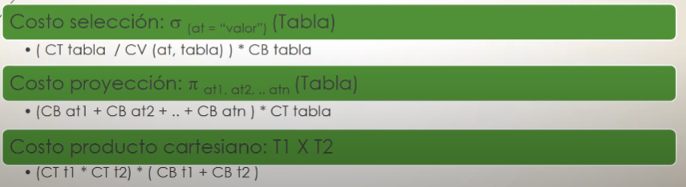

# Clase 1
Diseño de base de datos 
**Resumen temas de la materia** 
- Modelado de datos 
- SQL 
- Seguridad e integridad de datos 

### Conceptos basicos de Base de datos 
**Definiciones**
- ¿Que es una base de datos? 
Es una coleccion de datos relacionados. Un dato representa hecho conocidos que puede registrarse y que tienen un resultado implicito.
- ¿Que es un DBMS?
Es una coleccion de programas que permiten a los usuario crear y mantener la BD.
    *Objetivos de una DBMS*
    * Evitar redudancia e inconsistencia de datos.
    * Permitir acceso a los datos en todo momento. 
    * Evitar anomalias en el acceso concurrente.
    * Restriccion a accesos no autorizados-> seguridad.
    * Suministro de almacenamiento persistente de datos.
    * Integridad en los datos.
    * Backups.

- Componenentes de un DMBS 
    * DDL(data definition lenguaje): Especifica el esquema de BD.
    * DML(data manipulation lenguaje): Permite a los usuarios manipular los datos.

- DML-> Caracteristicas 
- Procedimentales(SQL): Requieren que el usuario especifique que datos se muestran y como obtener esos datos.
- No Procedimentales(QBD): Requieren que el usuario especifique que datos se muestran y sin especificar como obtener esos datos.

# Clase 2

## Modelado 
Coleccion de herramientas conceptuales para describir datos, relaciones entre ellos, semantica asociada a los datos y restricciones de consistencia.

*Modelos* 
- Basado en objetos: Estructura flexible, especifican resitriccion explicitamente. (Modelo entidad-relacion, Modelo orientado a objetos).
- Basado en registros: La BD se estructura en registros de formato fijo. Se dispone de lenguaje asociado para expresar consultas. (OO, **Relacional(usado hoy en dia, las BD son relacional)**, Jerarquico, Red)
- Fisico de datos. 

*Para comunicar el modelo con el usuario lo modelamos en basado en objetos*

Para construir el modelo: Tres etapas 
- Conceptual: Sirve para comunicarse con el cliente y contiene elementos abstractos que no siempre se representan directamente en la computadora. Se transforma en un modelo lógico para adaptarse al entorno computacional.
- Lógico: Es una representación más técnica que prepara el diseño para definir las estructuras de almacenamiento físico.
- Físico: Es la implementación concreta de las estructuras de almacenamiento en el sistema.

***Nota***
Debes quitar herencia, elementos polivalentes y compuestos del modelo conceptual al logico porque:
- Herencia: Las bases de datos relacionales no la soportan directamente. Debe transformarse en tablas.
- Polivalentes: No se permiten múltiples valores en un mismo campo. Se separan en tablas.
- Compuestos: Los atributos deben ser atómicos (indivisibles). Se descomponen en columnas.

## Modelo conceptual 
*Objetivos* 
- Representar la informacion de un problema en un alto nivel de abstraccion
- Captar las necesidades del clientes respecto del problema que enfrenta
- Mejora la interaccion cliente - desarrollador 

*Caracteristicas* 
- **Expresividad**: Disponer de todos lo medios necesario para describir un problema.
- **Formalidad**: Cada elemento representado sea preciso y bien definido, con una sola interpretacion posible.
- **Minimalidad**: Cada elemento tiene una unica representacion posible.
- **Simplicidad**: El modelo debe ser facil de entender por el cliente y por el desarrollador.

*Componentes (Constructores)* 
- **Entidades**: Represneta un elemento u objeto del mundo real con identidad. Se diferencia de cualquiera otro objeto o cosa.
- **Atributos**: Representa una propiedad basica de una entidad o relacion. Equivale a un campo de un registro.  
    * Cardinalidad:  
        - Monovalente/Polivalente.  
        - Obligatorio/Opcional(NULO).  
        Si no se define es monovalente-obligatorio (1,1).
- **Relacion**:: Representa agregaciones entre dos o mas entidades.
    * Tipos:  
        - Binaria.  
        - Ternaria.  
        - N-aria.  
        - Recursiva.
    * Cardinalidad: 
        - Cardinalidad Maxima.  ( ,1), ( ,N).
        - Cardinalidad Minima.  (0, ), (1, ).
        En relacion recursiva se aclara el tipo de relacion.

*Componentes Adicionales*
- **Atributos Compuestos**: Represnta un atributo generado a partir de una combinacion de atributos siumples. 
    * Puede ser polivalentes y no obligatorio.  
    * Sus atributos simples pueden ser polivalentes y no obligatorios tambien.  
- **Identificadoras**: Es un atributo o conjunto de atributos que permite reconocer una entidad de manera univoca dentro del conjunto de entidades. Pueden ser:
    * Simples o compuestos.  
    * Internos o externos.  
- **Jerarquiass**: Permite extrare propiedades comunes de varias entidades (o relaciones) y generar una superentidad que las contenga. Cobetura puede ser:
    * Total o parcial.  
        - Total: Todos los elementos de la entidad padre deben pertenecer a alguna subclase.
        - Parcial: Algunos elementos de la entidad padre no necesitan pertenecer a ninguna subclase.
    * Superpuesta o exclusiva.  
        - Superpuesta: Un elemento de la entidad padre puede pertenecer a varias subclases al mismo tiempo.
        - Exclusiva: Un elemento de la entidad padre solo puede pertenecer a una subclase.
    Si no se anota es T,E.
- **Subconjunto**: Cuando una jerarquia presenta un solo conjunto de entidades como hijo, entonces se habal de subconjunto. La cobertura de un subconjunto es parcial exclusiva unicamente.

*Atributos derivados*
Aparece en un conjunto de entidades y representa la informacion que se puede obtener de otra forma.

Solo se incluyen si ayudan a aclarar información en el modelo conceptual, pero **pueden** omitirse en el lógico o físico, ya que su cálculo se define en consultas o vistas.


# Clase 3

## Modelo logico 
Convertir el esquema coneptual en un esquema logico.
Eleccion del modelo logico objetivo (OO, relacional, jerarquico, o red) dependiendo la eleccion es la conversion.
Usamos relacional en la cursada, ya que se utiliza a nivel mundial.

*Decisiones*
- **Atributos derivados** -> Atenta contra la minimalidad. 
Analizar la ventaja entre dejarlo o sacarlo. Cambia mucho se usa poco lo saco. Cambia poco se usa mucho lo dejo. Caso intermedio eleccion nuestra.

- **Ciclo de realciones** -> Atenta contra la minimalidad.  
Ver que relaciones se pueden omitir. Es decir se puede acceder a la misma informacion desde otro lado.

- **Atributos compuestos**.  
    *Opciones*

    * Generar un atributo que se convierta en la concatenacion de todos los atributos simples que contiene el compuesto.
    * Definir los atributos simples sin un atributo compuesto que lo resuma. Es decir agregar directamente a la entidad como atributos simples matienendo su cardinalidad.
    * Generar una nueva entidad, la que representa el atributo compuesto, conformada por cada uno de los atributos simples que contiene.

- **Atributos polivalentes**.  
    *Se debe transformar por que en el modelo relacional solo existen atributos simples*
    * Se genera una entidad nueva con ese atributo, se genera una relacion muchos a muchos con la nueva entidad.

- **Jerarquias**.  
    *Opciones (Se quitan ya que en el modelo relacional no existe el conepto de herencia)*

    * Eliminar entidades hijas: Combinar los atributos de las entidades hijas con la entidad padre en una sola tabla. Se pierde la diferenciación entre subclases.
    * Eliminar entidad padre: Pasar los atributos de la entidad padre a cada entidad hija. *Nota: No es posible en una cobertura parcial, porque pueden existir entidades en la clase padre que no pertenecen a ninguna subclase.*
    * Conservar todo: Mantener la entidad padre y las entidades hijas como tablas separadas, utilizando claves foráneas para relacionarlas.  


# Clase 4

## Modelo fisico 
El modelo fisico (relacional) representa la BD como una coleccion de relaciones. Cada tabla de valores resultante se denomina relacion.

*Pasos de conversion*
- **Eliminación de identificadores externos:**
    Se eliminan los identificadores externos (también conocidos como claves foráneas) en el modelo físico, ya que las relaciones entre tablas se gestionan mediante claves primarias y foráneas, pero en este paso, su enfoque está en la conversión de la estructura y no la representación externa.

- **Selección de claves:**
    * Clave primaria: Se selecciona un atributo o conjunto de atributos que identifican de manera única a cada registro en la tabla.
    * Clave candidata: Son aquellas que podrían ser claves primarias, pero que no se eligen como clave principal. Se dejan como alternativas posibles.
    *Mejor candidata a clave primaria es el atributo simple e integer*

- **Conversión de entidades:**
    Las entidades del modelo conceptual se convierten en tablas en el modelo físico. Los atributos de las entidades se convierten en columnas de las tablas correspondientes.

- **Relaciones:**
    Las relaciones entre entidades en el modelo conceptual se representan en el modelo físico mediante tablas adicionales que contienen las claves foráneas que vinculan las entidades relacionadas.

**Integridad Referencial**
*Clave foranea: Atributo o conjunto de atributos que hace referencia a la clave primaria de otra tabla. Se utiliza para mantener la integridad referencial.* 
- Propiedad deseable de la base de datos.
- Asegura que un valor que aparece para un atributo en una tabla, aparezca ademas en otra tabla.

En la eliminacion o modificacion se debe tener cuidado. 
- **Cascada**: Se eliminan o modifican las filas en las tablas relacionadas.
- **Nula**: Se eliminan o modifican las filas en las tablas relacionadas y se anula el valor de la clave foránea. 
- **Restringida**: No se permite la eliminación o modificación de una fila en la tabla principal si hay filas relacionadas en la tabla secundaria.
- **No hacer nada**

**Restricciones**
- **Restricciones de Dominio:**
Es el conjunto de valores permitidos para un atributo. Define el tipo y el rango de valores que un atributo puede tener.

- **Restricciones de Clave:**
Evita que el valor del atributo clave genere valores repetidos.

- **Restricciones sobre Nulos:**
Se refiere a la ausencia de un valor en un atributo. Un atributo puede ser NULL (sin valor) o NOT NULL (no puede ser nulo).

- **Restricciones de Integridad:**
Ningun valor de la calve primaria puede ser nulo.

- **Restricciones de Integridad referencial:**
Garantiza que las relaciones entre tablas sean consistentes, es decir, que las claves foráneas siempre apunten a registros válidos en otras tablas.

# Clase 5 

## Depencia funcional
Una depencia funciona es una resticcion entre dos conjuntos de atributos de la Base de datos. No es malo, simplemente existen.
- Las restriccion indica que si t1 y t2 son dos tuplas cualquieras de r y que si t1[x] = t2[x] entonces debe ocurrir que t1[y] = t2[y].  
- Esto significa que los valores del componente y de una tupla r dependen de los valores del componente x.
- claves univocas y primarias determinan al resto de los atributos.  
Por ejemplo:
En una tabla de estudiantes, si tienes una columna "Número de identificación" (X) y otra columna "Nombre del estudiante" (Y), entonces:
Si dos filas tienen el mismo "Número de identificación" (X), siempre deben tener el mismo "Nombre del estudiante" (Y).
Esto significa que el Nombre del estudiante depende del Número de identificación.

*Tipos*
*Generan repeticiones innecesarias, atentan contra la minimalidad, solucionarlas*
- **Dependencia funcional completa** : Si A y B son atributos en una tabla r, B depende funcionalmente de manera completa de A, si B depende de A pero de ningun subconjunto de A.
- **Dependencia funcional parcial** : A->B es uan depencia funcional parcial si existe algun atributo que puede eliminarse de A y la dependencia continua verificandose.  
- **Dependencia funcional transitiva** : Una condicion en la que A,B y C son atributos de una relacion tales que A->B y B->C, entonces C depende transitivamente de A a traves de B.
- **Dependencia de Boyce Codd** : Una relación (tabla) está en BCNF si para toda dependencia funcional de la forma: X → Y (X determina a Y), se cumple que X es una clave candidata de la tabla.

**Dependencia Multivaludada**
La existencia de dependencia multivaluadas en una tabla se debe a 1FN que impide que una tupla tenga un cojunto de valores diferentes.
Una tabla tiene una dependencia multivaluada si para un atributo A y dos conjuntos de atributos B y C:
- Los valores de B dependen de A, pero C también depende de A de manera independiente.
- Es decir, los valores de B no tienen relación con los valores de C, solo con A.
Se expresa como:
A →→ B (A multivalúa a B). Se un valor de A y por este valor muchos de B.

*Triviales y no triviales*
Una dependencia multivaluada A →→ B se dice trivial si B es:
- Un subconjunto de A.
- O si A y B juntos cubren todos los atributos de la tabla.

## Normalizacion
Una base de datos que contenga solo dependencias funcionales deseadas va a estar normalizada.

- Primera forma normal
    * Una tabla que contiene uno o mas grupos repetitivos no esta en 1FN o sea una tabla que tenga atributos polivalentes.  
    * Un modelo estara en 1FN si para toda relacion r del modelo (tabla) cada uno de los atributos que la forman son si y solo si monovalentes.

- Segunda forma normal 
    * Una tabla que tenga atributos que dependan parcialmente de otro no esta en 2FN.  
    * Un modelo esta en 2FN si y solo si esta en 1FN y para toda relacion r del mismo (tabla) no existen depencias parciales.  

- Tercera forma normal 
    * Una tabla que tenga atributos que dependan transitivamente de otro no esta en 3FN.
    * un modelo esta en 3FN si y solo si esta en 2FN y para toda relacion r del mismo (tabla) no existen depencencias transitivas.

- Boyce Codd forma normal 
    * Una tabla que tenga atributos que dependen de acuerdo con la definicion de Boyce Codd de otro no esta en BCNF.
    * Un modelo esta en BCNF si y solo si esta en 3FN y para toda relacion de r del mismo (tabla) no existen dependencia de Boyce Codd.  

- Cuarta forma normal 
    * un modelo esta en 4FN si y solo si esta en BCNF (Se puede pasar por alto en la practica) y para toda relacion r del mismo (tabla) solo existen dependencia multivaluadas triviales.

- Quinta forma normal 
    * Un modelo está en quinta forma normal (5FN) si y solo si está en 4FN y no existen dependencias de unión en la relación (tabla). Esto significa que los datos de la tabla no pueden ser descompuestos de forma más eficiente sin perder información.

## Algebra relacional
*Operaciones*

- Selección (σ): se utiliza para filtrar filas de una relación que cumplen con una condición específica. 
- Proyección (π): se utiliza para filtrar columnas de una relación.
- Unión (∪): se utiliza para combinar dos relaciones que tienen el mismo número de atributos y tipos de datos.
- Diferencia (−): se utiliza para obtener las tuplas que están en una relación R, pero no en otra relación S.
- Producto Cartesiano (×): se utiliza para combinar todas las tuplas de una relación R con todas las tuplas de otra relación S.

*Operaciones adicinales*

- Intersección (∩): se utiliza para obtener las tuplas que son comunes entre dos relaciones.
- Producto Natural (⋈):  elimina las columnas duplicadas que tengan el mismo nombre. En otras palabras, realiza un producto cartesiano, pero compara las tuplas que tienen los mismos valores en los atributos con el mismo nombre y solo une las tuplas cuando esas columnas coinciden.
- Asignación Temporal (←): se utiliza para guardar el resultado de una operación relacional en una nueva variable o relación.
- Producto Tita (Θ): es una operación que combina dos relaciones R y S usando un predicado o condición personalizada.

*operaciones de updates* 
- Actualizar: δ nombre ← nombre=Golf (Deportes)
- Eliminar: Deportes ← Deportes - σ(nombre = 'golf' (Deportes))
- Crear: Deportes ← Deportes ∪ {'golf', 2}

# Clase 6 

## SQL 
*Lenguaje de definicion de datos (DDL)* 
- CREATE database 
- DROP database 
- CREATE table 
- ALTER table 
- DROP table 

*Lenguaje de Manipulación de Datos (DML)*
- SELECT: Consultar datos.
- INSERT: Insertar nuevos datos.
- UPDATE: Actualizar datos existentes.
- DELETE: Eliminar datos.

Consulta básica:
- SELECT *
- FROM tabla
Variaciones:
- Cláusula SELECT:
    * Atributos específicos: SELECT atr1, atr2, ...
    * Eliminación de duplicados: SELECT DISTINCT atr1, atr2, ...
    * Funciones de agregación: SELECT COUNT(*), AVG(atr1), SUM(atr2), ...
        - AVG: Promedio.  
        - COUNT: Conteo. 
        - SUM: Suma.
        - MIN: minimo.
        - MAX: maximo.
    * Alias de atributos: SELECT atr1 AS alias1, atr2 AS alias2, ...
- Cláusula FROM:
    * Múltiples tablas: FROM tabla1, tabla2, ...
    * Producto natural: FROM tabla1 INNER JOIN tabla2 ON (condición)
    * Variantes de producto natural:
        - LEFT OUTER JOIN
        - RIGHT OUTER JOIN
        - FULL OUTER JOIN
    * Subconsultas: FROM (SELECT ... FROM ... WHERE ...)
- Cláusula WHERE:
    * Condiciones de selección: WHERE condición1 AND/OR condición2 ...
    * Operadores lógicos: AND, OR, NOT
    * Operadores de comparación: =, !=, >, <, >=, <=
    * Operadores de rango: BETWEEN, LIKE, IN, NOT IN
    * Subconsultas: WHERE atr1 operador (SELECT ... FROM ... WHERE ...)
    * Valores nulos: WHERE atr1 IS NULL/IS NOT NULL
- Cláusula GROUP BY:
    * Agrupación de resultados: GROUP BY atr1, atr2, ...
- Cláusula HAVING:
    * Condiciones de filtro para grupos: HAVING condición1 AND/OR condición2 ...
- Cláusula ORDER BY:
    * Ordenamiento de resultados: ORDER BY atr1 ASC/DESC, atr2 ASC/DESC, ...
- Cláusula LIMIT:
* Limitar el número de resultados: LIMIT cantidad
Consideraciones:
- Se pueden combinar múltiples variaciones en una misma consulta.
- El orden de las cláusulas en una consulta SQL es importante.
- La optimización de consultas busca la forma más eficiente de obtener los resultados.
- Se pueden crear vistas para simplificar consultas complejas.
```
    [SELECT]
        |
        ├── [Proyección de columnas]
        |       └── SELECT columna1, columna2, ...
        |
        ├── [Eliminación de duplicados]
        |       └── SELECT DISTINCT departamento
        |
        ├── [Funciones de agregación]
        |       └── SELECT COUNT(*), SUM(salario), ...
        |
        ├── [Operadores aritméticos]
        |       └── SELECT salario * 1.1, salario + 500, ...
        |
        ├── [Filtrado de datos]
        |       └── WHERE salario > 5000, nombre LIKE 'J%'
        |
        ├── [Operadores lógicos]
        |       └── WHERE salario > 5000 AND departamento = 'Ventas'
        |
        |
        ├── [Unión de tablas]
        |       └── INNER JOIN, LEFT JOIN, ...
        |
        ├── [Agrupación de datos]
        |       └── GROUP BY departamento
        |
        ├── [Filtrado posterior a la agrupación]
        |       └── HAVING AVG(salario) > 3000
        |
        ├── [Ordenamiento de resultados]
        |       └── ORDER BY salario DESC
        |
        └── [Límite de resultados]
                └── LIMIT 10, TOP 5
```

# Clase 7

## Optimizacion de consultas 

*Componentes del 'Costo' de ejecucion de una consulta*
- Costo de acceso a almacenamiento secundario -> Acceder al bloque de dato que reside en disco.
- Costo de computo -> Costo de realizar opreaciones sobre memoria RAM.  
- Costo de comunicaciones -> Costo de enviar la consulta y los resultados

*Optimizacion de consultas*
Cuando el DBMS recibe la consulta: 
```
    Consulta 
        └─(Parser)── Forma interna
                        └── Proceso de optimizacion
                                └── Eleccion de indices
                                        └── Acceso a disco
```
*Optimizacion logico* 
Se encarga el DMBS, nosotros priorizamos legibilidad. El DBMS siempre analiza si se puede mejorar.

*Valores en la optimizacion de consulta*
- CT tabla: cantidad total.  
- CB tabla: peso en bytes de la tabla.
- CV (a, tabla): Cuantos son los valores disntintos de un valor en un tabla.  

*costos* 



# Clase 8

## Seguridad e integridad de datos
- Transacciones 
    * Prioridades
    * Estados
- Transacciones monousuarios 
    * Atomicidad
    * Protocolos 
- Transacciones centralizadas 
    * Aislamiento
    * Consistencia
    * Durabilidad

**Transacciones**
Coleccion de operaciones que forman una unica unidad logica de trabajo.
***Propiedades ACID***

- Atomicidad: Todas las operaciones de la transaccion se ejecutan o no lo hacen ninguna de ellas.
- Consistencia: La ejecucion aislada de la transaccion conserva la consistencia de la BD.
- Aislamiento (isolation): Cada transaccion ignora el resto de las transacciones que se ejecutan concurrentemente en el sistema, actua c/u como unica.
- Durabilidad: Una transaccion terminada con exito realiza cambios permanentes en la BD, incluso si hay fallos en el sistema.

***Estados***
*Estados de una transaccion*
- Activa: Estado inicial, estado normal durante la ejecucion.
- Parcialmente cometida: Despues de ejecutarse la ultima instruccion.
- Fallada: Luego de descubrir que no puede seguir la ejecucion normal.
- Abortada: Despues de haber retrocedido la transaccion y restablecido la BD al estado anterior al comienzo de la transaccion.
- Cometida: Tras completarse con exito.
```
                 +---------+
                 |  Activa |
                 +---------+
                     |
       +-------------+-------------+
       |                           |
       v                           v
+-------------------+     +--------------------+
| Parcialmente      |---->|      Fallada       |
|     Cometida      |     +--------------------+
+-------------------+               |
       |                            |
       v                            v
+-------------------+     +--------------------+
|    Cometida       |     |     Abortada       |
+-------------------+     +--------------------+
```

## Transacciones monousuarios
***Sistemas monousuarios***
Hay un usario disparando transacciones. Entonces, hay una sola transaccion activar actuando sobre el dbms. Nuetro unico inconveniente es asegurar la atomicidad (asilamiento se cumple si o si) mediantes bitacora o doble paginacion.

***¿Que hacer luego de un fallo?***
- Solucion: indicar las modificaciones.
    * Registro Historico(bitacora).  
    * Doble paginacion.  

### Registro Historico (Bitacora, Log)
Secuencia de actividades realizadas sobre la BD. Antes de ejecutarse. Impresidible para valor de escrituras, de lectura no importa.
Contenido dela bitacora: 
- <T iniciada> (indicador de inicio)
- <T,E,Va,Vn>
    * Identificador de la transaccion.  
    * Identificador del elemento de datos.  
    * Valor anterior.   
    * Valor nuevo. 
- <T commit> (indicador de finalizacion) o - <T Abort> (indicador de aborto) o Nada (indica por ejemplo corte de luz).  

*Orden de ejecucion de bitacora*
1. Write bitacora
2. Write BD
3. Output Bitacora
4. Output BD

*Tecnicas de trabajo de bitacora*
1. Modificación diferida
- Descripción:
    Las operaciones WRITE no se aplican directamente en la base de datos mientras la transacción está activa. En su lugar, se registran en la bitácora y solo se escriben en la base de datos después de que la transacción esté parcialmente cometida.
- Proceso normal:
    1. Se registran en la bitácora los cambios planeados.
    2. Tras el COMMIT, se aplican los cambios en la base de datos utilizando la información de la bitácora.
- Manejo de fallos:
    REDO(Ti): Si una transacción tiene un registro de START y COMMIT en la bitácora, los cambios se vuelven a aplicar para garantizar la consistencia.
    Sin acción: Si no tiene un registro de COMMIT, no se necesita hacer nada porque los cambios nunca se aplicaron a la base de datos.
- Ventajas:
    Garantiza que no se apliquen cambios parciales, lo que simplifica la recuperación.
- Desventajas:
    Los cambios se aplazan, lo que puede causar retrasos si las transacciones son largas.

2. Modificación inmediata
- Descripción:
    Los cambios en la base de datos se realizan tan pronto como la transacción los ejecuta, incluso antes de que se confirme el COMMIT.
- Proceso normal:
    1. Los cambios se aplican directamente a la base de datos y se registran en la bitácora.
    2. Si la transacción se confirma (COMMIT), no es necesario realizar más ajustes.
- Manejo de fallos:
    REDO(Ti): Para transacciones con registros de START y COMMIT en la bitácora, los cambios deben volver a aplicarse para asegurar la consistencia.
    UNDO(Ti): Para transacciones con un registro de START pero sin COMMIT, los cambios deben deshacerse utilizando los registros de la bitácora.
- Ventajas:
    Cambios más rápidos, ya que se aplican inmediatamente. Mejor distribuida la carga de trabajo.
- Desventajas:
    Mas complejo que diferida. Requiere mayor manejo en caso de fallos porque se pueden dejar cambios parciales.

*Puntos de verificacion* 
Ante un fallo, que hacer 
- REDO, UNDO: segundo el caso
- Revisar la bitacora
    * Checkpoints(monousuario): Se agregan periodicamente indicando desde alli hacia atras todo OK. Periodicidad? no hay respuesta, podria ser cuando graba el buffer en disco. 

### Doble paginacion
- Ventaja: Menos accesos a disco. 
- Desventaja: Comlicada en un ambiente concurrente/distribuido.
- N paginas equivalente a pagisnas del SO.
    * Tabla de paginas actual.
    * Tabla de paginas sombra.  

*Funcionamiento*
1. Inicio de la transacción:
    Se crea una copia de la tabla de páginas actual, conocida como tabla de páginas sombra.
    La tabla de páginas sombra permanece sin cambios durante la transacción.
2. Ejecución de cambios:
    Los cambios se realizan sobre la tabla de páginas actual, afectando únicamente las páginas activas.
    Las páginas modificadas no se reflejan en la tabla de páginas sombra.
3. Confirmación de la transacción (COMMIT):
    La tabla de páginas actual se convierte en la nueva tabla de páginas sombra.
    Los cambios se consideran permanentes.
4. Fallos durante la transacción:
    Si ocurre un fallo antes del COMMIT, se descartan los cambios en la tabla de páginas actual.
    La tabla de páginas sombra se utiliza para restaurar el estado inicial de la base de datos.

## Transaccion Centralizadas

- Varias trasnacciones ejecutandose simultaneamente compartiendo recursos.
- Debe evitarse los mismo problemas de consistencia de datos.
- Transancciones correctas, en ambientes concurrente pueden llevar a fallos.  

### Planificcion: secuencia de ejecucion de transacciones 
- Involucra todas las instrucciones de las transacciones.
- Convervan el orden de ejecucion de las mismas. 
- Un conjunto de M transacciones generas M! (factorial) planificaciones en serie.   
- La ejecucion concurrente no necesita una planificion en serie. 

*La inconsistencia temporal puede ser causa de inconsistencia en planificaciones en paralelo*
*Una planificacion concurrente debe equivaler a una planificacion en serie*
*Solo las instruccions de READ y WRITE son importantes y deben considerarse*

**Conflicto de planificaciones serializables**
i1,i2 Instrucciones T1 y T2 
- Si operan sobre datos distintos no hay conflicto.
- Si operaon sobre el mismo dato: 
    * i1 = READ(q) = i2, no importa el orden de ejecucion
    * i1 = READ(q), i2 = WRITE(q) depende del orden de ejecucion (i1 leera valores distintos)
    * i1 = WRITE(q), i2 = READ (q) depende del orden de ejecucion (i2 leera valroes distintos)
    * i1 = WRITE(q) = i2, depende el estado final de la BD

- i1,i2 esta en conflicto si actuan sobre el mismo dato y almenos una es un write.

Una planificacion concurrente es valida si se puede transformar en una planificacion serializable.

**Metodos de control de concurrencia** 
Aseguran que la ejecucion simultanea de dos o mas transacciones no conflictue.
- Bloqueo 
- Basado en hora de entrada 

### Protocolo de Bloqueo
- Compartido Lock_c (dato)(Solo Lectura)
- Exclusivo Lock_e (dato) (Lectura/Escritura)
- Las transacciones piden lo que necesitan 
- Los bloqueos pueden ser compatibles y existir simultaneamente (Compartidos)

*Se deben llevar los bloqueos de las transacciones al comienzo*
 
Situaciones 
**Deadlock**
Situacion en la que una transaccion espera un recurso de otra y viceversa. Preferible antes de inconsistencia.
Se aborta alguna de las transacciones bloqueadas.

**Protocolo de bloqueo**
- Dos fases (Pido, uso y libero)
    * Cremiento se obtienen los datos 
    * Decrecimiento se liberan los datos

### Protocolo base en hora de entrada 
El orden de ejecucion se determina por adelantado, no depende de quie llega primero.
- C/ transaccion rebie una Hora de entrada.
    * Hora del servidor 
    * Un contador 
- Si HDE(Ti) < HDE(Tj), Ti es anterior.
- C/ Dato
    * Hora en que se ejecuto ulitmo WRITE 
    * Hora en que se ejecuto ultimo READ 
    * Las operaciones READ y WRITE que pueden entrar en conflicto se ejecutan y eventualmente fallan por HDE

**Como funciona:** 
- Ti Solicita READ(q)
    * HDE(Ti) < HW(q): rechazo (Solicita un dato que fue escrito por una transaccion posterior)
    * HDE(Ti) >= HW (q): Ejecuta y actualiza HR(q) = MAX {HDE(ti), HR(Ti)}
- Ti Solicita WRITE(q)
    * HDE(Ti) < HR(q): rechazo (Q fue utilizado por otra transaccion anteriormente y supuso que no cambiaba)
    * HDE(Ti) > HW(q): rechazo (Se intenta escribir un valor viejo)
    * HDE(Ti) > [HW(q) y HR(q)]: Ejecuta y HW(q) se establece con HDE(Ti).

Si Ti falla y se rechaza entonces puede recomenzar con una nueva HDE.

*Otras operaciones Conflictivas*
- Delete(q) Requiere un uso completo del registro.
- Insert(q) El dato permanece bloquedo hasta que la operacion finalice.  

### Falloes en concurrencias 

**Consideraciones del protocolo basado en bitacora**
- Existe un unico buffer de datos compartidso y uno para la bitacora. 
- C/Transaccion tiene un area donde lleva sus datos. 
- El retroceso de una transaccion puede llevar al retroceso de otras transacciones.  
**Retroceso en cascada**
- Falta una transaccion -> pueden llevar a abortar otras. 
- Puede llevar a deshacer gran cantidad de trabajo.  


### Durabilidad 
Transaccion que alcance el estado de cometido no se puede volver hacia atras.

En retroceso en cascada como hacemos???

- Protocolo de bloqueo de dos fasese: Los bloqueos exclusivos deben conservarse hasta que Ti(inicial) termina.
- HDE, agrega un bit, para escrbir el dato, ademas de lo analizado revisar el bit si esta en o proceder, si esta en 1 la transaccion anterior no termino, esperar.


### Bitacora en concurrentes 
- Similar a sistemas monousuarios 
- Como proceder con los checkpoint 
    * Colocarlo cuando ninguna transaccion este activa. Puede que no exista el momento .
    * Checkpoint<L> L lista de transacciones activa al momento del checkpoint.
- Ante un fallo 
    * UNDO Y REDO segun el caso. 
    * Debemos buscar antes del checkpoint solo aquellas transacciones que este en la lista.