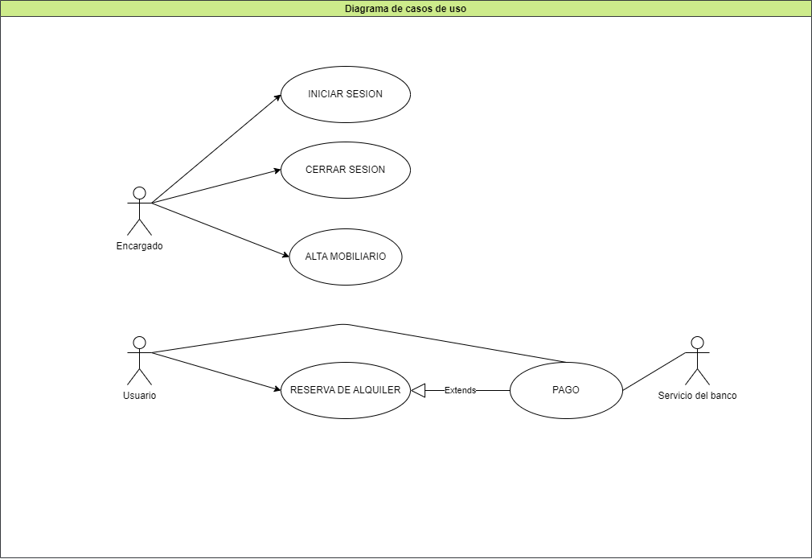

**Alquiler de mobiliario**

||||
|-|-|-|
| Nombre | Iniciar sesion ||
| Descripcion | Este caso de uso describe la manera en la que un encargado incia sesion con su nombre y contraseña ||
| Actores | Encargado ||
| Precondiciones | -- ||
| Cusro normal | Acciones del actor | Acciones Del sistema |
| Paso 1 | El encargado selecciona la opción de iniciar sesión. ||
| Paso2  || El sistema solicita usuario y contraseña.|
| Paso 3 | El encargado ingresa usuario y contraseña.||
| Paso 4 || El sistema verifica los datos ingresados.|
| Paso 5 || El sistema registra la sesión iniciada y habilita las acciones del encargado.|
| Curso alterno | Paso alternativo 4: el usuario o la contraseña no son validas. Se notifica la discrepancia. Retorna desde el paso 2.||
| Postcondicion | La sesion ha sido iniciada y las opciones para el encargado aparecen habilitadas ||

||||
|-|-|-|
| Nombre | Cerrar sesion |
| Descripcion | Este caso de uso describe la manera en la que un encargado cierra sesion|
| Actores | Encargado |
| Precondiciones | El encargado debe tener una sesion iniciada |
| Curso normal | Acciones del actor | Acciones del sistema | 
| Paso 1 | El encargado selecciona cerrar sesion | |
| Paso 2 | | El sistema solicita la confirmacion de cierre de sesion | 
| Paso 3 | El encargado confirma la cerrar sesion | | 
| Paso 4 | El sistema cierra la sesion y deshabilita las acciones del encargado | 
| Curso alterno | Paso alternativo 3: El encargado cancela cerrar sesion. Fin del caso de uso | 
| Postcondicion | La sesion fue cerrada y las opciones del encargado quedaron deshabilitados |

||||
|-|-|-|
| Nombre | Alta inmobiliario | 
| Descripcion | Este caso de uso describe la manera en la que un encargado da de alta un inmobiliario | 
| Actores | Encargado | 
| Precondiciones | El encargado debe tener una sesion inciada | 
| Curso normal | Acciones del actor | Acciones del sistema |
| Paso 1 | El encargado selecciona la opcion cargar mueble |
| Paso 2 | | El sistema solicita los datos del mueble: código de inventario, tipo de mueble, fecha de creación, fecha de último mantenimiento, estado (libre, de baja, alquilado) y el precio de alquiler |
| Paso 3 | El encargado ingresa los datos solicitados |
| Paso 4 | | El sistema verifica que no exista otro mueble con el mismo codigo y que el precio este cargado en dolares. |
| Paso 5 | | El sistema carga el mueble en la base de datos. |
| Curso alterno | Paso 4: El sistema verifica que ya existe un mueble con el mismo codigo. Fin de caso de uso. |
|| Paso 4: El sistema verifica que el precio no esta cargado en dolares. Se notifica la discrepancia y retorna paso 2. | 
| Postcondicion | El sistema agrega a la base de datos el mueble  y lo informa | 

||||
|-|-|-|
| Nombre | Reserva alquiler | 
| Descripcion | Este caso de uso especifica la manera en la que un usuario realizar una reserva de alquiler. |
| Actores | Usuario. |
| Precondiciones | | 
| Curso normal | Acciones del actor | Acciones del sistema | 
| Paso 1 | El usuario selecciona la opcion reservar alquiler | 
| Paso 2 | | El sistema le solicita al usuario que ingrese una fecha, lugar del evento, cantidad de dias y mobiliaria junto a su cantidad | 
| Paso 3 | El usuario ingresa los datos solicitados |
| Paso 4 | | El sistema verifica que haya stock de los muebles, y que la cantidad solicitada no sea menor a 3. |
| Paso 5 | | El sistema ejecuta el caso de uso Pago | 
| Paso 6 | | El sistema registra la reserva del alquiler y se emite un numero de reseva unico |
| Curso alterno | Paso 4: No hay stock suficiente del mobiliari solicitadoo. Se informa la falta de stok y retorna al paso 2. |
| | Paso 4: La cantidad de muebles seleccionados es menor a 3. Se informa que debe ser de almenos 3. Retorna al paso 2. |
| | Paso 5: El pago no se realiza, se notifica al usuario. Fin del caso de uso. | 
| Postcondicion | Se registro la reserva y se emitio un numero de reserva unico | 

||||
|-|-|-|
| Nombre | Pago |
| Descripcion | Este caso de uso describe el cobro de una reserva de alquiler por tajeta | 
| Actores | Servicio del banco, Usuario | 
| Precondiciones | Se debe haber ejecutado el caso de uso 'reserva alquiler'. | 
| Curso normal | Acciones del actor | Acciones del sistema | 
| Paso 1 | | El sistema solicita el numero de tarjeta y codigo de seguridad | 
| Paso 2 | El usuario carga los datos | 
| Paso 3 | | El sistema establece conexion con el servidor del banco | 
| Paso 4 | | El sistema envia los datos al servidor externo | 
| Paso 5 | El servidor externo valida los datos y fondos suficientes para abonar el 20% del alquiler | 
| Paso 6 | El servidor externo retorna el resultado | 
| Paso 7 | | El sistema recibe la respuesta que los fondos son suficientes y que la tarjeta es valida | 
| Paso 8 | | El sistema registra el pago y cierra la conexion con el sevidor externo | 
| Curso alterno | Paso alt. 3: Falla la conexion con el servidor del banco. Se informa el error y fin de CU | 
| | Paso alt. 7 : El sistema recibe que los datos son insuficientes o que la tarjeta no es valida y lo informa. Fin de Cu. | 
| Postcondicion | Se efectuo y registro el pago a traves de la tarjeta |