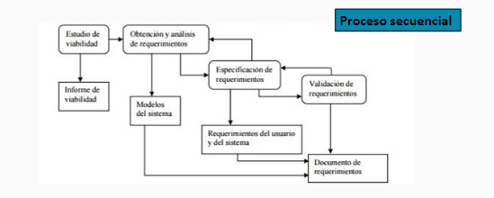
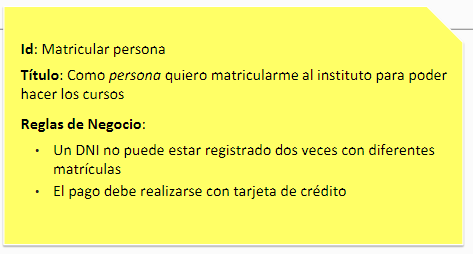
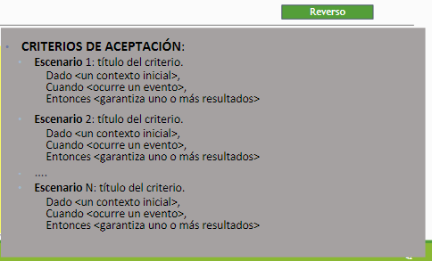
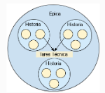

# Requerimientos 

Un requerimiento es una caracteristicas del sistema o una descripcion de algo que es sistema es capaz de hacer con el objeto de satifacer el proposito del sistema.
Importantes debido a que lleva errores como perdida de tiempo dinero, o llegar a algo que el cliente no quiere.

## Tipos 
### Requerimientos Funcionales
* Comportamiento del sistema
* Describen lo que el sistema tiene que hacer o incluso como no debe comportarse
* Desriben con detalle la funcionalidad del mismo
* Son independientes de la implementacion de la solucion 
### Requerimientos no funcionañes
* Requerimientos del producto 
    - Especifican el comportamiento del producto(Usabilidad, eficiencia, rendmiento, espacio, fiabilidad, portabilidad)
* Requerimientos organizacionales
    - Se derivan de las políticas y procedimientos existentes en la organización del cliente y en la del desarrollado(entrega, implementación, estándares)
* Requerimientos externos
    - Interoperabilidad, legales, privacidad, seguridad, eticos.

    Ejemplo 
        Requerimiento de usabilidad (Req. funcional) -> -Estetica, consistencia de interfaz de usuario, ayuda en lina... (Req. no funcional)

## Ing. de requirimientos

Se transforman los requerimientos declarados por el cliente a especificaciones precisas, no ambiguas, consistentes y completas.
“Ingeniería de requerimientos” es un enfoque sistémico para recolectar, organizar y documentar los requerimientos del sistema; es también el proceso que establece y mantiene acuerdos sobre los cambios de requerimientos, entre los clientes y el equipo del proyecto.
**Importancia**:
* Permite gestionar las necesidades del proyecto en forma estructurada
* Mejora la capacidad de predecir cronogramas de proyectos
* Disminuye los costos y retrasos del proyecto
* Mejora la calidad del software
* Mejora la comunicación entre equipos
* Evita rechazos de usuarios finales

### Informe de viabilidad -> estudio de viabilidad ->

A partir de una descripción resumida del sistema se elabora un informe que recomienda la conveniencia o no de realizar el proceso de desarrollo

### Obtencion y analisis de requerimientos <-> Especificacion de requerimientos <->

**Propiedades de los requerimientos**
* Necesario: su omision provoca una diferencia
* Consico: Facil de leer y entender
* Completo: No necesita ampliarse
* Consistente: No contradictorio
* No ambiguo: tiene una sola implementacion
* Verificable: puede testearse a trabes de inspeccions, pruebas, etc.

**Objetivos**
* Permite que los desarrolladores expliquen commo han entendido lo que el cliente pretende del sistema
* Indicar a los diseñadores que funcionalidad y caracteristicas va a tener el sistema resultante
* Inidicar al equipo de pruebas que demostraciones llevar a cabo para convencer al clientes de que el sistema que se le entrega es lo que habia pedido

**Aspectos básicos de una especificación de requerimientos** 
* Funcionalidad  
    ¿Qué debe hacer el software?
* Interfaces Externas  
    ¿Cómo interactuará el software con el medio externo (gente, hardware, otro software)?
* Rendimiento  
    Velocidad, disponibilidad, tiempo de respuesta, etc.
* Atributos  
    Portabilidad, seguridad, mantenibilidad, eficiencia
* Restricciones de Diseño  
    Estándares requeridos, lenguaje, límite de recursos, etc.

### Validacion de requerimientos->

Certificar la correccion del modelo de requerimientos contra las intenciones del usuario
    Definicion IEEE
    Validación: Al final del desarrollo evaluar el software para asegurar que el 
    software cumple los requerimientos
    Verificación: El software cumple los requerimientos correctamente

**Tecnicas de verificacion** 
Pueder ser manuales o automatizadas
* Revisiones de requerimientos (formales o informales)
    - Informales: los desarrolladores deber tratas a los requerimientos con tantos staker holders como sea posible
    - Formal: El equipo de desarrollo debe conducir al cliente, explicandole las imlicaciones de cada requerimientos
* Construccion de prototipos 
* Generacion de casos de prueba

### Tecnicas de especificacion de requerimientos
* Dinamicas 
    Se considera un sistema en función de los cambios que ocurren a lo largo del tiempo.
    Se considera que el sistema está en un estado particular hasta que un 
    estímulo lo obliga a cambiar su estado
*   Estáticas
    Se describe el sistema a través de las entidades u objetos, sus atributos y sus relaciones con otros. No describe cómo las relaciones cambian con el tiempo. Cuando el tiempo no es un factor mayor en la operación del sistema, es una descripción útil y adecuada

# Historias de usuario
**Definicion**: Una historia es una descipcion corta y simple de un requerimiento de un sistema, que se escribe en lenguaje comun del usuario y desde su perpectiva.
* Forma rapida de administrar los requerimientos
* Responde rapidamentes a los requerimientos cambiantes
* Posibilidad de discutirlas con os clientes
* Estimacion de tiempo

**Caracteristicas**
* Independientes unas de otras
* Negociables
* Valuradas por los clientes o usuarios
* Estimables
* Pequeñas
* Verificables

## Forma de redaccion 
Puede ser Libre pero debe responder a 3 preguntas.
Esquema: 
    Como 'ROL' quiero 'ALGO' para 'BENEFICIO'
Ejemplos: 
    'Como Cliente' quiero 'suscribirme por medio del sitio web' para 'obtener un
    nuevo plan de T.V. por cable'.

    ROL: como cliente
    ALGO: Suscribirme por medio del sitio web
    BENEFICIO: Obtener un nuevo plant de t.v. por cable

## Criterios de aceptacion 
Se define en la etapa incial, ayuda a entender como se comporta el producto. Representan el como de lo que sucedera.

# Plantilla Historia de usuario 
  

## Epicas 
Se denomica epida a un conjunto de historias de usuario que se agrupan por algun denominador comun

**Caracteristicas**
* Las épicas suelen abarcar varios equipos de desarrollo
* Recogen normalmente muchas historias de usuario
* Los clientes determinan si eliminan o añaden historias dentro de cada épica
* Una épica sirve para estructurar los temas e iniciativas(objetivos)
* Las épicas también sirven para dar flexibilidad y agilidad al proyecto

