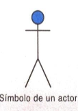
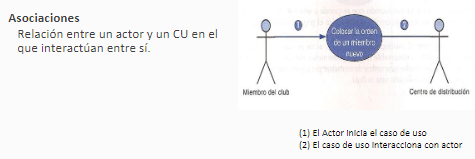
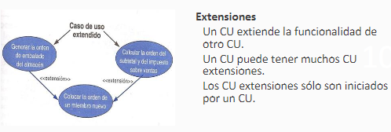
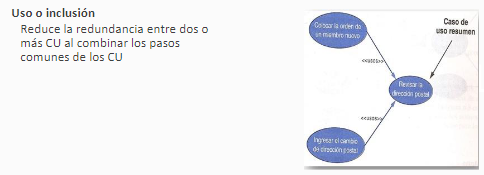
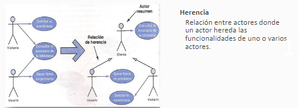

# Caso de uso

Proceso de modelado de las “funcionalidades” del sistema en término de los
eventos que interactúan entre los usuarios y el sistema.

* Herramienta para cpturar requerimientos funcionales
* Descompone el alcance del sistema en piezas mas menjables
* Medio de comunicacion con los usuarios
* Utiliza lenguaje comun y facil de entender por las partes
* Permite estimar el alcance del proyecto y el esfuerzo a realizar
* Define una liea base para la definicion de los planes de prueba
* Defina una linea base para toda la documentacion del sistema
* Proporciona una herramienta para el seguimiento de los requisitos

## Componentes 

**Diagrama de casos de uso** 
Ilustra las interacciones entre el sistema y los actores.
* Actores 

Un actor inicia una actividad (CU) en el sistema. Representa un papel desempeñado por un usuario que interactúa (rol).
Puede ser una persona, sistema externo o dispositivo externo que dispare un evento (sensor, reloj).

* Relaciones 
    -Asociciones
        
    -Extensiones
        
    -Uso o inclusion
        
    -Herencia 
        
        
**Escenarios(narrancion del CU)**
Descripción de la interacción entre el actor y el sistema para realizar la funcionalidad.

