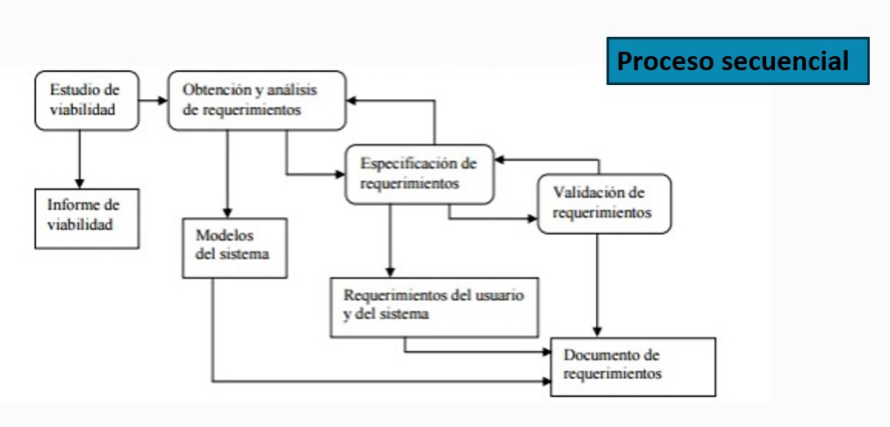
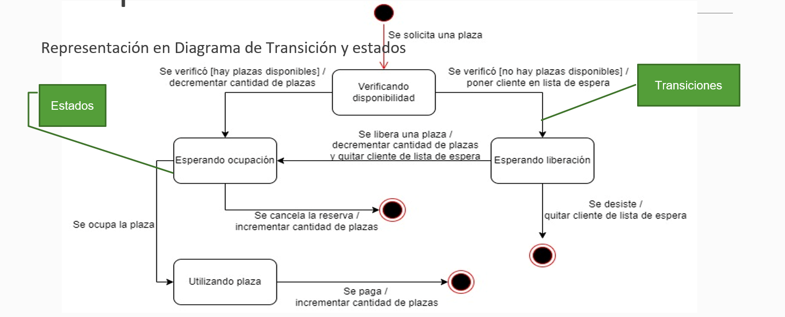
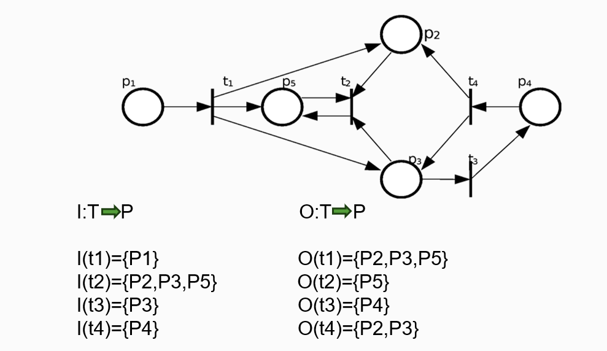

# Teoria 1 
## Software 
**¿Que es?** Instrucciones, procedimientos, reglas, documentacion y datos asociados que forman parte de las oprecaiones de un sistema de computacion. (IEEE).

**Caracteristicas:**
- Elemento logico.
- Se dearrolla, no se fabrica.
- No se desgasta.
- No sigue una curva clasica de envejecimiento. Cambios = incremento de tasa de fallas.

**Tipos de producto de software** 
- Genericos: Sistema aislado de producidos por ogranizaciones desarroladoras de software y que se venden en un mercado abierto.
- Personalizados: Sistemas requeridos por un cliente en particular.

El termino **software libre** hace referencia a la libertad, en concreto se refiere a cuatro libertades:
1. Libertad para ejecutar el programa
2. Libertad para estudiarlo y adaptarlo 
3. Libertad de redistribucion 
4. Libertad para mejorar y publicar mejoras.

**Clasificacion del software** 
- De sistemas 
- De aplicacion 
- Cientifico y de ingenieria 
- Integrado
- De linea de productos
- Aplicaciones web/mobiles 
- De inteligencia artificial

## Ingenieria de software 
La ingenieria de software surge a partir de la necesidad de integrar nuevas tecnologias con los sistemas tradicionales para asegurar un contexto util.
¿Que es la ingenieria de software? Disciplina de la ingenieria que comprende todos los aspectos de la produccion de software desde las etapas iniciales de la especificacion del sistema incluyendo la evolucion de este, luego que se comienza a ejecutar.
La IEEE define a la ingenieria de software como: 
1. El uso de metodos sistematicos, disciplinados y cuantificables para el desarrollo, operacion y mantenimiento de software.
2. El estudio de tecnicas relacionadas con 1.

**Caracteristicas de un ingeniero/a de software** 
El ingeniero debe dominar los aspectos tecnicos, aprender habilidades requeridas para entender el problema, diseñar solucion, desarrollarla, etc.
Pero ademas, los aspectos humanos es lo que haran un ingeniero efectivo.
Tener un sentido de responsabilidad individual, aguda conciencia de las necesidades del equipo, atencion al detalle, entre otros.

**Responsabilidad profesional y etica** 
La ingenieria de software se desarrolla en un marco economico, social y legal. 
- Los IS deben aceptar responsabilidades mas amplias que las responsabilidades tecnicas. 
No debe utilizar su capacidad y habilidades de forma deshonesta, o de forma que deshonre la profesion.
- Confidencialidad. 
- Competencia.
- Derechos de la propiedad intelectual.
- Uso inapropiado de las computadoras.

## Tecnicas de comunicacion 
La comunicacion es la base para la obtencion de las necesidades del cliente. Es la principal fuente de error.
Al hablar de necesidades, en termino mas tecnicos, Estamod hablando de requerimientos. **Requerimientos=Necesidades**.

## Requerimientos 
*Un requerimiento es una caracteristica del sistema o una descripcion de algo que el sistema es capaz de hacer con el objetivo de satisfacer el proposito del sistema.(Importante)*

**Fuentes de requerimientos** 
- Documentacion 
- Stakeholders 
- Especificaciones de sistemas sismilares

**StakeHolders**
El termino stakeholder se utiliza para referirse a cualquier persona o grupo que se vera afectado por el sistema, directa o indirectamente.
Ejemplos: Usuario finales, Ingenieros, Gerentes, Expertos del dominio, Diferentes visiones...

**Puntos de vista** 
Existen 3 tipos genericos de puntos de vista: 
- Interactuadoras: representan a las personas u otros sistemas que iteractuan directamente con el sistema.
- Indirecto: represetan a lso stakeholders que no utilizan el sistema ellos mismo pero que influyen en los requerimientos de algun modo.
- Dominio: representan caracteristicas y restricciones del dominio que influyen en los requerimientos del sistema.

## Elicitacion de requerimientos
Es el proceso de adquirir todo el conocimiento relevante necesario para producir un modelo de los requerimientos de un dominio de problema.
- Objetivo: Conocer el dominio del problema para poder comunicarse con clientes y usuario y entender sus necesidades. Conocer el sistema actual (manual o informatizado). Identificar las necesidades, tanto explicitas como implicitsa, de clientes y usuario y sus expectativas sobre el sistema a desarrollar.

**Tecnicas de elicitacion** 
Recopilacion de informacion: 

- Metodos discretos
1. Muestreo de la documentacion, los formularios y los datos existentes.
2. Investigacion y visitas al lugar.
3. Observacion del ambiente de trabajo.

- Metodos interactivos 
1. Cuestrionarios.
2. Entrevistas. 
3. Planeacion conjunta de requerimientos (JRP o JAD).
4. Lluvia de ideas - brainstorming. 

**Metodos discretos**
Menos pertubadores, se consideran insuficientes para recopilar informacion. 
- Muestreo de la documentacion, los formularios y los datos existentes
- Investigacion y visitas al sitio
- Observacion del ambiente de trabajo 

**Metodos interactivos**
Su base es hablar con las personas de la organizacion y escuchar para comprender.
- *Planeacion conjunta de requerimientos*
- *Brainstorming*
- *Cuestrionarios:*
Documentos que permite al analista recabar infomracion y opiniones de los encuestados. 
    - Ventajas: 
        * Respuestas rapida.
        * Economicos.
        * Anonimos.
        * Estructurados de facil analisis.  
    - Desventajas:
        * Numero bajo de respuestas 
        * No responde a todas las preguntas 
        * Preguntas rigidas 
        * No se puede realizar el analisis corporal 
        * No se puede aclarar respuestas incompletas 
        * Dificiles de preparar 
Utiliza preguntas de tipo abiertas o cerradas.
- *Entrevistas* 
    - Ventajas: 
        * El entrevistados se siente incluido en el proyecto 
        * Es poisible obtener una retroalimentacion del encuestado 
        * Es posible adaptar las preguntas de acuerdo al entrevistado 
        * Informacion no verbal observando las acciones y expresiones del entrevistado 
    - Desventajas: 
        * Costosas 
        * Tiempo y recursos humanos 
        * Las entrevistas dependen en gran parte de las habilidades del entrevistador 
        * No aplicable a distancia 
    - Tipos de entrevistas:
        * Estructuradas (Cerradas)
        El encuestador tiene un conjunto especifico de preguntas para hacercelas al entrevistado, se dirige al usuario sobre un requerimiento puntual, no permite adquierir un amplio conocimiento del dominio.
        * No estructuradas (Abiertas)
        El encuestador lleva a un tema general, sin preparacion, iniciar con preguntas que no dependen del contexto, para conocer el problema, la  gente involucrada, etc.
    - Tipos de preguntas: 
        * Abiertas: Permite al encuestado responder de cualquier manera 
        * Cerradas: Las respuestas son directas, cortas o de seleccion especifica 
        * Sondeo: Permite obtener mas dealle sobre un tema puntual 
    - Organizacion de una entrevista: 
        * Piramidal:  Preguntas cerradas -> preguntas abiertas 
        * Embudo: Preguntas abiertas -> preguntas cerradas 
        * Diamante: Preguntas cerrada -> preguntas abiertas -> preguntas cerradas
    - Preparacion previa a la entrevista 
        * Leer los antecedentes 
        * Establecer los objetivos 
        * Seleccionar los entrevistados 
        * Planificacion de la entrevista y preparacion del entrevistaado 
        * Seleccion del tipo de preguntas a usar y su estructura

# Teoria 2
## Tipos de requerimientos 
**Requerimientos funcionales**
- Describen una interaccion entre el sistema y su ambiente. Como debe comportarse el sistema ante determinado estimulo.
- Describen lo que el sistema debe hacer, o incluso como no debe comportarse.
- Describen con detalle la funcionalidad del mismo.
- Son independientes de la implementacion de la solucion.
- Se pueden expresar de distintas formas.
**Requerimientos no funciones**
- Describen uan restriccion sobre el sistema que limta nuestras elecciones den la construccion de una solucion al problema.
- Tipos: 
    * Requerimientos del producto: 
        * Especifican el comportamiento del producto(usabilidad, eficienta, rendimiento, espacio, fiabilidad, portabilidad).
    * Requerimientos organizacionales: 
        * Se derivan de las politicas y prodecimientos existenes en la organizacion del cliente y en la del desarrollador (entrega, implementacion, estandars).
    * Requerimientos externos: 
        * Interoperabilidad, legales, privacidad, seguridad, eticos.

## Ingenieria de requerimientos 

Es el proceso por el cual *se transforman los requerimientos declarados por los clientes, ya sean hablados o escritos, a especificaciones precisas, no ambiguas, consistentes y completas (SRS)* del comportamiento del sistema, incluyendo funciones, intefaces, rendimiento y limitaciones.
*SRS significa "Software Requirements Specification" (Especificación de Requerimientos de Software).*

## Estudio de viabilidad 
A partir de una descripcion resumida del sistema se elabora un informe que recomienda la conveniencia o no de realizar el proceso de desarrollo.

## Especificacion de requerimientos 
Propiedades de los requerimientos:
- Necesario.
- Conciso.
- Completo. 
- Consistente.
- No ambiguo.
- Verificable.
Objetivos: 
- Permitir que los desarrolladores expliquen como han entendido lo que el cliente pretende del sistema.
- Indicar a los diseñadores que funcionalidad y caracteristicas va a tener el sistema resultante.
- Inidicar al equipo de pruebas que demostraciones llevar a cabo para convecer al cliente de que el sistema que se le entrega es lo que habia pedido.
Apectos basicos de una especificacion de requerimientos:
- Funcionabilidad. ¿Que debe hacer el software?
- Interfaces externas. ¿Como interactuca el software con el medio externo?
- Rendimiento. ¿velocidad, disponibilidad, tiempo de respuesta, etc. 
- Atributos. Portabilidad, seguridad, mantenibilidad, eficiencia. 
- Restricciones de diseño. Estandares requeridos, lenguaje, limite de recursos, etc.

### Tecnicas de espicificacion de requerimientos
*Estaticas* 
Se describe el sistema a traves de las entidades u objetivos, sus atributos y sus relaciones con otros. No describe como las relaciones camibian con el tiempo.

*Dinamicas*
Se considera un sistema en funcion de los cambios que ocurren a lo largo del tiempo.Ejemplos:
Tablas de decision, Diagramas de transicion de estados, tablas de transicion de estados, diagramas de persianas, redes de petri, entre otras.

#### Historias de usuario
Una historia de usuario es un descripcion corta y simple de un requerimiento de un sistema, que se escribe en lenguaje comun del usuario y desde sus perspectiva. Se utilizan en metodologias agiles.
- Caracteristicas 
    * Independientes unas de otras:: De ser necesario, combinar las hitorias dependientes o buscar otra forma de dividir las historias de manera que resulten independientes.
    * Negociables: Las historia sen si misma no es lo suficiente explicita como para considerarse un contrato, la discusion con los usuario debe permitir esclarecer su alcance y este debe dejarse explicito bajo laforma de pruebas de validacion.
    * Valoradas por los clientes o usuario: Los intereses de los clientes y de los usuario no siempre coinciden, pero en todo caso, cada historia debe ser importante para alguno de ellos mas que para el desarrollador. 
    * Estimables: Un resultado de la discusion de una historia de usuario es la estimacion del tiempo que tomara completarla. Esto permite estimar el tiempo total del proyecto.
    * Pequeñas: Las historias muy largas sin dificles de estimar e imponen restricciones sobre la planificacion de un desarrollo iterativo. 
    * Verificables: Las historias de usuario cubren requerimientos funcionales, por lo que generalmente son verificables.

Criterios de aprobacion de la historia de usuario: Es el criterio por elcual se define si una historia de usuario fue desarrollada segun la expectativa del product manager/owner y si se puede dar como hecha.

Beneficios: 
- Rapida implementacion 
- Necesitan poco mantenimiento 
- Relacion cercana con el cliente 
- Division del proyecto en pequeñas entregas
- Estimacion facil
- Ideal paro proyectos volatiles o no muy claros

Limitaciones 
- Sin criterios de aceptacion pueden quedar abiertas a distintas interpretaciones
- Se requiere un contacto permanente con el cliente 
- Resulta dificl escalar 
- Requerie desarrolladores muy competentes

#### Epicas 
Se denomina Epica a un conjunto de historias de usuario que se agrupan por algun denominador comun 
Caracteristicas: 
- Suelen abarcar varios equipos de desarrollo 
- Recogen muchas historias de usuario 
- Los clientes determinan si añaden o quitan historias dentro de cada epica 
- Sirven para estructurar objetivos 
- Sirven para dar flaxibiliad y agilidad al proyecto

## Validacion de requerimientos 
Es el proceso de certificar la correccion del modelo de requerimientos contra las intenciones del usuario. 
Es importante, porque los errores en los requerimientos pueden conducir a grandes costos si se descubren mas tarde.
- Validacion: Al final del desarrollo evaluar el software para asegurar que el software cumple los requerimientos.
- Verificacion: El software cumple los requerimientos correctamente.
*Comprenden*  
- Verificacion de validez
- Verificacion de consistencia
- Verificacion de completitud 
- Verificacion de realismo
- Verificabilidad 

# Teoria 3
*Tecnica de especificacion Dinamica*
## Casos de uso 
Proceso de modelado de las "funcionalidades" del sistema en termino de los eventos que interactuan entre los usuarios y el sistema.
El uso de CU facilita y alienta la participación de los usuarios.
**Beneficios**
- Herramienta para capturar requerimientos funcionales 
- Descompone le alcance del sistema en piezas mas manejables 
- Medio de comunicacion con los usuario 
- Utiliza lenguaje comun y facil de entender por las partes 
- Permite estimar el alcance del proyecto y el esfuerzo a realizar 
- Define una linea base para la definicion de los planes de prueba
- Define una linea base para toda la documentacion del sistema 
- Proporciona una herramienta para el seguimiento de los requisitos 
**Componentes**
- Diagrama de casos de uso 
    Componentes del diagrama:
    * Caso de uso 
    * Actores
    * Relaciones 
    * Asociaciones
    * Extension (<extends>)
    * Usu o inclusion (<uses>)
    * Herencia
- Escenarios 
    En el escenario se describen 
    * La interaccion del escenario 
    * Eventos alternativos
**Caracteristicas importantes**
- Un caso de uso debe represntar una funcionalidad concreta
- La descripcion de lso pasos en los escenarios debe contener mas de un paso, para reprentar la interaccion entre los componentes
- El uso de condicionales en el curso normal, es limitado a la invocacion de excepciones, ya que este flujo representa la ejecucion del caso sin alteraciones
- Las pre condiciones no deben representarse en los cursos alternativos, ya que al ser una pre condicion no va a ocurrir
- Los 'uses' deben ser accedidos por lo menos desde dos CU.

# Teoria 4 
*Tecnica de especificacion Dinamica*
## Diagrama de transicion de estados 
**Máquinas de Estado Finito**
- Describe al sistema como un conjunto de estados donde el sistema reacciona a ciertos eventos posibles (externos o internos). 
- f(Si, Cj) = Sk
    * Al estar en el estado Si, la ocurrencia de la condición Cj hace que el sistema cambie al estado Sk.
Definicion formal: Formalmente, un automata finiti(AF) puede ser descrito como una **5-tupla (S,Σ,T,s,A)** donde:
- Σ es un alfabeto; 
- S un conjunto de estados; 
- T es la función de transición; 
- s es el estado inicial; 
- A es un conjunto de estados de aceptación o finales. 

**Compenentes**
- Evento 
    Es un suceso significativo que debe tenerse en cuenta, que influje en el comportamiento y evolucion del sistema.
    Tiene lugar en un punto del tiempo y carece de duracion respecto a la granularidad temporal del sistema.
    No tiene sentido preguntarse por lo que sucede mientras esta teniendo lugar el evento.
- Transicion 
    Las transiciones se producen como consecuencia de eventos. Pueden o no tener un procesamiento asociado.
    * Evento: obligatorio
    * Condición: opcional, depende del problema, puede haber transiciones sin condiciones
    * Acción: opcional, puede haber transiciones sin acciones                                                                
    
# Teoria 5 
*Tecnica de especificacion Dinamica*
## Redes de petri
Utilizadas para especificar sistemas de tiempo real en los que son necesarios representar aspectos de concurrencia.
*Los sistemas concurrentes se diseñan para permitir la ejecución simultánea de componentes de programación, llamadas tareas o procesos, en varios procesadores o intercalados en un solo procesador.*
- Las tareas concurrentes deben estar sincronizadas para permitir la comunicación entre ellas (pueden operar a distintas velocidades, deben prevenir la modificación de datos compartidos o condiciones de bloqueo).
- Pueden realizarse varias tareas en paralelo, pero son ejecutados en un orden impredecible.
- Éstas NO son secuenciales
**Componentes**
- Eventos o acciones
Los eventos se representan como transiciones(T)
- Estados o condiciones
Los estados se representan como lugares o sitios(P)
**Definicion formal** 
- Una estructua de red de petri es una 4-tupla **C=(P,T,I.O)**
    * P (Lugares)
    * T (Transiciones)
    * I (Funcion de entrada)
    * O (Funcion de salida)

Los arcos indican a traves de una flecha la relacion entre sitios y trasiciones y viceversa
A los lugares se les asignan tokens (fichas) que se representan mediante un número o puntos dentro del sitio
Luego de una marcación inicial se puede simular la ejecución de la red. El número de tokens asignados a un sitio es ilimitado

# Teoria 6
*Tecnica de especificacion Dinamica*
## Tablas de decision 
Es una herramienta que permite presentar de forma concisa las reglas logicas que hay que utilizar para decidir acciones a ejecutar en funcion de las condiciones y la lofica de descicion de un problema especifico.
Describe el sistema como un conjunto de:
Posibles **CONDICIONES** satisfechas por el sistema en un momento dado
**REGLAS** para reaccionar ante los estimulos que ocurren cuando se reunen determinados conjuntos de condiciones y **ACCIONES** a ser tomadas como un reusltado
**Componentes** 
- condiciones simples y acciones simples
- Las condiciones toman sólo valores Verdadero o Falso
- Hay 2^N Reglas donde N es la cantidad de condiciones
**Especificaciones**
- Especificaciones completas 
Aquellas que determinan acciones (una o varias) para todas las reglas posibles.
- Especificaciones redundantes
Aquellas que marcan para reglas que determinan las mismas condiciones acciones iguales.
- Especificaciones contradictorias
Aquellas que especifican para reglas que determinan las mismas condiciones acciones distintas.

## Analisis estructurado 
