# Teoria 1 
## Software 
**¿Que es?** Instrucciones, procedimientos, reglas, documentacion y datos asociados que forman parte de las oprecaiones de un sistema de computacion. (IEEE).

**Caracteristicas:**
- Elemento logico.
- Se dearrolla, no se fabrica.
- No se desgasta.
- No sigue una curva clasica de envejecimiento. Cambios = incremento de tasa de fallas.

**Tipos de producto de software** 
- Genericos: Sistema aislado de producidos por ogranizaciones desarroladoras de software y que se venden en un mercado abierto.
- Personalizados: Sistemas requeridos por un cliente en particular.

El termino **software libre** hace referencia a la libertad, en concreto se refiere a cuatro libertades:
1. Libertad para ejecutar el programa
2. Libertad para estudiarlo y adaptarlo 
3. Libertad de redistribucion 
4. Libertad para mejorar y publicar mejoras.

**Clasificacion del software** 
- De sistemas 
- De aplicacion 
- Cientifico y de ingenieria 
- Integrado
- De linea de productos
- Aplicaciones web/mobiles 
- De inteligencia artificial

## Ingenieria de software 
La ingenieria de software surge a partir de la necesidad de integrar nuevas tecnologias con los sistemas tradicionales para asegurar un contexto util.
¿Que es la ingenieria de software? Disciplina de la ingenieria que comprende todos los aspectos de la produccion de software desde las etapas iniciales de la especificacion del sistema incluyendo la evolucion de este, luego que se comienza a ejecutar.
La IEEE define a la ingenieria de software como: 
1. El uso de metodos sistematicos, disciplinados y cuantificables para el desarrollo, operacion y mantenimiento de software.
2. El estudio de tecnicas relacionadas con 1.

**Caracteristicas de un ingeniero/a de software** 
El ingeniero debe dominar los aspectos tecnicos, aprender habilidades requeridas para entender el problema, diseñar solucion, desarrollarla, etc.
Pero ademas, los aspectos humanos es lo que haran un ingeniero efectivo.
Tener un sentido de responsabilidad individual, aguda conciencia de las necesidades del equipo, atencion al detalle, entre otros.

**Responsabilidad profesional y etica** 
La ingenieria de software se desarrolla en un marco economico, social y legal. 
- Los IS deben aceptar responsabilidades mas amplias que las responsabilidades tecnicas. 
No debe utilizar su capacidad y habilidades de forma deshonesta, o de forma que deshonre la profesion.
- Confidencialidad. 
- Competencia.
- Derechos de la propiedad intelectual.
- Uso inapropiado de las computadoras.

## Tecnicas de comunicacion 
La comunicacion es la base para la obtencion de las necesidades del cliente. Es la principal fuente de error.
Al hablar de necesidades, en termino mas tecnicos, Estamod hablando de requerimientos. **Requerimientos=Necesidades**.

## Requerimientos 
*Un requerimiento es una caracteristica del sistema o una descripcion de algo que el sistema es capaz de hacer con el objetivo de satisfacer el proposito del sistema.(Importante)*

**Fuentes de requerimientos** 
- Documentacion 
- Stakeholders 
- Especificaciones de sistemas sismilares

**StakeHolders**
El termino stakeholder se utiliza para referirse a cualquier persona o grupo que se vera afectado por el sistema, directa o indirectamente.
Ejemplos: Usuario finales, Ingenieros, Gerentes, Expertos del dominio, Diferentes visiones...

**Puntos de vista** 
Existen 3 tipos genericos de puntos de vista: 
- Interactuadoras: representan a las personas u otros sistemas que iteractuan directamente con el sistema.
- Indirecto: represetan a lso stakeholders que no utilizan el sistema ellos mismo pero que influyen en los requerimientos de algun modo.
- Dominio: representan caracteristicas y restricciones del dominio que influyen en los requerimientos del sistema.

## Elicitacion de requerimientos
Es el proceso de adquirir todo el conocimiento relevante necesario para producir un modelo de los requerimientos de un dominio de problema.
- Objetivo: Conocer el dominio del problema para poder comunicarse con clientes y usuario y entender sus necesidades. Conocer el sistema actual (manual o informatizado). Identificar las necesidades, tanto explicitas como implicitsa, de clientes y usuario y sus expectativas sobre el sistema a desarrollar.

**Tecnicas de elicitacion** 
Recopilacion de informacion: 

- Metodos discretos
1. Muestreo de la documentacion, los formularios y los datos existentes.
2. Investigacion y visitas al lugar.
3. Observacion del ambiente de trabajo.

- Metodos interactivos 
1. Cuestrionarios.
2. Entrevistas. 
3. Planeacion conjunta de requerimientos (JRP o JAD).
4. Lluvia de ideas - brainstorming. 

**Metodos discretos**
Menos pertubadores, se consideran insuficientes para recopilar informacion. 
- Muestreo de la documentacion, los formularios y los datos existentes
- Investigacion y visitas al sitio
- Observacion del ambiente de trabajo 

**Metodos interactivos**
Su base es hablar con las personas de la organizacion y escuchar para comprender.
- *Planeacion conjunta de requerimientos*
- *Brainstorming*
- *Cuestrionarios:*
Documentos que permite al analista recabar infomracion y opiniones de los encuestados. 
    - Ventajas: 
        * Respuestas rapida.
        * Economicos.
        * Anonimos.
        * Estructurados de facil analisis.  
    - Desventajas:
        * Numero bajo de respuestas 
        * No responde a todas las preguntas 
        * Preguntas rigidas 
        * No se puede realizar el analisis corporal 
        * No se puede aclarar respuestas incompletas 
        * Dificiles de preparar 
Utiliza preguntas de tipo abiertas o cerradas.
- *Entrevistas* 
    - Ventajas: 
        * El entrevistados se siente incluido en el proyecto 
        * Es poisible obtener una retroalimentacion del encuestado 
        * Es posible adaptar las preguntas de acuerdo al entrevistado 
        * Informacion no verbal observando las acciones y expresiones del entrevistado 
    - Desventajas: 
        * Costosas 
        * Tiempo y recursos humanos 
        * Las entrevistas dependen en gran parte de las habilidades del entrevistador 
        * No aplicable a distancia 
    - Tipos de entrevistas:
        * Estructuradas (Cerradas)
        El encuestador tiene un conjunto especifico de preguntas para hacercelas al entrevistado, se dirige al usuario sobre un requerimiento puntual, no permite adquierir un amplio conocimiento del dominio.
        * No estructuradas (Abiertas)
        El encuestador lleva a un tema general, sin preparacion, iniciar con preguntas que no dependen del contexto, para conocer el problema, la  gente involucrada, etc.
    - Tipos de preguntas: 
        * Abiertas: Permite al encuestado responder de cualquier manera 
        * Cerradas: Las respuestas son directas, cortas o de seleccion especifica 
        * Sondeo: Permite obtener mas dealle sobre un tema puntual 
    - Organizacion de una entrevista: 
        * Piramidal:  Preguntas cerradas -> preguntas abiertas 
        * Embudo: Preguntas abiertas -> preguntas cerradas 
        * Diamante: Preguntas cerrada -> preguntas abiertas -> preguntas cerradas
    - Preparacion previa a la entrevista 
        * Leer los antecedentes 
        * Establecer los objetivos 
        * Seleccionar los entrevistados 
        * Planificacion de la entrevista y preparacion del entrevistaado 
        * Seleccion del tipo de preguntas a usar y su estructura

# Teoria 2
## Tipos de requerimientos 
**Requerimientos funcionales**
- Describen una interaccion entre el sistema y su ambiente. Como debe comportarse el sistema ante determinado estimulo.
- Describen lo que el sistema debe hacer, o incluso como no debe comportarse.
- Describen con detalle la funcionalidad del mismo.
- Son independientes de la implementacion de la solucion.
- Se pueden expresar de distintas formas.
**Requerimientos no funciones**
- Describen uan restriccion sobre el sistema que limta nuestras elecciones den la construccion de una solucion al problema.
- Tipos: 
    * Requerimientos del producto: 
        * Especifican el comportamiento del producto(usabilidad, eficienta, rendimiento, espacio, fiabilidad, portabilidad).
    * Requerimientos organizacionales: 
        * Se derivan de las politicas y prodecimientos existenes en la organizacion del cliente y en la del desarrollador (entrega, implementacion, estandars).
    * Requerimientos externos: 
        * Interoperabilidad, legales, privacidad, seguridad, eticos.

## Ingenieria de requerimientos 

Es el proceso por el cual *se transforman los requerimientos declarados por los clientes, ya sean hablados o escritos, a especificaciones precisas, no ambiguas, consistentes y completas (SRS)* del comportamiento del sistema, incluyendo funciones, intefaces, rendimiento y limitaciones.
*SRS significa "Software Requirements Specification" (Especificación de Requerimientos de Software).*

## Estudio de viabilidad 
A partir de una descripcion resumida del sistema se elabora un informe que recomienda la conveniencia o no de realizar el proceso de desarrollo.

## Especificacion de requerimientos 
Propiedades de los requerimientos:
- Necesario.
- Conciso.
- Completo. 
- Consistente.
- No ambiguo.
- Verificable.
Objetivos: 
- Permitir que los desarrolladores expliquen como han entendido lo que el cliente pretende del sistema.
- Indicar a los diseñadores que funcionalidad y caracteristicas va a tener el sistema resultante.
- Inidicar al equipo de pruebas que demostraciones llevar a cabo para convecer al cliente de que el sistema que se le entrega es lo que habia pedido.
Apectos basicos de una especificacion de requerimientos:
- Funcionabilidad. ¿Que debe hacer el software?
- Interfaces externas. ¿Como interactuca el software con el medio externo?
- Rendimiento. ¿velocidad, disponibilidad, tiempo de respuesta, etc. 
- Atributos. Portabilidad, seguridad, mantenibilidad, eficiencia. 
- Restricciones de diseño. Estandares requeridos, lenguaje, limite de recursos, etc.

### Tecnicas de espicificacion de requerimientos
*Estaticas* 
Se describe el sistema a traves de las entidades u objetivos, sus atributos y sus relaciones con otros. No describe como las relaciones camibian con el tiempo.

*Dinamicas*
Se considera un sistema en funcion de los cambios que ocurren a lo largo del tiempo.Ejemplos:
Tablas de decision, Diagramas de transicion de estados, tablas de transicion de estados, diagramas de persianas, redes de petri, entre otras.

#### Historias de usuario
Una historia de usuario es un descripcion corta y simple de un requerimiento de un sistema, que se escribe en lenguaje comun del usuario y desde sus perspectiva. Se utilizan en metodologias agiles.
- Caracteristicas 
    * Independientes unas de otras:: De ser necesario, combinar las hitorias dependientes o buscar otra forma de dividir las historias de manera que resulten independientes.
    * Negociables: Las historia sen si misma no es lo suficiente explicita como para considerarse un contrato, la discusion con los usuario debe permitir esclarecer su alcance y este debe dejarse explicito bajo laforma de pruebas de validacion.
    * Valoradas por los clientes o usuario: Los intereses de los clientes y de los usuario no siempre coinciden, pero en todo caso, cada historia debe ser importante para alguno de ellos mas que para el desarrollador. 
    * Estimables: Un resultado de la discusion de una historia de usuario es la estimacion del tiempo que tomara completarla. Esto permite estimar el tiempo total del proyecto.
    * Pequeñas: Las historias muy largas sin dificles de estimar e imponen restricciones sobre la planificacion de un desarrollo iterativo. 
    * Verificables: Las historias de usuario cubren requerimientos funcionales, por lo que generalmente son verificables.

Criterios de aprobacion de la historia de usuario: Es el criterio por elcual se define si una historia de usuario fue desarrollada segun la expectativa del product manager/owner y si se puede dar como hecha.

Beneficios: 
- Rapida implementacion 
- Necesitan poco mantenimiento 
- Relacion cercana con el cliente 
- Division del proyecto en pequeñas entregas
- Estimacion facil
- Ideal paro proyectos volatiles o no muy claros

Limitaciones 
- Sin criterios de aceptacion pueden quedar abiertas a distintas interpretaciones
- Se requiere un contacto permanente con el cliente 
- Resulta dificl escalar 
- Requerie desarrolladores muy competentes

#### Epicas 
Se denomina Epica a un conjunto de historias de usuario que se agrupan por algun denominador comun 
Caracteristicas: 
- Suelen abarcar varios equipos de desarrollo 
- Recogen muchas historias de usuario 
- Los clientes determinan si añaden o quitan historias dentro de cada epica 
- Sirven para estructurar objetivos 
- Sirven para dar flaxibiliad y agilidad al proyecto

## Validacion de requerimientos 
Es el proceso de certificar la correccion del modelo de requerimientos contra las intenciones del usuario. 
Es importante, porque los errores en los requerimientos pueden conducir a grandes costos si se descubren mas tarde.
- Validacion: Al final del desarrollo evaluar el software para asegurar que el software cumple los requerimientos.
- Verificacion: El software cumple los requerimientos correctamente.
*Comprenden*  
- Verificacion de validez
- Verificacion de consistencia
- Verificacion de completitud 
- Verificacion de realismo
- Verificabilidad 

# Teoria 3
*Tecnica de especificacion Dinamica*
## Casos de uso 
Proceso de modelado de las "funcionalidades" del sistema en termino de los eventos que interactuan entre los usuarios y el sistema.
El uso de CU facilita y alienta la participación de los usuarios.
**Beneficios**
- Herramienta para capturar requerimientos funcionales 
- Descompone le alcance del sistema en piezas mas manejables 
- Medio de comunicacion con los usuario 
- Utiliza lenguaje comun y facil de entender por las partes 
- Permite estimar el alcance del proyecto y el esfuerzo a realizar 
- Define una linea base para la definicion de los planes de prueba
- Define una linea base para toda la documentacion del sistema 
- Proporciona una herramienta para el seguimiento de los requisitos 
**Componentes**
- Diagrama de casos de uso 
    Componentes del diagrama:
    * Caso de uso 
    * Actores
    * Relaciones 
    * Asociaciones
    * Extension (<extends>)
    * Usu o inclusion (<uses>)
    * Herencia
- Escenarios 
    En el escenario se describen 
    * La interaccion del escenario 
    * Eventos alternativos
**Caracteristicas importantes**
- Un caso de uso debe represntar una funcionalidad concreta
- La descripcion de lso pasos en los escenarios debe contener mas de un paso, para reprentar la interaccion entre los componentes
- El uso de condicionales en el curso normal, es limitado a la invocacion de excepciones, ya que este flujo representa la ejecucion del caso sin alteraciones
- Las pre condiciones no deben representarse en los cursos alternativos, ya que al ser una pre condicion no va a ocurrir
- Los 'uses' deben ser accedidos por lo menos desde dos CU.

# Teoria 4 
*Tecnica de especificacion Dinamica*
## Diagrama de transicion de estados 
**Máquinas de Estado Finito**
- Describe al sistema como un conjunto de estados donde el sistema reacciona a ciertos eventos posibles (externos o internos). 
- f(Si, Cj) = Sk
    * Al estar en el estado Si, la ocurrencia de la condición Cj hace que el sistema cambie al estado Sk.
Definicion formal: Formalmente, un automata finiti(AF) puede ser descrito como una **5-tupla (S,Σ,T,s,A)** donde:
- Σ es un alfabeto; 
- S un conjunto de estados; 
- T es la función de transición; 
- s es el estado inicial; 
- A es un conjunto de estados de aceptación o finales. 

**Compenentes**
- Evento 
    Es un suceso significativo que debe tenerse en cuenta, que influje en el comportamiento y evolucion del sistema.
    Tiene lugar en un punto del tiempo y carece de duracion respecto a la granularidad temporal del sistema.
    No tiene sentido preguntarse por lo que sucede mientras esta teniendo lugar el evento.
- Transicion 
    Las transiciones se producen como consecuencia de eventos. Pueden o no tener un procesamiento asociado.
    * Evento: obligatorio
    * Condición: opcional, depende del problema, puede haber transiciones sin condiciones
    * Acción: opcional, puede haber transiciones sin acciones                                                                
    
# Teoria 5 
*Tecnica de especificacion Dinamica*
## Redes de petri
Utilizadas para especificar sistemas de tiempo real en los que son necesarios representar aspectos de concurrencia.
*Los sistemas concurrentes se diseñan para permitir la ejecución simultánea de componentes de programación, llamadas tareas o procesos, en varios procesadores o intercalados en un solo procesador.*
- Las tareas concurrentes deben estar sincronizadas para permitir la comunicación entre ellas (pueden operar a distintas velocidades, deben prevenir la modificación de datos compartidos o condiciones de bloqueo).
- Pueden realizarse varias tareas en paralelo, pero son ejecutados en un orden impredecible.
- Éstas NO son secuenciales
**Componentes**
- Eventos o acciones
Los eventos se representan como transiciones(T)
- Estados o condiciones
Los estados se representan como lugares o sitios(P)
**Definicion formal** 
- Una estructua de red de petri es una 4-tupla **C=(P,T,I.O)**
    * P (Lugares)
    * T (Transiciones)
    * I (Funcion de entrada)
    * O (Funcion de salida)

Los arcos indican a traves de una flecha la relacion entre sitios y trasiciones y viceversa
A los lugares se les asignan tokens (fichas) que se representan mediante un número o puntos dentro del sitio
Luego de una marcación inicial se puede simular la ejecución de la red. El número de tokens asignados a un sitio es ilimitado

# Teoria 6
*Tecnica de especificacion Dinamica*
## Tablas de decision 
Es una herramienta que permite presentar de forma concisa las reglas logicas que hay que utilizar para decidir acciones a ejecutar en funcion de las condiciones y la lofica de descicion de un problema especifico.
Describe el sistema como un conjunto de:
Posibles **CONDICIONES** satisfechas por el sistema en un momento dado
**REGLAS** para reaccionar ante los estimulos que ocurren cuando se reunen determinados conjuntos de condiciones y **ACCIONES** a ser tomadas como un reusltado
**Componentes** 
- condiciones simples y acciones simples
- Las condiciones toman sólo valores Verdadero o Falso
- Hay 2^N Reglas donde N es la cantidad de condiciones
**Especificaciones**
- Especificaciones completas 
Aquellas que determinan acciones (una o varias) para todas las reglas posibles.
- Especificaciones redundantes
Aquellas que marcan para reglas que determinan las mismas condiciones acciones iguales.
- Especificaciones contradictorias
Aquellas que especifican para reglas que determinan las mismas condiciones acciones distintas.

## Analisis estructurado 
- Para entender los requerimientos, se debe poder reconocer ademas como se mueven los datos, los proceso o transformaciones que sufren dichos datos y sus resultados.
- La elicitacion proporciona una desripocion verbal del sistema, una descripcion visual puede consolidar la informacion.
- La tecnica de anaalisis estructurado permite lograra uan representacion grafic que permite lograr una comprension mas profeunda del sistema a construir y comunicar a los ususarios los comprendido.
- La notacion n oespecifica aspectos fisicos de implementacion,
- Hace enfasis en el procesamiento o la transformacion de datos conforme estos pasan por distintos procesos.

**Digrama de flujo de datos**

- Es una heramienta que permite visualizar un sistema como uan red de proceso funcionales, conectrados entre si por "conductos" y alamecenamiento de datos.
- Representa la transformacion de entradas a salidas y es tambien llamado diagrama de burbujas.
- Es una herramienta comunmente utilizada por sistema opreacionales en los cuales las funciones del sistema son de gran importancia y son mas complejas que los datos que este maneja.
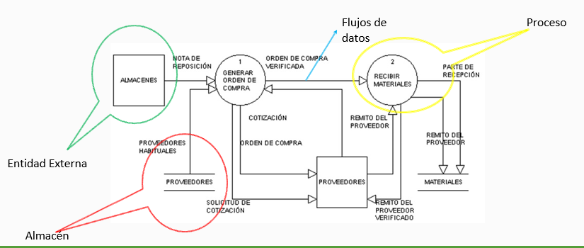

**Diagrama de contexto** 

Se muestra una panorama global que muestre las entradas basicas y las salidas. Es el nivel mas alto en un DFD y contiene un solo proceso que resprenta todo el sistema 

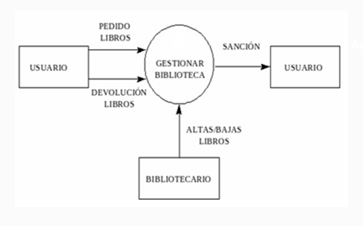

**Nivel 0**

Ampliacion del diagrama de contexto. 
Las entradas y salidas del Diagrama de contexto permanecen, sin embargo, se amplía para incluir hasta 9 procesos (como máximo) y mostrar los almacenes de datos y nuevos flujos.

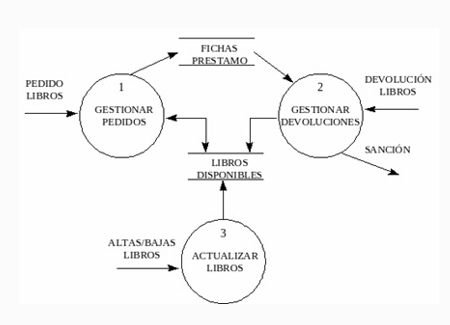

# Teoria 7 
## Proceso 
Se puede pensar a un "conjunto ordenado de tareas" como un proceso
### ¿Que es un proceso de software?
Es un conjunto de actividades y resultados asociados que producen un producto de software.
**Actividades fundamentales:**
- ***Especificación del software***:
Consiste en el proceso de comprender y definir que servicios se requieren del sistema, asi como la identificación de las restricciones sobre la operación y desarrollo del sistema.
Tambien llamada, *Ingeniería de Requerimientos*

- ***Desarrollo del software***:
Corresponde al proceso de convertir una especificación del sistema en un sistema ejecutable.
Incluye los procesos de diseño y programación. 
Se crea una descripción de la estructura del software que se va a implementar, los modelos y estructuras de datos, las interfaces, etc  

- ***Validación del software***
Se realiza para mostrar que un sistema cumple tanto con sus especificaciones como con las expectativas del cliente.
La prueba del sistema con datos de prueba simulados, es una de las formas de validación. 
Pero tambien incluye inspecciones y revisiones en distintas etapas.

- ***Evolución del software***:
El mantenimiento es una actividad a tener en cuenta en el proceso de desarrollo de software. Eso implica tambien cambios y mejoras 

### ¿Qué es un modelo de proceso de software?
- Es una representación simplificada de un proceso de software que presenta una visión de ese proceso.
- Estos modelos pueden incluir actividades que son partes de los procesos y productos de software, y el papel de las personas involucradas.

**Caracteristicas** 
- Establece todas las actividades 
- Utiliza recursos, esta sujeto a restrucciones y genera productos intermedios y finales
- Puede estar compuesto por subproceso 
- Cada actividad tiene entradas y salidas definidas 
- Las actividades se organizan e n una secuencia 
- Existen principios que orientan sobre las metas de cada actividad
- Las restricciones puede aplicarse a una actividad, recurso o produco

**Ciclo de vida**
Proceso que implica la construccion deu n producto
**Ciclo de via del software** 
Describe la vida del producto de software desde su concepcion hasta su implementacion, entrega, utilizacion y mantenimiento 
**Modelos de proceso de softare**
Es una representacion abstracta de un proceso del software 

### Modelos prescriptivos
Prescriben un conjunto de elementos del proceso: actividades del marco de trabajo, acciones de la ingeniería del software, tareas, aseguramiento de la calidad y mecanismos de control.
Cada modelo de proceso prescribe también un “flujo de trabajo”, es decir de qué forma los elementos del proceso se interrelacionan entre sí.

### Modelos descriptivos
Descripción en la forma en que se realizan en la realidad

### Modelos tradicionales 
Foramdos por un conjunto de fases o actividades en las que no tienen en cuenta la naturaleza evolituva del software 
- ***Clasico,lineal o en cascada***
    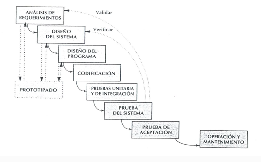
    * Las etapas se representan cayendo en cascada
    * Cada etapa de desarrollo se debe completar antes que comience la siguiente 
    * Útil para diagramar lo que se necesita hacer
    * Su simplicidad hace que sea fácil explicarlo a los clientes
    **Dificultades en el desarrollo y pruebas de sistemas:**
    * Resultados no inmediatos: Los resultados concretos solo se obtienen al finalizar todo el proceso.
    * Fallas en diferentes etapas: Las fallas triviales surgen al inicio del período de prueba, mientras que las más graves se detectan al final.
    * Eliminación de fallas: Es extremadamente difícil corregir fallas en las últimas etapas de prueba del sistema.
    * Perspectiva de manufactura: Proviene de enfoques del hardware, aplicando una visión de manufactura al desarrollo de software.
    * Incremento de pruebas: La necesidad de pruebas crece exponencialmente en las etapas finales.
    * Limitaciones en fases: Es poco realista "congelar" una fase debido a errores, cambios de parecer y alteraciones en el entorno.

- ***Modelo en V***
    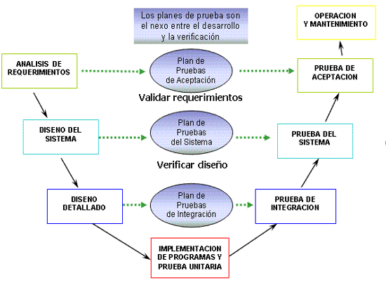
    *Demuestra cómo se relacionan las actividades de prueba con las de análisis y diseño.
    *Sugiere que la prueba unitaria y de integración también sea utilizada para verificar el diseño del programa
    *La vinculación entre los lados derecho e izquierdo implica que, si se encuentran problemas durante la verificación y validación, entonces el lado izquierdo de la V puede ser ejecutado nuevamente para solucionar el problema. 
    
- ***Basado en prototipos***
    El modelo de prototipos crea un producto parcial para que clientes y desarrolladores evalúen aspectos del sistema propuesto. Es útil para manejar incertidumbre, ambigüedad y cambios frecuentes en proyectos.
    * Prototipos evolutivos:
    Su objetivo es desarrollar el sistema final, construyendo partes rápidamente para aclarar aspectos y garantizar una comprensión compartida entre desarrolladores, usuarios y clientes.
    * Prototipos descartables:
    No funcionales, usados solo para modelar y explorar ideas con herramientas de diseño.
    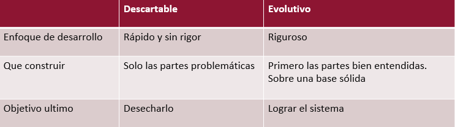

### Modelos evolutivos 
Son modelos que se adaptan a la evolucion que sufren los requisitos del sistema en funcion del tiempo
- ***En espiral***
    * Combina las actividades de desarrollo con la gestión del riesgo 
    * Trata de mejorar los ciclos de vida clásicos y prototipos.
    * Incorpora objetivos de calidad 
    * Elimina errores y alternativas no atractivas al comienzo
    * Permite iteraciones, vuelta atrás y finalizaciones rápidas
    * Cada ciclo empieza identificando:
        - Los objetivos de la porción correspondiente
        - Las alternativas
    * Restricciones
    * Cada ciclo se completa con una revisión que incluye todo el ciclo anterior y el plan para el siguiente
    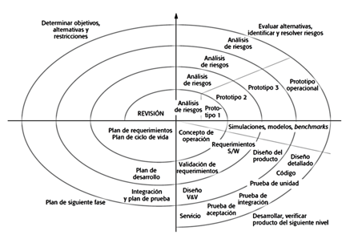

- ***Desarrollo por fases***
    Se desarrolla el sistema de tal manera que puede ser entregado en piezas. Esto implica que existen dos sistemas funcionando en paralelo: el sistema operacional y el sistema en desarrollo. 
    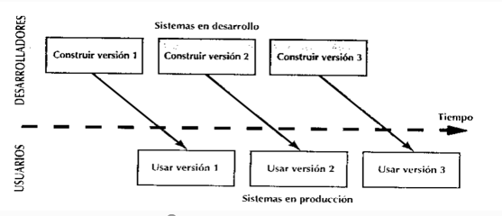
    Tipos de modelos de desarrollo por fases
    **Incremental**
    El sistema es particionado en subsistemas de acuerdo con su funcionalidad. Cada entrega agrega un subsistema.
    
    **Iterativo**
    Entrega un sistema completo desde el principio y luego aumenta la funcionalidad de cada subsistema con las nuevas versiones.
    
- ***Evolutivo***
- ***Incremental*** 

**Procesos agiles**

# Teoria 8
## Metodologias agiles 
**“Es un enfoque iterativo e incremental (evolutivo) de desarrollo de software”**

Objetivos : 
- Producir software de alta calidad con un costo efectivo  y en el tiempo apropiado.
- Esbozar los valores y principios que deberían permitir a los equipos desarrollar software rápidamente y respondiendo a los cambios que puedan surgir a lo largo del proyecto.
- Ofrecer una alternativa a los procesos de desarrollo de software tradicionales, caracterizados por ser rígidos y dirigidos por la documentación que se genera en cada una de las actividades desarrolladas.

***Principios***
1. **Prioridad al cliente:** Satisfacer al cliente con entregas continuas de software valioso.
2. **Flexibilidad en los requerimientos:** Se aceptan cambios de requisitos, incluso en etapas tardías del desarrollo.
3. **Entregas frecuentes:** Entregar software funcional cada pocas semanas o meses.
4. **Colaboración constante:** Desarrolladores y usuarios deben trabajar juntos a lo largo del proyecto.
5. **Motivación individual:** Construir proyectos alrededor de las motivaciones de los individuos.
6. **Ambiente de trabajo adecuado:** Proveer el entorno y soporte necesarios para el equipo, promoviendo la comunicación cara a cara.
7. **Progreso medido por software** funcional: La medida clave del progreso es el software que funciona.
8. **Desarrollo sostenible:** Fomentar un ritmo constante y sostenible de trabajo.
9. **Excelencia técnica y diseño:** Un enfoque continuo en la excelencia técnica mejora la agilidad.
10. **Simplicidad:** Maximizar el trabajo no realizado es esencial.
11. **Mejores resultados a partir de equipos:** Las mejores soluciones surgen de la autoorganización del equipo.
12. **Reflexión continua:** El equipo debe reflexionar regularmente para mejorar su efectividad y ajustar su enfoque.

***Desventajas***
En la práctica, los principios que subyacen a los métodos ágiles son a veces difíciles de cumplir:
- **Aunque es atractiva la idea de involucrar al cliente en el proceso de desarrollo**, los representantes del cliente están sujetos a otras presiones, y no intervienen por completo en el desarrollo del software.
- **Priorizar los cambios podría ser difícil**, sobre todo en sistemas donde  existen muchos participantes. Cada uno por lo general ofrece diversas prioridades a diferentes cambios.
- **Mantener la simplicidad requiere trabajo adicional**. Bajo la presión de fechas de entrega, es posible que los miembros del equipo carezcan de tiempo para realizar las  simplificaciones deseables al sistema.
- **Muchas organizaciones, especialmente las grandes compañías, pasan años cambiando su cultura, de tal modo que los procesos se definan y continúen**. Para ellas, resulta difícil moverse hacia un modelo de trabajo donde los procesos sean informales y estén definidos por equipos de desarrollo.

***Principales Metodologías Agiles***
### eXtreme Programming
Es una disciplina de desarrollo de software basado en los valores de la sencillez, la comunicación, la retroalimentación, la valentía y el respeto
Su acción consiste en llevar a todo el equipo reunido en la presencia de prácticas simples, con suficiente información para ver dónde están y para ajustar las prácticas a su situación particular.

* Desarrollo iterativo e incremental: pequeñas mejoras, unas tras otras.
* Pruebas unitarias continuas, frecuentemente repetidas y automatizadas, incluyendo pruebas de regresión. 
* Programación en parejas
* Frecuente integración del equipo de programación con el cliente o usuario. 
* Corrección de todos los errores antes de añadir nueva funcionalidad. 
* Refactorización del código
* Propiedad del código compartida
* Simplicidad en el código

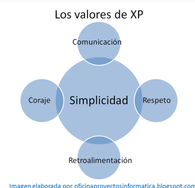

**Caracteristias escenciales**
* Historias de usuario 
* Roles
* Proceso 
* Practicas 

***Roles***
**Programador (Programmer)**
- Responsable de decisiones técnicas
- Responsable de construir el sistema
- Sin distinción entre analistas, diseñadores o codificadores
- En XP, los programadores diseñan, programan y realizan las pruebas

**Jefe de Proyecto (Manager)**
- Organiza y guía las reuniones
- Asegura condiciones adecuadas para el proyecto

**Cliente (Customer)**
- Es parte del equipo
- Determina qué construir y cuándo
- Establece las pruebas funcionales 

**Entrenador (Coach)**
- Responsable del proceso
- Tiende a estar en un segundo plano a medida que el equipo madura

**Encargado de Pruebas (Tester)**
- Ayuda al cliente con las pruebas funcionales
- Se asegura de que las pruebas funcionales se superan

**Rastreador (Tracker)**
- Metric Man
- Observa sin molestar
- Conserva datos históricos

***Ciclo de vida***
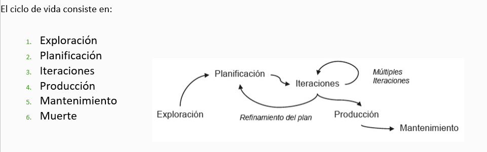

1. Exploración 
- Los clientes plantean las historias de usuario que son de interés para la primera entrega del producto.
- El equipo de desarrollo se familiariza con las herramientas, tecnologías y prácticas que se utilizarán en el proyecto.
- Se construye un prototipo.
- La fase de exploración toma de pocas semanas a pocos meses, dependiendo del tamaño y familiaridad que tengan los programadores con la tecnología.

2. Planificación 
- El cliente establece la prioridad de cada historia de usuario.
- Los programadores realizan una estimación del esfuerzo.
 Se toman acuerdos sobre el contenido de la primera entrega y se determina un cronograma en conjunto con el cliente.

Esta fase dura unos pocos días.

3. Iteración 
- El Plan de Entrega está compuesto por iteraciones de no más de tres semanas. 
- El cliente es quien decide qué historias se implementarán en cada iteración
- Al final de la última iteración el sistema estará listo para entrar en producción.

Esta fase incluye varias iteraciones sobre el sistema antes de ser entregado.

4. Producción 
- Esta fase requiere de pruebas adicionales  y revisiones de rendimiento antes de que el sistema sea trasladado al entorno del cliente.
- Al mismo tiempo, se deben tomar decisiones sobre la inclusión de nuevas características a la versión actual, debido a cambios durante esta fase.

5. Mantenimiento
- Mientras la primera versión se encuentra en producción, el proyecto XP debe mantener el sistema en funcionamiento al mismo tiempo que desarrolla nuevas iteraciones. 
- La fase de mantenimiento puede requerir nuevo personal dentro del equipo y cambios en su estructura.

6. Muerte 
- Es cuando el cliente no tiene más historias para ser incluidas en el sistema. 
- Se genera la documentación final del sistema y no se realizan más cambios en la arquitectura. 
- La muerte del proyecto también ocurre cuando el sistema no genera los beneficios esperados por el cliente o cuando no hay presupuesto para mantenerlo

***Practicas***
- Testing: 
Los programadores continuamente escriben pruebas unitarias, las cuales deben correr sin problemas para que el desarrollo continúe. 
Los clientes escriben pruebas demostrando que las funcionalidades están terminadas.
- Refactoring: 
Actividad constante de reestructuración del código con el objetivo de remover duplicación de código, mejorar su legibilidad, simplificarlo y hacerlo más flexible para facilitar los posteriores cambios.
- Programación de a Pares: 
Todo el código de producción es escrito por dos programadores en una máquina
- Propiedad Colectiva del Código: 
Cualquiera puede cambiar código en cualquier parte del sistema en cualquier momento.
Motiva a contribuir con nuevas ideas, evitando a la vez que algún programador sea imprescindible.
- Integración Continua: 
Cada pieza de código es integrada en el sistema una vez que esté lista. Así, el sistema puede llegar a ser integrado y construido varias veces en un mismo día.
Reduce la fragmentación de los esfuerzos de los desarrolladores por falta de comunicación sobre lo que puede ser reutilizado o compartido.
- Semana de 40-horas: 
Se debe trabajar un máximo de 40 horas por semana. 
El trabajo extra desmotiva al equipo.
Los proyectos que requieren trabajo extra para intentar cumplir con los plazos suelen al final ser entregados con retraso. En lugar de esto se puede realizar el juego de la planificación para cambiar el ámbito del proyecto o la fecha de entrega.
- Cliente en el Lugar de Desarrollo: 
El cliente tiene que estar presente y disponible todo el tiempo para el equipo.
- stándares de Codificación: 
Los programadores escriben todo el código de acuerdo con reglas que enfatizan la comunicación a través del mismo.

### SCRUM
Scrum se define como “una manera simple de manejar problemas complejos”, proporcionando un paradigma de trabajo que  soporta la innovación y permite que equipos auto-organizados entreguen resultados de alta calidad en tiempos cortos.  
En Scrum se realizan entregas parciales y regulares del resultado final del proyecto, priorizadas por el beneficio que aportan al receptor del proyecto
**Principios**
- *Eliminar el desperdicio:* no generar artefactos, ni perder el tiempo haciendo cosas que no le suman valor al cliente. 
- *Construir la calidad con el producto:* la idea es inyectar la calidad directamente en el código desde el inicio.
- *Crear conocimiento:* En la práctica no se puede tener el conocimiento antes de empezar el desarrollo.
- *Diferir las decisiones:* tomar las decisiones en el momento adecuado, esperar hasta ese momento, ya que uno tiene mas información a medida que va pasando el tiempo. Si se puede esperar, mejor.
- *Entregar rápido:* Debe ser una de las ventajas competitivas más  importantes.
- *Respetar a las personas:* la gente trabaja mejor cuando se encuentra en un ambiente que la motive y se sienta respetada.
- *Optimizar el todo:* optimizar todo el proceso, ya que el proceso es una unidad, y para lograr tener éxito y avanzar, hay que tratarlo como tal.

***Roles***
**El Product Owner (Propietario)** 
- conoce y marca las prioridades del proyecto o producto.
**El Scrum Master (Jefe)** 
- Es la persona que asegura el seguimiento de la metodología guiando las reuniones y ayudando al equipo ante cualquier problema que pueda aparecer. Su responsabilidad es entre otras, la de hacer de paraguas ante las presiones externas.
**El Scrum Team (Equipo)** 
- Son las personas responsables de implementar la funcionalidad o funcionalidades elegidas por el Product Owner.
**Los Usuarios o Cliente**
- Son los beneficiarios finales del producto, y son quienes viendo los progresos, pueden aportar ideas, sugerencias o necesidades.

***Artefactos***
**Product Backlog:** es la lista maestra que contiene toda la funcionalidad deseada en el producto. La característica más importante es que la funcionalidad se encuentra ordenada por un orden de prioridad.
**Sprint Backlog:** es la lista que contiene toda la funcionalidad que el equipo se comprometió a desarrollar durante un Sprint determinado.
**Burndown Chart:** muestra un acumulativo del trabajo hecho, día-a-día.
Entre otros… 

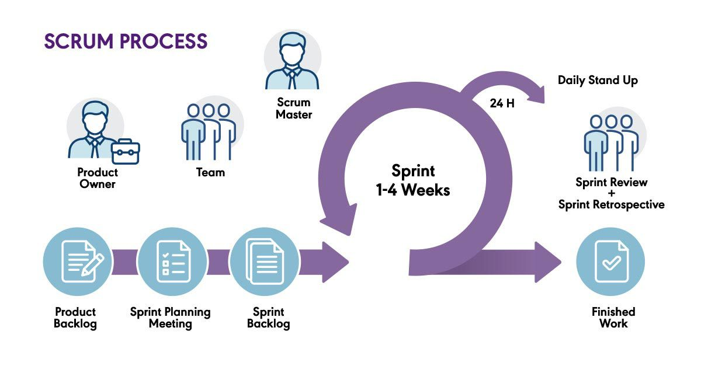

Scrum es **iterativo e incremental**

**¿Cuándo usar Scrum?**
Scrum está pensado para ser aplicado en proyectos en donde el “caos” es una constante, aquellos proyectos en los que tenemos requerimientos dinámicos, y que tenemos que implementar tecnología de punta. 
Esos proyectos difíciles, que con los enfoques tradicionales se hace imposible llegar a buen puerto.

### KANBAN 
Es un enfoque Lean de desarrollo de software ágil. 
Literalmente, Kanban es una palabra japonesa que significa "tarjeta visual". En Toyota, Kanban es el término que se utiliza para el sistema de señalización visual y física que une todo el sistema de producción Lean.
Kanban se presenta como una herramienta de gestión que prescribe solo 3 prácticas: 
- limitar el trabajo en curso 
- visualizar el flujo de trabajo
- medir el tiempo promedio de entrega. 
