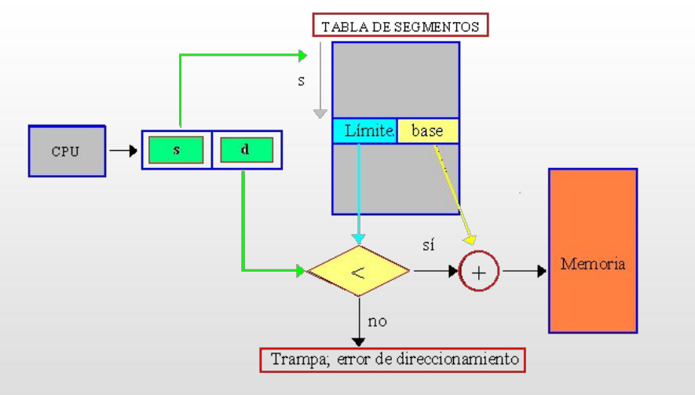
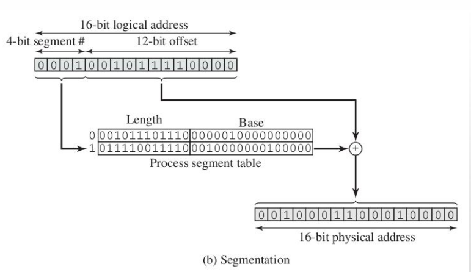
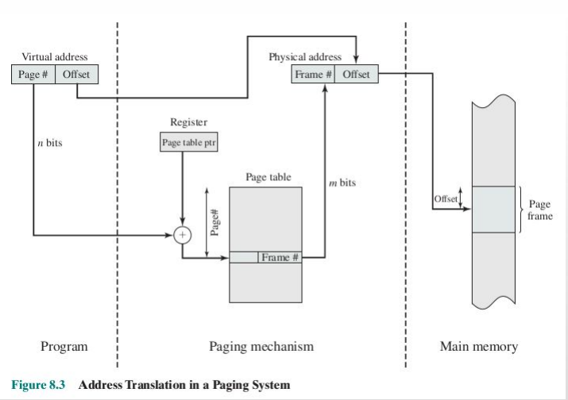
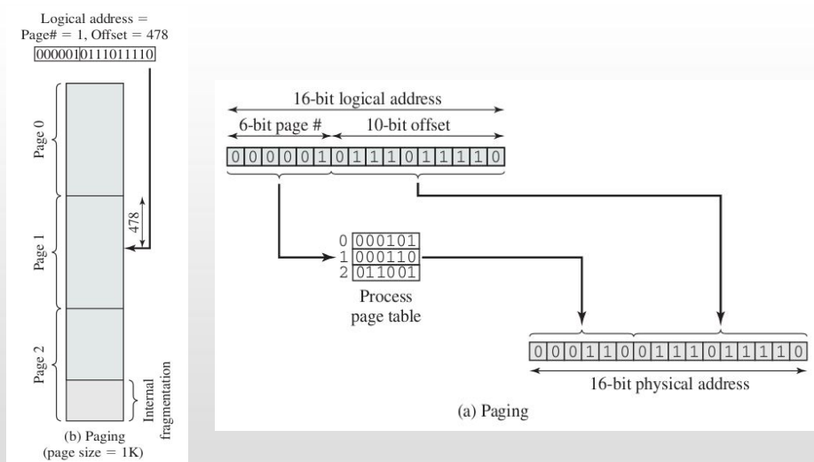

Respuestas de forma sintetica.
# 1
**A-Que es un sistema operativo?**
Un sistema operativo es un software que actúa como intermediario entre el hardware de una computadora  y los programas de aplicacion. Su función principal es gestionar los recursos del sistema, como la memoria, el procesador, el almacenamiento y los dispositivos de entrada/salida, para asegurar que los programas funcionen correctamente y de manera eficiente.

**B-Enumere que compoenentes/aspectos del harware son necesarios para cumplir con los objetivos de un sitema operativo.**
1. Procesador (CPU): Es el componente principal que ejecuta las instrucciones del sistema operativo y de las aplicaciones.
2. Memoria RAM: Almacena temporalmente los datos y programas en ejecución, permitiendo un acceso rápido.
3. Dispositivos de almacenamiento (HDD, SSD): Almacenan el sistema operativo, aplicaciones y datos de forma permanente.
4. Dispositivos de entrada/salida (teclado, mouse, pantalla, impresora): Permiten la interacción entre el usuario y el sistema operativo.
5. Tarjeta madre (Motherboard): Conecta todos los componentes del hardware y permite la comunicación entre ellos.
6. Tarjeta de red: Permite la conexión a redes y la comunicación con otros dispositivos
7. Fuente de alimentación: Proporciona energía eléctrica a todos los componentes del hardware.

**C-Enumere componentes de un sistema operativo.**
1. Núcleo (Kernel): Es el componente central que gestiona los recursos del sistema y permite la comunicación entre el hardware y el software.
2. Gestor de memoria: Administra la memoria RAM, asignando y liberando espacio según las necesidades de los programas.
3. Gestor de procesos: Controla la creación, ejecución y terminación de los procesos en el sistema.
4. Sistema de archivos: Organiza y gestiona el almacenamiento de datos en dispositivos de almacenamiento.
5. Interfaz de usuario: Proporciona una forma para que los usuarios interactúen con el sistema operativo, ya sea a través de una interfaz gráfica (GUI) o una línea de comandos (CLI).
6. Controladores de dispositivos: Permiten la comunicación entre el sistema operativo y los dispositivos de hardware.
7. Gestor de arranque: Maneja el proceso de inicio del sistema operativo cuando se enciende la computadora.
8. Servicios y utilidades del sistema: Proveen funciones adicionales como seguridad, redes, y herramientas de administración del sistema.

**D-Que es una llama al sistema (system call)? Como es posible implementarlas?**
Una llamada al sistema (system call) es una interfaz que permite a los programas de usuario solicitar servicios específicos del sistema operativo. Estas llamadas permiten a los programas interactuar con el hardware y realizar operaciones que requieren privilegios elevados, como la gestión de archivos, la comunicación entre procesos, y la asignación de memoria.
Las llamadas al sistema se implementan mediante una interrupción o una instrucción especial que cambia el modo de ejecución del procesador de modo usuario a modo kernel. 

**E-Defina y diferencie programa y proceso.**
Un programa es un conjunto de instrucciones escritas en un lenguaje de programación que realiza una tarea específica cuando se ejecuta. Es un archivo estático almacenado en el disco, como un ejecutable o un script.
Un proceso, por otro lado, es una instancia en ejecución de un programa. Incluye el estado del programa, la memoria asignada, los recursos del sistema y la información de control necesaria para su ejecución. Un proceso es dinámico y puede tener múltiples estados (ejecución, espera, terminado, etc.) durante su ciclo de vida.

**F-Cual es la informacion minima que el kernel debe tener sobre un proceso? En que escritura de datos asociada almacena dicha informacion?**
La información mínima que el kernel debe tener sobre un proceso incluye:
1. Identificador del proceso (PID): Un número único que identifica al proceso.
2. Estado del proceso: Indica si el proceso está en ejecución, esperando, detenido, etc.
3. Contador de programa (PC): La dirección de la próxima instrucción a ejecutar.
4. Registros de CPU: El contenido de los registros del procesador cuando el proceso está en espera.
5. Información de memoria: Detalles sobre la memoria asignada al proceso, como el espacio de direcciones.
6. Información de archivos abiertos: Una lista de archivos que el proceso tiene abiertos. 
7. Información de prioridad y planificación: Datos utilizados por el planificador del sistema operativo para gestionar la ejecución del proceso.

**G-Que objetivos persiguen los algoritmos de planificacion (scheduling)?**
Los algoritmos de planificación (scheduling) persiguen varios objetivos clave:
1. Maximizar el uso de la CPU: Asegurar que la CPU esté ocupada el mayor tiempo posible.
2. Minimizar el tiempo de respuesta: Reducir el tiempo que tarda un proceso en comenzar a ejecutarse después de ser solicitado.
3. Maximizar el rendimiento: Aumentar el número de procesos completados en un período de tiempo.
4. Garantizar la equidad: Asegurar que todos los procesos reciban una cantidad justa de tiempo de CPU.
5. Minimizar el tiempo de espera: Reducir el tiempo que los procesos pasan en la cola de espera antes de ser ejecutados.
6. Soportar diferentes tipos de cargas de trabajo: Adaptarse a las necesidades de procesos interactivos y por lotes.

**H-Que significa que un algoritmo de scheduling sea apropiativo o no apropiativo?**
Un algoritmo de scheduling es apropiativo (preemptive) si permite que el sistema operativo interrumpa un proceso en ejecución para asignar la CPU a otro proceso, generalmente basado en prioridades o tiempos de espera. Esto es útil para garantizar que los procesos de alta prioridad o los procesos interactivos reciban atención rápida.
Un algoritmo de scheduling no apropiativo (non-preemptive) no permite la interrupción de un proceso en ejecución hasta que este termine o entre en un estado de espera. En este caso, una vez que un proceso comienza a ejecutarse, retiene el control de la CPU hasta que finaliza su tarea o cede voluntariamente el control. Este enfoque puede ser más simple de implementar pero puede llevar a tiempos de espera más largos para otros procesos.

**I-Que tareas realizan los siguientes modulos de planificacion?**
- **Short Term Scheduler:** Se encarga de seleccionar qué proceso en la cola de listos debe ser asignado a la CPU para su ejecución inmediata. Su objetivo es maximizar el uso de la CPU y minimizar el tiempo de respuesta.
- **Long Term Scheduler:** Controla la admisión de nuevos procesos al sistema, decidiendo cuándo y cuántos procesos deben ser cargados en la memoria para su ejecución. Su objetivo es mantener un equilibrio entre la carga del sistema y la disponibilidad de recursos.
- **Medium Term Scheduler:** Gestiona la suspensión y reanudación de procesos en memoria, moviéndolos entre la memoria principal y el almacenamiento secundario (swap). Su objetivo es optimizar el uso de la memoria y mejorar la eficiencia del sistema al liberar espacio para procesos activos.

**J-Que tareas realiza el dispatcher? y el loader?**
- **Dispatcher:**
El dispatcher es responsable de la transición del control de la CPU entre procesos. Sus tareas principales incluyen:
1. Cambiar el contexto del proceso: Guardar el estado del proceso actual (registros, contador de programa, etc.) y cargar el estado del proceso siguiente que va a ejecutarse.
2. Transferir el control de la CPU: Iniciar la ejecución del proceso seleccionado por el planificador.
3. Manejar las interrupciones: Asegurar que las interrupciones del sistema se gestionen adecuadamente durante el cambio de contexto.
4. Minimizar el tiempo de cambio de contexto: Hacer que el proceso de cambio de contexto sea lo más rápido posible para reducir la sobrecarga del sistema.

- **Loader:**
El loader es responsable de cargar los programas en la memoria para su ejecución. Sus tareas principales incluyen:
1. Cargar el código del programa: Leer el código del programa desde el almacenamiento secundario y cargarlo en la memoria principal.
2. Preparar el entorno de ejecución: Configurar el espacio de direcciones del proceso, incluyendo la asignación de memoria para la pila, el heap y las variables globales.
3. Transferir el control al programa: Iniciar la ejecución del programa cargado, transfiriendo el control a su punto de entrada.
4. Manejar la carga de bibliotecas compartidas: Cargar y vincular dinámicamente las bibliotecas compartidas necesarias para la ejecución del programa.

Donde se encuentra el dispatcher y el loader en la estructura de un sistema operativo?
El dispatcher y el loader se encuentran en el núcleo (kernel) del sistema operativo. El dispatcher es una parte integral del planificador de procesos dentro del kernel, mientras que el loader también forma parte del kernel, ya que maneja la carga de programas en memoria y la preparación del entorno de ejecución. Ambos componentes trabajan juntos para gestionar la ejecución de procesos en el sistema operativo. 

Se ejecutan cuando el scheduler decide que un proceso debe ser ejecutado (dispatcher) o cuando un nuevo programa debe ser cargado en memoria (loader).

**K-Que significa que un proceso sea "CPU Bound" o "I/O Bound"?**
Un proceso "CPU Bound" es aquel que pasa la mayor parte de su tiempo utilizando la CPU para realizar cálculos intensivos. Estos procesos requieren mucha potencia de procesamiento y tienden a tener largos períodos de ejecución sin interrupciones para operaciones de entrada/salida. Ejemplos típicos incluyen programas de simulación, cálculos matemáticos complejos y procesamiento de datos.

Un proceso "I/O Bound", por otro lado, es aquel que pasa la mayor parte de su tiempo esperando operaciones de entrada/salida, como leer o escribir en discos, comunicarse a través de redes o interactuar con dispositivos periféricos. Estos procesos tienden a tener períodos cortos de uso de la CPU seguidos de largos tiempos de espera para completar las operaciones de I/O. Ejemplos típicos incluyen servidores web, aplicaciones de bases de datos y programas que manejan grandes volúmenes de datos.

**L-Cuales son los estados posibles por los que puede atravesar un proceso? Que represnta que un proceso se encuentre en los estados enumerados? Utilizando un diagrama explique las transciciones entre los estados:**
Los estados posibles por los que puede atravesar un proceso son:
1. Nuevo (New): El proceso está siendo creado.
2. Listo (Ready): El proceso está preparado para ejecutarse y espera a ser asignado a la CPU.
3. En ejecución (Running): El proceso está actualmente utilizando la CPU para ejecutar sus instrucciones.
4. Esperando (Waiting/Blocked): El proceso está esperando por un evento externo, como la finalización de una operación de I/O.
5. Terminado (Terminated): El proceso ha completado su ejecución y está siendo eliminado del sistema.
Las transiciones entre estos estados son las siguientes:
- De Nuevo a Listo: Cuando el proceso ha sido creado y está listo para ser ejecutado.
- De Listo a En ejecución: Cuando el planificador asigna la CPU al proceso.
- De En ejecución a Esperando: Cuando el proceso necesita esperar por un evento externo, como una operación de I/O.
- De Esperando a Listo: Cuando el evento por el que el proceso estaba esperando se ha completado.
- De En ejecución a Terminado: Cuando el proceso ha completado su tarea y finaliza su ejecución.
```plaintext
        +-------+
        | Nuevo |
        +-------+
            |
            v
        +-------+
        | Listo |
        +-------+
            |
            v
        +-----------+
        | En ejec.  |
        +-----------+
          |      |
          |      v
          |   +---------+
          |   | Espera. |
          |   +---------+
          |      |
          |      v
          |   +-------+
          |   | Listo |
          |   +-------+
          |
          v
      +-----------+
      | Terminado |
      +-----------+
```

**M-Cuales de los schedules mencionados anteriormente se encargan de las transiciones entre los estados de un proceso?**
El Short Term Scheduler (Planificador a corto plazo) es el encargado de gestionar las transiciones entre los estados de un proceso, específicamente las transiciones entre los estados de "Listo" y "En ejecución". Este planificador selecciona qué proceso en la cola de listos debe ser asignado a la CPU para su ejecución inmediata.

**N-Defina tiempo de retorno (TR), y tiempo de espera (TE) de un proceso. Como se calculan?**
El tiempo de retorno (TR) de un proceso es el tiempo total que transcurre desde que el proceso es creado hasta que finaliza su ejecución. Se calcula como la suma del tiempo de espera (TE) y el tiempo de ejecución (también conocido como tiempo de servicio o tiempo de CPU). La fórmula para calcular el tiempo de retorno es:
TR = TE + Tiempo de ejecución

El tiempo de espera (TE) de un proceso es el tiempo total que un proceso pasa en la cola de listos esperando a ser asignado a la CPU para su ejecución. Se calcula sumando todos los períodos en los que el proceso está en estado de "Listo" antes de ser ejecutado. La fórmula para calcular el tiempo de espera es:
TE = TR - Tiempo de ejecución

**O-Defina tiempo promedio de retorno (TRP) y tiempo promedio de espera (TPE). Como se calculan?**
El tiempo promedio de retorno (TRP) es el promedio del tiempo de retorno (TR) de todos los procesos en un sistema. Se calcula sumando los tiempos de retorno de todos los procesos y dividiendo por el número total de procesos. La fórmula para calcular el tiempo promedio de retorno es:
TRP = (Σ TRi) / N
donde TRi es el tiempo de retorno del proceso i y N es el número total de procesos.

El tiempo promedio de espera (TPE) es el promedio del tiempo de espera (TE) de todos los procesos en un sistema. Se calcula sumando los tiempos de espera de todos los procesos y dividiendo por el número total de procesos. La fórmula para calcular el tiempo promedio de espera es:
TPE = (Σ TEi) / N
donde TEi es el tiempo de espera del proceso i y N es el número total de procesos.

**P-Defina tiempo de respuesta**
El tiempo de respuesta  de un proceso es el tiempo que transcurre desde que un proceso hace una solicitud hasta que recibe la primera respuesta o comienza a ejecutarse. En el contexto de sistemas interactivos, el tiempo de respuesta es crucial, ya que afecta la percepción del usuario sobre la rapidez y eficiencia del sistema. Se calcula como el tiempo desde que el proceso entra en el estado de "Listo" hasta que comienza a ejecutarse por primera vez. La fórmula para calcular el tiempo de respuesta es:
TR = Tiempo de inicio de ejecución - Tiempo de solicitud

# 2 
**Algoritmos de Planificacion**

**FCFS (First Come First Served)**
El algoritmo FCFS asigna la CPU al proceso que llega primero a la cola de listos. Es un algoritmo no apropiativo, lo que significa que una vez que un proceso comienza a ejecutarse, no puede ser interrumpido hasta que termine su ejecución. Este enfoque es simple de implementar y entender, pero puede llevar a tiempos de espera largos para procesos que llegan después de procesos largos (efecto convoy).

**SJF (Shortest Job First)**
El algoritmo SJF asigna la CPU al proceso con el tiempo de CPU más corto entre los procesos en la cola de listos. Puede ser apropiativo o no apropiativo. En su versión no apropiativa, una vez que un proceso comienza a ejecutarse, no puede ser interrumpido. En su versión apropiativa (también conocido como SRTF - Shortest Remaining Time First), un proceso en ejecución puede ser interrumpido si llega un nuevo proceso con un tiempo de CPU más corto. Este algoritmo minimiza el tiempo promedio de espera, pero puede llevar a la inanición de procesos largos si llegan continuamente procesos cortos.

**Round Robin (RR)**
El algoritmo Round Robin asigna la CPU a cada proceso en la cola de listos por un período de tiempo fijo, conocido como quantum. Es un algoritmo apropiativo, ya que un proceso puede ser interrumpido cuando su quantum expira, y la CPU se asigna al siguiente proceso en la cola. Este enfoque es justo y equitativo, ya que todos los procesos reciben una cantidad igual de tiempo de CPU, pero puede llevar a un mayor tiempo de espera si el quantum es demasiado pequeño o demasiado grande.

**Priority Scheduling (Prioridades)**
El algoritmo de planificación por prioridades asigna la CPU al proceso con la prioridad más alta en la cola de listos. Puede ser apropiativo o no apropiativo. En su versión no apropiativa, una vez que un proceso comienza a ejecutarse, no puede ser interrumpido. En su versión apropiativa, un proceso en ejecución puede ser interrumpido si llega un nuevo proceso con una prioridad más alta. Este algoritmo permite la diferenciación entre procesos importantes y menos importantes, pero puede llevar a la inanición de procesos de baja prioridad si llegan continuamente procesos de alta prioridad.

**Cual es el mas adecuado segun los tipos de procesos y/o SO?**
- **FCFS** es adecuado para sistemas donde la carga de trabajo es ligera y los procesos tienen tiempos de ejecución similares. Es simple y fácil de implementar, pero no es ideal para sistemas con alta variabilidad en los tiempos de ejecución de los procesos.

- **SJF** es ideal para sistemas donde los tiempos de ejecución de los procesos son conocidos de antemano y varían significativamente. Es eficiente en términos de tiempo promedio de espera, pero puede no ser práctico en sistemas donde los tiempos de ejecución son impredecibles.

- **RR** es adecuado para sistemas interactivos donde se requiere una respuesta rápida a las solicitudes del usuario. Proporciona un buen equilibrio entre equidad y eficiencia, pero puede no ser ideal para procesos de larga duración que necesitan más tiempo de CPU.

- **Prioridades** es útil en sistemas donde algunos procesos son más importantes que otros. Permite que los procesos críticos obtengan más recursos, pero puede llevar a la inanición de procesos de baja prioridad si no se gestionan adecuadamente.


# 3 
#./Ejercicio3.xlsx

# 4 y 5 
#./Ejercicio4y5.xlsx

# 6
#./Ejercicio6.xlsx

# 7
## Inanicion
La inanición (starvation) es una situación en la que un proceso no puede obtener los recursos necesarios para continuar su ejecución debido a la asignación de recursos a otros procesos. Esto puede ocurrir en sistemas de planificación de procesos donde algunos procesos tienen prioridades más altas y, por lo tanto, obtienen más recursos, dejando a los procesos de baja prioridad sin la atención necesaria.

**Algoritmos que pueden provocar inanición:**
1. **SJF (Shortest Job First)**: En su versión apropiativa, los procesos con tiempos de ejecución más largos pueden ser continuamente desplazados por procesos más cortos que llegan, lo que puede llevar a que los procesos largos nunca obtengan tiempo de CPU.
2. **Priority Scheduling**: Si los procesos de alta prioridad llegan constantemente, los procesos de baja prioridad pueden quedar en espera indefinidamente, ya que siempre se les da preferencia a los procesos con mayor prioridad.

**Mecanismos para evitar la inanición:**
1. **Aging (Envejecimiento)**: Este mecanismo incrementa la prioridad de los procesos que han estado esperando en la cola de listos durante un período prolongado. De esta manera, con el tiempo, incluso los procesos de baja prioridad pueden obtener una prioridad suficientemente alta para ser ejecutados.
2. **Asignación de tiempo máximo**: Limitar el tiempo que un proceso puede estar en espera antes de ser promovido a una prioridad más alta o ser ejecutado.
3. **Equidad en la planificación**: Implementar algoritmos de planificación que aseguren que todos los procesos reciban una cantidad justa de tiempo de CPU, como el Round Robin, que asigna tiempo de CPU a cada proceso en turnos iguales.

# 8 
#./Ejercicio8.xlsx

# 9
**Algunos algoritmos pueden presentar ciertas desventajas cuando en el sistema se cuenta con procesos CPU Bound y I/O Bound. Analice las mismas para Round Robin y SRTF.**
**Round Robin (RR):**
- **Desventajas con procesos CPU Bound:** Los procesos CPU Bound pueden experimentar un mayor tiempo de espera y un menor rendimiento debido a la naturaleza del quantum fijo. Si el quantum es demasiado pequeño, los procesos CPU Bound pueden ser interrumpidos frecuentemente, lo que lleva a una sobrecarga de cambio de contexto y reduce la eficiencia del uso de la CPU.
- **Desventajas con procesos I/O Bound:** Los procesos I/O Bound pueden beneficiarse del Round Robin, ya que tienden a liberar la CPU rápidamente para realizar operaciones de I/O. Sin embargo, si el quantum es demasiado grande, los procesos I/O Bound pueden experimentar tiempos de respuesta más largos, ya que deben esperar a que los procesos CPU Bound terminen su quantum antes de obtener tiempo de CPU.
**SRTF (Shortest Remaining Time First):**
- **Desventajas con procesos CPU Bound:** Los procesos CPU Bound pueden sufrir de inanición si hay una llegada constante de procesos I/O Bound con tiempos de ejecución más cortos. Esto puede llevar a que los procesos CPU Bound nunca obtengan tiempo de CPU, ya que siempre son desplazados por los procesos más cortos.
- **Desventajas con procesos I/O Bound:** Los procesos I/O Bound generalmente se benefician del SRTF, ya que tienden a tener tiempos de ejecución más cortos. Sin embargo, si hay muchos procesos I/O Bound llegando al sistema, los procesos CPU Bound pueden quedar en espera indefinidamente, lo que puede afectar la equidad y la eficiencia del sistema en general.
Para mitigar estas desventajas, se pueden implementar mecanismos como el envejecimiento (aging) para evitar la inanición y ajustar el quantum en Round Robin para equilibrar la respuesta entre procesos CPU Bound e I/O Bound.

# 10 
#./Ejercicio10.xlsx

# 11 
Sí, bajo el esquema de VRR (Virtual Round Robin), es posible que el quantum de un proceso nunca llegue a 0. Esto puede suceder si el proceso en cuestión es un proceso I/O Bound que realiza operaciones de entrada/salida con frecuencia. En este caso, el proceso puede ser interrumpido y reprogramado antes de que su quantum expire, lo que significa que el contador nunca llega a 0.

# 12 **Importante** 

Algoritmos SJF y SRTF, requieren conocer la duracion de la proxima rafaga de CPU. En la practica esto no es posible, por lo que se utilizan estimaciones basadas en el historial de ejecucion del proceso.
La formula para la estimacion es:
```plaintext
    S(n+1) = 1/n * T(n) + (n-1)/n * S(n)
```
Donde:
- S(n+1) es la proxima estimacion de la duracion de la rafaga de CPU
- T(n) es la duracion real de la ultima rafaga de CPU
- S(n) es la estimacion anterior de la duracion de la rafaga de CPU
- n es el numero de rafagas de CPU que el proceso ha ejecutado hasta ahora 

Otra tecnica comun es el promedio ponderado exponencial, donde la proxima estimacion se calcula como:
```plaintext
    S(n+1) = α*T(n) + (1-α)*S(n)
```
Donde:
- S(n+1) es la proxima estimacion de la duracion de la rafaga de CPU
- T(n) es la duracion real de la ultima rafaga de CPU
- S(n) es la estimacion anterior de la duracion de la rafaga de CPU
- α es un factor de ponderacion entre 0 y 1 que determina la importancia de la ultima rafaga en la nueva estimacion. 

cuando α es cercano a 1, la nueva estimacion depende mas de la ultima rafaga, mientras que cuando α es cercano a 0, la nueva estimacion depende mas del historial de ejecucion del proceso.

a. Suponga un proceso cuyas ráfagas de CPU reales tienen como duración: 6,
4, 6, 4, 13, 13, 13. Calcule qué valores se obtendrían como estimación para
las ráfagas de CPU del proceso si se utiliza la fórmula 1, con un valor inicial
S(1) = 10.
```plaintext
Rafaga | T(n) | S(n) | S(n+1)
------------------------------  
    1    |  6   | 10   | 1/1*6 + 0/1*10 = 6
    2    |  4   |  6   | 1/2*4 + 1/2*6 = 5
    3    |  6   |  5   | 1/3*6 + 2/3*5 = 5.33
    4    |  4   |5.33  | 1/4*4 + 3/4*5.33 = 5
    5    | 13   | 5    | 1/5*13 + 4/5*5 = 6.6
    6    | 13   |6.6   | 1/6*13 + 5/6*6.6 =7.16
    7    | 13   |7.16  |1/7*13 +6/7*7.16=7.59
    
```

c. Para la situación planteada en a) calcule qué valores se obtendrían si se
utiliza la fórmula 2 con α = 0, 2; α = 0, 5 y α = 0,8
```plaintext
Rafaga | T(n) | S(n) | S(n+1) α=0.2 | S(n+1) α=0.5 | S(n+1) α=0.8
--------------------------------------------------------------------------------
    1  |  6   | 10   | 0.2*6 + 0.8*10 = 9.2 | 0.5*6 + 0.5*10 = 8 | 0.8*6 + 0.2*10 = 7.2
    2  |  4   | 9.2  | 0.2*4 + 0.8*9.2 = 8.16 | 0.5*4 + 0.5*9.2 = 6.6 | 0.8*4 + 0.2*7.2 = 4.64
    3  |  6   | 8.16 | 0.2*6 + 0.8*8.16 = 7.73 | 0.5*6 + 0.5*8.16 = 7.08 | 0.8*6 + 0.2*4.64 = 5.33
    4  |  4   | 7.73 | 0.2*4 + 0.8*7.73 = 6.98 | 0.5*4 + 0.5*7.73 = 5.87 | 0.8*4 + 0.2*5.33 = 4.27
    5  | 13   | 6.98 | 0.2*13 + 0.8*6.98 = 8.58 | 0.5*13 + 0.5*6.98 = 9.99 | 0.8*13 + 0.2*4.27 = 11.05
    6  | 13   | 8.58 | 0.2*13 + 0.8*8.58 = 9.66 | 0.5*13 + 0.5*9.99 = 11.495 | 0.8*13 + 0.2*11.05 = 12.39
    7  | 13   | 9.66 | 0.2*13 + 0.8*9.66 = 10.33 | 0.5*13 + 0.5*11.495 = 12.2475 | 0.8*13 + 0.2*12.39 = 12.78
```

d. Para todas las estimaciones realizadas en a y c ¿Cuál es la que más se
asemeja a las ráfagas de CPU reales del proceso?

La estimación que más se asemeja a las ráfagas de CPU reales del proceso es la obtenida utilizando la fórmula 2 con α = 0.5. Esta configuración proporciona un equilibrio adecuado entre la influencia de la última ráfaga y el historial de ejecuciones, lo que resulta en estimaciones que reflejan mejor las duraciones reales de las ráfagas de CPU del proceso. Las estimaciones con α = 0.2 tienden a ser demasiado conservadoras, mientras que las con α = 0.8 reaccionan demasiado rápidamente a los cambios recientes, lo que puede no ser representativo del comportamiento general del proceso.


# 13 Colas Multinivel

Actualmente los algoritmos de planificación vistos se han ido combinando para
formar algoritmos más eficientes. Así surge el algoritmo de Colas Multinivel, donde la
cola de procesos listos es dividida en varias colas, teniendo cada una su propio
algoritmo de planificación.
a. Suponga que se tiene dos tipos de procesos: Interactivos y Batch. Cada uno
de estos procesos se coloca en una cola según su tipo. ¿Qué algoritmo de
los vistos utilizará para administrar cada una de estas colas?.
A su vez, se utiliza un algoritmo para administrar cada cola que se crea. Así, por
ejemplo, el algoritmo podría determinar mediante prioridades sobre qué cola
elegir un proceso.
b. Para el caso de las dos colas vistas en a: ¿Qué algoritmo utilizaría para
planificarlas?

a. Para administrar la cola de procesos interactivos, se podría utilizar el algoritmo Round Robin (RR). Este algoritmo es adecuado para procesos interactivos porque proporciona tiempos de respuesta rápidos y equitativos, permitiendo que los usuarios reciban atención inmediata a sus solicitudes. El quantum puede ser ajustado para equilibrar la respuesta rápida con la eficiencia del sistema.
Para la cola de procesos batch, se podría utilizar el algoritmo Shortest Job First (SJF) o First Come First Served (FCFS). SJF es eficiente para procesos batch porque minimiza el tiempo promedio de espera al priorizar los trabajos más cortos. FCFS también es una opción viable si los tiempos de ejecución son similares y se busca simplicidad en la implementación.

b. Para planificar las dos colas, se podría utilizar un algoritmo de prioridades. En este caso, la cola de procesos interactivos tendría una prioridad más alta que la cola de procesos batch. Esto aseguraría que los procesos interactivos reciban atención inmediata y no se vean retrasados por los procesos batch, que pueden tolerar tiempos de espera más largos. El planificador de prioridades seleccionaría primero los procesos de la cola interactiva y, una vez que esta esté vacía, comenzaría a ejecutar los procesos de la cola batch. Este enfoque garantiza una experiencia de usuario óptima mientras se mantiene la eficiencia en la ejecución de procesos batch.

# 14
#./Ejercicio14.xlsx

# 15
#./Ejercicio15.xlsx

# 16 
. La situación planteada en el ejercicio 16, donde un proceso puede cambiar de
una cola a otra, se la conoce como Colas Multinivel con Realimentación.
Suponga que se quiere implementar un algoritmo de planificación que tenga en
cuenta el tiempo de ejecución consumido por el proceso, penalizando a los que más
tiempo de ejecución tienen. (Similar a la tarea del algoritmo SJF que tiene en cuenta
el tiempo de ejecución que resta).
Utilizando los conceptos vistos de Colas Multinivel con Realimentación indique
qué colas implementaría, qué algoritmo usaría para cada una de ellas así como para
la administración de las colas entre sí.
Tenga en cuenta que los procesos no deben sufrir inanición.

Para implementar un algoritmo de planificación basado en Colas Multinivel con Realimentación que penalice a los procesos con mayor tiempo de ejecución, se podrían seguir los siguientes pasos:
1. **Definir las colas**: Se podrían definir varias colas, cada una con un nivel de prioridad diferente. Por ejemplo, se podrían tener tres colas:
   - Cola 1: Alta prioridad (para procesos con bajo tiempo de ejecución)
   - Cola 2: Media prioridad (para procesos con tiempo de ejecución moderado)
   - Cola 3: Baja prioridad (para procesos con alto tiempo de ejecución)
2. **Asignar algoritmos a cada cola**:
    - Cola 1: Utilizar el algoritmo Round Robin (RR) con un quantum corto
    - Cola 2: Utilizar el algoritmo Shortest Job First (SJF) para minimizar el tiempo promedio de espera
    - Cola 3: Utilizar el algoritmo First Come First Served (FCFS) para asegurar que los procesos de larga duración sean atendidos eventualmente

# 17
A cuáles de los siguientes tipos de trabajos:
● cortos acotados por CPU
● cortos acotados por E/S
● largos acotados por CPU
● largos acotados por E/S
benefician las siguientes estrategias de administración:
a. prioridad determinada estáticamente con el método del más corto
primero (SJF).
b. prioridad dinámica inversamente proporcional al tiempo transcurrido
desde la última operación de E/S

a. La estrategia de prioridad determinada estáticamente con el método del más corto primero (SJF) beneficia principalmente a los trabajos cortos acotados por CPU. Estos trabajos tienen tiempos de ejecución breves y, al ser priorizados, pueden completarse rápidamente, lo que reduce el tiempo promedio de espera en el sistema. Sin embargo, esta estrategia puede no ser tan beneficiosa para trabajos largos acotados por CPU, ya que pueden sufrir de inanición si hay una llegada constante de trabajos cortos.
b. La estrategia de prioridad dinámica inversamente proporcional al tiempo transcurrido desde la última operación de E/S beneficia a los trabajos cortos acotados por E/S y a los trabajos largos acotados por E/S. Esta estrategia permite que los procesos que han estado esperando por un tiempo prolongado (especialmente aquellos que realizan operaciones de E/S) aumenten su prioridad con el tiempo, lo que ayuda a evitar la inanición. Los trabajos cortos acotados por E/S pueden beneficiarse al recibir atención rápida después de completar sus operaciones de E/S, mientras que los trabajos largos acotados por E/S también pueden obtener prioridad a medida que esperan, asegurando que eventualmente sean atendidos.

# 18
. Analizar y explicar por qué si el quantum en Round-Robin se incrementa sin límite, el algoritmo de planificación se aproxima a FIFO.

En el algoritmo Round-Robin, cada proceso en la cola de listos recibe una cantidad fija de tiempo de CPU, conocida como quantum, antes de ser interrumpido y colocado al final de la cola. Si el quantum se incrementa sin límite, eventualmente llegará a un punto en el que es tan grande que cada proceso puede completar su ejecución en un solo turno sin ser interrumpido. En este escenario, el comportamiento del algoritmo Round-Robin se asemeja al de FIFO (First In First Out), donde los procesos se ejecutan en el orden en que llegaron y no son interrumpidos hasta que terminan su ejecución.

# 19

. Dado los siguientes programas en un pseudo-código que simula la utilización de
llamadas al sistema para crear procesos en Unix/Linux, indicar qué mensajes se
imprimirán en pantalla (sin importar el orden en que saldrían):
a. Caso 1
printf(“hola”)
x = fork()
if x < 1 {
execv(“ls”)
printf(“mundo”)
exit(0)
}
exit(0)
b. Caso 2
printf(“hola”)
x = fork()
if x < 1 {
execv(“ps”)
printf(“mundo”)
exit(0)
}
execv(“ls”)
printf(“fin”)
exit(0)
c. Caso 3
printf(“Anda a rendir el Primer Parcial de
Promo!”)
newpid = fork()
if newpid == 0 {
printf(“Estoy comenzando el Examen”)
execv(“ps”)
printf(“Termine el Examen”)
}
printf(“¿Como te fue?”)
exit(0)
printf(“Ahora anda a descansar”)

**Caso 1:**
Los mensajes que se imprimirán en pantalla son:
- "hola"
- "mundo"
- La salida del comando "ls" (lista de archivos en el directorio actual)
El mensaje "mundo" no se imprimirá porque después de la llamada a execv("ls"), el proceso hijo reemplaza su imagen con la del comando "ls", y cualquier código después de execv no se ejecuta.

**Caso 2:**
Los mensajes que se imprimirán en pantalla son:
- "hola"
- "fin"
- La salida del comando "ps" (lista de procesos en ejecución)
- La salida del comando "ls" (lista de archivos en el directorio actual)
El mensaje "mundo" no se imprimirá porque después de la llamada a execv("ps"), el proceso hijo reemplaza su imagen con la del comando "ps", y cualquier código después de execv no se ejecuta. El mensaje "fin" se imprimirá en el proceso padre después de que el proceso hijo haya sido creado. El execv("ls") en el proceso padre reemplazará su imagen con la del comando "ls", y cualquier código después de execv no se ejecuta.

**Caso 3:**
Los mensajes que se imprimirán en pantalla son:
- "Anda a rendir el Primer Parcial de Promo!"
- "¿Como te fue?"
- La salida del comando "ps" (lista de procesos en ejecución)
El mensaje "Estoy comenzando el Examen" se imprimirá en el proceso hijo antes de la llamada a execv("ps"). El mensaje "Termine el Examen" no se imprimirá porque después de la llamada a execv("ps"), el proceso hijo reemplaza su imagen con la del comando "ps", y cualquier código después de execv no se ejecuta. El mensaje "Ahora anda a descansar" no se imprimirá porque está después de la llamada a exit(0) en el proceso padre, lo que termina la ejecución del proceso padre antes de llegar a ese punto.

# 20
#include <stdio.h>
#include <sys/types.h>
#include <unistd.h>
int main ( void ) {
    int c ;
    pid_t pid ;
    printf( " Comienzo . : \ n " ) ;
    for ( c = 0 ; c < 3 ; c++ ) {
     pid = fork ( ) ;
    }
    printf ( " Proceso \n " ) ;
    return 0 ;
}

A.¿Cuántas líneas con la palabra “Proceso” aparecen al final de la ejecución de este programa?
Al final de la ejecución de este programa, aparecerán 8 líneas con la palabra "Proceso". Porque el bucle for se ejecuta 3 veces, y en cada iteración se crea un nuevo proceso con fork(). El proceso hijo se crea con el código después de la llamada a fork(), lo que significa que cada proceso (padre e hijo) continuará ejecutando el bucle y creando más procesos. El número total de procesos creados será 2^n, donde n es el número de veces que se ejecuta el bucle for. En este caso, n es 3, por lo que el número total de procesos será 2^3 = 8.

B. ¿El número de líneas es el número de procesos que han estado en ejecución?.
Ejecute el programa y compruebe si su respuesta es correcta. Modifique el
valor del bucle for y compruebe los nuevos resultados.

Sí, el número de líneas con la palabra "Proceso" es igual al número de procesos que han estado en ejecución. Cada vez que se llama a fork(), se crea un nuevo proceso, y cada proceso (tanto el padre como los hijos) ejecuta el código después de la llamada a fork(), lo que incluye la impresión de "Proceso". Por lo tanto, el número total de líneas impresas corresponde al número total de procesos creados durante la ejecución del programa. 

# 21 

#include <stdio.h>
#include <sys/types.h>
#include <unistd.h>
int main ( void ) {
    int c ;
    pid_t pid ;
    int p = 0;
    printf( " Comienzo . : \ n " ) ;
    for ( c = 0 ; c < 3 ; c++ ) {
        pid = fork ( ) ;
    }
    p++;
    printf ( " Proceso %d\n ",p ) ;
    return 0 ;
}

A. ¿Que valores se imprimen en pantalla?
La salida mostrara 
Comienzo.
Proceso 1
Proceso 1
Proceso 1
Proceso 1
Proceso 1
Proceso 1
Proceso 1
Proceso 1

# 22 
**Que es la MMU y que funciones cumple?**
La MMU (Memory Management Unit) es un componente de hardware en un sistema informático que se encarga de gestionar la memoria del sistema. Sus funciones principales incluyen:
1. Traducción de direcciones: La MMU traduce las direcciones virtuales utilizadas por los programas en direcciones físicas correspondientes en la memoria RAM. Esto permite que los programas utilicen un espacio de direcciones virtuales independiente del espacio de direcciones físicas.
2. Protección de memoria: La MMU implementa mecanismos de protección para evitar que los procesos accedan a áreas de memoria que no les están asignadas. Esto ayuda a prevenir errores y mejorar la seguridad del sistema.
3. Gestión de memoria virtual: La MMU facilita la implementación de memoria virtual, permitiendo que los procesos utilicen más memoria de la que físicamente está disponible en el sistema. Esto se logra mediante el uso de técnicas como el paginamiento y la segmentación.
4. Control de acceso: La MMU puede controlar los permisos de acceso a diferentes áreas de memoria, como lectura, escritura y ejecución, asegurando que los procesos solo puedan realizar operaciones permitidas en las áreas de memoria asignadas.
5. Soporte para swapping: La MMU puede ayudar en la gestión del intercambio de páginas entre la memoria principal y el almacenamiento secundario (swap), facilitando la liberación de memoria para procesos activos.

# 23
**Que representa el espacio de direcciones de un proceso?**
El espacio de direcciones de un proceso representa el rango completo de direcciones de memoria que un proceso puede utilizar durante su ejecución. Este espacio incluye tanto las direcciones virtuales como las físicas, y está dividido en varias secciones que contienen diferentes tipos de datos y código necesarios para el funcionamiento del proceso.
El espacio de direcciones típicamente incluye:
1. Código del programa: La sección que contiene las instrucciones ejecutables del proceso.
2. Datos estáticos: La sección que contiene variables globales y estáticas que son accesibles durante toda la vida del proceso.
3. Pila (stack): La sección que se utiliza para almacenar variables locales, parámetros de funciones y direcciones de retorno durante la ejecución de funciones.
4. Heap: La sección que se utiliza para la asignación dinámica de memoria durante la ejecución del proceso.
5. Área de memoria compartida: Si el proceso utiliza memoria compartida con otros procesos, esta área también formará parte del espacio de direcciones.

# 24 
**Explique y relacione los siguientes conceptos:**
- **Direccion logica o virtual**: Es la dirección que un proceso utiliza para acceder a la memoria. Estas direcciones son generadas por el programa y son independientes de la ubicación física en la memoria.
- **Direccion fisica**: Es la dirección real en la memoria RAM donde se almacenan los datos. La MMU traduce las direcciones lógicas o virtuales a direcciones físicas para acceder a la memoria.

# 25 
En la tecnica de particiones multiples, la memoria es dividia en varias particiones y los espacios de direcciones de los procesos son ubicados en estas, siempre que el tamaño del mismo sea menor o igual que el tamaño de la particion.
Al trabajar con particiones se pueden considerar 2 metodos de asignacion:
- **Particiones fijas**: La memoria se divide en particiones de tamaño fijo.
- **Particiones dinamicas**: La memoria se divide en particiones de tamaño variable, ajustandose al tamaño del proceso que se va a cargar.

a. Explique como trabajan estos 2 metodos. Cite diferencias, ventajas y desventajas.

**Particiones fijas:**
- **Funcionamiento**: La memoria se divide en un número fijo de particiones de tamaño predefinido. Cada partición puede alojar un solo proceso, y si un proceso es más pequeño que la partición, el espacio restante se desperdicia (fragmentación interna).
- **Ventajas**: 
  - Simplicidad en la implementación y gestión de la memoria.
  - Menor sobrecarga en la administración de memoria.
- **Desventajas**:
  - Fragmentación interna, ya que el espacio no utilizado dentro de una partición no puede ser utilizado por otros procesos.
  - Limitación en la cantidad de procesos que pueden ser alojados, ya que el número de particiones es fijo.

**Particiones dinámicas:**
- **Funcionamiento**: La memoria se divide en particiones de tamaño variable, ajustándose al tamaño del proceso que se va a cargar. Esto significa que cada partición puede crecer o reducirse según las necesidades del proceso.
- **Ventajas**:
  - Mejor utilización de la memoria, ya que no hay fragmentación interna.
  - Mayor flexibilidad para alojar procesos de diferentes tamaños.
- **Desventajas**:
  - Mayor complejidad en la implementación y gestión de la memoria.
  - Posible fragmentación externa, ya que los procesos pueden dejar huecos de memoria no utilizados entre ellos.

b. ¿Que informacion debe disponer el kernel para poder administrar la memoria principal con estos metodos?

Para administrar la memoria principal con los métodos de particiones fijas y dinámicas, el kernel debe disponer de la siguiente información:
1. **Mapa de memoria**: Una estructura de datos que indique qué particiones están ocupadas y cuáles están libres, así como el tamaño de cada partición.
2. **Tamaño de las particiones**: En el caso de particiones fijas, el tamaño de cada partición debe ser conocido y almacenado.
3. **Lista de procesos**: Información sobre los procesos que están actualmente en ejecución, incluyendo su tamaño y estado (activo, esperando, etc.).
4. **Algoritmo de asignación**: El método utilizado para asignar particiones a los procesos, como First Fit, Best Fit o Worst Fit.
5. **Información de fragmentación**: Datos sobre la fragmentación interna y externa para optimizar la asignación de memoria y reducir el desperdicio.

c.Realice un grafico indicando como se realiza la tranformcacion de direcciones logicas a direcciones fisicas en ambos metodos.

- Se usa un registro base y un registro límite en el hardware (MMU).
- La conversión de direcciones se hace en tiempo de ejecución.
- La MMU suma automáticamente la dirección base a la dirección lógica cuando el proceso accede a memoria.

Fórmula (idéntica en concepto): 𝐷𝐹=𝐷𝐿+𝑅𝑒𝑔𝑖𝑠𝑡𝑟𝑜𝐵𝑎𝑠𝑒
```plaintext
──────────────────────────────────────────────
1️⃣ Particiones Fijas (Relocación Estática)
──────────────────────────────────────────────
        Programa (dirección lógica)
                │
                ▼
        +-------------------+
        |   Dirección Base  |  ← asignada al cargar
        +-------------------+
                │  (suma)
                ▼
        +-------------------+
        | Dirección Física  |
        +-------------------+

Transformación: DF = DL + DB
──────────────────────────────────────────────


2️⃣ Particiones Variables (Relocación Dinámica)
──────────────────────────────────────────────
        CPU genera DL
                │
                ▼
        +-------------------+
        | Registro Base     | ← cargado por el SO
        +-------------------+
                │  (suma en tiempo real)
                ▼
        +-------------------+
        | MMU (traducción)  |
        +-------------------+
                │
                ▼
        Memoria física (DF)

Transformación: DF = DL + RegistroBase
──────────────────────────────────────────────
```

# 26 
Al trabajar con particiones fijas, los tamaños de las mismas se pueden considerar:
- **Particiones de igual tamaño**: Todas las particiones tienen el mismo tamaño.
- **Particiones de distinto tamaño**: Las particiones tienen tamaños diferentes, adaptándose a las necesidades de los procesos.
a. Ventajas y desventajas de cada una de estas opciones.
**Particiones de igual tamaño:**
- **Ventajas**:
    - Simplicidad en la gestión de memoria, ya que todas las particiones son iguales.
    - Fácil implementación y administración.
- **Desventajas**:
    - Fragmentación interna, ya que los procesos más pequeños desperdician espacio dentro de la partición.
    - Limitación en la cantidad de procesos que pueden ser alojados, ya que el tamaño fijo puede no adaptarse a todos los procesos.

**Particiones de distinto tamaño:**
- **Ventajas**:
    - Mejor utilización de la memoria, ya que las particiones pueden adaptarse al tamaño de los procesos.
    - Menor fragmentación interna, ya que los procesos pueden ajustarse mejor a las particiones disponibles.
- **Desventajas**:
    - Mayor complejidad en la gestión de memoria, ya que se deben manejar particiones de diferentes tamaños.
    - Posible fragmentación externa, ya que los procesos pueden dejar huecos de memoria no utilizados entre ellos.

# 27 
**Fragmentacion** 
Ambos metoso de particiones presentan el problema de la fragmentacion: 
a. Explique que es la fragmentacion y que tipos existen.
- **Fragmentacion interna**: Ocurre cuando un proceso no utiliza todo el espacio asignado en una partición, dejando espacio desperdiciado dentro de la partición. Esto es común en particiones fijas, especialmente cuando los procesos son más pequeños que las particiones.
- **Fragmentacion externa**: Ocurre cuando hay suficiente memoria total disponible para un proceso, pero no hay un bloque contiguo de memoria lo suficientemente grande para alojarlo. Esto es común en particiones dinámicas, donde los procesos pueden dejar huecos de memoria no utilizados entre ellos.

b.El problema de la fragmentacion externa es posible de subsanar. Explique una posible tecnica que permita al kernel mitigar este problema.

Una técnica común para mitigar el problema de la fragmentación externa es la **compactación de memoria**. La compactación implica mover los procesos en la memoria para consolidar los bloques libres en un solo bloque contiguo. Esto se realiza periódicamente por el kernel para reorganizar la memoria y reducir los huecos de memoria no utilizados entre los procesos.

# 28 
Analice y describa como funcionan las siguientes tecnicas de asignacion de particiones,
Tenga en cuenta la informacion que debe tener el kernel. Indique, para los metodos de partciones fijas y dinamicas, con cual tecnica se obtienen mejores resultados.

- **First Fit**: Esta técnica asigna la primera partición libre que es lo suficientemente grande para alojar el proceso. El kernel debe mantener un mapa de memoria que indique qué particiones están ocupadas y cuáles están libres. Esta técnica es rápida y simple, pero puede llevar a la fragmentación externa si las particiones libres son pequeñas y dispersas.
- **Best Fit**: Esta técnica busca la partición libre más pequeña que sea lo suficientemente grande para alojar el proceso. El kernel debe mantener un mapa de memoria y buscar a través de todas las particiones libres para encontrar la mejor opción. Esta técnica puede reducir la fragmentación externa al utilizar el espacio de manera más eficiente, pero puede ser más lenta debido a la búsqueda exhaustiva.
- **Worst Fit**: Esta técnica asigna la partición libre más grande disponible para alojar el proceso. El kernel debe mantener un mapa de memoria y buscar a través de todas las particiones libres para encontrar la opción más grande. Esta técnica puede dejar grandes bloques de memoria libres, pero puede no ser eficiente en términos de utilización de memoria, ya que puede dejar pequeños bloques de memoria inutilizables.
- **Next Fit**: Esta técnica es similar a First Fit, pero en lugar de comenzar la búsqueda desde el principio de la memoria cada vez, comienza desde la última posición donde se encontró una partición libre. El kernel debe mantener un puntero que indique la última posición de búsqueda. Esta técnica puede ser más eficiente que First Fit en términos de tiempo de búsqueda, pero puede llevar a una distribución desigual de los procesos en la memoria.

Para particiones fijas, First Fit suele ser la técnica más eficiente debido a su simplicidad y rapidez. Para particiones dinámicas, Best Fit puede ofrecer mejores resultados en términos de utilización de memoria y reducción de fragmentación externa, aunque a costa de un mayor tiempo de búsqueda.

# 29 
**Segmentacion**
La segmentación es una técnica de gestión de memoria que divide el espacio de direcciones de un proceso en segmentos lógicos, cada uno con un propósito específico, como código, datos y pila. A diferencia de la paginación, que divide la memoria en bloques de tamaño fijo, la segmentación permite que los segmentos tengan tamaños variables según las necesidades del proceso.
A. Explique como trabaja este metodo de asignacion de memoria.

La segmentación trabaja asignando segmentos de memoria a un proceso en función de sus necesidades lógicas. Cada segmento tiene una dirección base y un límite que define su tamaño. Cuando un proceso intenta acceder a una dirección de memoria, la MMU utiliza la dirección base del segmento correspondiente y suma el desplazamiento (offset) proporcionado por el proceso para calcular la dirección física real en la memoria.

B. ¿Que estructuras son necesarias en el kernel para poder ejectuarse sobre un harware que utiliza segmentacion?

Para que el kernel pueda gestionar la memoria utilizando segmentación, se requieren las siguientes estructuras:
1. **Tabla de segmentos (Por proceso)**: Una estructura que almacena información sobre cada segmento, incluyendo la dirección base, el límite (tamaño) y los permisos de acceso (lectura, escritura, ejecución) para cada segmento.
2. **Segment-table base register (STBR)**: Un registro que apunta a la tabla de segmentos del proceso actual en ejecución.
3. **Segment-table limit register (STLR)**: Un registro que indica el tamaño de la tabla de segmentos, ayudando a prevenir accesos fuera de los límites definidos.

C. Explique, utilizando graficos, como son resueltas las direcciones logicas a fisicas en este metodo.



**Direcciones**


# 30 
Dado un esquema de segmentacion donde cada direccion hace referencia a 1 byte y la siguiente tabla de segmentos de un proceso, traduzca, de corresponder, las direcciones logicas indicadas a direcciones fisicas. La direccion logica esta representada por: segmento:desplazamiento
| Segmento | Direccion Base | Limite |
|----------|----------------|--------|
|    0     |       102      | 12500  |
|    1     |      28699     | 24300  |
|    2     |      68010     | 15855  |
|    3     |      80001     | 400    |

a. 0000:9001
b. 0001:24301
c. 0002:5678
d. 0001:18976
e. 0003:0

a. 0000:9001
- Segmento 0, Desplazamiento 9001
- Dirección Base: 102
- Límite: 12500
- 9001 < 12500 (dentro del límite)
- Dirección Física = 102 + 9001 = 9103
- Resultado: 9103

b. 0001:24301
- Segmento 1, Desplazamiento 24301
- Dirección Base: 28699
- Límite: 24300
- 24301 >= 24300 (fuera del límite)
- Dirección Física = No válida
- Resultado: Error de segmentación

c. 0002:5678
- Segmento 2, Desplazamiento 5678
- Dirección Base: 68010
- Límite: 15855
- 5678 < 15855 (dentro del límite)
- Dirección Física = 68010 + 5678 = 73688
- Resultado: 73688

d. 0001:18976
- Segmento 1, Desplazamiento 18976
- Dirección Base: 28699
- Límite: 24300
- 18976 < 24300 (dentro del límite)
- Dirección Física = 28699 + 18976 = 47675
- Resultado: 47675

e. 0003:0
- Segmento 3, Desplazamiento 0
- Dirección Base: 80001
- Límite: 400
- 0 < 400 (dentro del límite)
- Dirección Física = 80001 + 0 = 80001
- Resultado: 80001

# 31
**Paginacion**
A. Explique como trabaja este metodo de asignacion de memoria.
La paginación es una técnica de gestión de memoria que divide la memoria física en bloques de tamaño fijo llamados marcos (frames) y la memoria lógica de un proceso en bloques del mismo tamaño llamados páginas (pages). Cuando un proceso necesita memoria, se le asignan marcos libres en la memoria física para alojar sus páginas. La paginación permite que los procesos utilicen memoria de manera más eficiente, ya que no requieren bloques contiguos de memoria y pueden aprovechar mejor el espacio disponible.

B. ¿Que estructuras son necesarias en el kernel para poder ejectuarse sobre un harware que utiliza paginacion?
Para que el kernel pueda gestionar la memoria utilizando paginación, se requieren las siguientes estructuras:
1. **Tabla de páginas (Por proceso)**: Una estructura que almacena la correspondencia entre las páginas lógicas del proceso y los marcos físicos en la memoria. Cada entrada en la tabla de páginas contiene información como el número de marco, los permisos de acceso (lectura, escritura, ejecución) y un bit de presencia que indica si la página está actualmente en memoria.
2. **Page Table Base Register (PTBR)**: Un registro que apunta a la tabla de páginas del proceso actual en ejecución.
3. **Page Table Limit Register (PTLR)**: Un registro que indica el tamaño de la tabla de páginas, ayudando a prevenir accesos fuera de los límites definidos.

C. Explique, utilizando graficos, como son resueltas las direcciones logicas a fisicas en este metodo.



**Direcciones**


D. En este esquema ¿se puede productir fragmentacion? ¿Que tipo de fragmentacion y por que?
En el esquema de paginación, no se produce fragmentación interna ni externa en el sentido tradicional. Sin embargo, puede ocurrir una forma de fragmentación conocida como **fragmentación de memoria** o **fragmentación de espacio libre**. Esto sucede cuando hay suficientes marcos libres en la memoria física para alojar un proceso, pero no hay un bloque contiguo de marcos libres lo suficientemente grande para satisfacer la solicitud del proceso. Aunque la paginación permite que las páginas se alojen en marcos no contiguos, la gestión ineficiente del espacio libre puede llevar a situaciones donde la memoria está fragmentada en pequeños bloques que no pueden ser utilizados eficazmente.

# 32
Suponga un sistema donde la memoria es administrada mediante la tecnica de paginacion y donde: 
- El tamaño de la pagina es de 512 bytes
- Cada direccion de memoria referencia a 1 byte
- Se tiene una memoria principal de 10240 bytes(10 KB) y los marcos se enumeran desde 0 y comienzan en la direccion fisica 0.
Suponga ademas que un proceso P1 con un tamaño logico de 2000 bytes y cona la siguiente tabla de paginas:
| Pagina | Marco |
|--------|-------|
|   0    |   3   |
|   1    |   5   |
|   2    |   2   |
|   3    |   6   |


A. Realice los graficos necesarios (de la memoria principal, del espacio de direcciones del proceso, de tabla de paginas y de la tabla de marcos) en el que refleje es estado descripto.

Tamaño página = 512 B.
Memoria principal = 10240 B → 20 marcos numerados 0..19.
Proceso P1: tamaño lógico 2000 B → 4 páginas (0..3).
- Página 0: direcciones lógicas 0 — 511
- Página 1: 512 — 1023
- Página 2: 1024 — 1535
- Página 3: 1536 — 1999 (la página 3 usa solo 464 bytes de los 512 posibles)

Tabla de páginas (dada):
- p0 → marco 3 (dirección física inicio = 3×512 = 1536; fin = 1536+511 = 2047)
- p1 → marco 5 (inicio = 2560; fin = 3071)
- p2 → marco 2 (inicio = 1024; fin = 1535)
- p3 → marco 6 (inicio = 3072; fin = 3583)

Marcos en memoria principal:
| Marco | Dirección Física | Estado       |
|-------|------------------|--------------|
|   0   |      0 - 511     | Libre        |
|   1   |    512 - 1023    | Libre        |
|   2   |   1024 - 1535    | Ocupado (p2) |
|   3   |   1536 - 2047    | Ocupado (p0) |
|   4   |   2048 - 2559    | Libre        |
|   5   |   2560 - 3071    | Ocupado (p1) |
|   6   |   3072 - 3583    | Ocupado (p3) |
|   7   |   3584 - 4095    | Libre        |
|  ...  |       ...        |     ...      |

B. Inidicar si las siguientes direcciones logicas son validas o invalidas. En caso de ser validas, indicar a que direccion fisica hacen referencia.

1. 35
- Página: 0 (0 ≤ 35 < 512)
- Dirección física: 1536 + 35 = 1571
- Resultado: Válida, Dirección física 1571

2. 512
- Página: 1 (512 ≤ 512 < 1024)
- Dirección física: 2560 + (512 - 512) = 2560
- Resultado: Válida, Dirección física 2560

3. 2051
- Página: 4 (2051 ≥ 2000, fuera del rango del proceso)
- Resultado: Inválida

4. 0 
- Página: 0 (0 ≤ 0 < 512)
- Dirección física: 1536 + 0 = 1536
- Resultado: Válida, Dirección física 1536

5. 1325
- Página: 2 (1024 ≤ 1325 < 1536)
- Dirección física: 1024 + (1325 - 1024) = 1325
- Resultado: Válida, Dirección física 1325

6. 1025
- Página: 2 (1024 ≤ 1025 < 1536)
- Dirección física: 1024 + (1025 - 1024) = 1025
- Resultado: Válida, Dirección física 1025

7. 2000
- Página: 4 (2000 ≥ 2000, fuera del rango del proceso)
- Resultado: Inválida

# 33 
Dado un esquema donde cada direccion hace referencia a 1 byte, con paginas de 2KiB(Kibibytes), donde el frame 0 se encuentra en la direccion fisica 0. Con las siguientes primeras entradas de la tabla de paginas de un proceso: 
2Kib = 2048 bytes

| Pagina | Marco |
|--------|-------|
|   0    |   16  |
|   1    |   13  |
|   2    |   9   |
|   3    |   2   |
|   4    |   0   |

Como calculo las direcciones logicas?
Para calcular las direcciones lógicas en un esquema de paginación, se utiliza la siguiente fórmula:
Dirección Lógica = (Número de Página × Tamaño de la Página) + Desplazamiento
Con un tamaño de página de 2048 bytes, las direcciones lógicas para cada página serían:
- Página 0: 0 × 2048 + Desplazamiento (0 a 2047)
- Página 1: 1 × 2048 + Desplazamiento (2048 a 4095)
- Página 2: 2 × 2048 + Desplazamiento (4096 a 6143)
- Página 3: 3 × 2048 + Desplazamiento (6144 a 8191)
- Página 4: 4 × 2048 + Desplazamiento (8192 a 10239)

marcos en memoria principal:
| Marco | Dirección Física | Estado       |
|-------|------------------|--------------|
|   0   |      0 - 2047    | Ocupado (p4) |
|   1   |   2048 - 4095    | Libre        |
|   2   |   4096 - 6143    | Ocupado (p3) |
|   3   |   6144 - 8191    | Libre        |
|   4   |   8192 - 10239   | Libre        |
|   5   |  10240 - 12287   | Libre        |
|   6   |  12288 - 14335   | Libre        |
|  ...  |       ...        |     ...      |
|  9    |  18432 - 20479   | Ocupado (p2) |
|  ...  |       ...        |     ...      |
|  13   |  26624 - 28671   | Ocupado (p1) |
|  ...  |       ...        |     ...      |
|  16   |  32768 - 34815   | Ocupado (p0) |

Traduzca las siguientes direcciones logicas a direcciones fisicas:
a. 5120
5120 es la dirección lógica. 
- Página: 2 (4096 ≤ 5120 < 6144)
- Desplazamiento: 5120 - 4096 = 1024
- Dirección física: (inicio marco 9) + (desplazamiento) = 18432 + 1024 = 19456
- Resultado: Dirección física 19456

b. 3242
3242 es la dirección lógica.
- Página: 1 (2048 ≤ 3242 < 4096)
- Desplazamiento: 3242 - 2048 = 1194
- Dirección física: (inicio marco 13) + (desplazamiento) = 26624 + 1194 = 27818
- Resultado: Dirección física 27818

c. 1578
1578 es la dirección lógica.
- Página: 0 (0 ≤ 1578 < 2048)
- Desplazamiento: 1578 - 0 = 1578
- Dirección física: (inicio marco 16) + (desplazamiento) = 32768 + 1578 = 34346
- Resultado: Dirección física 34346

d. 2048
2048 es la dirección lógica.
- Página: 1 (2048 ≤ 2048 < 4096)
- Desplazamiento: 2048 - 2048 = 0
- Dirección física: (inicio marco 13) + (desplazamiento) = 26624 + 0 = 26624
- Resultado: Dirección física 26624

e. 8192
8192 es la dirección lógica.
- Página: 4 (8192 ≤ 8192 < 10240)
- Desplazamiento: 8192 - 8192 = 0
- Dirección física: (inicio marco 0) + (desplazamiento) = 0 + 0 = 0
- Resultado: Dirección física 0

# 34 
Tamaño de la pagina. Compare las siguientes situaciones con respecto al tamaño de la pagina y su impacto, indicando ventajas y desventajas de cada una de ellas.
a. un tamaño de pagina pequeño (ej. 512 bytes)
**Ventajas:**
- Menor fragmentación interna, ya que los procesos pueden ajustarse mejor a las páginas disponibles.
- Mayor flexibilidad para alojar procesos de diferentes tamaños.
**Desventajas:**
- Mayor sobrecarga en la gestión de memoria, ya que se necesitan más entradas en la tabla de páginas.
- Mayor tiempo de búsqueda en la tabla de páginas, lo que puede afectar el rendimiento.

b. un tamaño de pagina grande (ej. 16 KB)
**Ventajas:**
- Menor sobrecarga en la gestión de memoria, ya que se necesitan menos entradas en la tabla de páginas.
- Menor tiempo de búsqueda en la tabla de páginas, lo que puede mejorar el rendimiento.
**Desventajas:**
- Mayor fragmentación interna, ya que los procesos más pequeños pueden desperdiciar espacio dentro de una página.
- Menor flexibilidad para alojar procesos de diferentes tamaños, lo que puede llevar a una utilización ineficiente de la memoria.

# 35
Existen varios enfoques pra administrar las tablas de paginas:
- tablas de paginas de 1 nivel
- tablas de paginas de 2 niveles o mas
- tablas de paginas invertidas

Explique brevemente como trabajan estos mecanismos. Tenga en cuenta analizar como se resuelven las direcciones y que ventajas y desventajas presentan.

**Tablas de páginas de 1 nivel:**
- **Funcionamiento**: Cada proceso tiene una única tabla de páginas que mapea todas sus páginas lógicas a marcos físicos. La dirección lógica se divide en un número de página y un desplazamiento, y la tabla de páginas se utiliza para traducir el número de página a un marco físico.
- **Ventajas**:
    - Simplicidad en la implementación y gestión.
    - Rápida traducción de direcciones.
- **Desventajas**:
    - Puede consumir mucha memoria para la tabla de páginas, especialmente si el espacio de direcciones es grande y el proceso utiliza pocas páginas.

**Tablas de páginas de 2 niveles o más:**
- **Funcionamiento**: La tabla de páginas se divide en varios niveles. La dirección lógica se divide en múltiples partes, donde la primera parte se utiliza para indexar la tabla de nivel superior, la segunda parte para la tabla de nivel inferior, y así sucesivamente, hasta llegar a la tabla de páginas que mapea las páginas lógicas a marcos físicos.
- **Ventajas**:
    - Reduce el tamaño de la tabla de páginas, ya que solo se crean tablas para las partes del espacio de direcciones que están en uso.
    - Mejora la eficiencia en el uso de memoria.
- **Desventajas**:
    - Mayor complejidad en la implementación y gestión.
    - Traducción de direcciones más lenta debido a múltiples accesos a tablas.

**Tablas de páginas invertidas:**
- **Funcionamiento**: En lugar de tener una tabla de páginas por proceso, se utiliza una única tabla global que mapea marcos físicos a páginas lógicas y procesos. Cada entrada en la tabla contiene el número de proceso y el número de página correspondiente al marco físico.
- **Ventajas**:
    - Reduce significativamente el uso de memoria para la tabla de páginas, ya que solo se necesita una tabla global.
    - Facilita la gestión de memoria en sistemas con muchos procesos.
- **Desventajas**:
    - Traducción de direcciones más lenta, ya que se requiere una búsqueda en la tabla global.
    - Mayor complejidad en la implementación y gestión.

# 36
Dado un esquema de paginación, donde cada dirección hace referencia a 1 byte, se tiene un tamaño de dirección de 32 bits y un tamaño de página de 2048 bytes. Suponga además un proceso P1 que necesita 51358 bytes para su código y 68131 bytes para sus datos

a. De los 32 bits de las direcciones ¿Cuántos se utilizan para identificar página?¿Cuantos para desplazamiento?
- Tamaño de página = 2048 bytes = 2^11 bytes
- Desplazamiento = 11 bits
- Bits para identificar página = 32 - 11 = 21 bits

b. ¿Cual seria el tamaño logico maximo de un proceso?
Como se tiene un tamaño de dirección de 32 bits, el tamaño lógico máximo de un proceso sería:
Tamaño lógico máximo = 2^32 bytes = 4 GB

c. ¿Cuántas páginas máximo puede tener el proceso P1?
- Tamaño total del proceso P1 = 51358 bytes (código) + 68131 bytes (datos) = 119489 bytes
- Número máximo de páginas = Tamaño total / Tamaño de página = 119489 / 2048 ≈ 58.34
- Por lo tanto, el proceso P1 puede tener un máximo de 59 páginas (redondeando hacia arriba).

d. Si se contaran con 4GiB (Gibibytes) de RAM, ¿cuantos marcos habría disponibles
para utilizar?
- Tamaño de RAM = 4 GiB = 4 × 2^30 bytes = 2^32 bytes = 4294967296 bytes
- Tamaño de marco = Tamaño de página = 2048 bytes = 2^11 bytes = 2048 bytes
- Número de marcos = Tamaño de RAM / Tamaño de marco = 2^32 / 2^11 = 2^21 ≈ 2097152 marcos

e. ¿Cuántas páginas necesita P1 para almacenar su código?
- Tamaño del código de P1 = 51358 bytes
- Número de páginas para el código = Tamaño del código / Tamaño de página = 51358 / 2048 ≈ 25.07
- Por lo tanto, P1 necesita 26 páginas para almacenar su código (redondeando hacia arriba).

f. ¿Cuántas páginas necesita P1 para almacenar sus datos?
- Tamaño de los datos de P1 = 68131 bytes
- Número de páginas para los datos = Tamaño de los datos / Tamaño de página = 68131 / 2048 ≈ 33.26
- Por lo tanto, P1 necesita 34 páginas para almacenar sus datos (redondeando hacia arriba).

g. ¿Cuántos bytes habría de fragmentación interna entre lo necesario para almacenar su código y sus datos? Ayuda: Recuerde que en una misma página no pueden convivir código y datos

- Fragmentación interna para el código:
  - Páginas asignadas para el código = 26
  - Espacio utilizado en la última página = 51358 % 2048 = 1022 bytes
  - Espacio desperdiciado en la última página = 2048 - 1022 = 1026 bytes
  - Total de fragmentación interna = 1026 bytes

- Fragmentación interna para los datos:
  - Páginas asignadas para los datos = 34
    - Espacio utilizado en la última página = 68131 % 2048 = 1323 bytes
    - Espacio desperdiciado en la última página = 2048 - 1323 = 725 bytes   
    - Total de fragmentación interna = 1026 + 725 = 1751 bytes

- Total de fragmentación interna = 1026 + 725 = 1751 bytes

h. Asumiendo que el hardware utiliza tabla de páginas de un (1) nivel, que la dirección se interpreta como 20 bits para identificar página y 12 bits para desplazamiento, y que cada Entrada de Tabla de Páginas (PTE) requiere de 1 Kib. ¿Cuál será el tamaño mínimo que la tabla de páginas del proceso P1 ocupará en RAM?

- Entradas en la tabla de páginas = 2^20 = 1048576 entradas
- Tamaño de cada PTE (Entrada de Tabla de Páginas) = 1 KiB = 1024 bytes
- Tamaño total de la tabla de páginas = 1048576 × 1024 bytes = 1073741824 bytes = 1 GiB

i. Asumiendo que el hardware utiliza tabla de páginas de dos (2) niveles, que la dirección se interpreta como 10 bits para identificar primer nivel, 10 bits para identificar el segundo nivel, 12 bits para desplazamiento y que cada Entrada de Tabla de Páginas (PTE) requiere de 1 Kib. ¿Cuál será el tamaño mínimo que la tabla de páginas del proceso P1 ocupará en RAM?

- Entradas en la tabla de primer nivel = 2^10 = 1024 entradas
- Entradas en la tabla de segundo nivel = 2^10 = 1024 entradas
- Tamaño de cada PTE (Entrada de Tabla de Páginas) = 1 KiB = 1024 bytes
- Con la distribución 10/10/12, se necesitan 59 páginas para el proceso P1 (26 para código y 34 para datos).
- Número de tablas de segundo nivel necesarias = 59 / 1024 ≈ 1 (redondeando hacia arriba)
- Tamaño total de la tabla de primer nivel = 1024 × 1024 bytes = 1048576 bytes = 1 MiB
- Tamaño total de la tabla de segundo nivel = 1 × 1024 × 1024 bytes = 1048576 bytes = 1 MiB
- Tamaño total de la tabla de páginas = 1 MiB + 1 MiB = 2 MiB

j. Dado los resultados obtenidos en los dos incisos anteriores (h, i) ¿Qué conclusiones se pueden obtener del uso de los 2 modelos de tablas de página?

- La tabla de páginas de un nivel consume una cantidad significativa de memoria (1 GiB) debido a la necesidad de mantener entradas para todas las posibles páginas, incluso si muchas de ellas no se utilizan.
- La tabla de páginas de dos niveles es mucho más eficiente en términos de uso de memoria (2 MiB) ya que solo se crean tablas de segundo nivel para las páginas que realmente se utilizan, reduciendo así el desperdicio de memoria.
- La paginación de dos niveles introduce una mayor complejidad en la gestión de memoria y puede resultar en una traducción de direcciones más lenta debido a la necesidad de acceder a múltiples tablas.
- En general, para procesos con un espacio de direcciones grande pero un uso de memoria relativamente pequeño, la paginación de dos niveles es preferible debido a su eficiencia en el uso de memoria.

# 37 
Cite similitudes y diferencias entre las 4 técnicas vistas: Particiones Fijas, Particiones Dinámicas, Segmentación y Paginación.

**Similitudes:**
- Todas son técnicas de gestión de memoria utilizadas por los sistemas operativos para asignar y administrar la memoria principal.
- Todas buscan optimizar el uso de la memoria y minimizar el desperdicio.
- Todas requieren estructuras de datos específicas (como tablas) para rastrear el uso de la memoria.
- Todas implican la traducción de direcciones lógicas a direcciones físicas.

**Diferencias:**
- Las particiones fijas dividen la memoria en bloques de tamaño fijo, mientras que las particiones dinámicas permiten bloques de tamaño variable.
- La segmentación divide la memoria en segmentos lógicos, mientras que la paginación divide la memoria en páginas de tamaño fijo.
- La paginación puede introducir fragmentación interna, mientras que la segmentación puede introducir fragmentación externa.
- La gestión de memoria en la paginación es más compleja debido a la necesidad de mantener tablas de páginas.
- La segmentación permite una mejor organización lógica de los datos, mientras que la paginación se centra en la eficiencia del uso de la memoria.

# 38
Dada la técnica de administración de memoria por medio de segmentación paginada:
a. Explique cómo funciona.
b. Cite ventajas y desventajas respecto a las técnicas antes vistas.

a. La segmentación paginada combina las ventajas de la segmentación y la paginación. En este enfoque, la memoria lógica de un proceso se divide en segmentos, y cada segmento se divide a su vez en páginas de tamaño fijo. Cada segmento tiene su propia tabla de páginas que mapea las páginas lógicas del segmento a marcos físicos en la memoria. Cuando un proceso accede a una dirección lógica, primero se determina el segmento al que pertenece la dirección, luego se utiliza la tabla de páginas del segmento para traducir la página lógica a un marco físico, y finalmente se suma el desplazamiento para obtener la dirección física final.

b. **Ventajas:**
- Combina la organización lógica de la segmentación con la eficiencia en el uso de memoria de la paginación.
- Reduce la fragmentación externa al permitir que los segmentos se dividan en páginas.
- Permite una mejor protección y compartición de segmentos entre procesos.
**Desventajas:**
- Mayor complejidad en la gestión de memoria debido a la necesidad de mantener múltiples tablas (una por segmento).
- Traducción de direcciones más lenta debido a la necesidad de acceder a la tabla de segmentos y luego a la tabla de páginas.
- Puede requerir más memoria para almacenar las tablas de segmentos y páginas.

c. Teniéndose disponibles las siguientes tablas:
|           tabla de segmentos          | 
|-------------------|-------------------|
| Numero de segmento | Dirección base   |
|-------------------|-------------------|
|        1          |      500          |
|        2          |      1500         |
|        3          |      5000         |

|           tabla de páginas                                |
|-------------------|-------------------|-------------------|
| Numero de segmento | Numero de pagina | Numero de marco   |
|-------------------|-------------------|-------------------|
|        1          |        1          |        40         |
|        1          |        2          |        80         |
|        1          |        3          |        60         |
|        2          |        1          |        20         |
|        2          |        2          |        25         |
|        2          |        3          |        0          |
|        3          |        1          |        120        |
|        3          |        2          |        150        |

A. (2,1,1)
- Segmento: 2, Página: 1, Desplazamiento: 1
- Dirección base del segmento 2: 1500
- Número de marco para segmento 2, página 1: 20
- Dirección física = Direccion base +  + desplazamiento
- Dirección física = 1500 + 20 * 4096 + 1 = 1500 + 81920 + 1 = 83421

