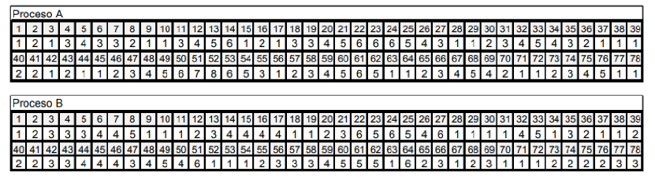
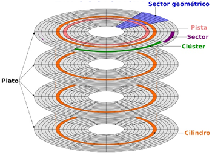
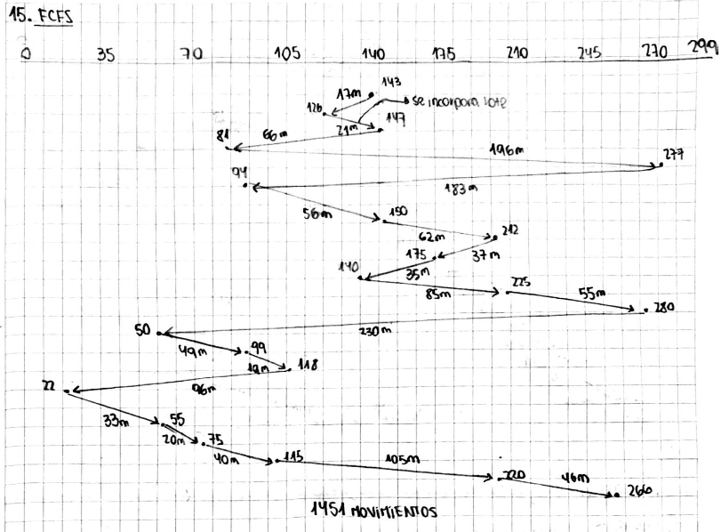
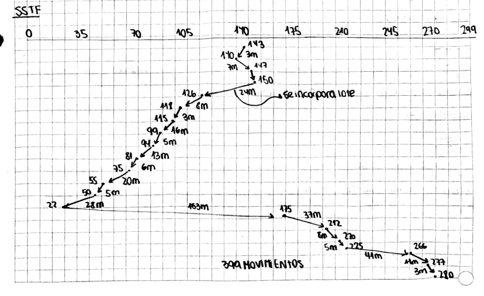
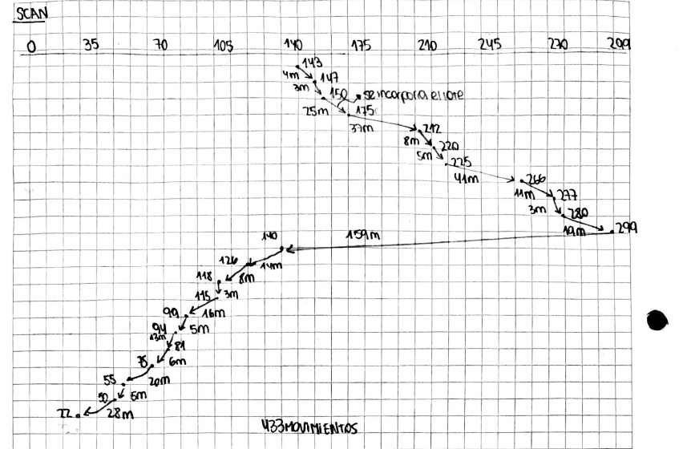

# Trabajo Practico 4

**Objetivo:**
- Continuar los temas relacionados a la administración de memoria, introduciendo paginación por demanda y su utilización para implementar memoria virtual, analizando el impacto en la ejecución de los procesos.
- Analizar el componente de Entrada/Salida de un Kernel, su organización, objetivos y funcionalidades en la administración de los dispositivos. 
- Estudiar la implementación de Sistemas de Archivos. 
- Estudiar el impacto de la utilización de Cache de Disco.

**Temas incluidos:**
- Paginación por demanda. 
- Algoritmos de reemplazos. 
- Memoria Virtual. 
- Entrada-Salida.
- Dispositivos. 
- Administración de Discos. 
- Sistemas de Archivos. 
- Buffer Cache.

# 1 Memoria Virtual

a. Decriba que beneficios introduce este esquema de administracion de la memoria.
b. En que se debe apoyar el Kernel para su implementacion?
c. Al implementar esta tecnica utilizando paginacion por demanda, las tablas de paginas de un proceso deben contar con informacion adicional ademas del marco donde se encuentra la pagina. ¿Cual es esta informacion? ¿Porque es necesaria?

a. Introduce varios beneficios, entre los cuales se destacan:
- Permite que los procesos utilicen más memoria de la que físicamente está disponible en el sistema, ya que solo las páginas necesarias se cargan en memoria.
- Mejora la utilización de la memoria, ya que las páginas que no se usan con frecuencia pueden ser almacenadas en el disco, liberando espacio para otras páginas activas.
- Facilita la protección de memoria, ya que cada proceso tiene su propio espacio de direcciones virtuales.
- Simplifica la gestión de memoria, ya que el sistema operativo puede manejar la memoria de manera más eficiente mediante la paginación.

b. El Kernel debe apoyarse en varios componentes para implementar la memoria virtual, entre ellos:
- Un mecanismo de paginación que permita dividir la memoria en páginas y marcos.
- Tablas de páginas para cada proceso, que mapeen las direcciones virtuales a las direcciones físicas.
- Un manejador de fallos de página que detecte cuando una página no está en memoria y la cargue desde el disco.
- Algoritmos de reemplazo de páginas para decidir qué páginas sacar de la memoria cuando se necesita espacio.
- Mecanismos de protección y aislamiento para asegurar que los procesos no accedan a la memoria de otros procesos.

c. Además del marco donde se encuentra la página, las tablas de páginas deben incluir información adicional como:
- Bit de presencia: Indica si la página está actualmente en memoria o no. Es necesario para que el sistema operativo pueda manejar los fallos de página.
- Bit de modificación (dirty bit): Indica si la página ha sido modificada desde que fue cargada en memoria. Esto es importante para decidir si la página necesita ser escrita de vuelta al disco antes de ser reemplazada.
- Bits de protección: Indican los permisos de acceso a la página (lectura, escritura, ejecución). Esto es crucial para la seguridad y estabilidad del sistema.
- Contador de uso o referencia: Utilizado por los algoritmos de reemplazo para determinar qué páginas son las mejores candidatas para ser sacadas de la memoria. 
- Otros bits de control según el diseño del sistema operativo, como bits de acceso reciente para algoritmos de reemplazo más sofisticados.

# 2 Fallo de pagina 
a. ¿Cuando se producen?
b. ¿Quien es responsable de detectar un fallo de pagina?
c. Describa las acciones que emprende el kernel cuando se produce un fallo de pagina.

a. Los fallos de página se producen cuando un proceso intenta acceder a una página que no está actualmente cargada en la memoria física. Esto puede ocurrir por varias razones, como cuando la página nunca ha sido cargada (paginación por demanda) o cuando la página ha sido desplazada al disco debido a la falta de espacio en memoria.

b. El responsable de detectar un fallo de página es el hardware de la unidad de gestión de memoria (MMU, por sus siglas en inglés). Cuando un proceso intenta acceder a una dirección virtual, la MMU verifica la tabla de páginas correspondiente. Si la entrada para esa página indica que no está presente en memoria (bit de presencia apagado), se genera una interrupción de fallo de página que es manejada por el kernel.

c. Cuando se produce un fallo de página, el kernel emprende las siguientes acciones:
1. Interrupción: La MMU genera una interrupción que notifica al kernel sobre el fallo de página.
2. Identificación: El kernel identifica cuál es la página que el proceso intentaba acceder y cuál es el proceso que causó el fallo.
3. Verificación: El kernel verifica si la página solicitada es válida y si el proceso tiene los permisos necesarios para acceder a ella.
4. Selección de marco: Si la página es válida, el kernel busca un marco libre en la memoria física. Si no hay marcos libres, utiliza un algoritmo de reemplazo de páginas para seleccionar una página existente que será desplazada al disco.
5. Carga de página: El kernel lee la página solicitada desde el disco y la carga en el marco seleccionado en la memoria física.
6. Actualización de la tabla de páginas: El kernel actualiza la tabla de páginas del proceso para reflejar que la página ahora está presente en memoria, estableciendo el bit de presencia y actualizando el marco correspondiente.
7. Reanudación del proceso: Finalmente, el kernel reanuda la ejecución del proceso que causó el fallo de página, permitiéndole acceder a la página que ahora está en memoria.

# 3 Suponga que la tabla de paginas para un proceso que se esta ejecutando es la que se muestra a continuacion:

| Pagina | Bit V | Bit R | Bit M | Marco |
|--------|-------|-------|-------|-------|
|   0    |   1   |   1   |   0   |   4   |
|   1    |   1   |   1   |   1   |   7   |
|   2    |   0   |   0   |   0   |   -   |
|   3    |   1   |   0   |   0   |   2   |
|   4    |   0   |   0   |   0   |   -   |
|   5    |   1   |   0   |   1   |   0   |

Asumiendo que:
- El tamaño de pagina es de 512 bytes.
- Cada direccion de memoria referencia 1 byte.
- Los marcos se encuentran contiguos y en orden en memoria (0,1,2,...) a partir de la direccion fisica 0.

¿Que direccion fisica si existe, corresponeria a cada una de las siguientes direcciones virtuales? 
a. 1052 
b. 2221
c. 5499
d. 3101

Para resolver este problema, primero debemos determinar a qué página virtual pertenece cada dirección virtual y luego verificar si esa página está presente en memoria (bit V = 1). Si está presente, calculamos la dirección física utilizando el marco correspondiente. Si no está presente, indicamos que no existe una dirección física.

El tamaño de página es de 512 bytes, por lo que podemos calcular la página virtual y el desplazamiento dentro de la página utilizando las siguientes fórmulas:
Página virtual = Dirección virtual / Tamaño de página
Desplazamiento = Dirección virtual % Tamaño de página

a. Dirección virtual 1052:
Página virtual = 1052 / 512 = 2 (entero)
Desplazamiento = 1052 % 512 = 28 (Resto)
La página 2 tiene el bit V = 0, por lo que no está presente en memoria. No existe dirección física.

b. Dirección virtual 2221:
Página virtual = 2221 / 512 = 4 (entero)
Desplazamiento = 2221 % 512 = 173
La página 4 tiene el bit V = 0, por lo que no está presente en memoria. No existe dirección física.

c. Dirección virtual 5499:
Página virtual = 5499 / 512 = 10 (entero)
Desplazamiento = 5499 % 512 = 427
La página 10 no está en la tabla de páginas proporcionada, por lo que no existe dirección física.

d. Dirección virtual 3101:
Página virtual = 3101 / 512 = 6 (entero)
Desplazamiento = 3101 % 512 = 5
La página 6 no está en la tabla de páginas proporcionada, por lo que no existe dirección física.

# 4 Analice como impacta el tamaño de una pagina (pequeña o grande) en paginacion por demanda

El tamaño de la página en un sistema de paginación por demanda tiene un impacto significativo en varios aspectos del rendimiento y la eficiencia del sistema. A continuación, se analizan los efectos de utilizar páginas pequeñas versus páginas grandes:

**Páginas pequeñas:**
- **Ventajas:**
    - Menor fragmentación interna: Al tener páginas más pequeñas, es menos probable que se desperdicie espacio dentro de una página.
    - Mayor granularidad: Permite una gestión más fina de la memoria, ya que solo se cargan en memoria las páginas que realmente se necesitan.
    - Mejor utilización de la memoria: Puede mejorar la utilización de la memoria en aplicaciones con patrones de acceso a memoria dispersos.
- **Desventajas:**
    - Mayor sobrecarga de la tabla de páginas: Se requieren más entradas en la tabla de páginas, lo que puede aumentar el consumo de memoria y la complejidad del manejo de tablas.
    - Mayor número de fallos de página: Con páginas más pequeñas, es más probable que se produzcan fallos de página, lo que puede afectar negativamente el rendimiento.
    - Mayor carga en el sistema de E/S: Más fallos de página pueden llevar a un aumento en las operaciones de E/S, lo que puede ralentizar el sistema.

**Páginas grandes:**
- **Ventajas:**
    - Menor sobrecarga de la tabla de páginas: Se requieren menos entradas en la tabla de páginas, lo que reduce el consumo de memoria y simplifica la gestión.
    - Menor número de fallos de página: Con páginas más grandes, es menos probable que se produzcan fallos de página, lo que puede mejorar el rendimiento.
- **Desventajas:**
    - Mayor fragmentación interna: Las páginas grandes pueden llevar a un mayor desperdicio de espacio dentro de una página si el proceso no utiliza toda la página.
    - Menor granularidad: Puede resultar en la carga de más datos de los necesarios en memoria, lo que puede ser ineficiente si el proceso solo necesita una pequeña parte de la página.

# 5 
Asignación de marcos a un proceso (Conjunto de trabajo o Working Set). Con la memoria virtual paginada, no se requiere que todas las páginas de un proceso se encuentren en memoria. El Kernel debe controlar cuantas páginas de un proceso puede tener en la memoria principal. 
Existen 2 políticas que se pueden utilizar:
- Asignación Fija
- Asignación Dinámica.

a. Describa como trabjan estas 2 politicas.
b. Dada la siguiente tabla de procesos y las páginas que ellos ocupan, y teniéndose 40 marcos en la memoria principal, cuántos marcos le corresponderá a cada proceso si se usa la técnica de Asignación Fija:
- Reparto equitativo
- Reparto proporcional

| Proceso | Páginas |
|---------|---------|
|   P1    |    15   |
|   P2    |    20   |
|   P3    |    20   |
|   P4    |    8    |
c. ¿Cual de los 2 repartos usados en b) resulto mas eficiente? Justifique su respuesta.

a.
- Asignación Fija: En esta política, cada proceso recibe un número fijo de marcos de página en la memoria principal, independientemente de sus necesidades o del tamaño del proceso. Esto puede llevar a una subutilización de la memoria si un proceso no utiliza todos sus marcos asignados, o a fallos de página si un proceso necesita más marcos de los que se le han asignado.

- Asignación Dinámica: En esta política, el número de marcos asignados a un proceso puede variar según sus necesidades y el estado del sistema. El kernel puede ajustar la cantidad de marcos asignados a cada proceso en función de su comportamiento y demanda de memoria, lo que puede mejorar la utilización de la memoria y reducir los fallos de página.

b.
- Reparto equitativo:
    Total de procesos = 4
    Marcos totales = 40
    Marcos por proceso = 40 / 4 = 10 marcos por proceso

    | Proceso | Marcos Asignados |
    |---------|------------------|
    |   P1    |        10        |
    |   P2    |        10        |
    |   P3    |        10        |
    |   P4    |        10        |

- Reparto proporcional:
    Total de páginas = 15 + 20 + 20 + 8 = 63
    Marcos por página = 40 / 63 ≈ 0.6349

    | Proceso | Páginas | Marcos Asignados (aprox.)               |
    |---------|---------|-----------------------------------------|
    |   P1    |    15   |          15 * 0.6349 ≈ 9.52 ≈ 10        |
    |   P2    |    20   |          20 * 0.6349 ≈ 12.70 ≈ 13       |
    |   P3    |    20   |          20 * 0.6349 ≈ 12.70 ≈ 13       |
    |   P4    |    8    |          8 * 0.6349 ≈ 5.08 ≈ 5          |

c. El reparto proporcional resulta más eficiente en este caso, ya que asigna marcos de memoria en función de las necesidades reales de cada proceso. Los procesos más grandes (P2 y P3) reciben más marcos, lo que reduce la probabilidad de fallos de página y mejora el rendimiento general del sistema. En contraste, el reparto equitativo asigna la misma cantidad de marcos a todos los procesos, lo que puede llevar a una subutilización de la memoria para procesos más pequeños (como P4) y a fallos de página para procesos más grandes (como P2 y P3) que necesitan más marcos para funcionar eficientemente.

# 6 
Reemplazo de páginas (selección de una víctima). ¿Qué sucede cuando todos los marcos en la memoria principal están usados por las páginas de los procesos y se produce un fallo de página? El Kernel debe seleccionar una de las páginas que se encuentra en memoria principal (en un marco) como víctima, la que será reemplazada por la nueva página que produjo el fallo.

Considere los siguientes algoritmos de selección de víctimas básicos:
- LRU (Least Recently Used)
- FIFO (First In First Out)
- OPT (Optimal)
- Segunda chance

a. Clasifique estos algoritmos de malo a bueno de acuerdo a la tasa de fallos de página que se obtienen al utilizarlos.

De acuerdo a la tasa de fallos de página, los algoritmos se pueden clasificar de la siguiente manera, de malo a bueno:
1. FIFO (First In First Out)
2. Segunda chance
3. LRU (Least Recently Used)
4. OPT (Optimal)

b. Analice su funcionamiento. ¿Como se podrian implementar?
**FIFO (First In First Out):**
- Funcionamiento: Mantiene una cola de páginas en memoria. Cuando se necesita reemplazar una página, se elimina la página que está al frente de la cola (la más antigua).
- Implementación: Se puede implementar utilizando una estructura de datos de cola (FIFO) para rastrear el orden de llegada de las páginas. Cuando ocurre un fallo de página, se elimina la página al frente de la cola y se añade la nueva página al final.

**Segunda chance:**
- Funcionamiento: Similar a FIFO, pero con un bit de referencia. Cuando se necesita reemplazar una página, se revisa la página más antigua; si su bit de referencia está establecido, se le da una segunda oportunidad y se limpia el bit, moviendo la página al final de la cola. Si el bit no está establecido, la página es reemplazada.
- Implementación: Se puede implementar utilizando una cola junto con un bit de referencia para cada página. Al ocurrir un fallo de página, se revisa la página al frente de la cola y se aplica la lógica de segunda oportunidad.

**LRU (Least Recently Used):**
- Funcionamiento: Reemplaza la página que no ha sido utilizada durante el mayor tiempo.
- Implementación: Se puede implementar utilizando una lista enlazada o una pila para rastrear el orden de uso de las páginas. Cada vez que una página es accedida, se mueve al frente de la lista. Al ocurrir un fallo de página, se elimina la página al final de la lista (la menos recientemente usada).

**OPT (Optimal):**
- Funcionamiento: Reemplaza la página que no será utilizada por el mayor tiempo en el futuro.
- Implementación: Aunque no es práctico para sistemas reales, se puede simular en entornos de prueba donde se conoce el patrón de acceso a memoria. Se puede mantener un registro de las futuras referencias a páginas y seleccionar la página que no será referenciada por el mayor tiempo.

c. Sabemos que la página a ser reemplazada puede estar modificada. ¿Cómo detecta el Kernel esta situación? ¿Qué acciones adicionales deben realizarse cuando se encuentra ante esta situación?

El Kernel detecta si una página ha sido modificada utilizando el bit de modificación (dirty bit) que se encuentra en la tabla de páginas. Este bit se establece cuando una página es escrita o modificada en memoria. Si el bit de modificación está activado (1), significa que la página ha sido modificada desde que fue cargada en memoria.

Cuando se encuentra ante esta situación, el Kernel debe realizar las siguientes acciones adicionales:
1. Escribir la página modificada de vuelta al almacenamiento secundario (disco) para asegurar que los cambios no se pierdan.
2. Actualizar la tabla de páginas para reflejar que la página ya no está en memoria principal.
3. Liberar el marco de memoria ocupado por la página modificada para que pueda ser utilizado por la nueva página que causó el fallo.

# 7 
Alcance del reemplazo. Al momento de tener que seleccuinar una pagina victima, el kernel puede optar por 2 politicas diferentes:
- Reemplazo global
- Reemplazo local
a. Describa como trabajan estas 2 politicas.
b. ¿Es posible utilizar la politica asignacion fija de marcos junto con la politica de reemplazo global? Justifique su respuesta.

a.
- Reemplazo global: En esta política, cuando se produce un fallo de página, el kernel puede seleccionar cualquier página en memoria para ser reemplazada, independientemente de a qué proceso pertenezca. Esto permite una mayor flexibilidad y puede mejorar la utilización de la memoria, ya que las páginas menos utilizadas por cualquier proceso pueden ser reemplazadas.

- Reemplazo local: En esta política, cuando se produce un fallo de página, el kernel solo puede seleccionar páginas que pertenecen al proceso que causó el fallo. Esto limita la selección de páginas a reemplazar a las que están asignadas a ese proceso específico, lo que puede ayudar a mantener la estabilidad del proceso pero puede llevar a una menor utilización de la memoria.

b. No es posible utilizar la política de asignación fija de marcos junto con la política de reemplazo global. La razón es que la asignación fija de marcos implica que cada proceso tiene un número fijo de marcos asignados, y el reemplazo global permite que cualquier página en memoria pueda ser reemplazada, independientemente del proceso al que pertenezca. Esto crearía un conflicto, ya que un proceso podría perder marcos que le han sido asignados de manera fija, lo que va en contra del principio de la asignación fija. En cambio, la asignación fija de marcos se alinea mejor con la política de reemplazo local, donde cada proceso solo puede reemplazar sus propias páginas.

# 8
Considere la siguiente secuencia de referencias de páginas:
1, 2, 15, 4, 6, 2, 1, 5, 6, 10, 4, 6, 7, 9, 1, 6, 12, 11, 12, 2, 3, 1, 8, 1, 13, 14, 15, 3, 8

a. Si se disponen 5 marcos. ¿Cuántos fallos de página se producirán si se utilizan las siguientes técnicas de selección de víctima? (Considere una política de Asignación Dinámica y Reemplazo Global)
- Segunda chance
- FIFO
- LRU
- OPT

b. Suponiendo que cada atención de un fallo se página requiere de 0,1 seg. Calcular el tiempo consumido por atención a los fallos de páginas para los algoritmos de a).

# 9
Sean los procesos A, B y C tales que necesitan para su ejecución las siguientes
páginas:
 A: 1, 3, 1, 2, 4, 1, 5, 1, 4, 7, 9, 4
 B: 2, 4, 6, 2, 4, 1, 8, 3, 1, 8
 C: 1, 2, 4, 8, 6, 1, 4, 1

 Si la secuencia de ejecución es tal que los procesos se ejecutan en la siguientes secuencia:
1. B demanda 2 páginas
2. A demanda 3 páginas
3. C demanda 2 páginas
4. B demanda 3 páginas
5. A demanda 3 páginas
6. C demanda 2 páginas
7. B demanda 2 páginas
8. C demanda 4 páginas
9. A demanda 3 páginas
10. B demanda 3 páginas
11. C termina
12. A demanda 3 páginas
13. B termina
14. A termina

a. Considerando una política de Asignación Dinámica y Reemplazo Global y disponiéndose de 7 marcos. ¿Cuántos fallos de página se producirán si se utiliza la técnica de selección de víctimas:
i. LRU
ii. Segunda Chance

b. Considerando una política de Asignación Fija con reparto equitativo y Reemplazo
Local y disponiéndose de 9 marcos. ¿Cuántos fallos de página se producirán si se
utiliza la técnica de selección de víctimas:
i. LRU
ii. Segunda Chance

# 10. 
Sean los procesos A, B y C tales que necesitan para su ejecución las siguientes páginas:
 A: 1, 2, 1, 7, 2, 7, 3, 2
 B: 1, 2, 5, 2, 1, 4, 5
 C: 1, 3, 5, 1, 4, 2, 3
Si la secuencia de ejecución es tal que los procesos se ejecutan en la siguiente manera:
1. C demanda 1 página
2. A demanda 2 páginas
3. C demanda 1 página
4. B demanda 1 página
5. A demanda 1 página
6. C modifica la página 1
7. B demanda 2 páginas
8. A demanda 1 página
9. C demanda 1 página
10. B modifica la página 2
11. A modifica la página 2
12. B demanda 2 páginas
13. A demanda 1 página
14. B demanda 2 páginas
15. C demanda 2 páginas
16. C demanda 1 página
17. A demanda 1 página
18. B termina
19. A demanda 2 páginas
20. C demanda 1 página
21. A termina
22. C termina

Considerando una política de Asignación Dinámica y Reemplazo Global y disponiéndose de 7 marcos, debiéndose guardar 1 marco para la gestión de descarga asincrónica de páginas modificadas ¿Cuántos fallos de página se producirán si se utiliza la técnica de selección de víctima:

a. Segunda Chance
b. FIFO
c. LRU

Orden de llegada de las referencias:
C1	A1	A2	C3	B1	A1	CM1	B2	B5	A7	C5	BM2	AM2	B2	B1	A2	B4	B5	C1	C4	C2	A7	BT	A3	A2	C3	AT	CT

# 11 
Hiperpaginacion (Thrashing)

a. ¿Que es la hiperpaginacion?
b. ¿Cuales pueden ser los motivos que la causan?
c. ¿Como la detecta el SO?
d. Una vez que lo detecta ¿Que acciones puede tomar el kernel para eliminar este problema?

a. La hiperpaginación, o thrashing, es una situación en la que un sistema operativo pasa la mayor parte de su tiempo intercambiando páginas entre la memoria principal y el almacenamiento secundario (disco), en lugar de ejecutar procesos útiles. Esto ocurre cuando hay una alta tasa de fallos de página, lo que lleva a un rendimiento extremadamente bajo del sistema.

b. Los motivos que pueden causar la hiperpaginación incluyen:
- Insuficiente memoria física: Cuando la cantidad de memoria disponible es menor que la demanda de los procesos en ejecución.
- Asignación inadecuada de marcos: Si los procesos no tienen suficientes marcos asignados, pueden experimentar fallos de página frecuentes.
- Alta concurrencia de procesos: Muchos procesos compitiendo por la memoria pueden llevar a una sobrecarga en la gestión de páginas.
- Algoritmos de reemplazo ineficientes: Algoritmos que no gestionan adecuadamente las páginas pueden aumentar la tasa de fallos de página.

c. El sistema operativo puede detectar la hiperpaginación monitoreando la tasa de fallos de página y el uso de la CPU. Si la tasa de fallos de página es alta y la utilización de la CPU es baja, es un indicio claro de que el sistema está pasando demasiado tiempo manejando fallos de página en lugar de ejecutar procesos.

d. Una vez que el kernel detecta la hiperpaginación, puede tomar varias acciones para mitigar el problema:
1. Reducir la carga de trabajo: Puede suspender o finalizar algunos procesos para liberar memoria.
2. Ajustar la asignación de marcos: Puede aumentar el número de marcos asignados a los procesos que están experimentando fallos de página frecuentes.
3. Cambiar la política de reemplazo de páginas: Puede optar por un algoritmo más eficiente que reduzca la tasa de fallos de página.
4. Notificar a los usuarios: Puede informar a los usuarios sobre la situación para que puedan tomar medidas, como cerrar aplicaciones innecesarias.
5. Bajar el nivel de multiprogramación: Limitar el número de procesos en ejecución simultáneamente para reducir la competencia por la memoria.

# 12
Analice y compare las técnicas de PFF (Page Fault Frequency) y del Working Set. ¿Como las mismas permiten determinar la existencia de trashing?

La técnica de PFF (Page Fault Frequency) y la del Working Set son dos enfoques utilizados para gestionar la memoria en sistemas operativos y para detectar la hiperpaginación (thrashing). 

**PFF (Page Fault Frequency):**
- Esta técnica monitorea la frecuencia de fallos de página de un proceso. Si la frecuencia de fallos de página supera un umbral predefinido, se considera que el proceso está experimentando hiperpaginación.
- La ventaja de PFF es que es relativamente simple de implementar y puede reaccionar rápidamente a cambios en el comportamiento del proceso. Sin embargo, puede ser sensible a fluctuaciones temporales en la carga de trabajo.

**Working Set:**
- La técnica del Working Set se basa en la idea de que un proceso tiene un conjunto de páginas que utiliza activamente durante un período de tiempo determinado. Si el tamaño del conjunto de trabajo de un proceso excede la cantidad de memoria asignada, es probable que el proceso experimente hiperpaginación.

# 13 

Considere un sistema cuya memoria principal se administra mediante la técnica de paginación por demanda que utiliza un dispositivo de paginación, algoritmo de reemplazo global LRU y una política de asignación que reparte marcos equitativamente entre los procesos. El nivel de multiprogramación es actualmente, de 4.

Ante las siguientes mediciones:
a) Uso de CPU del 13%, uso del dispositivo de paginación del 97%.
b) Uso de CPU del 87%, uso del dispositivo de paginación del 3%.
c) Uso de CPU del 13%, uso del dispositivo de paginación del 3%.

Analizar para cada caso:
 ¿Qué sucede?
 ¿Puede incrementarse el nivel de multiprogramación para aumentar el uso de la CPU?
 ¿La paginación está siendo útil para mejorar el rendimiento del sistema?

a) En este caso, el uso de la CPU es muy bajo (13%) mientras que el uso del dispositivo de paginación es extremadamente alto (97%). Esto indica que el sistema está pasando la mayor parte de su tiempo manejando fallos de página en lugar de ejecutar procesos útiles, lo que sugiere que está experimentando hiperpaginación.
No, no se debe incrementar el nivel de multiprogramación, ya que esto probablemente empeoraría la situación al aumentar la competencia por la memoria. La paginación no está siendo útil en este caso, ya que está causando una sobrecarga significativa en el sistema. La paginación está siendo contraproducente para el rendimiento del sistema porque el alto uso del dispositivo de paginación indica que el sistema está gastando mucho tiempo en operaciones de E/S en lugar de ejecutar procesos.

b) En este caso, el uso de la CPU es alto (87%) y el uso del dispositivo de paginación es bajo (3%). Esto indica que el sistema está funcionando de manera eficiente, con la mayoría del tiempo de CPU dedicado a la ejecución de procesos en lugar de manejar fallos de página.
Sí, se puede considerar incrementar el nivel de multiprogramación para aprovechar aún más la capacidad de la CPU, siempre y cuando se monitoree cuidadosamente para evitar la hiperpaginación. La paginación está siendo útil en este caso, ya que está permitiendo que los procesos utilicen la memoria de manera eficiente sin causar una sobrecarga significativa en el sistema. La paginación está mejorando el rendimiento del sistema al permitir una gestión eficiente de la memoria.

c) En este caso, tanto el uso de la CPU (13%) como el uso del dispositivo de paginación (3%) son bajos. Esto sugiere que el sistema no está utilizando eficientemente sus recursos, posiblemente debido a una baja carga de trabajo o a procesos que no requieren mucha memoria.
Sí, se puede incrementar el nivel de multiprogramación para aumentar el uso de la CPU, ya que hay capacidad disponible en el sistema. La paginación está siendo útil en este caso, ya que no está causando una sobrecarga significativa en el sistema. Sin embargo, el bajo uso de la CPU indica que hay espacio para mejorar la utilización del sistema mediante un aumento en la carga de trabajo.

# 14

Considere un sistema cuya memoria principal se administra mediante la técnica de
paginación por demanda. Considere las siguientes medidas de utilización:
 Utilización del procesador: 20%
 Utilización del dispositivo de paginación: 97,7%
 Utilización de otros dispositivos de E/S: 5%


Cuales de las siguientes acciones pueden mejorar la utilización del procesador:
a) Instalar un procesador más rápido
b) Instalar un dispositivo de paginación mayor
c) Incrementar el grado de multiprogramación
d) Instalar mas memoria principal
e) Decrementar el quantum para cada proceso

Las acciones que pueden mejorar la utilización del procesador en este caso son:
c) Incrementar el grado de multiprogramación: Al aumentar el número de procesos en ejecución simultáneamente, se puede mejorar la utilización del procesador, ya que habrá más procesos listos para ejecutarse cuando uno esté esperando por E/S.
d) Instalar más memoria principal: Al aumentar la cantidad de memoria disponible, se puede reducir la frecuencia de fallos de página, lo que disminuirá la utilización del dispositivo de paginación y permitirá que el procesador tenga más tiempo para ejecutar procesos en lugar de esperar por E/S.

Las acciones que no mejorarían la utilización del procesador son:
a) Instalar un procesador más rápido: Aunque un procesador más rápido puede mejorar el rendimiento general, no abordará el problema subyacente de la alta utilización del dispositivo de paginación.
b) Instalar un dispositivo de paginación mayor: Esto no resolverá el problema de la alta utilización del dispositivo de paginación, ya que el cuello de botella está en la frecuencia de fallos de página, no en la capacidad del dispositivo.
e) Decrementar el quantum para cada proceso: Esto podría aumentar la sobrecarga del sistema debido a un mayor número de cambios de contexto, lo que no necesariamente mejorará la utilización del procesador en este caso.

# 15 
La siguiente fórmula describe el tiempo de acceso efectivo a la memoria al utilizar paginación para la implementación de la memoria virtual:
TAE = At + [ (1 − p) * Am] + [ p * (Tf + Am ) ]

Donde:
➢ TAE = tiempo de acceso efectivo
➢ p = tasa de fallo de página (0 <= p <=1)
➢ Am = tiempo de acceso a la memoria real
➢ Tf = tiempo se atención de una fallo de pagina
➢ At = tiempo de acceso a la tabla de páginas. Es igual al tiempo de acceso a la memoria (Am) si la entrada de la tabla de páginas no se encuentra en la TLB

**TLB (Translation Lookaside Buffer)**: Es una memoria caché que almacena las entradas más recientes de la tabla de páginas para acelerar la traducción de direcciones virtuales a físicas.

Suponga que tenemos una memoria virtual paginada, con tabla de páginas de 1 nivel,y donde la tabla de páginas se encuentra completamente en la memoria.
Servir una falla de página tarda 300 nanosegundos si hay disponible un marco vacío o si la página reemplazada no se ha modificado, y 500 nanosegundos si se ha modificado. El tiempo de acceso a memoria es de 20 nanosegundos y el de acceso a la TLB es de 1 nanosegundo.

a. Si suponemos una tasa de fallos de página de 0,3 y que siempre contamos con un marco libre para atender el fallo ¿Cuál será el TAE si el 50% de las veces la entrada de la tabla de páginas se encuentra en la TLB (hit)?

TAE = 120,5 nanosegundos

Para calcular el TAE en este caso, primero debemos identificar los valores necesarios:
- p (tasa de fallo de página) = 0.3
- Am (tiempo de acceso a la memoria real) = 20 nanosegundos
- Tf (tiempo de atención de una fallo de página) = 300 nanosegundos (ya que siempre contamos con un marco libre)
- At (tiempo de acceso a la tabla de páginas) = 0.5 * 1 + 0.5 * 20 = 0.5 + 10 = 10.5 nanosegundos (ya que el 50% de las veces la entrada se encuentra en la TLB)
Ahora, podemos calcular el TAE:
TAE = At + [ (1 − p) * Am] + [ p * (Tf + Am ) ]
TAE = 10.5 + [ (1 − 0.3) * 20] + [ 0.3 * (300 + 20 ) ]
TAE = 10.5 + [ 0.7 * 20] + [ 0.3 * 320 ]
TAE = 10.5 + 14 + 96
TAE = 120.5 nanosegundos

b. Si suponemos una tasa de fallos de página de 0,3; que el 70% de las ocasiones la página a reemplazar se encuentra modificada. ¿Cuál será el TAE si el 60% de las veces la entrada de la tabla de páginas se encuentra en la TLB (hit)?

Para calcular el TAE en este caso, primero debemos identificar los valores necesarios:
- p (tasa de fallo de página) = 0.3
- Am (tiempo de acceso a la memoria real) = 20 nanosegundos
- Tf (tiempo de atención de una fallo de página) = 0.7 * 500 + 0.3 * 300 = 350 + 90 = 440 nanosegundos (ya que el 70% de las ocasiones la página a reemplazar se encuentra modificada)
- At (tiempo de acceso a la tabla de páginas) = 0.6 * 1 + 0.4 * 20 = 0.6 + 8 = 8.6 nanosegundos (ya que el 60% de las veces la entrada se encuentra en la TLB)
Ahora, podemos calcular el TAE:

TAE = At + [ (1 − p) * Am] + [ p * (Tf + Am ) ]
TAE = 8.6 + [ (1 − 0.3) * 20] + [ 0.3 * (440 + 20 ) ]
TAE = 8.6 + [ 0.7 * 20] + [ 0.3 * 460 ]
TAE = 8.6 + 14 + 138

TAE = 160.6 nanosegundos

c. Si suponemos que el 60% de las veces la página a reemplazar está modificada, el 100% de las veces la entrada de la tabla de páginas requerida se encuentra en la TLB (hit) y se espera un TAE menor a 200 nanosegundos.

Para calcular el TAE en este caso, primero debemos identificar los valores necesarios:
- p (tasa de fallo de página) = ?
- Am (tiempo de acceso a la memoria real) = 20 nanosegundos
- Tf (tiempo de atención de una fallo de página) = 0.6 * 500 + 0.4 * 300 = 300 + 120 = 420 nanosegundos (ya que el 60% de las ocasiones la página a reemplazar se encuentra modificada)
- At (tiempo de acceso a la tabla de páginas) = 1 nanosegundo (ya que el 100% de las veces la entrada se encuentra en la TLB)

Ahora, podemos plantear la ecuación para encontrar p, sabiendo que TAE < 200 nanosegundos:
TAE = At + [ (1 − p) * Am] + [ p * (Tf + Am ) ] < 200
200 > 1 + [ (1 − p) * 20] + [ p * (420 + 20 ) ]
200 > 1 + 20 - 20p + 440p
200 > 21 + 420p
179 > 420p
p < 179 / 420

p < 0.4262 nanosegundos

d. ¿Cuál es la máxima tasa aceptable de fallas de página?

Para encontrar la máxima tasa aceptable de fallos de página (p) que mantiene el TAE por debajo de un cierto umbral, podemos usar la fórmula del TAE y despejar p.
Supongamos que queremos mantener el TAE por debajo de un umbral específico, digamos TAE_max. La fórmula del TAE es:

TAE = At + [ (1 − p) * Am] + [ p * (Tf + Am ) ]
Despejando p, tenemos:
p = (TAE - At - Am) / (Tf + Am - Am)
Sustituyendo los valores conocidos:
p = (TAE_max - At - Am) / (Tf)
p = (TAE_max - 1 - 20) / (420)
p = (TAE_max - 21) / 420
La máxima tasa aceptable de fallos de página dependerá del valor específico de TAE_max que se desee mantener.

# 16
6. Considere el siguiente programa:
#define Size 64
int A[Size; Size], B[Size; Size], C[Size;
Size]; int register i, j;
for (j = 0; j < Size; j ++)
    for (i = 0; i < Size; i++)
        C[i; j] = A[i; j] + B[i; j];

Si asumimos que el programa se ejecuta en un sistema que utiliza paginación por demanda para administrar la memoria, donde cada página es de 1Kb. Cada número entero (int) ocupa 4 bytes. Es claro que cada matriz requiere de 16 páginas para almacenarse. Por ejemplo: A[0,0]..A[0,63], A[1,0]..A[1,63], A[2,0]..A[2,63] y A[3,0]..A[3,63] se almacenará en la primera página. Asumamos que el sistema utiliza un working set de 4 marcos para este proceso. Uno de los 4 marcos es utilizado por el programa y los otros 3 se utilizan para datos (las matrices). También consideramos que para los índices “i” y “j” se utilizan 2 registros, por lo que no es necesario el acceso a la memoria para estas 2 variables.

a. Analizar cuántos fallos de páginas ocurren al ejecutar el programa (considere las veces que se ejecuta C[i,j] = A[i,j] + B[i,j])
b. Puede ser modificado el programa para minimizar el número de fallos de páginas. En caso de ser posible indicar la cantidad de fallos de páginas que ocurren.

a. Para analizar cuántos fallos de páginas ocurren al ejecutar el programa, debemos considerar cómo se accede a las matrices A, B y C en función del tamaño de la página y el working set disponible.

Cada matriz requiere 16 páginas para almacenarse, y el working set tiene 4 marcos, de los cuales 1 se utiliza para el programa y 3 para las matrices. Esto significa que en cualquier momento, solo 3 páginas de las matrices pueden estar en memoria.
El acceso a las matrices se realiza de la siguiente manera:

- Para cada valor de j (de 0 a 63), se accede a todas las filas i (de 0 a 63) de las matrices A, B y C.
- Esto significa que para cada j, se accede a 64 elementos de A, B y C.
Dado que cada página puede almacenar 16 elementos (64 bytes / 4 bytes por entero), cada acceso a una nueva fila i puede causar un fallo de página si la página correspondiente no está en memoria.
Para cada j, se acceden a 64 elementos, lo que significa que se necesitan 4 páginas para cada matriz (A, B y C) para cubrir todas las filas i. Dado que solo 3 páginas pueden estar en memoria al mismo tiempo, cada vez que se accede a una nueva página que no está en memoria, se produce un fallo de página.
Por lo tanto, para cada j, se producirán fallos de página al acceder a las páginas de A, B y C. En total, para 64 valores de j, se producirán:

- Fallos de página para A: 64 / 16 = 4 fallos por j * 64 j = 256 fallos
- Fallos de página para B: 64 / 16 = 4 fallos por j * 64 j = 256 fallos
- Fallos de página para C: 64 / 16 = 4 fallos por j * 64 j = 256 fallos

Total de fallos de página = 256 + 256 + 256 = 768 fallos de página

b. Sí, el programa puede ser modificado para minimizar el número de fallos de páginas. Una forma de hacerlo es cambiar el orden de los bucles para acceder a las matrices en un patrón que aproveche mejor la localidad espacial.
for (i = 0; i < Size; i++)
    for (j = 0; j < Size; j++)
        C[i; j] = A[i; j] + B[i; j];
        
Al cambiar el orden de los bucles, se accede a las matrices fila por fila en lugar de columna por columna. Esto significa que para cada valor de i, se acceden a todas las columnas j de las matrices A, B y C.
Dado que cada página puede almacenar 16 elementos, al acceder a las matrices fila por fila, se pueden cargar múltiples elementos de una página en memoria antes de que se produzca un fallo de página.

# 17 

Considere las siguientes secuencias de referencias a páginas de los procesos A y B, donde se muestra en instante de tiempo en el que ocurrió cada una (1 a 78):



a. Considerando una ventana ∆=5, indique cuál sería el conjunto de trabajo de los procesos A y B en el instante 24 (WSA(24) y WSB(24))

Para determinar el conjunto de trabajo (Working Set) de los procesos A y B en el instante 24 con una ventana ∆=5, debemos considerar las referencias a páginas que ocurrieron en los últimos 5 instantes de tiempo antes del instante 24, es decir, desde el instante 20 hasta el instante 24. 
WSA(24): 4,5,6
WSB(24): 2,3,5,6

b. Considerando una ventana ∆=5, indique cuál sería el conjunto de trabajo de los procesos A y B en el instante 60 (WSA(60) y WSB(60))

Para determinar el conjunto de trabajo (Working Set) de los procesos A y B en el instante 60 con una ventana ∆=5, debemos considerar las referencias a páginas que ocurrieron en los últimos 5 instantes de tiempo antes del instante 60, es decir, desde el instante 56 hasta el instante 60.

WSA(60): 1,2,3,4,5
WSB(60): 3,4,5


c. Para el los WS obtenidos en el inciso a), si contamos con 8 frames en el sistema ¿Se puede indicar que estamos ante una situación de trashing? ¿Y si contáramos con 6 frames? 

Para determinar si estamos ante una situación de thrashing, debemos comparar el tamaño del conjunto de trabajo (Working Set) con la cantidad de marcos (frames) disponibles en el sistema.
En el instante 24:
- WSA(24) tiene 3 páginas (4, 5, 6)
- WSB(24) tiene 4 páginas (2, 3, 5, 6)
Con 8 frames disponibles en el sistema, la suma de los tamaños de los conjuntos de trabajo es 3 + 4 = 7 páginas, lo cual es menor que los 8 frames disponibles. Por lo tanto, no estamos ante una situación de thrashing. 
Si contáramos con 6 frames, la suma de los tamaños de los conjuntos de trabajo sigue siendo 7 páginas, lo cual es mayor que los 6 frames disponibles. En este caso, sí estaríamos ante una situación de thrashing, ya que los procesos no pueden mantener sus conjuntos de trabajo en memoria, lo que llevaría a un alto número de fallos de página y una disminución del rendimiento del sistema.

d. Considerando únicamente el proceso A, y suponiendo que al mismo se le asignaron inicialmente 4 marcos, donde el de reemplazo de páginas es realizado considerando el algoritmo FIFO. ¿Cuál será la tasa de fallos en el instante 38 de páginas suponiendo que la misma se calcula contando los fallos de páginas que ocurrieron en las últimas 10 unidades de tiempo?

Para calcular la tasa de fallos de página del proceso A en el instante 38, considerando que se le asignaron inicialmente 4 marcos y utilizando el algoritmo FIFO para el reemplazo de páginas, debemos analizar las referencias a páginas del proceso A en las últimas 10 unidades de tiempo, es decir, desde el instante 28 hasta el instante 38.

Proceso A
1 2 3 4 5 6 7 8 9 10 11 12 13 14 15 16 17 18 19 20 21 22 23 24 25 26 27 28 29 30 31 32 33 34 35 36 37 38 39
1 2 1 3 4 3 3 2 1 1 3 4 5 6 1 2 1 3 3 4 5 6 6 6 5 4 3 1 1 2 3 4 5 4 3 2 1 1 1 40
41 42 43 44 45 46 47 48 49 50 51
52 53 54 55 56 57 58 59 60 61 62 63 64 65 66 67 68 69 70 71 72 73 74 75 76 77 78
2 2 1 2 1 1 2 3 4 5 6 7 8 6 5 3 1 2 3 4 5 6 5 1 1 2 3 4 5 4 2 1 1 2 3 4 5 1 1

Analizando las referencias a páginas del proceso A desde el instante 28 hasta el instante 38:
- Referencias: 1, 1, 2, 3, 4, 5, 4, 3, 2, 1, 1
- Inicialmente, los marcos están vacíos.
- Referencia 1: fallo de página (marcos: [1])
- Referencia 1: no hay fallo (marcos: [1])
- Referencia 2: fallo de página (marcos: [1, 2])
- Referencia 3: fallo de página (marcos: [1, 2, 3])
- Referencia 4: fallo de página (marcos: [1, 2, 3, 4])
- Referencia 5: fallo de página (reemplaza 1, marcos: [5, 2, 3, 4])
- Referencia 4: no hay fallo (marcos: [5, 2, 3, 4])
- Referencia 3: no hay fallo (marcos: [5, 2, 3, 4])
- Referencia 2: no hay fallo (marcos: [5, 2, 3, 4])
- Referencia 1: fallo de página (reemplaza 5, marcos: [1, 2, 3, 4])
- Referencia 1: no hay fallo (marcos: [1, 2, 3, 4])

En total, hubo 6 fallos de página en las últimas 10 unidades de tiempo (instantes 28 a 38).
La tasa de fallos de página se calcula como el número de fallos dividido por el número total de referencias en ese período:
Tasa de fallos = Número de fallos / Número total de referencias
Tasa de fallos = 6 / 11 ≈ 0.545 o 54.5%

e. Para el valor obtenido en el inciso d), si suponemos que el S.O. utiliza como límites superior e inferior de tasa de fallos de páginas los valores 2 y 5 respectivamente ¿Qué acción podría tomar el Kernel respecto a la cantidad de marcos asignados al proceso?

Dado que la tasa de fallos de página calculada en el inciso d) es aproximadamente 54.5%, que está por encima del límite superior de 5%, el Kernel debería considerar aumentar la cantidad de marcos asignados al proceso A. Al aumentar el número de marcos, se espera que el proceso pueda mantener un conjunto de trabajo más grande en memoria, lo que reduciría la frecuencia de fallos de página y mejoraría el rendimiento del proceso.

# Administracion de E/S

# 18
Dispositivos de E/S

a. Los dispositivos, según la forma de transferir los datos, se pueden clasificar en 2 tipos:
    i. Orientados a bloques
    ii. Orientados a flujos
b. Describa las diferencias entre ambos tipos.
c. Cite ejemplos de dispositivos de ambos tipos.
d. Enuncie las diferencias que existen entre los dispositivos de E/S y que el Kernel debe considerar.

a.
i. Dispositivos orientados a bloques: Estos dispositivos transfieren datos en bloques o unidades fijas. Permiten el acceso aleatorio a los datos, lo que significa que se puede leer o escribir en cualquier parte del dispositivo sin necesidad de seguir un orden secuencial.

ii. Dispositivos orientados a flujos: Estos dispositivos transfieren datos de manera continua y secuencial. No permiten el acceso aleatorio, ya que los datos deben ser leídos o escritos en el orden en que se encuentran.

b. Las diferencias entre ambos tipos de dispositivos son:
- Acceso a datos: Los dispositivos orientados a bloques permiten el acceso aleatorio, mientras que los dispositivos orientados a flujos requieren acceso secuencial.
- Unidad de transferencia: Los dispositivos orientados a bloques transfieren datos en bloques fijos, mientras que los dispositivos orientados a flujos transfieren datos de manera continua.
- Uso típico: Los dispositivos orientados a bloques son comúnmente utilizados para almacenamiento (como discos duros), mientras que los dispositivos orientados a flujos son utilizados para transmisión de datos en tiempo real (como audio y video).

c. Ejemplos de dispositivos:
- Dispositivos orientados a bloques: Discos duros, unidades de estado sólido (SSD), unidades flash USB.
- Dispositivos orientados a flujos: Tarjetas de sonido, cámaras web, micrófonos.

d. Las diferencias que existen entre los dispositivos de E/S y que el Kernel debe considerar incluyen:
- Velocidad de transferencia: Algunos dispositivos son más rápidos que otros, lo que afecta la planificación de E/S.
- Modo de operación: Algunos dispositivos pueden operar en modo bloque o flujo, lo que influye en cómo se manejan las solicitudes de E/S.
- Requerimientos de control: Algunos dispositivos requieren controladores específicos o protocolos de comunicación.
- Capacidad de almacenamiento: La cantidad de datos que un dispositivo puede almacenar o manejar puede variar significativamente.


# 19
Tecnicas de E/S. Describa como trabajan las siguientes técnicas de E/S:
a. E/S programada
b. E/S por interrupciones
c. DMA (Acceso Directo a Memoria)

a. E/S programada: En esta técnica, el procesador controla directamente la transferencia de datos entre la memoria y el dispositivo de E/S. El procesador envía comandos al dispositivo y espera a que la operación de E/S se complete antes de continuar con otras tareas. Esto puede llevar a una utilización ineficiente del procesador, ya que este queda bloqueado durante la operación de E/S.

b. E/S por interrupciones: En esta técnica, el procesador envía un comando al dispositivo de E/S para iniciar una operación y luego continúa ejecutando otras tareas. Cuando la operación de E/S se completa, el dispositivo genera una interrupción que notifica al procesador. El procesador entonces detiene su tarea actual, atiende la interrupción y maneja la transferencia de datos. Esto permite un uso más eficiente del procesador, ya que puede realizar otras tareas mientras espera la finalización de la E/S.

c. DMA (Acceso Directo a Memoria): En esta técnica, un controlador de DMA se encarga de la transferencia de datos entre la memoria y el dispositivo de E/S sin la intervención directa del procesador. El procesador configura el controlador de DMA con la dirección de memoria, el dispositivo de E/S y la cantidad de datos a transferir, y luego continúa ejecutando otras tareas. El controlador de DMA realiza la transferencia de datos de manera autónoma y notifica al procesador mediante una interrupción cuando la operación se completa. Esto libera al procesador de la carga de manejar las transferencias de E/S, mejorando significativamente el rendimiento del sistema.

# 20 
La tecnica de E/S programada puede trabajar de dos formas diferentes: 
a. E/S mapeada (Memory Mapped I/O)
b. E/S aislada (Isolated I/O)
Indique como trabajan estas 2 tecnicas:

a. E/S mapeada (Memory Mapped I/O): En esta técnica, los dispositivos de E/S se asignan a direcciones específicas en el espacio de direcciones de la memoria del sistema. Esto significa que el procesador puede acceder a los dispositivos de E/S utilizando las mismas instrucciones que utiliza para acceder a la memoria. Por ejemplo, para leer o escribir datos en un dispositivo de E/S, el procesador simplemente realiza una operación de lectura o escritura en la dirección de memoria correspondiente al dispositivo. Esta técnica permite una integración más sencilla entre la memoria y los dispositivos de E/S, facilitando la programación y el acceso a los dispositivos.

b. E/S aislada (Isolated I/O): En esta técnica, los dispositivos de E/S tienen un espacio de direcciones separado del espacio de direcciones de la memoria. El procesador utiliza instrucciones específicas de E/S para comunicarse con los dispositivos, lo que implica que las operaciones de lectura y escritura a los dispositivos de E/S se realizan mediante instrucciones especiales (como IN y OUT en arquitecturas x86). Esta separación puede proporcionar una mayor seguridad y control sobre el acceso a los dispositivos de E/S, ya que el procesador no puede acceder directamente a ellos utilizando instrucciones de memoria estándar.

# 21
Enuncie las metas que debe perseguir un SO para la administración de dispositivos de E/S.

Las metas que debe perseguir un sistema operativo (SO) para la administración de dispositivos de E/S incluyen:
1. Abstracción: Proporcionar una interfaz uniforme para que los programas de usuario puedan interactuar con diferentes dispositivos de E/S sin preocuparse por las diferencias específicas de hardware.
2. Eficiencia: Optimizar el uso de los recursos del sistema, minimizando el tiempo de espera y maximizando el rendimiento de las operaciones de E/S.
3. Concurrencia: Permitir que múltiples procesos realicen operaciones de E/S simultáneamente sin interferencias, gestionando adecuadamente las solicitudes de E/S.
4. Fiabilidad: Asegurar que las operaciones de E/S se realicen de manera segura y correcta, manejando errores y fallos de hardware de manera adecuada.
5. Flexibilidad: Soportar una amplia variedad de dispositivos de E/S y adaptarse a nuevas tecnologías y estándares de hardware.
6. Protección: Garantizar que los procesos no puedan acceder a dispositivos de E/S de manera no autorizada, protegiendo la integridad del sistema y los datos.

# 22
Drivers 
a. ¿Que son?
b. ¿Que funciones minimas deben proveer?
c. ¿Quien determina cuales deben ser estas funciones?

a. ¿Que son?
Los drivers son programas de software que actúan como intermediarios entre el sistema operativo y los dispositivos de hardware. Su función principal es permitir que el sistema operativo y las aplicaciones puedan comunicarse y controlar los dispositivos de hardware de manera eficiente y efectiva.

b. ¿Que funciones minimas deben proveer?
Los drivers deben proveer las siguientes funciones mínimas:
1. Inicialización: Configurar el dispositivo de hardware para que esté listo para su uso.
2. Control de operaciones: Permitir la ejecución de operaciones básicas como lectura, escritura y control de estado del dispositivo.
3. Manejo de interrupciones: Gestionar las interrupciones generadas por el dispositivo para notificar al sistema operativo sobre eventos importantes.
4. Gestión de errores: Detectar y manejar errores que puedan ocurrir durante las operaciones de E/S.
5. Liberación de recursos: Liberar los recursos del sistema cuando el dispositivo ya no esté en uso.

c. ¿Quien determina cuales deben ser estas funciones?
El proveedor es quien determina las funciones del driver

# 23
Realice un grafico que marque la relacion entre el subsistema de E/S, los drivvers, los controladores de dispositivos y los dispositivos de E/S.

```plaintext
+-------------------------+
| Software de E/S usuario |
+-------------------------+
            |
            v
+----------------------------------------------+
| Software de SO independiente del dispositivo |
+----------------------------------------------+
            |
            v
+-------------------------------+
| Controladores de dispositivos |
+-------------------------------+
            |
            v
+-------------------------------+
| Manejadores de interrupciones |
+-------------------------------+
            |
            v
+------------------+
| Hardware de E/S  |
+------------------+
```

# 24
Describa mediante un ejemplo los pasos mínimos que se suceden desde que un proceso genera un requerimiento de E/S hasta que el mismo llega al dispositivo.

1. El proceso de usuario realiza una llamada al sistema para solicitar una operación de E/S, como leer datos de un archivo.
2. El sistema operativo recibe la llamada al sistema y verifica los permisos del proceso para asegurarse de que tiene acceso al dispositivo de E/S solicitado.
3. El sistema operativo identifica el controlador de dispositivo correspondiente al dispositivo de E/S solicitado.
4. El sistema operativo prepara una estructura de datos que contiene la información necesaria para la operación de E/S, como la dirección de memoria donde se almacenarán los datos y la cantidad de datos a transferir.
5. El sistema operativo envía la solicitud de E/S al controlador de dispositivo, pasando la estructura de datos preparada.
6. El controlador de dispositivo recibe la solicitud y configura el hardware del dispositivo para iniciar la operación de E/S.
7. El dispositivo de E/S realiza la operación solicitada, como leer datos del disco y transferirlos a la memoria.
8. Una vez que la operación de E/S se completa, el dispositivo genera una interrupción para notificar al sistema operativo.
9. El manejador de interrupciones del sistema operativo atiende la interrupción y verifica el estado de la operación de E/S.
10. El sistema operativo actualiza la estructura de datos con el resultado de la operación de E/S y notifica al proceso de usuario que la operación ha finalizado.

# 26
Enuncie qué servicios provee el Kernel para la administración de E/S.

Buffering (almacenamiento temporal de datos): Permite almacenar temporalmente los datos durante las operaciones de E/S para mejorar el rendimiento y la eficiencia.
Caching (almacenamiento en caché): Almacena copias de datos frecuentemente accedidos para reducir el tiempo de acceso y mejorar la velocidad de las operaciones de E/S.
spooling: Administrar la cola de requerimientos de un dispositivo
    - Algunos dispositivos de acceso exclusivo, no pueden atender distintos requerimientos al mismo tiempo. Por ejemplo, una impresora.
    - Es un mecanismo para coordinar el acceso concurrente al dispositivo.

# Administracion de discos

# 27
Describa en forma sintética, cómo es la organización física de un disco, puede utilizar gráficos para mayor claridad.

Un disco duro está organizado físicamente en varias capas concéntricas llamadas pistas (tracks). Cada pista está dividida en sectores, que son las unidades más pequeñas de almacenamiento en el disco. Los discos suelen tener múltiples platos (discos físicos) apilados uno sobre otro, y cada plato tiene dos superficies de lectura/escritura.



Cada pista en un plato se corresponde con una pista en los demás platos, formando cilindros. Un cabezal de lectura/escritura se mueve radialmente para acceder a diferentes pistas y sectores en el disco. La combinación de la posición del cabezal y la rotación del disco permite acceder a cualquier sector en el disco.

# 28
La velocidad promedio para la obtención de datos de un disco está dada por la suma de los siguientes tiempos:
➢ Seek Time
➢ Latency Time
➢ Transfer Time
De una definición para cada uno:

➢ Seek Time (Tiempo de búsqueda): Es el tiempo que tarda el cabezal de lectura/escritura en moverse desde su posición actual hasta la pista donde se encuentran los datos solicitados. Este tiempo depende de la distancia que el cabezal debe recorrer y la velocidad de movimiento del mismo.

➢ Latency Time (Tiempo de latencia): Es el tiempo que tarda el sector deseado en girar hasta la posición bajo el cabezal de lectura/escritura después de que el cabezal ha llegado a la pista correcta. Este tiempo depende de la velocidad de rotación del disco y se calcula como la mitad del tiempo que tarda el disco en completar una rotación completa.

➢ Transfer Time (Tiempo de transferencia): Es el tiempo que tarda en transferir los datos desde el disco a la memoria una vez que el cabezal está en la posición correcta y el sector deseado está bajo el cabezal. Este tiempo depende de la cantidad de datos a transferir y la velocidad de transferencia del disco.

# 29
Suponga un disco con las siguientes características:
➢ 7 platos con 2 caras utilizables cada uno.
➢ 1100 cilindros, con 300 sectores por pista, donde cada sector es 512 bytes.
➢ Seek Time de 10 ms
➢ 9000 RPM .
➢ Velocidad de Transferencia de 10 MiB/s (Mebibytes por segundos).

a. Calcule la capacidad total del disco
b. ¿Cuántos sectores de disco se requerirían si se quiere almacenar 3 MiB(MebiBytes) de datos?
c. Calcule el tiempo de latencia.

a. Capacidad total del disco:
Número de platos = 7
Número de caras por plato = 2
Número de cilindros = 1100
Número de sectores por pista = 300
Capacidad por sector = 512 bytes

**Capacidad total = Número de platos * Número de caras por plato * Número de cilindros * Número de sectores por pista * Capacidad por sector**

Capacidad total = 7 * 2 * 1100 * 300 * 512 bytes
Capacidad total = 2,355,840,000 bytes ≈ 2.36 GiB

b. Sectores necesarios para almacenar 3 MiB de datos:
Tamaño de 3 MiB = 3 * 1024 * 1024 bytes = 3,145,728 bytes
Número de sectores necesarios = Tamaño total de datos / Capacidad por sector
Número de sectores necesarios = 3,145,728 bytes / 512 bytes/sector = 6144 sectores

c. Tiempo de latencia
RPM = 9000
Tiempo por vuelta = 60 segundos / 9000 RPM = 0.00667 segundos = 6.67 ms
Tiempo de latencia = Tiempo por vuelta / 2 (promedio) = 6.67 ms / 2 = 3.33 ms

# 30
Originalmente, los sectores de un disco se identificaban por la terna de valores (C,H,S) esto es Cylinder-head-sector (Cilindro, Cabeza , Sector), con C desde 0 hasta la cantidad de cilindros menos 1, H desde 0 hasta la cantidad de cabezas lecto/grabadoras menos 1 y S desde 1 hasta la cantidad de sectores por pista.

En los ‘90 los controladores de disco reemplazaron la identificación de los sectores por unmodelo numérico denominado LBA (Logical Block Addressing). La numeración comenzaba en0 y alcanzaba la cantidad total de sectores menos 1. Cada sector en formato (C,H,S) se puede traducir al LBA a partir de la siguiente fórmula:

A = (C x Nheads + H) x Nsectors + (S - 1)

Donde: 
➔ A es el valor LBA a obtener
➔ Nheads es la cantidad de cabezas lecto/grabadoras del disco
➔ Nsectors es la cantidad de sectores por pista del disco

También se puede obtener el valor de la terna (C,H,S) a partir de un valor LBA con las siguientes fórmulas:

C = A / (Nheads x Nsectors)
H = (A / Nsectors) mod Nheads
S = (A mod (Nheads x Nsectors)) mod Nsectors + 1

a. Si se tiene un disco con 1020 cilindros, 16 cabezas y 63 sectores por pista, calcule la cantidad total de sectores que tendrá el disco y determine el valor LBA para las siguientes ternas (C,H,S):

Cantidad total de sectores:
Cantidad total de sectores = Número de cilindros * Número de cabezas * Número de sectores por pista
Cantidad total de sectores = 1020 * 16 * 63 = 1,028,160 sectores

i. (3, 2, 1)
LBA = (3 * 16 + 2) * 63 + (1 - 1) = (48 + 2) * 63 + 0 = 50 * 63 = 3150

C = 3150 / (16 * 63) = 3150 / 1008 = 3
H = (3150 / 63) mod 16 = 50 mod 16 = 2
S = (3150 mod (16 * 63)) mod 63 + 1 = (3150 mod 1008) mod 63 + 1 = 126 mod 63 + 1 = 0 + 1 = 1

ii. (0, 0, 1)
LBA = (0 * 16 + 0) * 63 + (1 - 1) = 0 * 63 + 0 = 0

C = 0 / (16 * 63) = 0 / 1008 = 0
H = (0 / 63) mod 16 = 0 mod 16 = 0
S = (0 mod (16 * 63)) mod 63 + 1 = (0 mod 1008) mod 63 + 1 = 0 mod 63 + 1 = 0 + 1 = 1

iii. (1019, 15, 63)
LBA = (1019 * 16 + 15) * 63 + (63 - 1) = (16304 + 15) * 63 + 62 = 16319 * 63 + 62 = 1,028,157 + 62 = 1,028,219

C = 1,028,219 / (16 * 63) = 1,028,219 / 1008 = 1019
H = (1,028,219 / 63) mod 16 = 16319 mod 16 = 15
S = (1,028,219 mod (16 * 63)) mod 63 + 1 = (1,028,219 mod 1008) mod 63 + 1 = 1007 mod 63 + 1 = 62 + 1 = 63


b. Determine el valor de la terna (C,H,S) para los siguientes valores LBA:

i. 1 
C = 1 / (16 * 63) = 1 / 1008 = 0
H = (1 / 63) mod 16 = 0 mod 16 = 0
S = (1 mod (16 * 63)) mod 63 + 1 = (1 mod 1008) mod 63 + 1 = 1 mod 63 + 1 = 1 + 1 = 2

ii. 100
C = 100 / (16 * 63) = 100 / 1008 = 0
H = (100 / 63) mod 16 = 1 mod 16 = 1
S = (100 mod (16 * 63)) mod 63 + 1 = (100 mod 1008) mod 63 + 1 = 100 mod 63 + 1 = 37 + 1 = 38

iii. 14890
C = 14890 / (16 * 63) = 14890 / 1008 = 14
H = (14890 / 63) mod 16 = 236 mod 16 = 12
S = (14890 mod (16 * 63)) mod 63 + 1 = (14890 mod 1008) mod 63 + 1 = 778 mod 63 + 1 = 22 + 1 = 23

iv. 45687
C = 45687 / (16 * 63) = 45687 / 1008 = 45
H = (45687 / 63) mod 16 = 725 mod 16 = 5
S = (45687 mod (16 * 63)) mod 63 + 1 = (45687 mod 1008) mod 63 + 1 = 327 mod 63 + 1 = 12 + 1 = 13

# 31 
El Seek Time es el parámetro que posee mayor influencia en el tiempo real necesario para transferir datos desde o hacia un disco. Es importante que el Kernel planifique los diferentes requerimientos al disco para minimizar el movimiento de la cabeza lecto-grabadora.
Analicemos las diferentes políticas de planificación de requerimientos a disco con un ejemplo: Supongamos un Head con movimiento en 200 tracks (numerados de 0 a 199), que está en el track 83 atendiendo un requerimiento y anteriormente atendió un requerimiento en el track 75.

Si la cola de requerimientos es: {86, 147, 91, 177, 94, 150, 102, 175, 130, 32, 120, 58, 66, 115}. Realice los diagramas para calcular el total de movimientos de head para satisfacer estos requerimientos de acuerdo a los siguientes algoritmos de scheduling de discos:

a. FCFS (First Come, First Served)
b. SSTF (Shortest Seek Time First)
c. Scan
d. Look
e. C-Scan (Circular Scan)
f. C-Look (Circular Look)

a. FCFS (First Come, First Served)
En este algoritmo, los requerimientos se atienden en el orden en que llegan.

```plaintext
0-----------25-----------50-----------75-----------100----------125----------150----------175----------200
|           |            |            |            |            |            |            |            |
                                        83 
                                        ---->86
                                              ---------------------------->147
                                                91<------------------------
                                                ------------------------------------------->177
                                                    94<--------------------------------------
                                                     ---------------------->150
                                                       102<------------------
                                                         ------------------------------>175
                                                                130<---------------------
                   32<--------------------------------------------
                        --------------------------------->120
                                58<------------------------
                                ----------------->66
                                                  ------------------>115
```

Total movimientos de head = 
1. 3 Movimientos: 83 -> 86
2. 61 Movimientos: 86 -> 147
3. 56 Movimientos: 147 -> 91
4. 86 Movimientos: 91 -> 177
5. 83 Movimientos: 177 -> 94
6. 56 Movimientos: 94 -> 150
7. 48 Movimientos: 150 -> 102
8. 73 Movimientos: 102 -> 175
9. 45 Movimientos: 175 -> 130
10. 98 Movimientos: 130 -> 32
11. 88 Movimientos: 32 -> 120
12. 62 Movimientos: 120 -> 58
13. 8 Movimientos: 58 -> 66
14. 49 Movimientos: 66 -> 115
Total = 3 + 61 + 56 + 86 + 83 + 56 + 48 + 73 + 45 + 98 + 88 + 62 + 8 + 49 = 816 movimientos

b. SSTF (Shortest Seek Time First)
En este algoritmo, se atiende primero el requerimiento que está más cerca del head actual.

```plaintext
0-----------25-----------50-----------75-----------100----------125----------150----------175----------200
|           |            |            |            |            |            |            |            |
                                        83 
                                        ---->86
                                              ----------------------->91
                                                ------------------>94
                                                  ----------------->102
                                                    ------------------>115
                                                      ----------------->120
                                                        ----------------->130
                                                          ----------------->147
                                                            ----------------->150
                                                              ----------------->175
                                                                ----------------->177
                                    66<--------------------------------------------
                             58<-----
                  32<--------                 
```          
Total movimientos de head =
1. 3 Movimientos: 83 -> 86
2. 5 Movimientos: 86 -> 91
3. 3 Movimientos: 91 -> 94
4. 8 Movimientos: 94 -> 102
5. 13 Movimientos: 102 -> 115
6. 5 Movimientos: 115 -> 120
7. 10 Movimientos: 120 -> 130
8. 17 Movimientos: 130 -> 147
9. 3 Movimientos: 147 -> 150
10. 25 Movimientos: 150 -> 175
11. 2 Movimientos: 175 -> 177
12. 111 Movimientos: 177 -> 66
13. 8 Movimientos: 66 -> 58
14. 26 Movimientos: 58 -> 32
Total = 3 + 5 + 3 + 8 + 13 + 5 + 10 + 17 + 3 + 25 + 2 + 111 + 8 + 26 = 239 movimientos

c. Look
En este algoritmo, el head se mueve en una dirección hasta que no hay más requerimientos en esa dirección, luego invierte la dirección. Para este ejemplo look y sstf son iguales ya que el head se mueve hacia arriba y luego hacia abajo.

Total movimientos de head = 239 movimientos (igual que SSTF)

d. Scan
En este algoritmo, el head se mueve en una dirección hasta el final del disco, luego invierte la dirección y continúa atendiendo los requerimientos hasta el otro extremo del disco. Luego invierte la dirección nuevamente.

```plaintext
0-----------25-----------50-----------75-----------100----------125----------150----------175----------200
|           |            |            |            |            |            |            |            |
                                        83 
                                        ---->86
                                              ------------------>91
                                                ------------------>94
                                                  ----------------->102
                                                    ------------------>115
                                                      ----------------->120
                                                        ----------------->130
                                                          ----------------->147
                                                            ----------------->150
                                                              ----------------->175
                                                                ----------------->177
                                                                                   ----------------->199
                                  66<---------------------------------------------------------------
                            58<----
                    32<-----
```
Total movimientos de head =
1. 3 Movimientos: 83 -> 86
2. 5 Movimientos: 86 -> 91
3. 3 Movimientos: 91 -> 94
4. 8 Movimientos: 94 -> 102
5. 13 Movimientos: 102 -> 115
6. 5 Movimientos: 115 -> 120
7. 10 Movimientos: 120 -> 130
8. 17 Movimientos: 130 -> 147
9. 3 Movimientos: 147 -> 150
10. 25 Movimientos: 150 -> 175
11. 2 Movimientos: 175 -> 177
12. 22 Movimientos: 177 -> 199
13. 133 Movimientos: 199 -> 66
14. 8 Movimientos: 66 -> 58
15. 26 Movimientos: 58 -> 32
Total = 3 + 5 + 3 + 8 + 13 + 5 + 10 + 17 + 3 + 25 + 2 + 22 + 133 + 8 + 26 = 283 movimientos


e. C-Scan
En este algoritmo, el head se mueve en una dirección hasta el final del disco, luego salta al inicio y continúa en la misma dirección. La vuelta no cuenta como movimiento. 


```plaintext
0-----------25-----------50-----------75-----------100----------125----------150----------175----------200
|           |            |            |            |            |            |            |            |
                                        83 
                                        ---->86
                                              ------------------>91
                                                ------------------>94
                                                  ----------------->102
                                                    ------------------>115
                                                      ----------------->120
                                                        ----------------->130
                                                          ----------------->147
                                                            ----------------->150
                                                              ----------------->175
                                                                ----------------->177
                                                                                   ----------------->199
                            <<<<<< Vuelta (No cuenta como movimiento) <<<<<<
0------------------>32
                   -------->58
                            ------>66
``` 

Total movimientos de head =
1. 3 Movimientos: 83 -> 86
2. 5 Movimientos: 86 -> 91
3. 3 Movimientos: 91 -> 94
4. 8 Movimientos: 94 -> 102
5. 13 Movimientos: 102 -> 115
6. 5 Movimientos: 115 -> 120
7. 10 Movimientos: 120 -> 130
8. 17 Movimientos: 130 -> 147
9. 3 Movimientos: 147 -> 150
10. 25 Movimientos: 150 -> 175
11. 2 Movimientos: 175 -> 177
12. 22 Movimientos: 177 -> 199
13. Vuelta
14. 32 Movimientos: 0 -> 32
15. 26 Movimientos: 32 -> 58
16. 8 Movimientos: 58 -> 66
Total = 3 + 5 + 3 + 8 + 13 + 5 + 10 + 17 + 3 + 25 + 2 + 22 + 32 + 26 + 8 = 182 movimientos

f. C-Look
En este algoritmo, el head se mueve en una dirección hasta el último requerimiento en esa dirección, luego salta al primer requerimiento y continúa en la misma dirección. La vuelta no cuenta como movimiento
```plaintext
0-----------25-----------50-----------75-----------100----------125----------150----------175----------200
|           |            |            |            |            |            |            |            |
                                        83 
                                        ---->86
                                              ------------------>91
                                                ------------------>94
                                                  ----------------->102
                                                    ------------------>115
                                                      ----------------->120
                                                        ----------------->130
                                                          ----------------->147
                                                            ----------------->150
                                                              ----------------->175
                                                                ----------------->177
                 32         <<<<<< Vuelta (No cuenta como movimiento) <<<<<< 
                  ----------->58
                             ------>66
```

Total movimientos de head =
1. 3 Movimientos: 83 -> 86
2. 5 Movimientos: 86 -> 91
3. 3 Movimientos: 91 -> 94
4. 8 Movimientos: 94 -> 102
5. 13 Movimientos: 102 -> 115
6. 5 Movimientos: 115 -> 120
7. 10 Movimientos: 120 -> 130
8. 17 Movimientos: 130 -> 147
9. 3 Movimientos: 147 -> 150
10. 25 Movimientos: 150 -> 175
11. 2 Movimientos: 175 -> 177
12. Vuelta
13. 26 Movimientos: 32 -> 58
14. 8 Movimientos: 58 -> 66
Total = 3 + 5 + 3 + 8 + 13 + 5 + 10 + 17 + 3 + 25 + 2 + 26 + 8 = 128 movimientos

# 32 
¿Alguno de los algoritmos analizados en el ejercicio anterior pueden causar inanición de requerimientos?

Sí, el algoritmo SSTF (Shortest Seek Time First) puede causar inanición de requerimientos. Esto ocurre porque SSTF siempre atiende el requerimiento más cercano al head actual, lo que puede llevar a que ciertos requerimientos que están más lejos queden sin ser atendidos durante un período prolongado si hay una afluencia constante de requerimientos cercanos. Como resultado, algunos requerimientos pueden quedar "atrapados" y no ser atendidos, lo que se conoce como inanición.

# 33

Supongamos un disco con 300 pistas (numerados de 0 a 299), donde la cabeza se encuentra en la pista 143 atendiendo un requerimiento y anteriormente atendió un requerimiento en la pista 125. Si la cola inicial de requerimientos es: {126, 147, 81, 277, 94, 150, 212, 175, 140, 225, 280, 50, 99, 118, 22, 55} y luego de 30 movimientos se incorporan los requerimientos de las pistas {75, 115, 220 y 266}. Realice los diagramas para calcular el total de movimientos de head para satisfacer estos requerimientos de acuerdo a los siguientes algoritmos de scheduling de discos:

a. FCFS
b. SSTF
c. Scan
d. Look
e. C-Scan
f. C-Look

{126, 147, 81, 277, 94, 150, 212, 175, 140, 225, 280, 50, 99, 118, 22, 55}

a. FCFS (First Come, First Served)



b. SSTF (Shortest Seek Time First)



c. Scan



d. Look
Seria lo mismo que el algoritmo anterior pero no llega hasta la ultima pista del disco, sino que se detiene en el ultimo requerimiento en ese sentido y vuelve. 

395 Movimientos

e. C-Scan

Igual que scan pero al llegar a la ultima pista del disco en el setido actual vuelve a la pista del otro extermo con un salto, continuando en el mismo sentido

296 Movimientos

f. C-Look

Igual que look pero al llegar a la ultima pista de los requerimientos en el sentido actual vuelve al primer requerimiento y continua en el mismo sentido.

# 34 

Supongamos un disco con 300 pistas (numerados de 0 a 299), donde la cabeza se encuentra en la pista 140 atendiendo un requerimiento y anteriormente atendió un equerimiento en la pista 135
Si la cola de requerimientos es: {99, 110, 42, 25, 186, 270, 50, 99, 147PF, 81, 257,94, 133, 212, 175, 130} y después de 30 movimientos se incorporan los requerimientosde las pistas {85, 15PF , 202 y 288} y después de otros 40 movimientos más se incorporan los requerimientos de las pistas {75, 149 PF , 285, 201 y 59}. Realice los diagramas para calcular el total de movimientos de head para satisfacer estos requerimientos de acuerdo a los siguientes algoritmos de scheduling de discos:

a. FCFS
b. SSTF
c. Scan
d. Look
e. C-Scan
f. C-Look


Pendiente de resolución.

# Administracion de archivos

# 35
Dados las siguientes técnicas de administración de espació de un archivo:
➢ Asignación contigua
➢ Asignación enlazada
➢ Asignación indexada

a. Describa cómo trabaja cada una.
b. Cite ventajas y desventajas de cada una.
c. Indique para cada técnica si la misma puede producir fragmentación interna y/o externa.

a. Descripción de cada técnica:
➢ Asignación contigua: En esta técnica, los bloques de datos de un archivo se almacenan en bloques contiguos en el disco. Esto permite un acceso rápido y eficiente a los datos, ya que el sistema puede leer o escribir grandes cantidades de datos en una sola operación.

➢ Asignación enlazada: En esta técnica, cada bloque de datos de un archivo contiene un puntero al siguiente bloque. Los bloques pueden estar dispersos en el disco, y el sistema sigue los punteros para acceder a los datos del archivo.

➢ Asignación indexada: En esta técnica, se utiliza un bloque de índice que contiene punteros a todos los bloques de datos del archivo. El bloque de índice permite un acceso rápido a cualquier bloque de datos, ya que el sistema puede consultar el índice para encontrar la ubicación de los bloques.

b. Ventajas y desventajas de cada técnica:
➢ Asignación contigua:
   - Ventajas: Acceso rápido y eficiente a los datos, fácil de implementar.
   - Desventajas: Puede causar fragmentación externa, difícil de expandir archivos grandes.
➢ Asignación enlazada:
   - Ventajas: No causa fragmentación externa, fácil de expandir archivos.
   - Desventajas: Acceso más lento a los datos debido a la necesidad de seguir punteros, mayor sobrecarga de almacenamiento debido a los punteros.
➢ Asignación indexada:
   - Ventajas: Acceso rápido a cualquier bloque de datos, no causa fragmentación externa
    - Desventajas: Mayor sobrecarga de almacenamiento debido al bloque de índice, puede ser más complejo de implementar.

c. Fragmentación:
➢ Asignación contigua: Puede producir fragmentación externa.
➢ Asignación enlazada: No produce fragmentación interna ni externa.
➢ Asignación indexada: No produce fragmentación interna ni externa.


# 36
Gestion de espacio libre. Dados los siguientes metodos de gestion de espacio libre en disco:
➢ Tabla de bits 
➢ Lista enlazada
➢ Agrupamiento 
➢ Recuento

a. Describa como trabaja cada uno.
b. Cite ventajas y desventajas de cada uno.

a. Descripción de cada método:
➢ Tabla de bits: En este método, se utiliza un mapa de bits (bitmap) donde cada bit representa un bloque de disco. Un bit en 0 indica que el bloque está libre, mientras que un bit en 1 indica que el bloque está ocupado. El sistema operativo puede escanear la tabla de bits para encontrar bloques libres para asignar a archivos.

➢ Lista enlazada: En este método, se mantiene una lista enlazada de bloques libres en el disco. Cada bloque libre contiene un puntero al siguiente bloque libre. El sistema operativo puede recorrer la lista para encontrar bloques libres para asignar a archivos.

➢ Agrupamiento: En este método, los bloques libres se agrupan en clústeres o grupos. Cada grupo contiene varios bloques libres, y el sistema operativo asigna grupos completos a los archivos en lugar de bloques individuales. Esto reduce la sobrecarga de gestión de espacio libre.

➢ Recuento: En este método, se mantiene un contador que indica la cantidad de bloques libres disponibles en el disco. Cuando se asignan bloques a un archivo, el contador se decrementa, y cuando se liberan bloques, el contador se incrementa. Este método es simple pero no proporciona información detallada sobre la ubicación de los bloques libres.

b. Ventajas y desventajas de cada método:
➢ Tabla de bits:
    - Ventajas: Permite una gestión eficiente del espacio libre, fácil de implementar.
    - Desventajas: Puede consumir una cantidad significativa de memoria para discos grandes, la búsqueda de bloques libres puede ser lenta si la tabla es grande.

➢ Lista enlazada:
    - Ventajas: No requiere memoria adicional para una tabla de bits, fácil de expandir.
    - Desventajas: La búsqueda de bloques libres puede ser lenta si la lista es larga, mayor sobrecarga de almacenamiento debido a los punteros.

➢ Agrupamiento:
    - Ventajas: Reduce la sobrecarga de gestión de espacio libre, mejora la eficiencia de asignación.
    - Desventajas: Puede desperdiciar espacio si los archivos no utilizan todos los bloques en un grupo, más complejo de implementar.

➢ Recuento:
    - Ventajas: Simple de implementar, requiere poca memoria.
    - Desventajas: No proporciona información sobre la ubicación de los bloques libres, puede llevar a una asignación ineficiente si no se gestiona adecuadamente.

# 37

Datos un disco con las características vistas en el ejercicio 29:
a. Calcule el tiempo de transferencia real de un archivo de 15 MiB(Mebibytes) almacenado en el disco de manera secuencial (todos sus bloques almacenados de manera consecutiva)
b. Calcule el tiempo de transferencia real de un archivo de 16 MiB(Mebibytes) almacenado en el disco de manera aleatoria.

a. Tiempo de transferencia real de un archivo de 15 MiB almacenado de manera secuencial:
Tamaño del archivo = 15 MiB = 15 * 1024 * 1024 bytes = 15,728,640 bytes
Velocidad de transferencia = 10 MiB/s = 10 * 1024 * 1024 bytes/s = 10,485,760 bytes/s
Tiempo de transferencia = Tamaño del archivo / Velocidad de transferencia
Tiempo de transferencia = 15,728,640 bytes / 10,485,760 bytes/s ≈ 1.5 segundos

b. Tiempo de transferencia real de un archivo de 16 MiB almacenado de manera aleatoria:
Tamaño del archivo = 16 MiB = 16 * 1024 * 102
4 bytes = 16,777,216 bytes
Velocidad de transferencia = 10 MiB/s = 10 * 1024 * 1024 bytes/s = 10,485,760 bytes/s
Número de bloques = Tamaño del archivo / Capacidad por sector = 16,777,
216 bytes / 512 bytes/sector = 32,768 sectores
Tiempo de transferencia = Número de bloques * (Seek Time + Latency Time + Transfer Time por bloque)
Seek Time = 10 ms = 0.01 s
Latency Time = 3.33 ms = 0.00333 s
Transfer Time por bloque = Capacidad por sector / Velocidad de transferencia = 512 bytes / 10,485,760 bytes/s ≈ 0.0000488 s
Tiempo de transferencia = 32,768 * (0.01 s + 0.00333 s + 0.0000488 s) ≈ 32,768 * 0.0133788 s ≈ 438.5 segundos

# 38
Unidad de Asignación. Las técnicas vistas pueden referenciar a sectores físicos de medio de almacenamiento o clusters (conjunto consecutivo de sectores físicos). Cite ventajas y desventajas de la utilización de cada forma de unidad de asignación.

Ventajas y desventajas de utilizar sectores físicos como unidad de asignación:
Ventajas:
1. Mayor eficiencia en el uso del espacio: Al asignar espacio en unidades más pequeñas, se reduce el desperdicio de espacio debido a la fragmentación interna.
2. Flexibilidad: Permite almacenar archivos de tamaños variados sin necesidad de reservar espacio adicional.
Desventajas:
1. Mayor sobrecarga de gestión: Requiere más entradas en las tablas de asignación de archivos, lo que puede aumentar la complejidad del sistema de archivos.
2. Rendimiento: Puede ser menos eficiente en términos de rendimiento debido a la necesidad de gestionar un mayor número de bloques pequeños.

Ventajas y desventajas de utilizar clusters como unidad de asignación:
Ventajas:
1. Mejor rendimiento: Al asignar espacio en unidades más grandes, se reduce la cantidad de operaciones de E/S necesarias para leer o escribir archivos grandes.
2. Menor sobrecarga de gestión: Requiere menos entradas en las tablas de asignación de archivos, lo que simplifica la gestión del sistema de archivos.
Desventajas:
1. Mayor desperdicio de espacio: Puede causar fragmentación interna, ya que los archivos pequeños pueden no utilizar todo el espacio asignado en un cluster.
2. Menos flexibilidad: Puede ser menos eficiente para almacenar archivos de tamaños variados, ya que los archivos pequeños pueden desperdiciar espacio en clusters grandes.

# 39

Si se tiene un disco con 10 platos con 2 caras utilizables cada uno (20 cabezas), 350 cilindros y con 500 sectores por pista ¿Cuántos cluster pueden haber si se toma un tamaño de 4 sectores? ¿Y si el cluster es de 8 sectores?

Cantidad total de sectores en el disco:
Número de platos = 10
Número de caras por plato = 2
Número de cilindros = 350
Número de sectores por pista = 500
Cantidad total de sectores = Número de platos * Número de caras por plato * Número de cilindros * Número de sectores por pista
Cantidad total de sectores = 10 * 2 * 350 * 500 = 3,500,000 sectores

a. Si el tamaño del cluster es de 4 sectores:
Número de clusters = Cantidad total de sectores / Tamaño del cluster
Número de clusters = 3,500,000 sectores / 4 sectores/cluster = 875,000 clusters

b. Si el tamaño del cluster es de 8 sectores:
Número de clusters = Cantidad total de sectores / Tamaño del cluster
Número de clusters = 3,500,000 sectores / 8 sectores/cluster = 437,500 clusters

# 40

Asumiendo un sistema de archivos que utiliza como unidad de asignación un cluster de 8
sectores de disco y que el primer cluster de datos (cluster 0) se comienza a almacenar en
el sector LBA 120. Determine el los valores LBA de los sectores que corresponden a los siguientes números de cluster:

a. Cluster 0
LBA del primer sector del cluster 0 = 120 + (0 * 8) = 120

b. Cluster 123
LBA del primer sector del cluster 123 = 120 + (123 * 8) = 120 + 984 = 1104

c. Cluster 299
LBA del primer sector del cluster 299 = 120 + (299 * 8) = 120 + 2392 = 2512

d. Cluster 1001
LBA del primer sector del cluster 1001 = 120 + (1001 * 8) = 120 + 8008 = 8128

# 41

Describa la organización del FileSystem de Unix System V. Tenga en cuenta la organización del mismo, estructuras de datos, etc.

El FileSystem de Unix System V está organizado en varias estructuras de datos clave que permiten la gestión eficiente de archivos y directorios en el sistema operativo. A continuación se describen las principales características y estructuras del FileSystem de Unix System V:

1. Estructura de bloques: El disco se divide en bloques de tamaño fijo (generalmente 512 bytes o 1024 bytes) que son las unidades básicas de almacenamiento. Los archivos y directorios se almacenan en estos bloques.

2. Inodos (i-nodes): Cada archivo y directorio en el sistema de archivos está representado por un inodo, que es una estructura de datos que contiene información sobre el archivo, como su tamaño, permisos, propietario, timestamps y punteros a los bloques de datos donde se almacenan los contenidos del archivo.

3. Directorios: Los directorios son archivos especiales que contienen una lista de entradas que mapean nombres de archivos a sus correspondientes inodos. Cada entrada en un directorio incluye el nombre del archivo y el número de inodo asociado.

4. Asignación de espacio: Unix System V utiliza una combinación de asignación contigua y enlazada para gestionar el espacio en disco. Los bloques de datos de un archivo pueden estar dispersos en el disco, y los inodos contienen punteros a estos bloques.

5. Tabla de inodos: El sistema mantiene una tabla de inodos en el disco que permite al sistema operativo localizar rápidamente el inodo correspondiente a un archivo o directorio dado.

6. Sistema de archivos jerárquico: El FileSystem de Unix System V está organizado en una estructura jerárquica de directorios, donde el directorio raíz ("/") es el punto de partida para todos los archivos y directorios en el sistema.

7. Montaje de sistemas de archivos: Unix System V permite montar múltiples sistemas de archivos en diferentes puntos del árbol de directorios, lo que facilita la gestión de almacenamiento y la integración de dispositivos de almacenamiento adicionales.

# 42

Gestión de archivos en UNIX System V

El sistema de archivos de UNIX utiliza una variante del esquema de asignación
indexada para la administración de espacio de los archivos. Cada archivo o directorio está
representado por una estructura que mantiene, entre otra información, las direcciones de
los bloques que contienen los datos del archivo: el I-NODO.


Cada I-NODO contiene 13 campos para direcciones a los bloques de datos, organizadas de la siguiente manera:

➢ 10 de direccionamiento directo.
➢ 1 de direccionamiento indirecto simple.
➢ 1 de direccionamiento indirecto doble.
➢ 1 de direccionamiento indirecto triple.


a. Realice un gráfico que represente la estructura del I-NODO y de los bloques de datos.
Cada cluster es de 1 Kib(Kibibits).
b. Si cada dirección para referenciar un bloque es de 32 bits:
i. ¿Cuántas referencias (direcciones) a bloque pueden contener un cluster?
ii. ¿Cuál sería el tamaño máximo de un archivo?

a. Gráfico de la estructura del I-NODO y de los bloques de datos:

```plaintext
+---------------------+
|       I-NODO       |
+---------------------+
| Dirección Directa 1 | ---> Bloque de Datos 1
| Dirección Directa 2 | ---> Bloque de Datos 2
| Dirección Directa 3 | ---> Bloque de Datos 3
| Dirección Directa 4 | ---> Bloque de Datos 4
| Dirección Directa 5 | ---> Bloque de Datos 5
| Dirección Directa 6 | ---> Bloque de Datos 6
| Dirección Directa 7 | ---> Bloque de Datos 7
| Dirección Directa 8 | ---> Bloque de Datos 8
| Dirección Directa 9 | ---> Bloque de Datos 9
| Dirección Directa 10| ---> Bloque de Datos 10
| Dirección Indirecta | --x32--> Bloque de Punteros --> Bloques de Datos
| Dirección Indirecta | --x32--> Bloque de Punteros --> Bloques de Punteros --> Bloques de Datos
| Dirección Indirecta | --x32--> Bloque de Punteros --> Bloques de Punteros --> Bloques de Punteros --> Bloques de Datos
+---------------------+
```

b. Cálculos:
Si cada bloque es de 1 KiB (1024 bytes) y cada dirección es de 32 bits (4 bytes):
i. Cantidad de referencias (direcciones) a bloque que pueden contener un cluster:

Si cada bloque de 1Kib -> 1*2^10 bytes = 1024 bytes y cada dirección es de 32 bits -> 2^5 bytes = 32 bits -> 32 direcciones

ii. Tamaño máximo de un archivo:
- Direccionamiento directo: 10 bloques * 1 KiB = 10 KiB
- Direccionamiento indirecto simple: 32 direcciones * 1 KiB = 32 KiB
- Direccionamiento indirecto doble: 32 direcciones * 32 direcciones * 1 KiB = 1024 KiB = 1 MiB
- Direccionamiento indirecto triple: 32 direcciones * 32 direcciones * 32 direcciones * 1 KiB = 32,768 KiB = 32 MiB

Tamaño máximo de un archivo = 10 KiB + 32 KiB + 1 MiB + 32 MiB = 33,042 KiB ≈ 32.25 MiB

# 43

Dado el FileSystem de UNIX System V (visto en clase), indique qué cambios se producen el en mismo dada las siguientes situaciones:

a. Se agrega un nuevo archivo "Archivo1" en el directorio "Directorio1".

Al agregar un nuevo archivo "Archivo1" en el directorio "Directorio1", se producen los siguientes cambios en el FileSystem de UNIX System V:
1. Se crea un nuevo inodo para "Archivo1" que contiene la información del archivo, como su tamaño, permisos, propietario y punteros a los bloques de datos.
2. Se asignan bloques de datos en el disco para almacenar el contenido de "Archivo1".
3. Se actualiza el directorio "Directorio1" para incluir una nueva entrada que mapea el nombre "Archivo1" al número de inodo correspondiente.

b. Se agrega un nuevo contenido al archivo "Archivo1".

Al agregar nuevo contenido al archivo "Archivo1", se producen los siguientes cambios en el FileSystem de UNIX System V:
1. Se actualiza el inodo de "Archivo1" para reflejar el nuevo tamaño del archivo.
2. Si el nuevo contenido requiere más bloques de datos, se asignan bloques adicionales en el disco y se actualizan los punteros en el inodo para incluir estos nuevos bloques.
3. El contenido del archivo se escribe en los bloques de datos asignados.

c. Se modifica el archivo "Archivo1" a "Archivo2".

Al modificar el nombre del archivo de "Archivo1" a "Archivo2", se producen los siguientes cambios en el FileSystem de UNIX System V:
1. Se actualiza la entrada en el directorio "Directorio1" para cambiar el nombre de "Archivo1" a "Archivo2", manteniendo el mismo número de inodo.
2. No se realizan cambios en el inodo ni en los bloques de datos, ya que solo se está modificando el nombre del archivo.

d. Se hace un link duro a "Archivo2" en el mismo directorio con nombre "LinkArchivo2".

Al crear un link duro a "Archivo2" en el mismo directorio con el nombre "LinkArchivo2", se producen los siguientes cambios en el FileSystem de UNIX System V:
1. Se crea una nueva entrada en el directorio "Directorio1" que mapea el nombre "LinkArchivo2" al mismo número de inodo que "Archivo2".
2. Se incrementa el contador de enlaces (link count) en el inodo de "Archivo2" para reflejar que ahora hay dos nombres que apuntan al mismo archivo.

e. Se borra un archivo "Archivo3"

Al borrar el archivo "Archivo3", se producen los siguientes cambios en el FileSystem de UNIX System V:
1. Se elimina la entrada correspondiente a "Archivo3" en su directorio padre.
2. Se decrementa el contador de enlaces (link count) en el inodo de "Archivo3".
3. Si el contador de enlaces llega a cero, se liberan los bloques de datos asignados al archivo y se marca el inodo como libre para su reutilización.

# 44

Se tiene un FileSystem con un modelo indexado con niveles de indirección, donde se mantiene un i-nodo con 10 índices de direccionamiento directo, 1 índice para indirecto simple y 2 para indirecto doble. Considerando además que utilizan 32 bits para referenciar direcciones a bloques/clusters.

Suponga que existen dos siguientes archivos con sus tamaños logicos:
● ArchivoA: de 55 KibiBytes
● ArchivoB: de 12 KibiBytes
● ArchivoC: de 1075 KibiBytes

a. Si se utiliza como unidad de asignación el sector de disco de 512bytes
i. ¿Cuántas direcciones a sectores puede contener un sector de disco?
ii. ¿Cuál sería el tamaño máximo que un archivo podría alcanzar?
iii. ¿Cuántos sectores se necesitan para almacenar cada uno de los archivos antes enumerados? Indique el tamaño físico que se requirió para almacenar cada uno.
v. Indique la fragmentación interna que se produce para cada uno de los archivos antes enumerados

a. Cálculos:
i. Cantidad de direcciones a sectores que puede contener un sector de disco:
Tamaño del sector = 512 bytes
Tamaño de la dirección = 32 bits = 4 bytes
Número de direcciones por sector = Tamaño del sector / Tamaño de la dirección = 512 bytes / 4 bytes = 128 direcciones

ii. Tamaño máximo que un archivo podría alcanzar:
- Direccionamiento directo: 10 bloques * 512 bytes = 5120 bytes
- Direccionamiento indirecto simple: 1 indice para indirecto simple = 128 direcciones * 512 bytes = 65,536 bytes
- Direccionamiento indirecto doble: 2 indices para indirecto doble = 128 direcciones * 128 direcciones * 512 bytes = 8,388,608 bytes

Tamaño máximo de un archivo = 5120 bytes + 65,536 bytes + 8,388,608 bytes * 2 = 16,847,872 bytes ≈ 16.06 MiB

iii. Cantidad de sectores necesarios para almacenar cada archivo y tamaño físico requerido:

- ArchivoA: 55 KiB = 55 * 1024 bytes = 56,320 bytes
  Sectores necesarios = 56,320 bytes / 512 bytes/sector = 110 sectores
  Tamaño físico requerido = 110 sectores * 512 bytes/sector = 56,320 bytes

- ArchivoB: 12 KiB = 12 * 1024 bytes = 12,288 bytes
    Sectores necesarios = 12,288 bytes / 512 bytes/sector = 24 sectores
    Tamaño físico requerido = 24 sectores * 512 bytes/sector = 12,288 bytes

- ArchivoC: 1075 KiB = 1075 * 1024 bytes = 1,100,800 bytes
    Sectores necesarios = 1,100,800 bytes / 512 bytes/sector = 2150 sectores
    Tamaño físico requerido = 2150 sectores * 512 bytes/sector = 1,100,800 bytes

v. Fragmentación interna para cada archivo:
- ArchivoA: Tamaño del último sector utilizado = 56,320 bytes % 512 bytes = 0 bytes (no hay fragmentación interna)

- ArchivoB: Tamaño del último sector utilizado = 12,288 bytes % 512 bytes = 0 bytes (no hay fragmentación interna)

- ArchivoC: Tamaño del último sector utilizado. Total de sector a guardar = 2150 sectores

Aquí sumamos los bloques que no son datos, sino punteros:
A. Por los Directos:
    * 10 sectores (los 10 directos). Restan 2,140 sectores de datos.
A. Por el Indirecto Simple:
    * 1 sector (la tabla simple). Restan 2,140 - 128 = 2,012 sectores de datos. Recordar el peso del indice simple = 1 sector.
B. Por los Indirectos Dobles:
    * Tenemos 2,012 bloques de datos para guardar. Cada bloque doble puede apuntar a 128 bloques simples, y cada bloque simple apunta a 128 bloques de datos. Entonces necesitamos:
    * Indices dobles necesarios = 2,012 / (128) = 15.72 -> 16 bloques dobles. Pero tomamos el bloque dobre entero entonces tenemos fragmentación interna.

Entonces 
Sectores de ÍNDICES: 18 
Sectores de DATOS: 2,150 - 18 = 2,132 sectores de datos
Total fisico = 2,168 sectores * 512 bytes/sector = 1,108,736 bytes
Fragmentación interna = 1,108,736 bytes - 1,100,800 bytes = 7,936 bytes

# 45 

Para los incisos a. y b. el ejercicio anterior, y considerando que el fileSystem se utiliza en un disco con las siguientes características:

➢ 6 platos, con 2 caras útiles cada uno
➢ 2500 pistas por cara y 100 sectores por pista de 512 bytes cada uno.
➢ 7200 RPM
➢ seek type de 10,5 ms
➢ velocidad de transferencia de 146 MiB/seg (Mebibytes por segundo)

Calcule el tiempo de transferencia de los 3 archivos (ArchivoA, ArchivoB y ArchivoC) del ejercicio previo.

Entonces el tiempo de transferencia se calcula como:

Tiempo de transferencia de un archivo = tamaño del archivo / velocidad de transferencia + tiempo de búsqueda + tiempo de latencia

Donde:
- Tiempo de búsqueda (Seek Time) = 10.5 ms = 0.0105 s
- Tiempo de latencia (Latency Time) = (1 / (2 * RPM)) * 60 s = (1 / (2 * 7200)) * 60 s ≈ 0.00417 s
- Velocidad de transferencia = 146 MiB/s = 146 * 1024 * 1024 bytes/s = 153,931,648 bytes/s

a. ArchivoA: 56,320 bytes (Logico) -> 56,320 bytes (Fisico)

Tiempo de transferencia = 56,320 bytes / 153,931,648 bytes/s + 0.0105 s + 0.00417 s
Tiempo de transferencia ≈ 0.000366 s + 0.0105 s + 0.00417 s ≈ **0.015036 s**

b. ArchivoB: 12,288 bytes (Logico) -> 12,288 bytes (Fisico)

Tiempo de transferencia = 12,288 bytes / 153,931,648 bytes/s + 0.0105 s + 0.00417 s
Tiempo de transferencia ≈ 0.00008 s + 0.0105 s + 0.00417 s ≈ **0.01475 s**

c. ArchivoC: 1,100,800 bytes (Logico) -> 1,108,736 bytes (Fisico)

Tiempo de transferencia = 1,108,736 bytes / 153,931,648 bytes/s + 0.0105 s + 0.00417 s
Tiempo de transferencia ≈ 0.0072 s + 0.0105 s + 0.00417 s ≈ **0.02187 s**


# 46

Analice las siguientes fórmulas necesarias para localizar un I-NODO en la tabla de i-nodos de un filesystem similar a System V (visto en la teoría)

nro bloque = ((nro de inodo-1)/nro. de inodos por bloque) + bloque de comienzo de la lista de inodos
Desplazamiento del inodo en el bloque = ((nro de inodo - 1) módulo (número de inodos por bloque)) * medida de inodo del disco.

a. Según la primera fórmula, asumiendo que en el bloque 2 está en el comienzo de la lista de inodos y que hay 8 inodos por bloque:
calcule donde se encuentra el inodo 8 y el 9. ¿Dónde estarían para un bloque de disco con 16 inodos?

Cálculos:
Para un bloque con 8 inodos por bloque:
- Inodo 8:
nro bloque = ((8-1)/8) + 2 = (7/8) + 2 = 0 + 2 = 2

- Inodo 9:
nro bloque = ((9-1)/8) + 2 = (8/8) + 2 = 1 + 2 = 3

Para un bloque con 16 inodos por bloque:
- Inodo 8:
nro bloque = ((8-1)/16) + 2 = (7/16) + 2 = 0 + 2 = 2

- Inodo 9:
nro bloque = ((9-1)/16) + 2 = (8/16) + 2 = 0 + 2 = 2

b.De acuerdo a la segunda fórmula, si cada inodo del disco ocupa 64 bytes y hay 8 inodos por bloque de disco, el inodo 8 comienza en el desplazamiento 448 del bloque de disco. ¿Dónde empieza el 6? Si fueran inodos de 128 bytes y 24 inodos por bloque: ¿dónde empezaría el inodo 8?

Cálculos:
Para inodos de 64 bytes y 8 inodos por bloque:
- Inodo 6:
Desplazamiento del inodo en el bloque = ((6-1) módulo 8) * 64 bytes = (5 módulo 8) * 64 bytes = 5 * 64 bytes = 320 bytes
Nro de bloque = ((6-1)/8) + 2 = (5/8) + 2 = 0 + 2 = 2
El inodo 6 comienza en el desplazamiento 320 del bloque 2

Para inodos de 128 bytes y 24 inodos por bloque:
- Inodo 8:
Desplazamiento del inodo en el bloque = ((8-1) módulo 24) * 128 bytes = (7 módulo 24) * 128 bytes = 7 * 128 bytes = 896 bytes
Nro de bloque = ((8-1)/24) + 2 = (7/24) + 2 = 0 + 2 = 2
El inodo 8 comienza en el desplazamiento 896 del bloque 2

# 47

Dado el siguiente gráfico que representa el estado de Buffer Cache en Unix System V (Visto en clase):

```plaintext
+-Hash Queue-+
| 0 mod 5    | <-> | 45 | <-> | 25 | <-> | 55 | <-> | 20 |
+------------+     
| 1 mod 5    | <-> | 21 | <-> | 36 | <-> | 6  | <-> | 101|
+------------+
| 2 mod 5    | <-> | 237 | <-> | 152DW | <-> | 127 | <-> | 102 |
+------------+
| 3 mod 5    | <-> | 18 | <-> | 78 | <-> | 103 |
+------------+
| 4 mod 5    | <-> | 59 | <-> | 9DW | <-> | 94 | <-> | 319DW |
+------------+

+-Free List--+ <-> | 9DW | <-> | 152DW | <-> | 102 | <-> | 25 | <-> | 237 |
```
Responda a los siguientes incisos (considere cambios en los headers, las hash queue, free list, operaciones de E/S, etc):

a. ¿Qué sucedería si un proceso P1 requiere el bloque 45?

1. El sistema busca el bloque 45 en la Hash Queue correspondiente 45 mod 5 = 0.
2. Encuentra el bloque 45 en la Hash Queue. Pero el buffer está marcado como "busy", es decir no esta en la free list.
3. El proceso P1 se bloquea y espera hasta que el bloque 45 esté disponible.


b. ¿Qué sucedería si un proceso P1 solicita el bloque 113?
1. El sistema busca el bloque 113 en la Hash Queue correspondiente 113 mod 5 = 3.
2. No encuentra el bloque 113 en la Hash Queue.
3. El sistema selecciona un bloque libre de la Free List, siempre el primero (en este caso el bloque 9DW).
4. Se lee del disco el bloque 113 y se carga en el buffer del bloque 9DW.
5. El bloque 9DW se elimina de la Free List y se agrega a la Hash Queue correspondiente 113 mod 5 = 3. Ahora etonces el bloque 9DW contiene los datos del bloque 113.
Solo se modifican los headers del bloque 9DW, y las listas de la Hash Queue y Free List. No se modifican ubicaciones de disco.

c. ¿Qué sucedería si un proceso P1 solicita el bloque 102?
1. El sistema busca el bloque 102 en la Hash Queue correspondiente 102 mod 5 = 2.
2. Encuentra el bloque 102 en la Hash Queue. Pero el buffer está marcado como "busy", es decir no esta en la free list.
3. El proceso P1 se bloquea y espera hasta que el bloque 102 esté disponible

d. ¿Qué sucedería si un proceso P1 solicita el bloque 9?
1. El sistema busca el bloque 9 en la Hash Queue correspondiente 9 mod 5 = 4.
2. Encuentra el bloque 9 en la Hash Queue. Pero el buffer está marcado como "dirty write" (DW), es decir que tiene datos modificados que no han sido escritos en el disco.
3. El sistema inicia una operación de escritura en el disco para guardar los datos del bloque 9.
4. Una vez que la operación de escritura se completa, el bloque 9 se marca como "clean" y se libera.
5. El proceso P1 puede ahora acceder al bloque 9.


