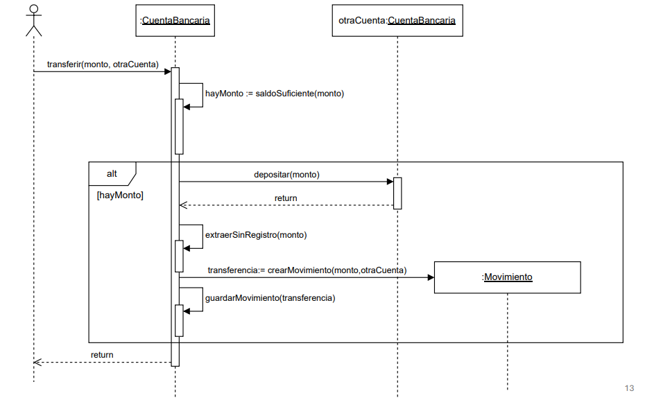

# Orientado a objetos 

## Temas 
- Modelos conceptual (UML, diagramas de clases)
- Relaciones Objetosas
- Herencia
- Contratos
- Testing unitario
- UML

## Modelo conceptual
El modelo conceptual es una representación abstracta de un sistema que utiliza conceptos y relaciones para describir su estructura y comportamiento. En el contexto de la programación orientada a objetos, el modelo conceptual se enfoca en identificar las clases, objetos, atributos y métodos que componen el sistema.

### Modelos del dominio
El modelo de dominio es una evolución del modelo conceptual. Es mucho más rico y detallado, ya que incluye no solo las clases y sus relaciones, sino también las reglas de negocio, restricciones y comportamientos específicos del dominio en cuestión. El modelo de dominio sirve como una guía para el desarrollo del software, asegurando que el sistema refleje fielmente los requisitos y necesidades del negocio.

### Estrategia de modelado
- Utilización de una lista de categorías de clases conceptuales.
- Identificar clases nominales
- Agregar atributos y operaciones a las clases.
- Identificar relaciones entre clases.
- Refinar el modelo mediante la adición de detalles y la eliminación de elementos innecesarios.

## Relaciones Objetosas
Objetos que conocen a otros, identidad e igualdad, relaciones uno a muchos, delegación, polimorfismo y el rol de los tipos y las interfaces.

### Relaciones entre clases
- Un objeto que conoce a otro porque es su resposabilidad manteer a ese otro objeto en el sistema. (Tiene un, conoce a).
- Un objeto conoce a otro cuando:
    - Tiene una referencia en una variable de instancia. (rel. duradera)
    - Le llega una referencia como parámetro en un método. (rel. temporal)
    - Lo crea. (rel. temporal/duradera)
    - Lo obtiene enviando mensajes a otros que que conoce. (rel. temporal)

### This 
this es una "pseudo-variable" que hace referencia al objeto actual dentro de un método o constructor. Se utiliza para diferenciar entre variables de instancia y parámetros o variables locales con el mismo nombre.

### Tipos en lenguajes OO
Los tipos en lenguajes orientados a objetos definen la estructura y el comportamiento de los objetos. Los tipos pueden ser clases, interfaces o tipos primitivos. Los lenguajes OO suelen ser fuertemente tipados, lo que significa que cada variable y expresión tiene un tipo específico que se verifica en tiempo de compilación.

### Polimorfismo
El polimorfismo es un concepto fundamental en la programación orientada a objetos que permite que un mismo mensaje o método pueda comportarse de diferentes maneras según el objeto que lo reciba. 

## Herencia
La herencia es un mecanismo en la programación orientada a objetos que permite a una clase (subclase) heredar atributos y métodos de otra clase (superclase). Esto promueve la reutilización del código y establece una relación jerárquica entre las clases. 

### Interfaces
Una interfaz es un contrato que define un conjunto de métodos que una clase debe implementar. Las interfaces permiten la creación de código más flexible y reutilizable, ya que diferentes clases pueden implementar la misma interfaz de diferentes maneras.

### Relaciones 
Un objeto que conoce a muchos: 
- Las relaciones de uno a muchos se utilizan cuando un objeto necesita mantener referencias a múltiples objetos de otra clase.
- Estas relaciones se implementan comúnmente mediante colecciones, como listas o conjuntos, que almacenan las referencias a los objetos relacionados.

### Clases abstractas
Una clase abstracta captura comportamiento y estructura que sera comun a otras clases. No se pueden instanciar directamente, sino que sirven como base para otras clases que heredan de ellas. Las clases abstractas pueden contener métodos abstractos (sin implementación) y métodos concretos (con implementación).

### Clases abstractas e Interfaces
- Una clase abstracta “es una clase”
- Una interfaz “es un tipo”
- Se pueden implementar muchas interfaces pero solo se puede
heredar de una clase

## Contratos
Son una forma de describir el comportamiento en un sistema de forma detallada. Describen pre(antes) y post(despues) condiciones de los métodos.

### Secciones de un contrato
- Precondiciones: Condiciones que deben cumplirse antes de ejecutar un método.
- Postcondiciones: Condiciones que deben cumplirse después de ejecutar un método.

### Contratos – Test de Unidad
- Los contratos ayudan a definir expectativas claras para el comportamiento de los métodos, lo que facilita la creación de pruebas unitarias efectivas.
- Definen los requerimientos en términos de pre y post condiciones.
- Las pre-condiciones dan una idea del fixture del test.
- Las post-condiciones dan una idea de las verificaciones del test.

Del análisis al diseño:
- Crear diagramas de interacción que muestran cómo los objetos se comunican con el objetivo de cumplir con los requerimientos capturados en la etapa de análisis.
- A partir de los diagramas de interacción, diseñar diagramas de clases representando las clases que serán implementadas.

### Diagramas UML de secuencia

### Heurísticas para asignar responsabilidades
- **Experto**: Asignar la responsabilidad a la clase que tiene la información necesaria para cumplir con la responsabilidad.
- **Creador**: Asignar la responsabilidad de crear un objeto a la clase que tiene la información necesaria para crear ese objeto.
- **Alta cohesión**: Asignar responsabilidades de manera que las clases tengan una única responsabilidad o un conjunto estrechamente relacionado de responsabilidades.
- **Bajo acoplamiento**: Asignar responsabilidades de manera que las clases tengan pocas dependencias entre sí, lo que facilita el mantenimiento y la evolución del sistema.