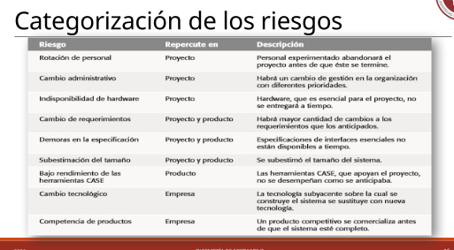

# Riesgos

## ¿Que es un riegos?
Un riesgo es un evento no deseado que tiene consecuencias negativas.

## Gestion de riegos
* Los gerentes deben determinar si pueden presentarse eventos no deseados durante el desarrollo o el mantenimiento.
* Deben hacer planes para evitar que se presenten o para minimizar sus consecuencias negativas.

  <h3>Anticipar/Evitar</h3>

## Gestión de Riesgos en el Desarrollo de Software

* La “deuda técnica” es el término que se utiliza para describir los costos
asociados al aplazamiento de actividades, tales como documentación y
refactorización del software.

* La deuda técnica que no se paga, resulta en un producto de mala calidad,
documentación insuficiente, complejidad innecesaria.

* La deuda técnica implica que los costos (esfuerzo, tiempo, recursos) de
luchar con temas técnicos se puede reducir si se afrontan los problemas al
principio, en vez de dejarlos para el final.

* El desarrollo ágil no implica dejar de lado la gestión de riesgos, ya que
podría llevar a obtener una deuda técnica.

## Tipos de riesgos 

  <h3>Genericos / Especificos</h3>

## Proceso de gestión de riesgos

1. Identificar los riesgos
2. Analizar los riesgos
3. Planificar la respuesta a los riesgos
4. Supervisar y controlar los riesgos

## Identificar los riesgos
* "Verdaderos riesgos" son aquellos que pueden afectar el proyecto de manera significativa.
* "Lista de comprobacion de elementos de riesgo" es una herramienta que se utiliza para identificar riesgos potenciales en un proyecto.
* Uitiliza un enfoque de tormenta de ideas o en base a la experiencia para identificar riesgos potenciales.
* Categorizar los riesgos en función de su impacto y probabilidad de ocurrencia.
  - Del proyecto
  - Del producto
  - Del negocio

Ejemplo de lista de comprobacion de elementos de riesgo:

## Analizar los riesgos
* Cada riesgo identificado requiere:
  - Probabilidad
  - Impacto
* Se construye la tabla de riesgos:
| Riesgo | Categoria | Probabilidad | Impacto |
* Se debe establecen una escala que refleje la probabilidad observada de un riesgo:
  - Bastante improbable : < 10%
  - Improbable : 10 - 25%
  - Moderado : 25 - 50%
  - Probable : 50 - 75%
  - Bastante probable : > 75%
* Luego es necesario estimar el impacto de cada riesgo, utilizando una escala similar a la de probabilidad:
  - 1. Catastrófico : El proyecto no se puede completar o el producto no se puede usar.
  - 2. Serio: El proyecto se retrasa significativamente o el producto tiene problemas graves.
  - 3. Tolerable: El proyecto se retrasa o el producto tiene problemas menores.
  - 4. Insignificante: El proyecto se retrasa ligeramente o el producto tiene problemas muy menores.
Se ordena la lista por probabilidad e impacto, para identificar los riesgos más críticos.

## Planificar la respuesta a los riesgos
* Se consideran cada uno de los riegos por encima de la linea de  corte y se determina una estrategia
- Evitar el riesgo: Cambiar el plan del proyecto para eliminar el riesgo o proteger los objetivos del proyecto de su impacto.
- Mitigar el riesgo: Reducir la probabilidad o el impacto del riesgo a un nivel aceptable.
- Planificar la contingencia: Desarrollar un plan de acción para ejecutar si el riesgo se materializa.

## Supervisar y controlar los riesgos

* Evaluar si ha cambiado la probabilidad de cada riesgo
* Evaluar la efectividad de las estrategias propuestas
* Detectar la ocurrencia de un riesgo que fue previsto
* Asegurar que se están cumpliendo los pasos definidos para cada riesgo
* Recopilar información para el futuro
* Determinar si existen nuevos riesgos
* Reevaluar los riesgos periodicamente
