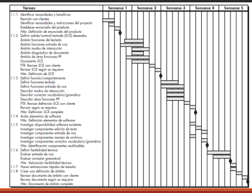

# Candelarizacion de un proyecto

Las fechas de los proyectos pueden ser de dos tipos: 
    * Del cliente
    * Del desarrollador

Pesan mas las del cliente.

# Componente de la planificacion temporal:

* Tarea: (se decribe por 4 parametros)
    - Precursor
    - Duracion
    - Fecha de entrega 
    - Resultado
* Tarea Critica 
* Hito

# Red de tareas 
Es un grafo dirigido aciclico, donde cada nodo es una tarea y cada arista es una dependencia entre tareas.

# Planificacion temporal

* Un diagrama de Gantt, es una herramienta visual de gestion de proyectos utilizada para planificar y rastrear el progreso de diversas tareas y actividades dentro del ciclo de vida de un proyecto.

* PERT (tenica de evaluacion y revisison de programas), es una herramienta utilizada para analizar las estimaciones de tareas en un cronograma y evaludar las opciones de la ruta critica, especialemente cuando las duraciones de la tareas son inciertas.

* CPM (Metodo de la ruta critica), es una tecnica de gestion de proyectos que se utiliza para identificar las tareas criticas en un proyecto, es decir, aquellas que tienen un impacto directo en la fecha de finalizacion del proyecto.

Actualmente se ha tomado lo mejor de ambos metodos, y se han vuelto un solo conocido como metodo del camino critico.

# Planificación Temporal – PERT y CPM

* Fecha mas temprana y tardia:
    - Fecha mas temprana: Es la fecha mas temprana en la que una tarea puede comenzar, teniendo en cuenta las dependencias de las tareas anteriores.
    - Fecha mas tardia: Es la fecha mas tardia en la que una tarea puede comenzar sin retrasar la fecha de finalizacion del proyecto.
* Holgura: Es el tiempo adicional que una tarea puede retrasarse sin afectar la fecha de finalizacion del proyecto. Se calcula restando la fecha mas temprana de la fecha mas tardia.