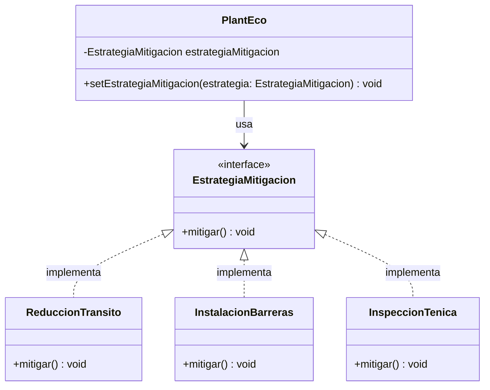

## Patrones

Actividades-Parte 1

1. Se utiliza el patron **Composite**
2. El patron Composite, permite tratar a los objetos individuales y a los compuesto de manera uniforme. Permite definir una jerarquia de objetos en forma de arbol, donde los objetos compuestos pueden contener a otros objetos compuestos o individuales.

Actividades-Parte 2

3. Aplicaria el patron **Strategy** para incorporar la posibilidad de definir el mecanismo de mitigacion.
4. El patro Strategy, define una familia de algoritmos, encapsula cada uno de ellos y los hace intercambiables. Permite que el algortimo varie entre estos permitiendo que el cliente pueda elegir el algoritmo a utilizar en tiempo de ejecucion.
5. UML: 


6. Codigo:

```java
public class PlantEco {
    private EstrategiaMitigacion estrategiaMitigacion;

    public PlantEco() {
        this.estrategiaMitigacion = new ReduccionTransito(); // Estrategia por defecto
    }

    public void setEstrategiaMitigacion(EstrategiaMitigacion estrategia) {
        this.estrategiaMitigacion = estrategia;
    }

    public void activarMitigacion() {
        this.estrategiaMitigacion.mitigar();
    }
}

public interface EstrategiaMitigacion {
    void mitigar();
}

public class ReduccionTransito implements EstrategiaMitigacion {
    
    public ReduccionTransito() {
        // Constructor
    }

    @Override
    public void mitigar() {
        System.out.println("Aplicando reducción de tránsito para mitigar el impacto ambiental.");
    }
}
```

## Refactoring 

