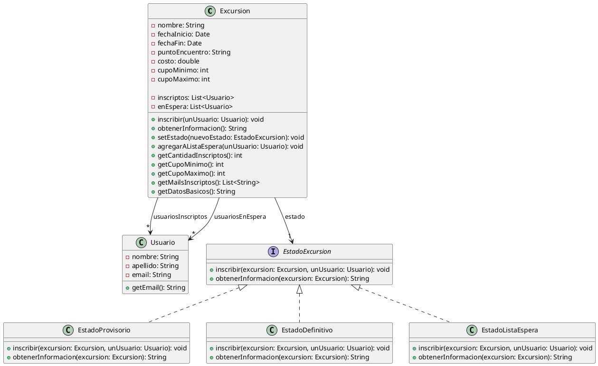

Ejercicio 1 - Patrones
Sea una aplicación que ofrece excursiones como por ejemplo "dos días en kayak bajando el Paraná". Una excursión posee nombre, fecha de inicio, fecha de fin, punto de encuentro, costo, cupo mínimo y cupo máximo.

La aplicación ofrece las excursiones pero éstas sólo se realizan si alcanzan el cupo mínimo de inscriptos. Un usuario se inscribe a una excursión y si aún no se alcanzó el cupo mínimo, la inscripción se considera provisoria. Luego, cuando se alcanza el cupo mínimo, la inscripción se considera definitiva y podrá llevarse a cabo. Finalmente, cuando se alcanza el cupo máximo, la excursión solo registrará nuevos inscriptos en su lista de espera.  

De los usuarios inscriptos, la aplicación registra su nombre, apellido e email.

Por otro lado, en todo momento la excursión ofrece información de la misma, la cual consiste en una serie de datos que varían en función de la situación.

Si la excursión no alcanza el cupo mínimo, la información es la siguiente: nombre, costo, fechas, punto de encuentro, cantidad de usuarios faltantes para alcanzar el cupo mínimo.

Si la excursión alcanzó el cupo mínimo pero aún no el máximo, la información es la siguiente: nombre, costo, fechas, punto de encuentro, los mails de los usuarios inscriptos y cantidad de usuarios faltantes para alcanzar el cupo máximo.

Si la excursión alcanzó el cupo máximo, la información solamente incluye nombre, costo, fechas y punto de encuentro.

En una primera versión, al no contar con una interfaz de usuario y a los efectos de debugging, este comportamiento puede implementarlo en un método que retorne un String con la información solicitada.

Tareas:
Realice un diseño UML. Si utiliza algún patrón indique cuál(es) y justifique su uso.

Implemente lo necesario para instanciar una excursión y para instanciar un usuario.

Implemente los siguientes mensajes de la clase Excursion:

(i) public void inscribir (Usuario unUsuario)

(ii) public String obtenerInformacion()

Escriba un test para inscribir a un usuario en la excursión "Dos días en kayak bajando el Paraná", con cupo mínimo de 1 persona y cupo máximo 2, con dos personas ya inscriptas. Implemente todos los mensajes que considere necesarios.

**Solucion:**

Anotaciones

Excursion: nombre, fechaInicio, fechaFin, puntoEncuentro, costo, cupoMinimo, cupoMaximo

Usuario: nombre, apellido, email

¿Patron state?

Excursion sin cupo minimo alcanzado: nombre, costo, fechas, punto de encuentro, cantidad de usuarios faltantes para alcanzar el cupo mínimo.

Excursion con cupo minimo alcanzado pero sin cupo maximo alcanzado: nombre, costo, fechas, punto de encuentro, los mails de los usuarios inscriptos y cantidad de usuarios faltantes para alcanzar el cupo máximo.

Excursion con cupo maximo alcanzado: nombre, costo, fechas y punto de encuentro.

Que patron es: State, siendo el estado de la excursión el que determina la información que se muestra.

1. El patron a usar es el patron State, ya que nos permite cambiar el comportamiento de la excursion en funcion de su estado sin necesidad de modificar la clase Excursion. Cada estado (provisorio, definitivo, lista de espera) implementa la interfaz EstadoExcursion y define su propio comportamiento para los métodos inscribir y obtenerInformacion.

El patron state tiene como objetivo permitir que un objeto altere su comportamiento cuando su estado interno cambia.

UML:



2. Codigo necesario para instanciar una excursión y un usuario:

```java
public class usuario {
    private String nombre;
    private String apellido;
    private String email;

    public usuario(String nombre, String apellido, String email) {
        this.nombre = nombre;
        this.apellido = apellido;
        this.email = email;
    }

    public String getEmail() {
        return email;
    }
}

public interface EstadoExcursion {
    void inscribir(Excursion excursion, Usuario unUsuario);
    String obtenerInformacion(Excursion excursion);
}

public class Excursion {
    private String nombre;
    private Date fechaInicio;
    private Date fechaFin;
    private String puntoEncuentro;
    private double costo;
    private int cupoMinimo;
    private int cupoMaximo;

    private List<Usuario> inscriptos = new ArrayList<>();
    private List<Usuario> enEspera = new ArrayList<>();
    private EstadoExcursion estado;

    public Excursion(String nombre, Date fechaInicio, Date fechaFin, String puntoEncuentro, double costo, int cupoMinimo, int cupoMaximo) {
        this.nombre = nombre;
        this.fechaInicio = fechaInicio;
        this.fechaFin = fechaFin;
        this.puntoEncuentro = puntoEncuentro;
        this.costo = costo;
        this.cupoMinimo = cupoMinimo;
        this.cupoMaximo = cupoMaximo;
        this.estado = new EstadoProvisorio(); // Estado inicial
    }

    public void inscribir(Usuario unUsuario) {
        estado.inscribir(this, unUsuario);
    }

    public void agregarInscripto(Usuario unUsuario) {
        this.usuariosInscriptos.add(unUsuario);
    }

    public void agregarAListaEspera(Usuario unUsuario) {
        enEspera.add(unUsuario);
    }

    public String obtenerInformacion() {
        return estado.obtenerInformacion(this);
    }

    public void setEstado(EstadoExcursion nuevoEstado) {
        this.estado = nuevoEstado;
    }

    public int getCantidadInscriptos() {
        return inscriptos.size();
    }

    public int getCupoMinimo() {
        return cupoMinimo;
    }

    public int getCupoMaximo() {
        return cupoMaximo;
    }

    public List<String> getMailsInscriptos() {
        return inscriptos.stream().map(Usuario::getEmail).collect(Collectors.toList());
    }

    public String getDatosBasicos() {
        return "Nombre: " + nombre + ", Costo: " + costo + ", Fechas: " + fechaInicio + " - " + fechaFin + ", Punto de Encuentro: " + puntoEncuentro;
    }
}

// Provisorio Cantidad de inscriptos < cupoMinimo
public class EstadoProvisorio implements EstadoExcursion {
    @Override
    public void inscribir(Excursion excursion, Usuario unUsuario) {
        excursion.agregarInscripto(unUsuario);
        if (excursion.getCantidadInscriptos() >= excursion.getCupoMinimo()) {
            excursion.setEstado(new EstadoDefinitivo());
        }
    }

    @Override
    public String obtenerInformacion(Excursion excursion) {
        return excursion.getDatosBasicos() + ", Usuarios faltantes para alcanzar el cupo mínimo: " + (excursion.getCupoMinimo() - excursion.getCantidadInscriptos());
    }
}

// Definitivo Cantidad de inscriptos >= cupoMinimo y < cupoMaximo
public class EstadoDefinitivo implements EstadoExcursion {
    @Override
    public void inscribir(Excursion excursion, Usuario unUsuario) {
        if (excursion.getCantidadInscriptos() < excursion.getCupoMaximo()) {
            excursion.agregarInscripto(unUsuario);
            if (excursion.getCantidadInscriptos() == excursion.getCupoMaximo()) {
                excursion.setEstado(new EstadoListaEspera());
            }
        } else {
            excursion.agregarAListaEspera(unUsuario);
        }
    }

    @Override
    public String obtenerInformacion(Excursion excursion) {
        return excursion.getDatosBasicos() + ", Mails de usuarios inscriptos: " + String.join(", ", excursion.getMailsInscriptos()) + ", Usuarios faltantes para alcanzar el cupo máximo: " + (excursion.getCupoMaximo() - excursion.getCantidadInscriptos());
    }
}

// Lista de espera Cantidad de inscriptos >= cupoMaximo
public class EstadoListaEspera implements EstadoExcursion {
    @Override
    public void inscribir(Excursion excursion, Usuario unUsuario) {
        excursion.agregarAListaEspera(unUsuario);
    }

    @Override
    public String obtenerInformacion(Excursion excursion) {
        return excursion.getDatosBasicos();
    }
}
```


4. Test para inscribir a un usuario en la excursión "Dos días en kayak bajando el Paraná":

```java

public class TestExcursion {
    public static void main(String[] args) {
        // Crear una excursión con cupo mínimo de 1 y cupo máximo de 2
        Excursion excursion = new Excursion("Dos días en kayak bajando el Paraná", new Date(), new Date(), "Puerto de Rosario", 150.0, 1, 2);

        // Crear usuarios
        Usuario usuario1 = new Usuario("Juan", "Pérez", "juan.perez@email.com");
        Usuario usuario2 = new Usuario("María", "Gómez", "maria.gomez@email.com");
        Usuario usuario3 = new Usuario("Carlos", "López", "carlos.lopez@email.com");

        // Inscribir a los usuarios
        excursion.inscribir(usuario1);
        excursion.obtenerInformacion(); // Debería mostrar que falta 1 usuario para alcanzar el cupo mínimo
        excursion.inscribir(usuario2);
        excursion.obtenerInformacion(); // Debería mostrar los mails de los usuarios inscriptos y que falta 0 usuarios para alcanzar el cupo máximo
        excursion.inscribir(usuario3); // Este usuario debería ir a la lista de espera
        excursion.obtenerInformacion(); // Debería mostrar solo los datos básicos de la excursión
    }
}