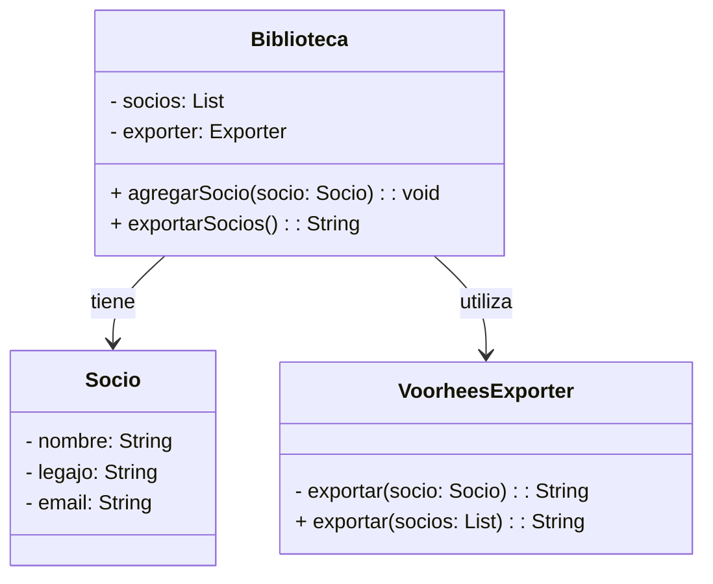

Tareas:

1. Analice la implementación de la clase Biblioteca, Socio y VoorheesExporter que se provee con el material adicional 
de esta práctica (Archivo biblioteca.zip).
2. Documente la implementación mediante un diagrama de clases UML. 
3. Programe los Test de Unidad para la implementación propuesta.

1. Analice la implementación de la clase Biblioteca, Socio y VoorheesExporter:


2. Documente la implementación mediante un diagrama de clases UML:


3. Programe los Test de Unidad para la implementación propuesta:
```java

import org.junit.jupiter.api.Test;
import static org.junit.jupiter.api.Assertions.*;
import java.util.List;

public class BibliotecaTest {

    @Test
    public void testAgregarSocio() {
        Biblioteca biblioteca = new Biblioteca();
        Socio socio = new Socio("Juan Perez", "12345", "juan.perez@email.com");
        biblioteca.agregarSocio(socio);
        // exportarSocios() debería incluir al nuevo socio
        String exportacion = biblioteca.exportarSocios();
        assertTrue(exportacion.contains("Juan Perez"));
    }
}

# Ejercicio 1B

Tareas:
1. Instale la librería JSON.simple agregando la siguiente dependencia al archivo pom.xml de Maven

<dependency>
    <groupId>com.googlecode.json-simple</groupId>
    <artifactId>json-simple</artifactId>
    <version>1.1.1</version>
</dependency>

2. Utilice esta librería para imprimir, en formato JSON, los socios de la Biblioteca en lugar de utilizar la clase VoorheesExporter, sin que esto genere un cambio en el código de la clase Biblioteca.
Modele una solución a esta alternativa utilizando un diagrama de clases UML. Si utiliza patrones de diseño indique los roles en las clases utilizando estereotipos.
Implemente en Java la solución incluyendo los tests que crea necesarios.

3. Investigue sobre la librería Jackson, la cual también permite utilizar el formato JSON para serializar objetos Java.  Extienda la implementación para soportar también esta librería.

Con JSON.simple, tú haces un mapeo manual. Eres el responsable de decirle exactamente qué llave del JSON corresponde a qué dato del objeto
Jackson te quita de encima el trabajo aburrido y repetitivo de traducir "Objeto a Texto" y "Texto a Objeto", haciéndolo de forma automática basándose en cómo escribiste los getters y setters de tus clases.    