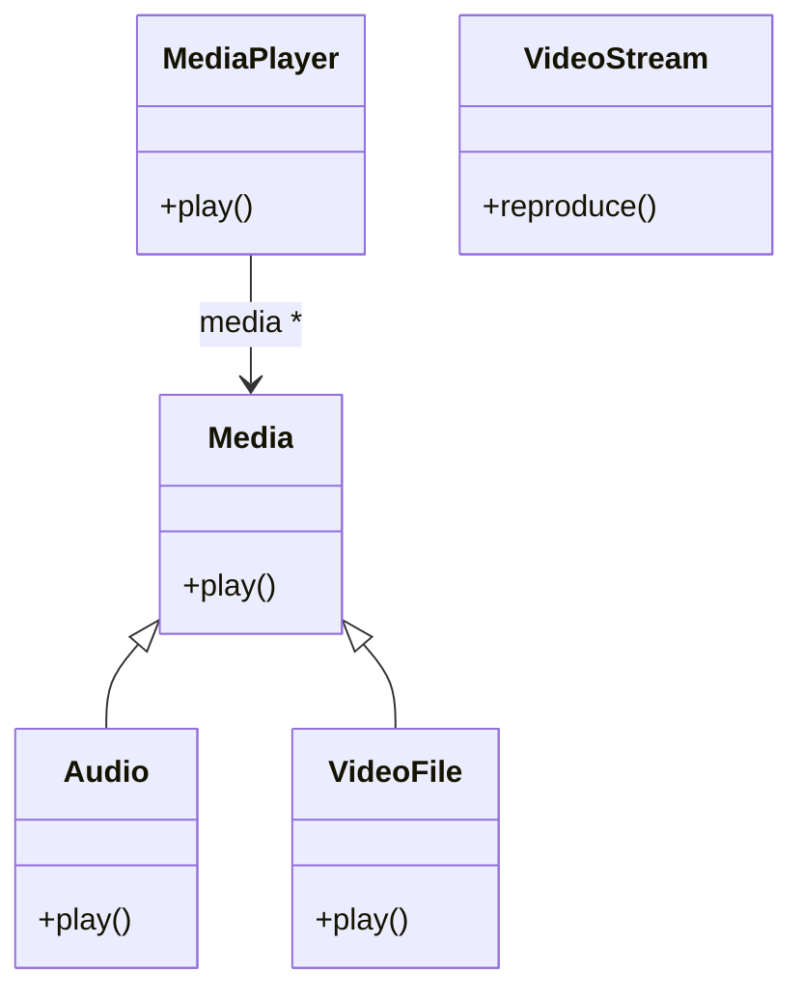
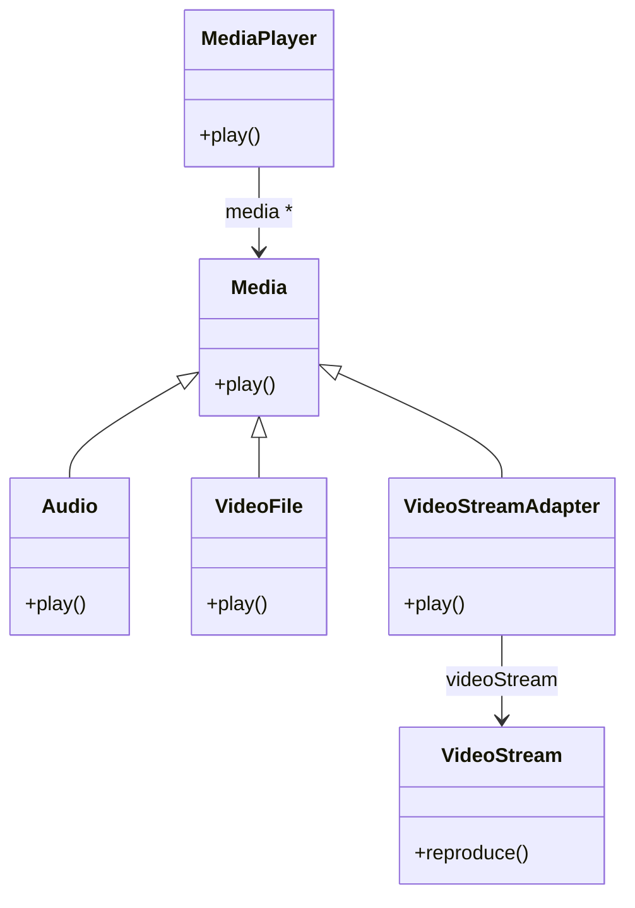

### Ejercicio 3: Media Player

Usted ha implementado una clase Media player, para reproducir archivos de audio y video en formatos que usted ha diseñado. Cada Media se puede reproducir con el mensaje play(). Para continuar con el desarrollo, usted desea incorporar la posibilidad de reproducir Video Stream. Para ello, dispone de la clase VideoStream que pertenece a una librería de terceros y usted no puede ni debe modificarla. El desafío que se le presenta es hacer que la clase MediaPlayer pueda interactuar con la clase VideoStream. 
La situación se resume en el siguiente diagrama UML:

Solucion:

Para resolver este problema, podemos utilizar el patrón de diseño Adapter. El Adapter permitirá que la clase MediaPlayer interactúe con la clase VideoStream sin modificar ninguna de las clases existentes.

Adapter resumidamente es una clase que actúa como un puente entre dos interfaces incompatibles. En este caso, el Adapter implementará la interfaz de Media y se encargará de llamar al método reproduce() de VideoStream cuando se llame al método play().

Solucion en UML:

En este diagrama, la clase VideoStreamAdapter implementa la interfaz Media y tiene una referencia a un objeto VideoStream. Cuando se llama al método play() de VideoStreamAdapter, este método llama al método reproduce() del objeto VideoStream, permitiendo así que MediaPlayer pueda reproducir VideoStream a través del Adapter.