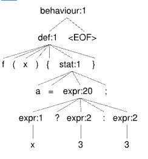

Ejercicios  
 
Con cada uno de los siguientes ejemplos,  
1.  Considere que en el lenguaje dado por la cátedra el llamado a una función o método retorna el valor generado por la evaluación de la última sentencia (stat, en la gramática).
2.  Determine si hay un code smell y cual es. 
3.  Evalúe el código en antlr lab usando las especificaciones del parser.
4.  Estudie el árbol generado por antlr lab.
5.  Escriba un pseudocódigo que permita detectar el code smell en el árbol.

A.
```
f(x,y) {
    a = 4
    a = 3 + y;
    x * x + y * x;
}
```

1. Code Smell: Dead Store (la variable 'a' es asignada pero nunca utilizada).
2. Pseudocódigo para detectar Dead Store:

```
1. Recorrer el arbol:
    a. Para cada referencia a variable:
        i. Si no esta a la izquierda, se elimina del set.
        ii. Si esta a la izquierda, se agrega al set.
2. Al final del recorrido, si hay variables en el set que no fueron utilizadas, reportar como Dead Store.
```


B.
```
f(x, y, z) {
    a = 3 + y;
    x * x + y * x;
}
```

1. Code Smell: Dead Store (la variable 'a' es asignada pero nunca utilizada) y parámetro no utilizado (el parámetro 'z' nunca es usado en la función).
2. Mismo pseudocódigo que en el caso A, y adicionalmente, para detectar parámetros no utilizados:

```
1. Inicializar un 'set de variables' vacío.
2. Inicializar un 'set de parámetros' con todos los parámetros definidos en la firma de la función (ej: agregar x, y, z).
3. Recorrer el arbol:
    a. Para cada referencia a variable:
        i. Si no esta a la izquierda, se elimina del set de variables.
        ii. Si esta a la izquierda, se agrega al set de variables.
    b. Para cada referencia a parámetro:
        i. Si no esta a la izquierda, se elimina del set de parámetros.
4. Al final del recorrido:
    a. Si hay variables en el set que no fueron utilizadas, reportar como Dead Store.
    b. Si hay parámetros en el set de parámetros que no fueron utilizados, reportar como parámetros no utilizados.
```

C.
```
f(x,y) {
    a = 4;
    x + a;
}
```
1. Code Smell: Unsued parameter (La variable 'y' es un parámetro que nunca se utiliza en la función).
2. Pseudocódigo para detectar parámetros no utilizados:

```
1. Inicializar un 'set de parámetros' con todos los parámetros definidos en la firma de la función (ej: agregar x, y).
2. Recorrer el arbol:
    a. Para cada referencia a parámetro:
        i. Si no esta a la izquierda, se elimina del set de parámetros.
3. Al final del recorrido, si hay parámetros en el set de parámetros que no fueron utilizados, reportar como parámetros no utilizados.

```

D.
```
f(x) {
    a = 4;
    a = 5;
}
```
1. Code Smell: Dead Store (la variable 'a' es asignada dos veces, pero nunca utilizada) y Unused parameter (el parámetro 'x' nunca es usado en la función).
2. Pseudocódigo para detectar Dead Store y parámetros no utilizados mismo que en los casos anteriores.

E.

```
f(x) {
    a = x ? 3 : 3;
}
```
1. Code Smell: Redundant Conditional (la expresión condicional siempre evalúa a 3, por lo que la condición es innecesaria).
2. Pseudocódigo para detectar Redundant Conditional:

```
1. Recorrer el arbol:
    a. Para cada expresión condicional:
        i. Extraer los subárboles por verdadero y por falso.
        ii. Comparar los valores de ambos subárboles.
        iii. Si ambos subárboles son iguales, reportar como Redundant Conditional.
```


F.

```
f(y) {
    a = g.x() + g.x() + g.x();
}
```
1. Code Smell: Duplicate Function Call (la función g.x() es llamada tres veces, lo que puede ser ineficiente si la función tiene efectos secundarios o es costosa). Se supone que la funcion g.x() siempre retorna el mismo valor, por lo que se puede almacenar en una variable y reutilizarla.
2. Pseudocódigo para detectar Duplicate Function Call:

```
1. Recorrer el arbol:
    a. Para cada llamada a función:
        i. Mantener contadores (clave: nombre de la función y argumentos).
        ii. Incrementar el contador para cada llamada a la función.
2. Al final del recorrido, si hay funciones llamadas más de una vez con los mismos argumentos, reportar como Duplicate Function Call.
```

G. 

```
f(y) {
    a = not not y;
}
```

1. Code Smell: Double Negation (la expresión 'not not y' es redundante y puede simplificarse a 'y').
2. Pseudocódigo para detectar Double Negation:

```
1. Recorrer el arbol:
    a. Para cada expresión de negación:
        i. Verificar si el hijo de la negación es otra negación.
        ii. Si es así, reportar como Double Negation.
```

H.

```
f(y, z) {
    z + 12;
}
```
1. Code Smell: Unused parameter (el parámetro 'y' nunca es usado en la función).
2. Pseudocódigo para detectar parámetros mismo que en los casos anteriores.

I.

```
elegirSueldo(empleado) {
    clase = empleado.class;
    clase.equals(pasante) ? empleado.setSueldo(20000);
    clase.equals(planta) ? empleado.setSueldo(50000);
}
```
1. Code Smell: switch statement, usa if para dependiendo del tipo de empleado, lo que puede ser reemplazado por polimorfismo (cada clase de empleado podría tener su propio método setSueldo).
2. Pseudocódigo para detectar switch statement:

```
1. Recorrer el árbollllll:
    a. Para cada sentencia de asignación:
        i. Si el lado derecho contiene '.class', 'typeof' o similar, guardar el nombre de esa variable en un registro de "variables de tipo".
    b. Para cada expresión condicional:
        i. Verificar si la condición es una comparación de tipo evaluando su subárbol:
            1. Si el subárbol contiene operaciones directas como 'instanceof', 'typeof' o '.class'...
            2. O SI el subárbol invoca una comparación (ej. '.equals', '==') utilizando alguna de las "variables de tipo" registradas en el paso (a)...
            3. Sumar 1 al contador de switch statements.
2. Al final del recorrido, si el contador de switch statements es mayor a 1, reportar el Code Smell como Switch Statement.
```

J.

```
agregarOnceNumeros(lista) {
    lista.agregar(1);
    lista.agregar(2);
    lista.agregar(3);
    lista.agregar(4);
    lista.agregar(5);
    lista.agregar(6);
    lista.agregar(7);
    lista.agregar(8);
    lista.agregar(9);
    lista.agregar(10);
    lista.agregar(11);
}
```
1. Code Smell: Codigo duplicado (la función agrega once números de manera repetitiva, lo que puede ser reemplazado por un bucle).
2. Pseudocódigo para detectar código duplicado:

```
1. Iniciar un registro de arboles de llamadas a métodos (diccionario o mapa).
2. Recorrer el árbol:
    a. Para cada sentencia de llamada a método:
        i. Extraer el subárbol excluyendo los valores de los argumentos (las hojas).
        ii. Comparar el subárbol con los subárboles ya registrados:
            1. Si el subárbol ya existe, incrementar su contador.
            2. Si el subárbol no existe, agregarlo al registro con un contador inicial de 1.
2. Al final del recorrido:
    a. Si algún subárbol en el registro tiene un contador mayor a 1 (o un umbral que consideres crítico, como 3 repeticiones), reportar el Code Smell: "Código Duplicado"
```

K.

```
numeroTelefonoCompleto(telefono, numero) {
    numero = telefono.codigoArea + telefono.prefijo + telefono.numero;
}
```
1. Code Smell: Envidia de atributos (la función accede a los atributos de otro objeto 'telefono' para construir el 'numero', lo que indica que la función podría estar mejor ubicada dentro de la clase del objeto 'telefono').
2. Pseudocódigo para detectar Envidia de atributos:

```
1. Inicializar en cero un registro de atributos accedidos clave objeto - valor 0.
2. Recorrer arbol:
    a. para cada acceso a un atributo de un objeto:
        i. Si el objeto no es 'this', incrementar el contador del registro para ese objeto.
3. Al final del recorrido:
    a. Si algún objeto en el registro tiene un contador mayor a 1, reportar como Envidia de atributos.
```

L.
```
f(x,y) {
    x or not x ? y + 1;
    x and x ? y - 1;
    x ? x ? y - 1;
}
```

1. Code Smell: Redundant  Conditional(las expresiones condicionales son redundantes y pueden simplificarse).
2. Pseudocódigo para detectar Redundant Conditional mismo que en el caso E.
```
   1. Recorrer el árbol (AST):
    a. Detección en operaciones lógicas directas:
        i. Al encontrar un nodo de operador lógico ('and', 'or'):
            1. Extraer el subárbol izquierdo y el subárbol derecho.
            2. Si ambos subárboles son estructuralmente idénticos (ej. 'x and x'), reportar Code Smell: "Redundant Boolean Expression".
            3. Si un subárbol es la negación exacta del otro (ej. tiene un nodo 'not' cuyo contenido es idéntico al otro subárbol), reportar Code Smell: "Tautology / Contradiction".

    b. Detección en condicionales anidados:
        i. Al encontrar un nodo de expresión condicional (if, ternario):
            4. Extraer el subárbol de la condición actual (ej. 'x').
            5. Recorrer hacia arriba buscando los nodos padres (ancestros) dentro de la misma rama de ejecución.
            6. Si un nodo padre es otro condicional y su condición es estructuralmente idéntica a la actual (ej. 'x ? x ?'), reportar Code Smell: "Redundant Nested Condition".
```

M.

```
f(x) {
    x = x;
}
```

1. Code Smell: Self Assignment (la variable 'x' se asigna a sí misma, lo que es innecesario y puede indicar un error de lógica).
2. Pseudocódigo para detectar Self Assignment:
   
```
1. Recorrer el árbol (AST):
    a. Para cada nodo de asignación:
        i. Extraer el subárbol izquierdo (variable asignada) y el subárbol derecho (valor asignado).
        ii. Si ambos subárboles son idénticos (mismo nombre de variable y misma estructura), reportar Code Smell: "Self Assignment".
```

N.

```
f(x,y) {
    x ? y - 1;
    not x ? y - 2;
}
```

1. Code Smell: Contradictory Conditions (las condiciones 'x' y 'not x' son mutuamente excluyentes, lo que puede indicar un diseño de flujo de control ineficiente o confuso).
2. Pseudocódigo para detectar Contradictory Conditions:

```
1. Recorrer el árbol:
    a. Al entrar a un bloque de sentencias (contexto de ejecución):
        i. Inicializar un registro de "condiciones_evaluadas".
    b. Para cada nodo de expresión condicional dentro de ese bloque:
        i. Extraer el subárbol de la condición actual.
        ii. Comparar estructuralmente este subárbol con las condiciones en 'condiciones_evaluadas':
            1. Si la condición actual tiene un nodo raíz 'not' y su subárbol interno es idéntico a una condición ya registrada...
            2. O SI una condición ya registrada tiene un nodo raíz 'not' y su subárbol interno es idéntico a la condición actual...
            3. Reportar el Code Smell: "Contradictory Conditions / Simulated Else".
        iii. Si no hay coincidencia, guardar el subárbol de la condición actual en 'condiciones_evaluadas'.
```

Ñ.

```
f(a,b,c,d,e,f,g,h,i,j,k) {
    aa+b+c+d+e+f+g+h+i+j+k;
}
```

1. Code Smell: Long Parameter List (la función tiene demasiados parámetros, lo que puede dificultar su uso y mantenimiento).
2. Pseudocódigo para detectar Long Parameter List:

```
1. Recorrer el árbol (AST).
2. Al encontrar un nodo de definición de función:
    a. Extraer la lista de nodos correspondientes a los parámetros definidos dentro de los paréntesis.
    b. Contar la cantidad de nodos de parámetros.
    c. Si el contador supera un umbral preestablecido de buenas prácticas (por ejemplo, mayor a 4 o 5 parámetros), reportar el Code Smell: "Long Parameter List" y sugerir encapsulación de parámetros en un objeto o estructura.
```

O.

```
someOperation(x,y,z) {
    other.someOperation(x,y,z);
}
```

1. Code Smell: Middle Man (la función 'someOperation' simplemente delega la llamada a otra función sin agregar valor, lo que puede indicar que la función es innecesaria).
2. Pseudocódigo para detectar Middle Man:

```
1. Recorrer el árbol (AST).
2. Al encontrar un nodo de definición de función:
    a. Extraer la lista de parámetros de la firma de la función (ej. [x, y, z]).
    b. Evaluar el cuerpo de la función:
        i. Si el cuerpo contiene más de una sentencia, ignorar (no es un Middle Man puro).
        ii. Si contiene exactamente una sentencia y esta es una llamada a un método/función:
            1. Extraer la lista de argumentos que se le están pasando a esa llamada interna.
            2. Comparar la lista de argumentos de la llamada con la lista de parámetros de la firma original.
            3. Si ambas listas son idénticas en cantidad, orden y nombre (es decir, los nodos hojas de los argumentos son referencias directas a los parámetros, sin operadores matemáticos ni alteraciones), reportar el Code Smell: "Middle Man".
```