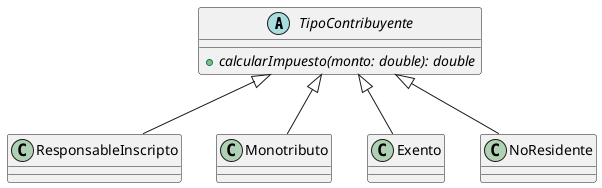
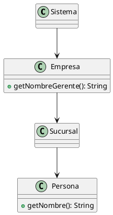

# Práctica de Bad Smells y Refactoring — Batería de ejercicios

> **Instrucciones generales**
> - Los ejercicios están pensados para resolverse en modo examen: primero intentá responder sin mirar las soluciones (están todas al final del documento).
> - Nombrá los smells con su nombre en inglés (es lo que se exige en parcial) y justificá siempre con evidencia del código.
> - En los ejercicios de refactoring, indicá el/los refactoring(s) aplicados y mostrá firmas y clases resultantes (código y/o diagrama UML).
> - Tiempo sugerido: 90 minutos en total.

---

## Mapa de cobertura

| # | Formato | Smells que evalúa |
|---|---|---|
| 1 | Detector de Smells | Duplicated Code, Long Method, Comments |
| 2 | Detector de Smells | Primitive Obsession, Switch Statements, Data Clumps, Long Parameter List |
| 3 | Detector de Smells | Feature Envy, Data Class, Message Chains |
| 4 | Detector de Smells | Refused Bequest, Lazy Class, Speculative Generality |
| 5 | Detector de Smells | Middle Man, Temporary Field, Inappropriate Intimacy |
| 6 | Detector de Smells (PHP) | Duplicated Code, Switch Statements, Primitive Obsession, Long Method |
| 7 | Laboratorio de Refactoring | Switch Statements → Replace Conditional with Polymorphism |
| 8 | Laboratorio de Refactoring | Large Class, Data Clumps → Extract Class + Introduce Parameter Object |
| 9 | Laboratorio de Refactoring | Primitive Obsession → Replace Primitive with Object |
| 10 | Laboratorio de Refactoring | Duplicated Code, Null Checks → Introduce Null Object + Extract Method |
| 11 | Laboratorio de Refactoring | Duplicated Code → Form Template Method |
| 12 | Laboratorio de Refactoring (diagrama) | Message Chains → Hide Delegate |
| 13 | Opción múltiple (6 ítems) | Conceptos generales de varios smells |
| 14 | Verdadero / Falso justificado (6 ítems) | Naturaleza de smells e impacto de refactorings |

---

# PARTE A — Detector de Smells

## Ejercicio 1 — Sistema de nómina

Analice el siguiente código:

```java
public class ProcesadorNomina {

    public void imprimirRecibos(List<Empleado> empleados) {
        double totalGeneral = 0;
        for (Empleado e : empleados) {
            double bruto = e.getSueldoBasico() + e.getHorasExtra() * 450
                    + e.getAntiguedad() * 200;
            // le aplico el 13% de descuento por aportes
            double descuento = bruto * 0.13;
            double neto = bruto - descuento;
            System.out.println("Empleado: " + e.getNombre() + " - Neto: " + neto);
            totalGeneral = totalGeneral + neto;
        }
        System.out.println("Total pagado: " + totalGeneral);
    }

    public double calcularCostoEstimado(List<Empleado> empleados) {
        double total = 0;
        for (Empleado e : empleados) {
            double bruto = e.getSueldoBasico() + e.getHorasExtra() * 450
                    + e.getAntiguedad() * 200;
            double descuento = bruto * 0.13;
            total = total + (bruto - descuento);
        }
        return total;
    }

    public void guardarBackupDeLiquidacion(List<Empleado> empleados) {
        String archivo = "";
        for (Empleado e : empleados) {
            double bruto = e.getSueldoBasico() + e.getHorasExtra() * 450
                    + e.getAntiguedad() * 200;
            double descuento = bruto * 0.13;
            archivo += e.getNombre() + ";" + (bruto - descuento) + "\n";
        }
        ArchivoUtils.escribir("backup.txt", archivo);
    }
}
```

**Consignas:**
a) Identifique todos los bad smells presentes (nombre en inglés) y ubique cada uno en el/los método(s) correspondiente(s).
b) Indique qué refactorings aplicaría para corregirlos, en qué orden, y por qué.

---

## Ejercicio 2 — Reservas de hotel

Analice el siguiente código:

```java
public class GestorReservas {

    public double calcularPrecio(String tipoHabitacion, int categoriaCliente,
                                 String fechaInicio, String fechaFin,
                                 double tarifaBase, boolean incluyeDesayuno,
                                 String codigoPromocional) {
        int dias = FechaUtils.diferenciaEnDias(fechaInicio, fechaFin);
        double total = tarifaBase * dias;

        if (tipoHabitacion == "simple") {
            total = total * 1.0;
        } else if (tipoHabitacion == "doble") {
            total = total * 1.5;
        } else if (tipoHabitacion == "suite") {
            total = total * 2.2;
        }

        if (categoriaCliente == 1) {
            total = total - total * 0.05;
        } else if (categoriaCliente == 2) {
            total = total - total * 0.10;
        } else if (categoriaCliente == 3) {
            total = total - total * 0.20;
        }

        if (incluyeDesayuno) {
            total = total + 800 * dias;
        }
        return total;
    }

    public boolean disponibilidad(String fechaInicio, String fechaFin,
                                  String tipoHabitacion, int categoriaCliente,
                                  double tarifaBase) {
        // consulta a la base de datos
        return BaseDeDatos.hayDisponibilidad(fechaInicio, fechaFin, tipoHabitacion);
    }
}
```

**Consignas:**
a) Identifique todos los bad smells presentes y justifique cada uno con evidencia del código.
b) Para cada smell, indique el refactoring que lo corrige.

---

## Ejercicio 3 — Facturación de comercio

Analice el siguiente código:

```java
public class Factura {
    private int numero;
    private double total;
    private String clienteNombre;
    private String clienteDireccionCalle;
    private String clienteDireccionNumero;
    private String clienteDireccionCiudad;

    public Factura(int numero, String clienteNombre, String calle,
                   String numeroCalle, String ciudad) {
        this.numero = numero;
        this.clienteNombre = clienteNombre;
        this.clienteDireccionCalle = calle;
        this.clienteDireccionNumero = numeroCalle;
        this.clienteDireccionCiudad = ciudad;
    }

    public int getNumero() { return numero; }
    public double getTotal() { return total; }
    public void setTotal(double total) { this.total = total; }
    public String getClienteNombre() { return clienteNombre; }
    public String getClienteDireccionCalle() { return clienteDireccionCalle; }
    public String getClienteDireccionNumero() { return clienteDireccionNumero; }
    public String getClienteDireccionCiudad() { return clienteDireccionCiudad; }
}

public class ImpresorFacturas {

    public String generarEncabezado(Factura factura) {
        String encabezado = "Factura Nro: " + factura.getNumero() + "\n";
        encabezado += "Cliente: " + factura.getClienteNombre() + "\n";
        encabezado += "Dirección: " + factura.getClienteDireccionCalle() + " "
                + factura.getClienteDireccionNumero() + ", "
                + factura.getClienteDireccionCiudad() + "\n";
        return encabezado;
    }

    public String generarPie(Factura factura) {
        return "Total: " + factura.getTotal() + " - Ciudad: "
                + factura.getClienteDireccionCiudad();
    }
}

public class ServicioNotificaciones {
    public void notificarFactura(Factura factura) {
        String ciudad = factura.getClienteDireccionCiudad();
        System.out.println("Notificando a " + ciudad);
    }
}
```

**Consignas:**
a) Identifique todos los bad smells presentes y justifique cada uno.
b) Indique los refactorings correspondientes.

---

## Ejercicio 4 — Jerarquía de vehículos

Analice el siguiente diseño y código:

```java
public abstract class Vehiculo {
    private String patente;

    public void acelerar() { /* ... */ }
    public void frenar() { /* ... */ }
    public void despegar() {
        throw new UnsupportedOperationException("Este vehículo no despega");
    }
    public void anclar() {
        throw new UnsupportedOperationException("Este vehículo no ancla");
    }
    public double calcularAutonomia() { return 500; }
}

public class Auto extends Vehiculo {
    @Override
    public double calcularAutonomia() {
        return super.calcularAutonomia() * 1.2;
    }
}

public class Avion extends Vehiculo {
    @Override
    public void despegar() { /* lógica real de despegue */ }

    @Override
    public void anclar() {
        throw new UnsupportedOperationException("Los aviones no anclan");
    }
}

public class ValidadorPatentes {
    public boolean esValida(String patente) {
        return patente.length() == 7;
    }
}

public class Avioneta extends Vehiculo {
    // solo hereda, no agrega ni redefine nada
}
```

**Consignas:**
a) Identifique todos los bad smells presentes (nómbrelos en inglés) y ubíquelos.
b) ¿Qué refactoring/s aplicaría para cada uno?

---

## Ejercicio 5 — Gestión de biblioteca

Analice el siguiente código:

```java
public class Catalogo {
    private BaseDeDatos db;

    public List<Libro> buscarPorTitulo(String titulo) {
        return db.buscarPorTitulo(titulo);
    }
    public List<Libro> buscarPorAutor(String autor) {
        return db.buscarPorAutor(autor);
    }
    public Libro obtenerPorIsbn(String isbn) {
        return db.obtenerPorIsbn(isbn);
    }
    public void guardar(Libro libro) {
        db.guardar(libro);
    }
    public void eliminar(Libro libro) {
        db.eliminar(libro);
    }
    public BaseDeDatos getDb() {
        return db;
    }
}

public class ServicioPrestamos {
    private List<Prestamo> historial;
    private String ultimoPrestamoDetalle;
    private LocalDate ultimaFechaDevolucion;

    public void registrar(Prestamo p) {
        historial.add(p);
        ultimoPrestamoDetalle = p.getLibro().getTitulo() + " a " + p.getSocio();
        ultimaFechaDevolucion = p.getFechaDevolucion();
    }

    public String detalleUltimoPrestamo() {
        return ultimoPrestamoDetalle;
    }

    public void estadisticas() {
        // usa directamente los atributos internos de BaseDeDatos
        BaseDeDatos db = Sistema.getBaseDeDatos();
        for (int i = 0; i < db.getTablas().size(); i++) {
            for (int j = 0; j < db.getTablas().get(i).getFilas().size(); j++) {
                System.out.println(db.getTablas().get(i).getFilas().get(j).get("libro"));
            }
        }
    }
}
```

**Consignas:**
a) Identifique todos los bad smells presentes y justifique cada uno.
b) Indique el refactoring que corrige cada smell.

---

## Ejercicio 6 — Detector en PHP (proceso de pedidos web)

Analice el siguiente código PHP:

```php
<?php
class PedidoController {

    public function crear() {
        $tipo = $_POST['tipo'];
        $subtotal = 0;
        foreach ($_POST['items'] as $item) {
            $subtotal += $item['precio'] * $item['cantidad'];
        }

        if ($tipo == 'comun') {
            $total = $subtotal;
        } elseif ($tipo == 'express') {
            $total = $subtotal + 500;
        } elseif ($tipo == 'internacional') {
            $total = $subtotal * 1.21 + 1500;
        }

        // guardo el pedido
        $db = new PDO('mysql:host=localhost', 'root', '');
        $db->exec("INSERT INTO pedidos (total) VALUES ($total)");
        echo "Pedido creado por $" . $total;
    }

    public function editar($id) {
        $tipo = $_POST['tipo'];
        $subtotal = 0;
        foreach ($_POST['items'] as $item) {
            $subtotal += $item['precio'] * $item['cantidad'];
        }

        if ($tipo == 'comun') {
            $total = $subtotal;
        } elseif ($tipo == 'express') {
            $total = $subtotal + 500;
        } elseif ($tipo == 'internacional') {
            $total = $subtotal * 1.21 + 1500;
        }

        // actualizo el pedido
        $db = new PDO('mysql:host=localhost', 'root', '');
        $db->exec("UPDATE pedidos SET total = $total WHERE id = $id");
        echo "Pedido editado por $" . $total;
    }
}
```

**Consignas:**
a) Identifique todos los bad smells presentes y justifique cada uno.
b) Indique los refactorings que aplicaría y cómo quedaría organizado el código (a nivel de métodos/clases, sin necesidad de reescribirlo completo).

---

# PARTE B — Laboratorio de Refactoring

## Ejercicio 7 — Cálculo de impuestos

```java
public class CalculadoraImpuestos {

    public double calcularMonto(String tipoContribuyente, double monto) {
        double resultado = 0;
        if (tipoContribuyente == "responsable_inscripto") {
            resultado = monto * 0.21;
        } else if (tipoContribuyente == "monotributo") {
            resultado = monto * 0.15;
        } else if (tipoContribuyente == "exento") {
            resultado = 0;
        } else if (tipoContribuyente == "no_residente") {
            resultado = monto * 0.30;
        }
        return resultado;
    }
}
```

**Consigna:** Aplique **Replace Conditional with Polymorphism**. Muestre:
a) Las clases resultantes con sus firmas completas (incluyendo constructores y método polimórfico).
b) El diagrama de clases UML resultante (puede usar PlantUML).
c) Cómo cambia el código cliente que llama a `calcularMonto`.

---

## Ejercicio 8 — Clase Persona

```java
public class Persona {
    private String nombre;
    private String apellido;
    private String calle;
    private String numeroCalle;
    private String piso;
    private String departamento;
    private String ciudad;
    private String codigoPostal;
    private String telefono;
    private String email;
    private LocalDate fechaNacimiento;

    public Persona(String nombre, String apellido, String calle, String numeroCalle,
                   String piso, String departamento, String ciudad, String codigoPostal,
                   String telefono, String email, LocalDate fechaNacimiento) {
        // ... 11 parámetros ...
    }

    public String formatearDireccion() {
        return calle + " " + numeroCalle + " " + piso + " " + departamento
                + ", " + ciudad + " (" + codigoPostal + ")";
    }

    public int edad() {
        return Period.between(fechaNacimiento, LocalDate.now()).getYears();
    }
}
```

**Consigna:** Aplique **Extract Class** e **Introduce Parameter Object** (y, si corresponde, **Preserve Whole Object**). Muestre las clases resultantes con sus firmas y cómo queda el constructor de `Persona`. Indique también qué mal olor adicional se corrige al agrupar la dirección.

---

## Ejercicio 9 — Transferencias bancarias

```java
public class Transferencia {
    private String cbuOrigen;
    private String cbuDestino;
    private double monto;
    private String moneda;   // "ARS", "USD", "EUR"

    public Transferencia(String cbuOrigen, String cbuDestino, double monto, String moneda) {
        if (moneda != "ARS" && moneda != "USD" && moneda != "EUR") {
            throw new Error("Moneda inválida");
        }
        if (cbuOrigen.length() != 22) {
            throw new Error("CBU origen inválido");
        }
        // ...
    }

    public double convertirA(String destino) {
        if (this.moneda == "ARS" && destino == "USD") return monto / 1000;
        if (this.moneda == "USD" && destino == "ARS") return monto * 1000;
        return monto;
    }
}
```

**Consigna:** Aplique **Replace Primitive with Object**. Especifique:
a) Qué conceptos del dominio merecen ser objetos y qué clases crearía.
b) Las firmas resultantes (constructores y métodos).
c) Dónde queda la validación que hoy vive en el constructor de `Transferencia`.
d) Qué otros smells se corrigen de paso.

---

## Ejercicio 10 — Generación de reportes

```java
public class GeneradorReportes {

    public String generar(Reporte reporte, Filtro filtro) {
        String salida = "";
        if (filtro != null) {
            salida += filtro.aplicar(reporte.getDatos());
        } else {
            salida += reporte.getDatos();
        }
        if (filtro != null && filtro.esInvertido()) {
            salida = new StringBuilder(salida).reverse().toString();
        }
        return salida;
    }

    public String generarResumen(Reporte reporte, Filtro filtro) {
        String salida = "";
        if (filtro != null) {
            salida += filtro.aplicar(reporte.getDatos());
        } else {
            salida += reporte.getDatos();
        }
        return "Resumen: " + salida;
    }
}
```

**Consigna:** Aplique **Introduce Null Object** (y **Extract Method** si hace falta) para eliminar los chequeos `null`. Muestre la interfaz, el Null Object y cómo quedan los métodos de `GeneradorReportes`. Explique qué debe devolver el Null Object en `esInvertido()` y por qué.

---

## Ejercicio 11 — Notificaciones duplicadas

```java
public class NotificadorEmail {
    public void enviar(Mensaje m) {
        String destinatario = m.getDestinatario().trim().toLowerCase();
        if (!destinatario.contains("@")) {
            throw new Error("Destinatario inválido");
        }
        String cuerpo = "Estimado " + m.getDestinatario() + ": " + m.getTexto();
        EmailUtils.enviar(destinatario, cuerpo);
        Log.registrar("EMAIL", destinatario);
    }
}

public class NotificadorSMS {
    public void enviar(Mensaje m) {
        String destinatario = m.getDestinatario().trim().toLowerCase();
        if (!destinatario.contains("@")) {
            throw new Error("Destinatario inválido");
        }
        String cuerpo = "Estimado " + m.getDestinatario() + ": " + m.getTexto();
        SmsUtils.enviar(destinatario, cuerpo);
        Log.registrar("SMS", destinatario);
    }
}
```

**Consigna:** Identifique el smell y aplique **Form Template Method** (o **Extract Superclass** + **Form Template Method**). Muestre la clase abstracta resultante, los métodos concretos y los métodos "hook"/primitivos que cada subclase debe implementar.

---

## Ejercicio 12 — Cadenas de delegación (diagrama)

Dado el siguiente diseño:

```plantuml
class Sistema {
}

class Empresa {
    + getGerente(): Persona
}

class Sucursal {
    + getGerente(): Persona
}

class Persona {
    + getNombre(): String
}

Sistema --> Empresa
Empresa --> Sucursal
Sucursal --> Persona
```

Y el código cliente:

```java
public class Sistema {
    public String nombreDelGerente() {
        return empresa.getSucursalPrincipal().getGerente().getNombre();
    }
}
```

**Consigna:**
a) ¿Qué bad smell se observa en `nombreDelGerente()`? Justifique.
b) Aplique el refactoring correspondiente y muestre el diseño resultante (diagrama) y el código.

---

# PARTE C — Opción múltiple (estilo examen)

Para cada ítem, marque **una única** opción correcta.

**13.1)** Un método de 90 líneas con 6 variables temporales y 3 ciclos anidados es un ejemplo claro de:

- A) Feature Envy
- B) Long Method
- C) Data Clumps
- D) Divergent Change

**13.2)** La clase `Reserva` tiene los atributos `fechaInicio`, `fechaFin` y `horaCheckIn`, y estos tres datos viajan juntos como parámetros en 5 métodos distintos. El smell es:

- A) Temporary Field
- B) Long Parameter List únicamente
- C) Data Clumps
- D) Primitive Obsession

**13.3)** ¿Cuál de las siguientes afirmaciones define correctamente a *Feature Envy*?

- A) Un método que usa principalmente datos de otra clase en lugar de los propios.
- B) Una clase que contiene demasiados atributos y métodos.
- C) Dos clases que implementan la misma funcionalidad con interfaces distintas.
- D) Un atributo que solo se utiliza dentro de un método particular.

**13.4)** El refactoring más adecuado para reemplazar un `switch` sobre un código de tipo que crece con cada nuevo tipo es:

- A) Extract Method
- B) Replace Conditional with Polymorphism
- C) Inline Method
- D) Replace Temp with Query

**13.5)** Un método que solo se limita a llamar a `otro.metodo()` sin agregar comportamiento, repetido en varios métodos de la clase, es un *Middle Man*. Su corrección clásica es:

- A) Hide Delegate
- B) Remove Middle Man
- C) Extract Class
- D) Introduce Null Object

**13.6)** Observando el siguiente diagrama, donde `Vendedor` tiene exclusivamente atributos privados con sus getters/setters y todos los cálculos de comisiones viven en la clase `ComisionCalculator`:

```plantuml
class Vendedor {
    - nombre: String
    - ventas: double
    + getNombre(): String
    + setNombre(nombre: String)
    + getVentas(): double
    + setVentas(ventas: double)
}

class ComisionCalculator {
    + calcularComision(v: Vendedor): double
}
```

El smell presente y su corrección son:

- A) Large Class → Extract Class
- B) Data Class → Move Method (mover `calcularComision` hacia `Vendedor`)
- C) Lazy Class → Inline Class
- D) Inappropriate Intimacy → Encapsulate Field

---

# PARTE D — Verdadero o Falso **justificado**

Responda V o F **y justifique en 2-3 renglones**. Una respuesta sin justificación no puntúa.

**14.1)** Un refactoring puede modificar el comportamiento observable del programa siempre que mejore el diseño.

**14.2)** *Duplicated Code* y *Long Method* frecuentemente se corrigen con el mismo refactoring: *Extract Method*.

**14.3)** *Extract Class* es el refactoring indicado cuando una clase tiene demasiadas responsabilidades (*Large Class*).

**14.4)** Cambiar un `String tipo` por una jerarquía de clases con polimorfismo es un refactoring llamado *Replace Primitive with Object*, y es independiente de *Replace Conditional with Polymorphism*.

**14.5)** El patrón Null Object elimina los chequeos `null` porque sus métodos responden de forma inofensiva (ej. devolviendo cadena vacía o no haciendo nada).

**14.6)** *Rename Method* no es un refactoring "estructural" importante: cambiar nombres de métodos no aporta mejoras de diseño significativas.

---

---

# Soluciones

## Solución Ejercicio 1

**a) Smells identificados:**

1. **Duplicated Code** — el bloque `bruto = sueldoBasico + horasExtra * 450 + antiguedad * 200; descuento = bruto * 0.13` aparece copiado en **tres** métodos: `imprimirRecibos`, `calcularCostoEstimado` y `guardarBackupDeLiquidacion`. Si mañana cambia la fórmula o el porcentaje, hay que tocar tres lugares.
2. **Long Method** — `imprimirRecibos` hace tres cosas a la vez: calcular el sueldo, imprimir el recibo y acumular el total. `guardarBackupDeLiquidacion` arma el archivo y además calcula.
3. **Comments** — `// le aplico el 13% de descuento por aportes` explica *qué* hace la línea siguiente, señal de que el código no se explica solo (números mágicos incluidos: `450`, `200`, `0.13`).

**b) Refactorings, en orden:**

1. **Extract Method**: extraer `private double calcularNeto(Empleado e)` que contiene la fórmula completa. Esto elimina el *Duplicated Code* de un saque.
2. **Extract Method** (segunda pasada): en `imprimirRecibos`, separar `imprimirRecibo(Empleado, double)` del cálculo, resolviendo el *Long Method*.
3. **Rename Method** + **Replace Magic Number with Symbolic Constant** (o al menos nombrar los valores): `PORCENTAJE_APORTES = 0.13`, `VALOR_HORA_EXTRA = 450`, `VALOR_ANTIGUEDAD = 200`. Esto elimina la necesidad del comentario.

Resultado clave: el neto se calcula **una sola vez** y los tres métodos lo consumen.

## Solución Ejercicio 2

**a) y b) Smells y refactorings:**

1. **Switch Statements** — dos cadenas de `if/else if` sobre códigos de tipo (`tipoHabitacion`, `categoriaCliente`) que crecerán cada vez que se agregue una categoría.
   → **Replace Conditional with Polymorphism** (o *Replace Type Code with Subclasses/Strategy*): jerarquías `TipoHabitacion` (`getFactor()`) y `CategoriaCliente` (`getDescuento()`).
2. **Primitive Obsession** — `String tipoHabitacion`, `int categoriaCliente` y `String codigoPromocional` representan conceptos del dominio; se comparan con `==` (bug latente en Java: debe ser `.equals`) y no validan sus valores.
   → **Replace Primitive with Object** / *Replace Type Code with Class*.
3. **Data Clumps** — `fechaInicio` y `fechaFin` viajan juntas en `calcularPrecio` y en `disponibilidad`.
   → **Introduce Parameter Object** con una clase `RangoFechas` (que puede encapsular `diferenciaEnDias`).
4. **Long Parameter List** — `calcularPrecio` recibe 7 parámetros.
   → **Introduce Parameter Object** y **Preserve Whole Object**: pasar `RangoFechas`, `TipoHabitacion`, `CategoriaCliente` como objetos reduce la firma a algo como `calcularPrecio(RangoFechas estadia, TipoHabitacion tipo, CategoriaCliente categoria, double tarifaBase, boolean incluyeDesayuno)`.

Detalle importante: la comparación `tipoHabitacion == "simple"` compara referencias en Java; es un bug que el refactoring *Replace Primitive with Object* elimina de raíz.

## Solución Ejercicio 3

**a) Smells:**

1. **Data Class** — `Factura` es solo atributos + getters/setters; no tiene comportamiento propio. `ImpresorFacturas` y `ServicioNotificaciones` hacen la lógica con sus datos.
2. **Feature Envy** — `generarEncabezado`, `generarPie` y `notificarFactura` usan casi exclusivamente los datos de *dirección* de la factura, no los suyos.
3. **Message Chains** / acoplamiento excesivo — la dirección está "aplastada" en la factura (`clienteDireccionCalle`, `clienteDireccionNumero`, `clienteDireccionCiudad`): es un *Primitive Obsession* + *Data Clumps* disfrazado de atributos planos.

**b) Refactorings:**

1. **Extract Class**: crear `Direccion` (`calle`, `numero`, `ciudad`, `formatear()`) y `Cliente` (`nombre`, `direccion`). Esto resuelve los *Data Clumps*.
2. **Move Method**: `formatear()` vive en `Direccion`; `generarEncabezado` debe pedir `factura.getCliente().getDireccion().formatear()`... pero cuidado, eso reintroduce la cadena.
3. **Hide Delegate**: `Factura` expone `getDireccionFormateada()` delegando en el cliente, para que el código cliente no encadene `getCliente().getDireccion().getCiudad()`.

Con esto `Factura` deja de ser *Data Class* porque gana comportamiento (conoce y formatea su propia información de presentación).

## Solución Ejercicio 4

**a) Smells:**

1. **Refused Bequest** — `Vehiculo` define `despegar()` y `anclar()`, pero `Auto` no usa ninguno de los dos (solo hereda para rechazarlos con excepciones), y `Avion` hereda `anclar()` solo para rechazarlo. La subclase "rechaza" lo que hereda.
2. **Lazy Class** — `Avioneta` no agrega ni redefine nada: no justifica su existencia tal como está.
3. **Speculative Generality** — `despegar()` y `anclar()` en la clase base existen "por si las moscas" para vehículos que no los usan; `ValidadorPatentes` con un solo método trivial también apunta a generalidad de más si solo tiene un cliente.

**b) Refactorings:**

1. Para *Refused Bequest*: **Push Down Method** (`despegar()` y `anclar()` se bajan a las subclases que realmente los soportan, p. ej. una interfaz `Volador` / `Anclable`), o directamente **Replace Inheritance with Delegation** si las capacidades son opcionales.
2. Para *Lazy Class*: **Inline Class** (absorber `Avioneta` si es igual a `Auto`) o **Collapse Hierarchy** si es un caso de jerarquía innecesaria.
3. Para *Speculative Generality*: **Remove Parameter** / eliminar métodos no usados o renombrar con **Rename Method** si tienen un solo cliente; en general, reducir la superficie de `Vehiculo` a lo que todas las subclases usan.

## Solución Ejercicio 5

**a) Smells:**

1. **Middle Man** — `Catalogo` no hace nada más que delegar uno a uno todos sus métodos en `BaseDeDatos`, e incluso expone `getDb()`.
2. **Temporary Field** — `ultimoPrestamoDetalle` y `ultimaFechaDevolucion` solo se escriben en `registrar` y se leen en un método específico; el resto del tiempo están vacíos/obsoletos.
3. **Inappropriate Intimacy** — `estadisticas()` recorre `db.getTablas().get(i).getFilas().get(j).get("libro")`: conoce el modelo interno de `BaseDeDatos` en detalle (y encima es una *Message Chain*).

**b) Refactorings:**

1. Para *Middle Man*: **Remove Middle Man** (el cliente usa directamente `db`) o **Inline Class** si `Catalogo` no agrega valor. Si `Catalogo` sí aporta lógica de negocio, mantenerlo pero sin exponer `getDb()` (**Hide Method** / **Encapsulate Field**).
2. Para *Temporary Field*: **Extract Class** — crear `ResumenPrestamo` (o `UltimoPrestamo`) con esos dos atributos y su método `detalle()`, viviendo solo mientras se necesita.
3. Para *Inappropriate Intimacy*: **Move Method** — la lógica de `estadisticas()` debe vivir en `BaseDeDatos` (o en una clase que sí conozca su estructura), o **Hide Delegate** para exponer una consulta de alto nivel como `db.cantidadDeRegistrosPorLibro()`.

## Solución Ejercicio 6

**a) Smells:**

1. **Duplicated Code** — el bloque de cálculo del `subtotal` con `foreach` y la cadena de `if/elseif` del `total` está copiado idéntico en `crear()` y `editar()`.
2. **Switch Statements** — la cadena `if ($tipo == 'comun') ... elseif ...` es un condicional por código de tipo; crecerá con cada tipo nuevo de pedido.
3. **Primitive Obsession** — `$tipo` es un `String` que representa un concepto del dominio ("tipo de pedido") sin validación ni comportamiento asociado.
4. **Long Method** — `crear()` calcula, persiste y presenta resultados a la vez; `editar()` igual.

**b) Refactorings:**

1. **Extract Method**: `calcularTotal(array $items, $tipo)` y `obtenerSubtotal(array $items)`. Con esto desaparece el *Duplicated Code*.
2. **Replace Conditional with Polymorphism** (o *Replace Type Code with Subclasses*): clase abstracta `TipoPedido` con `calcularTotal($subtotal)` y subclases `Comun`, `Express`, `Internacional`.
3. **Extract Class/Método para persistencia**: la creación del `PDO` y el `INSERT`/`UPDATE` deben vivir en un repositorio (`PedidoRepository::guardar($pedido)`), no en el controlador.
4. **Extract Method** para la presentación (`presentar($total)`).

El orden importa: primero se extrae el método duplicado (cambio seguro), y recién después se reemplaza el condicional por polimorfismo sobre ese único punto.

## Solución Ejercicio 7

**a) Clases resultantes:**

```java
public abstract class TipoContribuyente {
    public abstract double calcularImpuesto(double monto);
}

public class ResponsableInscripto extends TipoContribuyente {
    @Override
    public double calcularImpuesto(double monto) {
        return monto * 0.21;
    }
}

public class Monotributo extends TipoContribuyente {
    @Override
    public double calcularImpuesto(double monto) {
        return monto * 0.15;
    }
}

public class Exento extends TipoContribuyente {
    @Override
    public double calcularImpuesto(double monto) {
        return 0;
    }
}

public class NoResidente extends TipoContribuyente {
    @Override
    public double calcularImpuesto(double monto) {
        return monto * 0.30;
    }
}
```

**b) Diagrama:**



**c) Código cliente:** `calcularMonto` desaparece como condicional y queda delegación pura:

```java
public double calcularMonto(TipoContribuyente tipo, double monto) {
    return tipo.calcularImpuesto(monto);
}
```

**Paso a paso:** (1) se identifica que el `if/else if` varía únicamente en la tasa; (2) se extrae una clase por cada rama con un método que encapsula esa tasa; (3) la variable `tipoContribuyente` (String) se reemplaza por la referencia polimórfica — esto **también** es *Replace Type Code with Class*; (4) agregar un nuevo tipo de contribuyente ahora = agregar una clase nueva, sin tocar la calculadora (**Open/Closed**).

## Solución Ejercicio 8

**Clases resultantes:**

```java
public class Direccion {
    private String calle;
    private String numero;
    private String piso;
    private String departamento;
    private String ciudad;
    private String codigoPostal;

    public Direccion(String calle, String numero, String piso,
                     String departamento, String ciudad, String codigoPostal) {
        // ...
    }

    public String formatear() {
        return calle + " " + numero + " " + piso + " " + departamento
                + ", " + ciudad + " (" + codigoPostal + ")";
    }
}

public class Persona {
    private String nombre;
    private String apellido;
    private Direccion direccion;      // Extract Class
    private String telefono;
    private String email;
    private LocalDate fechaNacimiento;

    public Persona(String nombre, String apellido, Direccion direccion,
                   String telefono, String email, LocalDate fechaNacimiento) {
        // ... 6 parámetros en lugar de 11
    }

    public int edad() {
        return Period.between(fechaNacimiento, LocalDate.now()).getYears();
    }
}
```

**Paso a paso:**
1. Los 6 atributos de dirección son un **Data Clump** clásico: siempre viajan juntos y tienen comportamiento propio (`formatear`). → **Extract Class** `Direccion`.
2. `formatear()` **Move Method** hacia `Direccion` (es *Feature Envy* latente).
3. El constructor de 11 parámetros (**Long Parameter List**) se reduce pasando los objetos completos: **Introduce Parameter Object** / **Preserve Whole Object**.
4. Mal olor adicional corregido: si más adelante se agrega un barrio o un país, solo cambia `Direccion`, no `Persona` (**Shotgun Surgery** evitado).

## Solución Ejercicio 9

**a) Conceptos que merecen ser objetos:**

- `Moneda` (hoy es un `String` con `"ARS"`, `"USD"`, `"EUR"`).
- `Cbu` (hoy es un `String` de 22 caracteres con validación).
- (Opcional pero recomendable) `Monto`, que agrupa importe + moneda.

**b) Firmas resultantes:**

```java
public class Moneda {
    public static final Moneda ARS = new Moneda("ARS");
    public static final Moneda USD = new Moneda("USD");
    public static final Moneda EUR = new Moneda("EUR");

    public double convertir(double monto, Moneda destino) { /* ... */ }
}

public class Cbu {
    private String valor;

    public Cbu(String valor) {
        if (valor.length() != 22) {
            throw new IllegalArgumentException("CBU inválido");
        }
        this.valor = valor;
    }
}

public class Transferencia {
    private Cbu cbuOrigen;
    private Cbu cbuDestino;
    private double monto;
    private Moneda moneda;

    public Transferencia(Cbu cbuOrigen, Cbu cbuDestino, double monto, Moneda moneda) { /* ... */ }

    public double convertirA(Moneda destino) {
        return moneda.convertir(monto, destino);
    }
}
```

**c) Dónde queda la validación:** cada validación se muda a su propio objeto: la del CBU al constructor de `Cbu`, la de la moneda al constructor/fábrica de `Moneda`. `Transferencia` ya no valida datos ajenos a su responsabilidad.

**d) Smells corregidos de paso:** *Primitive Obsession*, el *Switch Statement* del `convertirA` (se puede resolver con un mapa de tasas o polimorfismo en `Moneda`), los comentarios/validaciones repetidas, y la comparación con `==` sobre Strings (bug latente).

## Solución Ejercicio 10

**Interfaz y Null Object:**

```java
public interface Filtro {
    String aplicar(String datos);
    boolean esInvertido();
}

public class FiltroVacio implements Filtro {
    @Override
    public String aplicar(String datos) {
        return datos;          // operación neutra: devuelve tal cual
    }

    @Override
    public boolean esInvertido() {
        return false;          // operación neutra: "no invertir"
    }
}
```

**Métodos resultantes:**

```java
public class GeneradorReportes {

    public String generar(Reporte reporte, Filtro filtro) {
        String salida = filtro.aplicar(reporte.getDatos());
        if (filtro.esInvertido()) {
            salida = new StringBuilder(salida).reverse().toString();
        }
        return salida;
    }

    public String generarResumen(Reporte reporte, Filtro filtro) {
        return "Resumen: " + filtro.aplicar(reporte.getDatos());
    }
}
```

**Paso a paso:**
1. Se detecta el código repetido `if (filtro != null) {...} else {...}` en ambos métodos (el `else` es el comportamiento "neutro" del filtro).
2. Se define la interfaz `Filtro` con el protocolo completo que el cliente necesita (`aplicar`, `esInvertido`).
3. `FiltroVacio` implementa cada método con respuesta **inofensiva**: `aplicar` devuelve el dato sin cambios; `esInvertido` devuelve `false`. Ese `false` es el valor neutro: un filtro inexistente nunca invierte.
4. Los `if (filtro != null)` desaparecen: el cliente siempre trabaja con un `Filtro`, concreto o vacío. Las llamadas que antes pasaban `null` ahora pasan `new FiltroVacio()`.
5. Bonus: el bloque duplicado de `aplicar` se unificó (**Duplicated Code** corregido de paso).

## Solución Ejercicio 11

**Smell:** **Duplicated Code** — el algoritmo "normalizar destinatario → validar → armar cuerpo → enviar → registrar log" está copiado en ambas clases; solo cambia el medio de envío. También hay un **Comments/validación** compartida.

**Clase abstracta resultante (Form Template Method):**

```java
public abstract class Notificador {

    // Template Method: define el ALGORITMO, no se overridea
    public final void enviar(Mensaje m) {
        String destinatario = m.getDestinatario().trim().toLowerCase();
        if (!destinatario.contains("@")) {
            throw new IllegalArgumentException("Destinatario inválido");
        }
        String cuerpo = "Estimado " + m.getDestinatario() + ": " + m.getTexto();
        this.entregar(destinatario, cuerpo);          // primitiva
        Log.registrar(this.canal(), destinatario);    // hook/primitiva
    }

    protected abstract void entregar(String destinatario, String cuerpo);

    protected abstract String canal();
}

public class NotificadorEmail extends Notificador {
    @Override
    protected void entregar(String destinatario, String cuerpo) {
        EmailUtils.enviar(destinatario, cuerpo);
    }

    @Override
    protected String canal() {
        return "EMAIL";
    }
}

public class NotificadorSMS extends Notificador {
    @Override
    protected void entregar(String destinatario, String cuerpo) {
        SmsUtils.enviar(destinatario, cuerpo);
    }

    @Override
    protected String canal() {
        return "SMS";
    }
}
```

**Paso a paso:** (1) se identifica el algoritmo idéntico; (2) **Extract Superclass** `Notificador`; (3) **Form Template Method**: el método concreto `enviar` (declarado `final`) fija los pasos y delega en las primitivas abstractas `entregar` y `canal`, que son los **únicos** puntos de variación. Agregar un nuevo canal (p. ej. WhatsApp) = crear una subclase, sin duplicar nada.

## Solución Ejercicio 12

**a) Smell:** **Message Chains** — `empresa.getSucursalPrincipal().getGerente().getNombre()` encadena cuatro navegaciones. El cliente conoce la estructura completa de colaboradores; si `Empresa` cambia su forma de acceder a la sucursal o al gerente, `Sistema` se rompe.

**b) Refactoring:** **Hide Delegate** (y/o **Extract Method** + **Move Method**).

`Empresa` encapsula la navegación:

```java
public class Empresa {
    private Sucursal sucursalPrincipal;

    public String getNombreGerente() {
        return sucursalPrincipal.getGerente().getNombre();
    }
}
```

Y el código cliente queda:

```java
public class Sistema {
    public String nombreDelGerente() {
        return empresa.getNombreGerente();
    }
}
```

**Diseño resultante:**



La cadena `Sistema → Empresa → Sucursal → Persona` sigue existiendo **como implementación interna**, pero `Sistema` ya solo conoce a `Empresa`. Nota: si muchas clases piden el nombre del gerente, la alternativa es **Move Method** directo (la responsabilidad de armar el texto se muda a `Empresa`).

## Solución Ejercicio 13 (opción múltiple)

| Ítem | Respuesta | Por qué |
|---|---|---|
| 13.1 | **B) Long Method** | La definición clásica: método extenso con variables temporales y ciclos que hacen difícil ver de un vistazo qué hace. El distractor "Divergent Change" es distinto: se refiere a que *una clase* cambia por motivos distintos, no a la longitud del método. |
| 13.2 | **C) Data Clumps** | Los tres datos "viajan juntos" siempre. *Long Parameter List* es un síntoma, pero el smell de fondo es el grupo de datos que merece un objeto (`RangoFechas`/`CheckIn`). |
| 13.3 | **A)** | Esa es la definición exacta de *Feature Envy*; la opción B describe *Large Class*, la C *Alternative Classes with Different Interfaces*, la D *Temporary Field*. |
| 13.4 | **B) Replace Conditional with Polymorphism** | Es la corrección canónica de un *Switch Statement* sobre códigos de tipo. *Extract Method* solo lo oculta mejor, no elimina el condicional. |
| 13.5 | **B) Remove Middle Man** | Cuando la delegación es trivial, se elimina el intermediario. *Hide Delegate* es el refactoring inverso (se usa para cortar *Message Chains*). |
| 13.6 | **B) Data Class → Move Method** | `Vendedor` solo guarda datos y la lógica vive en otra clase; el fix es mover `calcularComision` hacia `Vendedor`. |

## Solución Ejercicio 14 (V/F justificado)

**14.1) FALSO.** Por definición, un refactoring **preserva el comportamiento observable** del programa: solo cambia la estructura interna. Si se cambia el comportamiento, ya no es un refactoring sino un *cambio de funcionalidad* (que puede combinarse con refactorings, pero es otra cosa).

**14.2) VERDADERO.** *Extract Method* saca un fragmento a un método con nombre propio: elimina la duplicación (un solo método compartido) y acorta los métodos largos. Es la herramienta base para ambos smells, aunque para duplicación entre jerarquías se complemente con *Pull Up Method* o *Form Template Method*.

**14.3) VERDADERO.** *Large Class* (demasiadas responsabilidades/atributos) se corrige con **Extract Class** separando cohesiones distintas; alternativas son *Extract Subclass* o *Extract Interface* si la variación es por comportamiento.

**14.4) FALSO (matiz importante).** Son refactorings distintos pero **complementarios y frecuentemente encadenados**: *Replace Primitive with Object* convierte el `String tipo` en un objeto de dominio; *Replace Conditional with Polymorphism* reemplaza los `if/switch` sobre ese tipo por llamadas polimórficas. No son independientes: el segundo suele requerir (o motivar) el primero.

**14.5) VERDADERO.** El Null Object implementa el protocolo completo del tipo con respuestas neutras (cadena vacía, `false`, no-op), y además sus consultas sin valor posible usan valores centinera documentados (p. ej. `Integer.MIN_VALUE` en `getValor()` de un nodo vacío). Así el cliente trabaja sin chequeos `null`.

**14.6) FALSO.** *Rename Method* es un refactoring de bajo costo pero de alto impacto: los nombres son la documentación primaria del código. Nombres como `lmtCrdt()` o `mtFcE()` son un *smell en sí mismos* (de hecho es el punto 1.1 del cuadernillo); un buen nombre elimina la necesidad de comentarios y reduce errores de uso.

---

## Mini guía de repaso final

1. **Detectar** → nombrar el smell en inglés y citar la evidencia (qué método, qué líneas, qué datos usa).
2. **Elegir** el refactoring mínimo que ataca la **causa**, no el síntoma (ej. un `switch` largo no se arregla con *Extract Method* solo).
3. **Aplicar en pasos pequeños**, verificando tras cada paso que el comportamiento no cambió.
4. **Iterar**: cada refactoring suele revelar otro smell (ese es el espíritu del ejercicio 2 del cuadernillo: *"Si vuelve a encontrar un mal olor, retorne al paso (i)"*).
