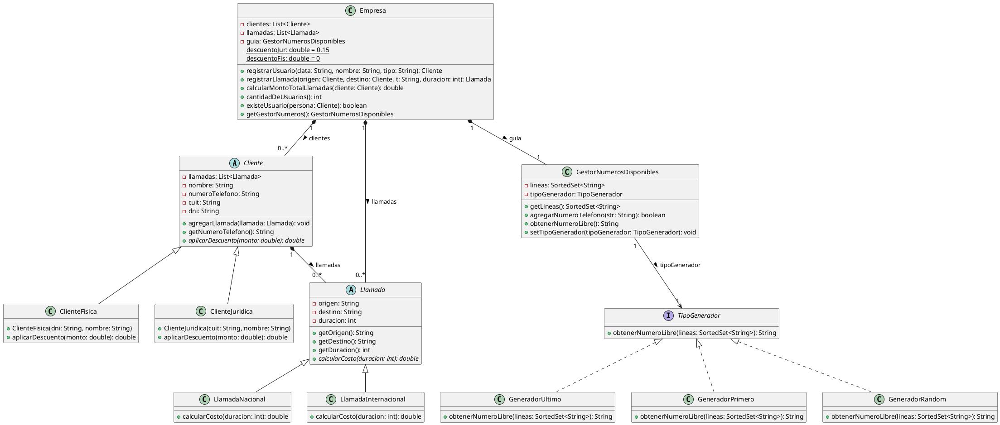

# Ejercicio 1


## 1.1 Protocolo de cliente

La clase Cliente tiene el siguiente protocolo. ¿Cómo puede mejorarlo?  


```java
/**
 * Retorna el límite de crédito del cliente
 */
public double lmtCrdt() {...}

/**
 * Retorna el monto facturado al cliente desde la fecha f1 a la fecha f2
 */
protected double mtFcE(LocalDate f1, LocalDate f2) {...}

/**
 * Retorna el monto cobrado al cliente desde la fecha f1 a la fecha f2
 */
private double mtCbE(LocalDate f1, LocalDate f2) {...}
```

Code smelss identificados: 

1. Nombre poco descriptivos: Cambiaria los nombre de los metodos para que sean mas descriptivos y entendibles. lmtCrdt() -> getLimiteCredito(), mtFcE() -> getMontoFacturadoEntreFechas(), mtCbE() -> getMontoCobradoEntreFechas()

2. Visibilidad de los metodos: Los metodos mtFcE() y mtCbE() tienen visibilidad protected y private respectivamente, lo cual puede dificultar su uso en otras clases. Se podría considerar cambiar la visibilidad de estos métodos a public si se desea que sean accesibles desde otras clases.

3. Parametros poco descriptivos: Los nombres de los parámetros f1 y f2 no son claros. Se podrían cambiar a nombres más descriptivos como fechaInicio y fechaFin para mejorar la legibilidad del código.
   
4. Cambiaria los parametros por un objeto de tipo Periodo o RangoFechas que contenga las fechas de inicio y fin, en lugar de pasar dos parámetros separados. Esto mejoraría la claridad y la cohesión del código.

## 1.2 Participacion en proyectos
Al revisar el siguiente diseño inicial (Figura 1), se decidió realizar un cambio para evitar lo que se consideraba un mal olor. El diseño modificado se muestra en la Figura 2. Indique qué tipo de cambio se realizó y si lo considera apropiado. Justifique su respuesta. 

Diseño inicial (Figura 1):

```plantuml

class Proyecto {}

class Persona {
    +id: string
    +participaEnProyecto(p: Proyecto): Boolean
}

Proyecto 0..* Persona : participantes >
```

Diseño revisado (Figura 2):

```plantuml
class Proyecto {
    +participa(p: Persona): Boolean
}

class Persona {
    +id: string
}

Proyecto 0..* Persona : participantes >
```

Se realizó un cambio en la responsabilidad de la clase Persona. En el diseño inicial, la clase Persona tenía la responsabilidad de determinar si participaba en un proyecto, mientras que en el diseño revisado, esa responsabilidad se trasladó a la clase Proyecto. Se aplica Move method.

se identifica ademas un bad smells en el id de la clase persona. Se soluciona aplicando encapsulate field.

## 1.3 Calculos 
Analice el código que se muestra a continuación. Indique qué code smells encuentra y cómo pueden 
corregirse

```java
public void imprimirValores() { 
  int totalEdades = 0; 
  double promedioEdades = 0; 
  double totalSalarios = 0; 
   
  for (Empleado empleado : personal) { 
    totalEdades = totalEdades + empleado.getEdad(); 
    totalSalarios = totalSalarios + empleado.getSalario(); 
  } 
  promedioEdades = totalEdades / personal.size(); 
     
  String message = String.format("El promedio de las edades es %s y el total de salarios es %s", promedioEdades, totalSalarios); 
   
  System.out.println(message); 
}
```

Code smells identificados:

1. Nombre poco descriptivo -> Cambiaria el nombre del metodo imprimirValores() por imprimirPromedioEdadesYTotalSalarios() para que sea mas descriptivo y entendible.
```java
public void imprimirPromedioEdadesYTotalSalarios() { 
  int totalEdades = 0; 
  double promedioEdades = 0; 
  double totalSalarios = 0; 
   
  for (Empleado empleado : personal) { 
    totalEdades = totalEdades + empleado.getEdad(); 
    totalSalarios = totalSalarios + empleado.getSalario(); 
  } 
  promedioEdades = totalEdades / personal.size(); 
     
  String message = String.format("El promedio de las edades es %s y el total de salarios es %s", promedioEdades, totalSalarios); 
   
  System.out.println(message); 
}
```

2. Extracción de métodos -> Se puede extraer el cálculo del promedio de edades y el total de salarios en métodos separados para mejorar la legibilidad y la mantenibilidad del código.
```java
public void imprimirPromedioEdadesYTotalSalarios() { 
  double promedioEdades = calcularPromedioEdades(); 
  double totalSalarios = calcularTotalSalarios(); 
     
  String message = String.format("El promedio de las edades es %s y el total de salarios es %s", promedioEdades, totalSalarios); 
   
  System.out.println(message); 
}

private double calcularPromedioEdades() { 
  int totalEdades = 0; 
   
  for (Empleado empleado : personal) { 
    totalEdades = totalEdades + empleado.getEdad(); 
  } 
  return totalEdades / personal.size(); 
}

private double calcularTotalSalarios() { 
  double totalSalarios = 0; 
   
  for (Empleado empleado : personal) { 
    totalSalarios = totalSalarios + empleado.getSalario(); 
  } 
  return totalSalarios; 
}
```

3. Uso de variables innecesarias -> Se puede eliminar la variable promedioEdades y totalSalarios en el método imprimirPromedioEdadesYTotalSalarios() y calcular directamente los valores en los métodos separados.
```java 
public void imprimirPromedioEdadesYTotalSalarios() { 
  String message = String.format("El promedio de las edades es %s y el total de salarios es %s", calcularPromedioEdades(), calcularTotalSalarios()); 
   
  System.out.println(message); 
}

private double calcularPromedioEdades() { 
  int totalEdades = 0; 
   
  for (Empleado empleado : personal) { 
    totalEdades = totalEdades + empleado.getEdad(); 
  } 
  return totalEdades / personal.size(); 
}

private double calcularTotalSalarios() { 
  double totalSalarios = 0; 
   
  for (Empleado empleado : personal) { 
    totalSalarios = totalSalarios + empleado.getSalario(); 
  } 
  return totalSalarios; 
}
```

4. Reinventando la rueda -> Se puede utilizar la clase Stream de Java 8 para calcular el promedio de edades y el total de salarios de manera más concisa y legible.
```java
public void imprimirPromedioEdadesYTotalSalarios() { 
  double promedioEdades = personal.stream().mapToInt(Empleado::getEdad).average().orElse(0); 
  double totalSalarios = personal.stream().mapToDouble(Empleado::getSalario).sum(); 
     
  String message = String.format("El promedio de las edades es %s y el total de salarios es %s", promedioEdades, totalSalarios); 
   
  System.out.println(message); 
}

private double calcularPromedioEdades() { 
  return personal.stream().mapToInt(Empleado::getEdad).average().orElse(0); 
}

private double calcularTotalSalarios() { 
  return personal.stream().mapToDouble(Empleado::getSalario).sum(); 
}
```

# Ejercicio 2 

Para cada una de las siguientes situaciones, realice en forma iterativa los siguientes pasos: 
(i) indique el mal olor, 
(ii) indique el refactoring que lo corrige,  
(iii) aplique el refactoring, mostrando el resultado final (código y/o diseño según corresponda).  
Si vuelve a encontrar un mal olor, retorne al paso (i). 

## 2.1 Empleados 

```java
public class EmpleadoTemporario { 
    public String nombre; 
    public String apellido; 
    public double sueldoBasico = 0; 
    public double horasTrabajadas = 0; 
    public int cantidadHijos = 0; 
    // ...... 
     
    public double sueldo() { 
        return this.sueldoBasico 
        +  (this.horasTrabajadas * 500)  
        +  (this.cantidadHijos * 1000)  
        -  (this.sueldoBasico * 0.13); 
    } 
}

public class EmpleadoPlanta { 
    public String nombre; 
    public String apellido; 
    public double sueldoBasico = 0; 
    public int cantidadHijos = 0; 
    // ...... 
     
    public double sueldo() { 
        return this.sueldoBasico  
        + (this.cantidadHijos * 2000) 
        - (this.sueldoBasico * 0.13); 
    } 
} 
 
public class EmpleadoPasante { 
    public String nombre; 
    public String apellido; 
    public double sueldoBasico = 0; 
    // ...... 
     
    public double sueldo() { 
        return this.sueldoBasico - (this.sueldoBasico * 0.13); 
    } 
} 
```

1. Codigo duplicado: Los metodos Sueldo() de las tres clases tienen una misma seccion de codigo:
Refactoring: Extract Method. Se puede extraer la parte de la deduccion del sueldoBasico en un metodo separado.

```java
public class EmpleadoTemporario { 
    public String nombre; 
    public String apellido; 
    public double sueldoBasico = 0; 
    public double horasTrabajadas = 0; 
    public int cantidadHijos = 0; 
    // ......

    public double sueldo() { 
        return this.sueldoBasico 
        +  (this.horasTrabajadas * 500)  
        +  (this.cantidadHijos * 1000)  
        -  calcularDeduccion(); 
    }

    private double calcularDeduccion() {
        return this.sueldoBasico * 0.13;
    }
}

public class EmpleadoPlanta { 
    public String nombre; 
    public String apellido; 
    public double sueldoBasico = 0; 
    public int cantidadHijos = 0; 
    // ......

    public double sueldo() { 
        return this.sueldoBasico  
        + (this.cantidadHijos * 2000) 
        - calcularDeduccion(); 
    }

    private double calcularDeduccion() {
        return this.sueldoBasico * 0.13;
    }
}

public class EmpleadoPasante { 
    public String nombre; 
    public String apellido; 
    public double sueldoBasico = 0; 
    // ......

    public double sueldo() { 
        return this.sueldoBasico - calcularDeduccion(); 
    }

    private double calcularDeduccion() {
        return this.sueldoBasico * 0.13;
    }
}
```

2. Codigo duplicado: Los atributos nombre, apellido y sueldoBasico se repiten en las tres clases.
Refactoring: Extract Superclass. Se puede crear una clase padre Empleado que contenga los atributos y el metodo calcularDeduccion().

```java
public class Empleado {
    public String nombre; 
    public String apellido; 
    public double sueldoBasico = 0; 

    protected double calcularDeduccion() {
        return this.sueldoBasico * 0.13;
    }
}

public class EmpleadoTemporario extends Empleado { 
    public double horasTrabajadas = 0; 
    public int cantidadHijos = 0; 
    // ......

    public double sueldo() { 
        return this.sueldoBasico 
        +  (this.horasTrabajadas * 500)  
        +  (this.cantidadHijos * 1000)  
        -  calcularDeduccion(); 
    }
}

public class EmpleadoPlanta extends Empleado { 
    public int cantidadHijos = 0; 
    // ......

    public double sueldo() { 
        return this.sueldoBasico  
        + (this.cantidadHijos * 2000) 
        - calcularDeduccion(); 
    }
}

public class EmpleadoPasante extends Empleado { 
    // ......

    public double sueldo() { 
        return this.sueldoBasico - calcularDeduccion(); 
    }
}
```

3. Codigo duplicado: Los metodos sueldo() de las tres clases tienen una misma seccion de codigo: la deduccion del sueldoBasico.
Refactoring: Template Method. Se puede crear un metodo abstracto calcularSueldo() en la clase padre Empleado y que cada subclase implemente su propia logica de calculo de sueldo, llamando al metodo calcularDeduccion().

```java
public abstract class Empleado {
    public String nombre; 
    public String apellido; 
    public double sueldoBasico = 0; 

    protected double calcularDeduccion() {
        return this.sueldoBasico * 0.13;
    }

    public abstract double calcularSueldo();
}

public class EmpleadoTemporario extends Empleado { 
    public double horasTrabajadas = 0; 
    public int cantidadHijos = 0; 
    // ......

    @Override
    public double calcularSueldo() { 
        return this.sueldoBasico 
        +  (this.horasTrabajadas * 500)  
        +  (this.cantidadHijos * 1000)  
        -  calcularDeduccion(); 
    }
}

public class EmpleadoPlanta extends Empleado { 
    public int cantidadHijos = 0; 
    // ......

    @Override
    public double calcularSueldo() { 
        return this.sueldoBasico  
        + (this.cantidadHijos * 2000) 
        - calcularDeduccion(); 
    }
}

public class EmpleadoPasante extends Empleado { 
    // ......

    @Override
    public double calcularSueldo() { 
        return this.sueldoBasico - calcularDeduccion(); 
    }
}
```

4. Encapsulamiento: Los atributos nombre, apellido y sueldoBasico son publicos, lo cual permite que cualquier clase pueda acceder y modificar sus valores directamente. Esto puede generar problemas de integridad de datos y dificulta el mantenimiento del código.
Refactoring: Encapsulate Field. Se puede cambiar la visibilidad de los atributos a private y crear métodos getter y setter para acceder y modificar sus valores de manera controlada.

```java
public abstract class Empleado {
    private String nombre; 
    private String apellido; 
    private double sueldoBasico = 0; 

    protected double calcularDeduccion() {
        return this.sueldoBasico * 0.13;
    }

    public abstract double calcularSueldo();

    public String getNombre() {
        return nombre;
    }

    public void setNombre(String nombre) {
        this.nombre = nombre;
    }

    public String getApellido() {
        return apellido;
    }

    public void setApellido(String apellido) {
        this.apellido = apellido;
    }

    public double getSueldoBasico() {
        return sueldoBasico;
    }

    public void setSueldoBasico(double sueldoBasico) {
        this.sueldoBasico = sueldoBasico;
    }
}

public class EmpleadoTemporario extends Empleado { 
    private double horasTrabajadas = 0; 
    private int cantidadHijos = 0; 
    // ......

    @Override
    public double calcularSueldo() { 
        return getSueldoBasico() 
        +  (this.horasTrabajadas * 500)  
        +  (this.cantidadHijos * 1000)  
        -  calcularDeduccion(); 
    }

    public double getHorasTrabajadas() {
        return horasTrabajadas;
    }

    public void setHorasTrabajadas(double horasTrabajadas) {
        this.horasTrabajadas = horasTrabajadas;
    }

    public int getCantidadHijos() {
        return cantidadHijos;
    }

    public void setCantidadHijos(int cantidadHijos) {
        this.cantidadHijos = cantidadHijos;
    }
}

public class EmpleadoPlanta extends Empleado { 
    private int cantidadHijos = 0; 
    // ......

    @Override
    public double calcularSueldo() { 
        return getSueldoBasico()  
        + (this.cantidadHijos * 2000) 
        - calcularDeduccion(); 
    }

    public int getCantidadHijos() {
        return cantidadHijos;
    }

    public void setCantidadHijos(int cantidadHijos) {
        this.cantidadHijos = cantidadHijos;
    }
}
```

5. Long Method: El método calcularSueldo() de la clase EmpleadoTemporario es largo y realiza varias operaciones. Esto puede dificultar su comprensión y mantenimiento.
Refactoring: Extract Method. Se puede extraer la parte del cálculo del sueldo en un método separado para mejorar la legibilidad y la mantenibilidad del código.

```java
public abstract class Empleado {
    private String nombre; 
    private String apellido; 
    private double sueldoBasico = 0; 

    protected double calcularDeduccion() {
        return this.sueldoBasico * 0.13;
    }

    public abstract double calcularSueldo();

    public String getNombre() {
        return nombre;
    }

    public void setNombre(String nombre) {
        this.nombre = nombre;
    }

    public String getApellido() {
        return apellido;
    }

    public void setApellido(String apellido) {
        this.apellido = apellido;
    }

    public double getSueldoBasico() {
        return sueldoBasico;
    }

    public void setSueldoBasico(double sueldoBasico) {
        this.sueldoBasico = sueldoBasico;
    }
}

public class EmpleadoTemporario extends Empleado { 
    private double horasTrabajadas = 0; 
    private int cantidadHijos = 0; 
    // ......

    @Override
    public double calcularSueldo() { 
        return calcularSueldoBasico() + calcularSueldoPorHoras() + calcularSueldoPorHijos() - calcularDeduccion(); 
    }

    private double calcularSueldoBasico() {
        return getSueldoBasico();
    }

    private double calcularSueldoPorHoras() {
        return this.horasTrabajadas * 500;
    }

    private double calcularSueldoPorHijos() {
        return this.cantidadHijos * 1000;
    }

    public double getHorasTrabajadas() {
        return horasTrabajadas;
    }

    public void setHorasTrabajadas(double horasTrabajadas) {
        this.horasTrabajadas = horasTrabajadas;
    }

    public int getCantidadHijos() {
        return cantidadHijos;
    }

    public void setCantidadHijos(int cantidadHijos) {
        this.cantidadHijos = cantidadHijos;
    }
}
```

## 2.2 Juego 

```java
public class Juego { 
    // ...... 
    public void incrementar(Jugador j) { 
        j.puntuacion = j.puntuacion + 100; 
    } 
    public void decrementar(Jugador j) { 
        j.puntuacion = j.puntuacion - 50; 
    } 
}

public class Jugador { 
    public String nombre; 
    public String apellido; 
    public int puntuacion = 0; 
} 
```

Code smells identificados:

1. Encapsulamiento de atributos -> Pasar los atributos de la clase Jugador a private y crear metodos getter y setter para acceder a ellos. Esto mejora la seguridad y el control sobre los datos de la clase.
2. Envidia de atributos -> Los metodos incrementar() y decrementar() de la clase Juego acceden directamente al atributo puntuacion de la clase Jugador. Esto indica que la clase Juego tiene demasiada información sobre la clase Jugador y viola el principio de encapsulamiento. Se puede aplicar el refactoring Move Method para mover los metodos incrementar() y decrementar() a la clase Jugador, donde tienen más sentido y pueden acceder a sus propios atributos de manera segura.
3. Nombres poco descriptivos -> Cambiar los nombres de los metodos incrementar() y decrementar() por incrementarPuntuacion() y decrementarPuntuacion() respectivamente, para que sean mas descriptivos y entendibles.

```java
public class Juego {
    // ......
    public void incrementarPuntuacion(Jugador j) {
        j.incrementarPuntuacion();
    }
    public void decrementarPuntuacion(Jugador j) {
        j.decrementarPuntuacion();
    }
}

public class Jugador {
    private String nombre;
    private String apellido;
    private int puntuacion = 0;

    public void incrementarPuntuacion() {
        this.puntuacion += 100;
    }

    public void decrementarPuntuacion() {
        this.puntuacion -= 50;
    }

    public String getNombre() {
        return nombre;
    }

    public void setNombre(String nombre) {
        this.nombre = nombre;
    }

    public String getApellido() {
        return apellido;
    }

    public void setApellido(String apellido) {
        this.apellido = apellido;
    }

    public int getPuntuacion() {
        return puntuacion;
    }
}
```

## 2.3 Publicaciones 

```plantuml
class PostApp {
    +ultimoPosts(usuario : Usuario, cantidad : int) : Post[*]
}

class Post {
    -texto: string
    -fecha: LocalDateTime
    +getUsuario() : Usuario
    +getFecha() : LocalDateTime
}

class Usuario {
    -username: string
}

PostApp 1 - * Post : posts >
Post 1 - 1 Usuario : usuario >
```

```java
/** 
* Retorna los últimos N posts que no pertenecen al usuario user 
*/ 
public List<Post> ultimosPosts(Usuario user, int cantidad) { 
         
    List<Post> postsOtrosUsuarios = new ArrayList<Post>(); 
    for (Post post : this.posts) { 
        if (!post.getUsuario().equals(user)) { 
            postsOtrosUsuarios.add(post); 
        } 
    } 
         
   // ordena los posts por fecha 
   for (int i = 0; i < postsOtrosUsuarios.size(); i++) { 
       int masNuevo = i; 
       for(int j= i +1; j < postsOtrosUsuarios.size(); j++) { 
           if (postsOtrosUsuarios.get(j).getFecha().isAfter( 
     postsOtrosUsuarios.get(masNuevo).getFecha())) { 
              masNuevo = j; 
           }     
       } 
      Post unPost = postsOtrosUsuarios.set(i,postsOtrosUsuarios.get(masNuevo)); 
      postsOtrosUsuarios.set(masNuevo, unPost);     
   } 
         
    List<Post> ultimosPosts = new ArrayList<Post>(); 
    int index = 0; 
    Iterator<Post> postIterator = postsOtrosUsuarios.iterator(); 
    while (postIterator.hasNext() &&  index < cantidad) { 
        ultimosPosts.add(postIterator.next()); 
    } 
    return ultimosPosts; 
}
```

Code smells identificados:

1. Long Method -> El metodo ultimosPosts() es largo y realiza varias operaciones. Esto puede dificultar su comprensión y mantenimiento.
Refactoring: Extract Method. Se puede extraer la parte de filtrado de posts y la parte de ordenamiento de posts en métodos separados para mejorar la legibilidad y la mantenibilidad del código.

```java
public List<Post> ultimosPosts(Usuario user, int cantidad) { 
    List<Post> postsOtrosUsuarios = filtrarPostsDeOtrosUsuarios(user); 
    ordenarPostsPorFecha(postsOtrosUsuarios); 
    return filtrarPrimerosNPosts(postsOtrosUsuarios, cantidad); 
}

public List<Post> filtrarPostsDeOtrosUsuarios(Usuario user) { 
    List<Post> postsOtrosUsuarios = new ArrayList<Post>(); 
    for (Post post : this.posts) { 
        if (!post.getUsuario().equals(user)) { 
            postsOtrosUsuarios.add(post); 
        } 
    } 
    return postsOtrosUsuarios; 
}

public void ordenarPostsPorFecha(List<Post> posts) { 
    for (int i = 0; i < posts.size(); i++) { 
        int masNuevo = i; 
        for(int j= i +1; j < posts.size(); j++) { 
            if (posts.get(j).getFecha().isAfter(posts.get(masNuevo).getFecha())) { 
                masNuevo = j; 
            }     
        } 
        Post unPost = posts.set(i,posts.get(masNuevo)); 
        posts.set(masNuevo, unPost);     
    } 
}

public List<Post> filtrarPrimerosNPosts(List<Post> posts, int cantidad) { 
    List<Post> ultimosPosts = new ArrayList<Post>(); 
    int index = 0; 
    Iterator<Post> postIterator = posts.iterator(); 
    while (postIterator.hasNext() &&  index < cantidad) { 
        ultimosPosts.add(postIterator.next()); 
        index++; 
    } 
    return ultimosPosts; 
}
```

Codigo bad smells identificados:

1. Reiventando la rueda -> replace loop with pipeline. Se puede utilizar la clase Stream de Java 8 para filtrar, ordenar y limitar los posts de manera más concisa y legible.

```java

public class PostApp {
    public List<Post> ultimosPosts(Usuario user, int cantidad) {
        return filtrarPrimerosNPosts(ordenarPostsPorFecha(filtrarPostsDeOtrosUsuarios(user)), cantidad);
    }

    public List<Post> filtrarPostsDeOtrosUsuarios(Usuario user) {
        return this.posts.stream()
                .filter(post -> !post.getUsuario().equals(user))
                .collect(Collectors.toList());
    }

    public List<Post> ordenarPostsPorFecha(List<Post> posts) {
        return posts.stream()
                .sorted(Comparator.comparing(Post::getFecha).reversed())
                .collect(Collectors.toList());
    }
    
    public List<Post> filtrarPrimerosNPosts(List<Post> posts, int cantidad) {
        return posts.stream()
                .limit(cantidad)
                .collect(Collectors.toList());
    }
}
```

## 2.4 Carrito de compras

```java
public class Producto { 
    private String nombre; 
    private double precio; 
     
    public double getPrecio() { 
        return this.precio; 
    } 
} 
 
public class ItemCarrito { 
    private Producto producto; 
    private int cantidad; 
         
    public Producto getProducto() { 
        return this.producto; 
    } 
     
    public int getCantidad() { 
        return this.cantidad; 
    } 
 
} 
 
public class Carrito { 
    private List<ItemCarrito> items; 
     
    public double total() { 
        return this.items.stream().mapToDouble(item -> item.getProducto().getPrecio() * item.getCantidad()).sum(); 
    } 
}       
```
Code smells identificados:

1. Feature Envy -> El metodo total() de la clase Carrito accede a los atributos de la clase Producto y ItemCarrito. Esto indica que la clase Carrito tiene demasiada informacion sobre las clases Producto y ItemCarrito y viola el principio de encapsulamiento. Se puede aplicar el refactoring Move Method para mover el metodo total() a la clase ItemCarrito, donde tiene mas sentido y puede acceder a sus propios atributos de manera segura.

2. Nombres poco descriptivos -> Cambiar el nombre del metodo total() por calcularTotal() para que sea mas descriptivo y entendible.

```java 
public class Producto { 
    private String nombre; 
    private double precio; 
     
    public double getPrecio() { 
        return this.precio; 
    } 
}

public class ItemCarrito { 
    private Producto producto; 
    private int cantidad; 
         
    public Producto getProducto() { 
        return this.producto; 
    } 
     
    public int getCantidad() { 
        return this.cantidad; 
    } 

    public double calcularTotal() {
        return this.producto.getPrecio() * this.cantidad;
    }
}

public class Carrito { 
    private List<ItemCarrito> items; 
     
    public double calcularTotal() { 
        return this.items.stream().mapToDouble(ItemCarrito::total).sum(); 
    } 
}       
```

## 2.5 Envio de pedidos 

```plantuml
class Supermercado {
    + notificarPedido(nroPEdido: integer; cliente:Cliente)
}

class Cliente {
    + getDireccionFormateada():string
}

class Direccion {
    + localidad:string
    + calle:string
    + numero:string
    + departamento:string
}
```

```java
public class Supermercado { 
   public void notificarPedido(long nroPedido, Cliente cliente) { 
    String notificacion = MessageFormat.format(“Estimado cliente, se le informa 
    que hemos recibido su pedido con número {0}, el cual será enviado a la dirección 
    {1}”, new Object[] { nroPedido, cliente.getDireccionFormateada() });
 
     // lo imprimimos en pantalla, podría ser un mail, SMS, etc.. 
    System.out.println(notificacion); 
  } 
} 
 
public class Cliente { 
   public String getDireccionFormateada() { 
        return  
            this.direccion.getLocalidad() + “, ” + 
            this.direccion.getCalle() + “, ” + 
            this.direccion.getNumero() + “, ” + 
            this.direccion.getDepartamento(); 
   }
}
```

Code smells identificados:
1. Feaury envy, envidia de atributos, La clase cliente pide la informacion de dieccion para retornar la direccion formateada. Esto indica que la clase cliente tiene demasiada informacion sobre la clase direccion y viola el principio de encapsulamiento. Se puede aplicar el refactoring Move Method para mover el metodo getDireccionFormateada() a la clase Direccion, donde tiene mas sentido y puede acceder a sus propios atributos de manera segura. 

2. Encapsulamiento de atributos, Los atributos de la clase Direccion son publicos, lo cual permite que cualquier clase pueda acceder y modificar sus valores directamente. Esto puede generar problemas de integridad de datos y dificulta el mantenimiento del código. Se puede aplicar el refactoring Encapsulate Field para cambiar la visibilidad de los atributos a private y crear métodos getter y setter para acceder y modificar sus valores de manera controlada.

3. MiddleMan, La clase Supermercado depende de la clase Cliente para obtener la direccion formateada. En este pasaje no se agrega comportamiento adicional, solo se delega la responsabilidad a la clase Cliente. Esto puede generar una dependencia innecesaria y dificulta el mantenimiento del código. Se puede aplicar el refactoring Remove Middle Man para eliminar la dependencia de la clase Cliente y obtener la direccion formateada directamente desde la clase Direccion.


```java
public class Supermercado { 
   public void notificarPedido(long nroPedido, Direccion direccion) { 
    String notificacion = MessageFormat.format(“Estimado cliente, se le informa 
    que hemos recibido su pedido con número {0}, el cual será enviado a la dirección 
    {1}”, new Object[] { nroPedido, direccion.getDireccionFormateada() });
 
     // lo imprimimos en pantalla, podría ser un mail, SMS, etc.. 
    System.out.println(notificacion);
  } 
}

public class Cliente { 
   private Direccion direccion;

   public Direccion getDireccion() {
       return direccion;
   }

   public void setDireccion(Direccion direccion) {
       this.direccion = direccion;
   }

   public String getDireccionFormateada() { 
        return this.direccion.getDireccionFormateada(); 
   }
}

public class Direccion { 
    private String localidad; 
    private String calle; 
    private String numero; 
    private String departamento; 

    public String getDireccionFormateada() { 
        return this.localidad + “, ” + this.calle + “, ” + this.numero + “, ” + this.departamento; 
   }
}
```

## 2.6 Peliculas
```plantuml
class HBOO {

}

class Usuario {
    - nombre:string
    - telefono:integer
    - tipoSubscripcion:string
    - email:string
    + calcularCostoPelicula(pelicula:Pelicula):double
}

class Pelicula {
    - nombre:string
    - genero:string
    - fechaEstreno:LocalDate
    - costo:double
    + getCosto():double
    + calcularCargoExtraPorEstreno():double
}
```

```java
public class Usuario { 
    String tipoSubscripcion; 
    // ... 
 
    public void setTipoSubscripcion(String unTipo) { 
        this.tipoSubscripcion = unTipo; 
    } 
     
    public double calcularCostoPelicula(Pelicula pelicula) { 
        double costo = 0; 
        if (tipoSubscripcion=="Basico") { 
            costo = pelicula.getCosto() + pelicula.calcularCargoExtraPorEstreno(); 
        } 
        else if (tipoSubscripcion== "Familia") { 
            costo = (pelicula.getCosto() + pelicula.calcularCargoExtraPorEstreno()) * 0.90; 
        } 
        else if (tipoSubscripcion=="Plus") { 
            costo = pelicula.getCosto(); 
        } 
        else if (tipoSubscripcion=="Premium") { 
            costo = pelicula.getCosto() * 0.75; 
        } 
        return costo; 
    } 
} 
 
public class Pelicula { 
    LocalDate fechaEstreno; 
    // ... 
 
    public double getCosto() { 
        return this.costo; 
    } 
     
    public double calcularCargoExtraPorEstreno(){  
    // Si la Película se estrenó 30 días antes de la fecha actual, retorna un cargo  de 0$, caso contrario, retorna un cargo extra de 300$ 
        return (ChronoUnit.DAYS.between(this.fechaEstreno, LocalDate.now()) ) > 30 ? 0 : 300; 
    } 
}
```

Code smells identificados:

1. Long Method -> El metodo calcularCostoPelicula() de la clase Usuario es largo y realiza varias operaciones. Esto puede dificultar su comprensión y mantenimiento.
Refactoring: Extract Method. Se puede extraer la parte del calculo del costo de la pelicula segun el tipo de subscripcion en metodos separados para mejorar la legibilidad y la mantenibilidad del codigo.

2. Condicionales anidados -> El metodo calcularCostoPelicula() de la clase Usuario tiene varias condicionales anidadas que dificultan su comprensión y mantenimiento. Se puede aplicar el refactoring Replace Conditional with Polymorphism para reemplazar las condicionales por polimorfismo, creando una clase abstracta TipoSubscripcion y subclases para cada tipo de subscripcion, donde cada subclase implementa su propia logica de calculo del costo de la pelicula.

3. Envidia de atributos -> El metodo calcularCostoPelicula() de la clase Usuario accede a los atributos de la clase Pelicula. Esto indica que la clase Usuario tiene demasiada informacion sobre la clase Pelicula y viola el principio de encapsulamiento. Se puede aplicar el refactoring Move Method para mover el metodo calcularCostoPelicula() a la clase Pelicula, donde tiene mas sentido y puede acceder a sus propios atributos de manera segura.

4. Comments -> El metodo calcularCargoExtraPorEstreno() de la clase Pelicula tiene un comentario que explica su logica. Esto indica que el metodo es poco legible y dificulta su comprension. Se puede aplicar el refactoring Extract Method para extraer la logica del calculo del cargo extra en un metodo separado con un nombre descriptivo, eliminando la necesidad del comentario.

```java
public abstract class TipoSubscripcion {
    public abstract double calcularCosto(Pelicula pelicula);
}

public class Basico extends TipoSubscripcion {
    @Override
    public double calcularCosto(Pelicula pelicula) {
        return pelicula.calcularCostoConCargoExtra();
    }
}

public class Familia extends TipoSubscripcion {
    @Override
    public double calcularCosto(Pelicula pelicula) {
        return pelicula.calcularCostoConCargoExtra() * 0.90;
    }
}

public class Plus extends TipoSubscripcion {
    @Override
    public double calcularCosto(Pelicula pelicula) {
        return pelicula.getCosto();
    }
}

public class Premium extends TipoSubscripcion {
    @Override
    public double calcularCosto(Pelicula pelicula) {
        return pelicula.getCosto() * 0.75;
    }
}

public class Usuario {
    private TipoSubscripcion tipoSubscripcion;

    public void setTipoSubscripcion(TipoSubscripcion tipoSubscripcion) {
        this.tipoSubscripcion = tipoSubscripcion;
    }

    public double calcularCostoPelicula(Pelicula pelicula) {
        return tipoSubscripcion.calcularCosto(pelicula);
    }
}

public class Pelicula {
    private LocalDate fechaEstreno;
    private double costo;

    public double getCosto() {
        return this.costo;
    }

    /**
     * Calcula el cargo extra por estreno.
     * @return el cargo extra por estreno.
     */
    public double calcularCargoExtraPorEstreno() {
        return (ChronoUnit.DAYS.between(this.fechaEstreno, LocalDate.now())) > 30 ? 0 : 300;
    }

    public double calcularCostoConCargoExtra() {
        return this.getCosto() + this.calcularCargoExtraPorEstreno();
    }

}
```

# Ejercicio 3 Documuentos y estadisticas

Dado el siguiente código implementado en la clase Document y que calcula algunas 
estadísticas del mismo: 
```java
    public class Document { 
        List<String> words; 
    
        public long characterCount() { 
            long count = this.words 
            .stream() 
            .mapToLong(w -> w.length()) 
            .sum(); 
            return count; 
        } 

        public long calculateAvg() { 
            long avgLength = this.words 
            .stream() 
            .mapToLong(w -> w.length()) 
            .sum() / this.words.size(); 
            return avgLength; 
        } 
        // Resto del código que no importa 
    } 
```

Tareas: 
1.  Enumere los code smell y que refactorings utilizará para solucionarlos. 
2.  Aplique los refactorings encontrados, mostrando el código refactorizado luego de aplicar cada uno. 
3.  Analice el código original y detecte si existe un problema al calcular las estadísticas. 
Explique cuál es el error y en qué casos se da ¿El error identificado sigue presente 
luego de realizar los refactorings? En caso de que no esté presente, ¿en qué momento se resolvió? De acuerdo a lo visto en la teoría, ¿podemos considerar esto un refactoring?

1. Code smells identificados:

- Codigo duplicado: Los metodo characterCount() y calculateAvg() tienen una misma seccion de codigo: la parte que calcula la suma de las longitudes de las palabras. -> Refactoring: Extract Method. Se puede extraer la parte de la suma de las longitudes de las palabras en un metodo separado.
- Envidia de atributos: Los metodos characterCount() y calculateAvg() acceden al atributo words de la clase Document. Esto indica que la clase Document tiene demasiada informacion sobre el atributo words y viola el principio de encapsulamiento. -> Refactoring: Move Method. Se puede mover los metodos characterCount() y calculateAvg() a una clase separada, donde tengan mas sentido y puedan acceder a sus propios atributos de manera segura.
- Long Method: Los metodos characterCount() y calculateAvg() son largos y realizan varias operaciones. Esto puede dificultar su comprensión y mantenimiento. -> Refactoring: Extract Method. Se puede extraer la parte del calculo de la suma de las longitudes de las palabras en un metodo separado para mejorar la legibilidad y la mantenibilidad del codigo.

2.

```java

public class Document { 
    List<String> words; 

    public long characterCount() { 
        return calcularSumaLongitudes(); 
    } 

    public long calculateAvg() { 
        return calcularSumaLongitudes() / this.words.size(); 
    } 

    private long calcularSumaLongitudes() {
        return this.words.stream().mapToLong(w -> w.length()).sum();
    }
}
```

3. Problema al calcular las estadísticas:
El problema es que calcularSumaLogitudes() y calculateAvg() devuelven un tipo long, y deberian retornar un double por ser un promedio. No lo podemos solucionar con un refactoring ya que implicaria cambiar la firma de metodo, es decir su comportamiento.

El otro problema es la division por 0.Como refactorizar implica no cambiar el comportamiento del metodo, no podemos solucionarlo con un refactoring.

# Ejercicio 4 - Pedidos

```plantuml
class Pedido {
    - fomaPago: string
    - <<create>> Pedido(cliente: Cliente, productos: List<Producto>, formaPago: string): Pedido
    - getCostoTotal(): double
}

class Producto {
    + precio: double
    + getPrecio(): double
}

class Cliente {
    + fechaAlta: Date
    + getFechaAlta(): Date
}

Pedido "1" *-- "0..*" Producto : productos >
Pedido "1" -- "1" Cliente : cliente > 
```

```java
01: public class Pedido { 
02:  private Cliente cliente; 
03:  private List<Producto> productos; 
04:  private String formaPago; 
05:  public Pedido(Cliente cliente, List<Producto> productos, String formaPago) { 
06:     if (!"efectivo".equals(formaPago) 
07:        && !"6 cuotas".equals(formaPago) 
08:        && !"12 cuotas".equals(formaPago)) { 
09:          throw new Error("Forma de pago incorrecta"); 
10:    } 
11:    this.cliente = cliente; 
12:    this.productos = productos; 
13:    this.formaPago = formaPago; 
14:   } 
15:   public double getCostoTotal() { 
16:     double costoProductos = 0; 
17:     for (Producto producto : this.productos) { 
18:       costoProductos += producto.getPrecio(); 
19:     } 
20:     double extraFormaPago = 0; 
21:     if ("efectivo".equals(this.formaPago)) { 
22:       extraFormaPago = 0; 
23:     } else if ("6 cuotas".equals(this.formaPago)) { 
24:       extraFormaPago = costoProductos * 0.2; 
25:     } else if ("12 cuotas".equals(this.formaPago)) { 
26:       extraFormaPago = costoProductos * 0.5; 
27:     } 
28:     int añosDesdeFechaAlta = Period.between(this.cliente.getFechaAlta(), LocalDate.now()).getYears(); 
29:     // Aplicar descuento del 10% si el cliente tiene más de 5 años de antiguedad 
30:     if (añosDesdeFechaAlta > 5) { 
31:       return (costoProductos + extraFormaPago) * 0.9; 
32:     } 
33:     return costoProductos + extraFormaPago; 
34:   }
35: } 
36: public class Cliente { 
37:   private LocalDate fechaAlta; 
38:   public LocalDate getFechaAlta() { 
39:     return this.fechaAlta; 
40:   } 
41: } 
42: public class Producto { 
43:   private double precio; 
44:   public double getPrecio() { 
45:     return this.precio; 
46:   } 
47: }
```

Tareas: 
1.  Dado e l código anterior, aplique únicamente los siguientes refactoring: 
    ●  Replace Loop with Pipeline (líneas 16 a 19) 
    ●  Replace Conditional with Polymorphism (líneas 21 a 27) 
    ●  Extract method y move method (línea 28) 
    ●  Extract method y replace temp with query (líneas 28 a 33) 
2.  Realice el diagrama de clases del código refactorizado.

```java
public class Pedido { 
    private Cliente cliente; 
    private List<Producto> productos; 
    private FormaPago formaPago; 

    public Pedido(Cliente cliente, List<Producto> productos, FormaPago formaPago) { 
        this.cliente = cliente; 
        this.productos = productos; 
        this.formaPago = formaPago; 
    } 

    public double getCostoTotal() { 
        double costoProductos = this.productos.stream().mapToDouble(Producto::getPrecio()).sum();
        double extraFormaPago = this.formaPago.getExtra(costoProductos);
        int añosDesdeFechaAlta = this.cliente.getAniosDesdeFechaAlta();
        return aplicarDescuentoSiCorresponde(costoProductos, extraFormaPago, añosDesdeFechaAlta);
    }

    public double aplicarDescuentoSiCorresponde(double costoProductos, double extraFormaPago, int añosDesdeFechaAlta) {
        if (añosDesdeFechaAlta > 5) {
            return (costoProductos + extraFormaPago) * 0.9;
        }
        return costoProductos + extraFormaPago;
    }
}

public interface FormaPago {
    public double getExtra(double costoProductos);
}

public class Efectivo implements FormaPago {
    @Override
    public double getExtra(double costoProductos) {
        return 0;
    }
}

public class SeisCuotas implements FormaPago {
    @Override
    public double getExtra(double costoProductos) {
        return costoProductos * 0.2;
    }
}

public class DoceCuotas implements FormaPago {
    @Override
    public double getExtra(double costoProductos) {
        return costoProductos * 0.5;
    }
}

public class Cliente { 
    private LocalDate fechaAlta; 

    public LocalDate getFechaAlta() { 
        return this.fechaAlta; 
    } 
    
    public int getAniosDesdeFechaAlta() {
        return Period.between(this.fechaAlta, LocalDate.now()).getYears();
    }
}
```

```plantuml

class Pedido {
    - cliente: Cliente
    - productos: List<Producto>
    - formaPago: FormaPago
    + getCostoTotal(): double
    + aplicarDescuentoSiCorresponde(costoProductos: double, extraFormaPago: double, añosDesdeFechaAlta: int): double
}

class Cliente {
    - fechaAlta: LocalDate
    + getFechaAlta(): LocalDate
    + getAniosDesdeFechaAlta(): int
}

class Producto {
    - precio: double
    + getPrecio(): double
}

interface FormaPago {
    + getExtra(costoProductos: double): double
}

class Efectivo implements FormaPago {
    + getExtra(costoProductos: double): double
}

class SeisCuotas implements FormaPago {
    + getExtra(costoProductos: double): double
}

class DoceCuotas implements FormaPago {
    + getExtra(costoProductos: double): double
}
```

# Ejercicio 5 - Facturacion de llamadas

```java
public class Cliente {
	public List<Llamada> llamadas = new ArrayList<Llamada>();
	private String tipo;
	private String nombre;
	private String numeroTelefono;
	private String cuit;
	private String dni;

	public String getTipo() {
		return tipo;
	}
	public void setTipo(String tipo) {
		this.tipo = tipo;
	}
	public String getNombre() {
		return nombre;
	}
	public void setNombre(String nombre) {
		this.nombre = nombre;
	}
	public String getNumeroTelefono() {
		return numeroTelefono;
	}
	public void setNumeroTelefono(String numeroTelefono) {
		this.numeroTelefono = numeroTelefono;
	}
	public String getCuit() {
		return cuit;
	}
	public void setCuit(String cuit) {
		this.cuit = cuit;
	}
	public String getDNI() {
		return dni;
	}
	public void setDNI(String dni) {
		this.dni = dni;
	}
}

public class Empresa {
	private List<Cliente> clientes = new ArrayList<Cliente>();
	private List<Llamada> llamadas = new ArrayList<Llamada>();
	private GestorNumerosDisponibles guia = new GestorNumerosDisponibles();

	static double descuentoJur = 0.15;
	static double descuentoFis = 0;

	public boolean agregarNumeroTelefono(String str) {
		boolean encontre = guia.getLineas().contains(str);
		if (!encontre) {
			guia.getLineas().add(str);
			encontre= true;
			return encontre;
		}
		else {
			encontre= false;
			return encontre;
		}
	}

	public String obtenerNumeroLibre() {
		return guia.obtenerNumeroLibre();
	}

	public Cliente registrarUsuario(String data, String nombre, String tipo) {
		Cliente var = new Cliente();
		if (tipo.equals("fisica")) {
			var.setNombre(nombre);
			String tel = this.obtenerNumeroLibre();
			var.setTipo(tipo);
			var.setNumeroTelefono(tel);
			var.setDNI(data);
		}
		else if (tipo.equals("juridica")) {
			String tel = this.obtenerNumeroLibre();
			var.setNombre(nombre);
			var.setTipo(tipo);
			var.setNumeroTelefono(tel);
			var.setCuit(data);
		}
		clientes.add(var);
		return var;
	}

	public Llamada registrarLlamada(Cliente origen, Cliente destino, String t, int duracion) {
		Llamada llamada = new Llamada(t, origen.getNumeroTelefono(), destino.getNumeroTelefono(), duracion);
		llamadas.add(llamada);
		origen.llamadas.add(llamada);
		return llamada;
	}

	public double calcularMontoTotalLlamadas(Cliente cliente) {
		double c = 0;
		for (Llamada l : cliente.llamadas) {
			double auxc = 0;
			if (l.getTipoDeLlamada() == "nacional") {
				// el precio es de 3 pesos por segundo más IVA sin adicional por establecer la llamada
				auxc += l.getDuracion() * 3 + (l.getDuracion() * 3 * 0.21);
			} else if (l.getTipoDeLlamada() == "internacional") {
				// el precio es de 150 pesos por segundo más IVA más 50 pesos por establecer la llamada
				auxc += l.getDuracion() * 150 + (l.getDuracion() * 150 * 0.21) + 50;
			}

			if (cliente.getTipo() == "fisica") {
				auxc -= auxc*descuentoFis;
			} else if(cliente.getTipo() == "juridica") {
				auxc -= auxc*descuentoJur;
			}
			c += auxc;
		}
		return c;
	}

	public int cantidadDeUsuarios() {
		return clientes.size();
	}

	public boolean existeUsuario(Cliente persona) {
		return clientes.contains(persona);
	}

	public GestorNumerosDisponibles getGestorNumeros() {
		return this.guia;
	}
}

public class GestorNumerosDisponibles {
	private SortedSet<String> lineas = new TreeSet<String>();
	private String tipoGenerador = "ultimo";

	public SortedSet<String> getLineas() {
		return lineas;
	}

	public String obtenerNumeroLibre() {
		String linea;
		switch (tipoGenerador) {
			case "ultimo":
				linea = lineas.last();
				lineas.remove(linea);
				return linea;
			case "primero":
				linea = lineas.first();
				lineas.remove(linea);
				return linea;
			case "random":
				linea = new ArrayList<String>(lineas)
						.get(new Random().nextInt(lineas.size()));
				lineas.remove(linea);
				return linea;
		}
		return null;
	}

	public void cambiarTipoGenerador(String valor) {
		this.tipoGenerador = valor;
	}
}

public class Llamada {
	private String tipoDeLlamada;
	private String origen;
	private String destino;
	private int duracion;

	public Llamada(String tipoLlamada, String origen, String destino, int duracion) {
		this.tipoDeLlamada = tipoLlamada;
		this.origen= origen;
		this.destino= destino;
		this.duracion = duracion;
	}

	public String getTipoDeLlamada() {
		return tipoDeLlamada;
	}

	public String getRemitente() {
		return destino;
	}

	public int getDuracion() {
		return this.duracion;
	}

	public String getOrigen() {
		return origen;
	}
}
```

Tareas: 
1. Describa la solución inicial con un diagrama de clases UML. 
2. Documente la secuencia de refactorings aplicados, como se indica previamente.  
3. Describa la solución final con un diagrama de clases UML.


4. 
Bad Smell: Envidia de atributos, en la clase empresa, el metodo agregarNumeroTelefono ejecuta logica que deberia estuan asignada en la clase GestorNumerosDisponibles.
Refactoring: Move Method, mover el metodo agregarNumeroTelefono a la clase GestorNumerosDisponibles.

```java
public class empresa {
    private List<Cliente> clientes = new ArrayList<Cliente>();
    private List<Llamada> llamadas = new ArrayList<Llamada>();
    private GestorNumerosDisponibles guia = new GestorNumerosDisponibles();

    static double descuentoJur = 0.15;
    static double descuentoFis = 0;

    public boolean agregarNumeroTelefono(String str) {
        return guia.agregarNumeroTelefono(str);
    }
}
```

```java
public class GestorNumerosDisponibles {
    private SortedSet<String> lineas = new TreeSet<String>();
    private String tipoGenerador = "ultimo";

    public boolean agregarNumeroTelefono(String str) {
        boolean encontre = lineas.contains(str);
        if (!encontre) {
            lineas.add(str);
            encontre= true;
            return encontre;
        }
        else {
            encontre= false;
            return encontre;
        }
    }
}
```

Bad Smell: Long method, agregarNumeroTelefono() es un metodo largo y realiza varias operaciones. Esto puede dificultar su comprensión y mantenimiento.
Refactoring: Extract Method, se puede extraer la logica de buscar si el numero ya existe en un metodo separado y otro que lo agregue a la lista de lineas.

Bad smell: Variable redundante, la variable encontre es redundante y no aporta valor al metodo. Se puede eliminar y retornar directamente el resultado de la operacion.
Refactoring: Replace Temp with Query, se puede reemplazar la variable encontre por una llamada al metodo existeNumero().

```java
public class GestorNumerosDisponibles {
    private SortedSet<String> lineas = new TreeSet<String>();
    private String tipoGenerador = "ultimo";

    public boolean agregarNumeroTelefono(String str) {
        if (!existeNumero(str)) {
            agregarNumero(str);
            return true;
        } else {
            return false;
        }
    }

    private boolean existeNumero(String str) {
        return lineas.contains(str);
    }

    private void agregarNumero(String str) {
        lineas.add(str);
    }
}
```

BadSmell: Codigo duplicado en registrarUsuario(), ya que tanto para el caso de tipo "fisica" como para el caso de tipo "juridica" se repite la logica de crear el Cliente y asignarle nombre, tipo y numero de telefono. Esto dificulta su comprensión y mantenimiento, ya que cualquier cambio deberia hacerse en dos lugares.
Refactoring: Extract Method, se puede extraer la logica comun de creacion e inicializacion del cliente en un metodo crearCliente(nombre, tipo). Notar que este metodo NO recibe "data", ya que ese dato es propio de cada tipo de cliente: recibirlo sin usarlo seria un mal olor (parametro sin uso) y dejaria un cliente incompleto a medio inicializar.

```java
public class Empresa {
    private List<Cliente> clientes = new ArrayList<Cliente>();
    private List<Llamada> llamadas = new ArrayList<Llamada>();
    private GestorNumerosDisponibles guia = new GestorNumerosDisponibles();

    static double descuentoJur = 0.15;
    static double descuentoFis = 0;

    public Cliente registrarUsuario(String data, String nombre, String tipo) {
        Cliente cliente = crearCliente(nombre, tipo);

        if (tipo.equals("fisica")) {
            cliente.setDNI(data);
        } else if (tipo.equals("juridica")) {
            cliente.setCuit(data);
        }

        clientes.add(cliente);
        return cliente;
    }

    private Cliente crearCliente(String nombre, String tipo) {
        Cliente cliente = new Cliente();
        cliente.setNombre(nombre);
        cliente.setTipo(tipo);
        cliente.setNumeroTelefono(this.obtenerNumeroLibre());
        return cliente;
    }
}
```

BadSmell: En el metodo registrarLLamada() de la clase Empresa, hay middle man, ya que la clase Empresa depende de la clase Cliente para obtener el numero de telefono del cliente origen y destino. En este pasaje no se agrega comportamiento adicional, solo se delega la responsabilidad a la clase Cliente. Esto puede generar una dependencia innecesaria y dificulta el mantenimiento del código.


```java
public class Empresa {
    private List<Cliente> clientes = new ArrayList<Cliente>();
    private List<Llamada> llamadas = new ArrayList<Llamada>();
    private GestorNumerosDisponibles guia = new GestorNumerosDisponibles();

    static double descuentoJur = 0.15;
    static double descuentoFis = 0;

    public Llamada registrarLlamada(Cliente origen, Cliente destino, String t, int duracion) {
        Llamada llamada = new Llamada(t, origen.getNumeroTelefono(), destino.getNumeroTelefono(), duracion);
        llamadas.add(llamada);
        origen.agregarLlamada(llamada);
        return llamada;
    }
}

public class Cliente {
    private List<Llamada> llamadas = new ArrayList<Llamada>();
    private String tipo;
    private String nombre;
    private String numeroTelefono;
    private String cuit;
    private String dni;

    public void agregarLlamada(Llamada llamada) {
        this.llamadas.add(llamada);
    }
}
```

BadSmells: Condicionales anidadas en el metodo calcularMontoTotalLlamadas() de la clase Empresa. Esto dificulta su comprensión y mantenimiento. Se puede aplicar el refactoring Replace Conditional with Polymorphism para reemplazar las condicionales por polimorfismo, creando una clase abstracta TipoCliente y subclases para cada tipo de cliente, donde cada subclase implementa su propia logica de calculo del monto total de llamadas.

Tambien se puede aplicar el refactoring Replace Conditional with Polymorphism para reemplazar las condicionales por polimorfismo, creando una clase abstracta TipoLlamada y subclases para cada tipo de llamada, donde cada subclase implementa su propia logica de calculo del costo de la llamada.

Dado este cambio tambien hay que acomodar registrarUsuario para que cree un TipoCliente correspondiente al tipo de cliente que se esta registrando.

```java

public abstract class Cliente {
    private List<Llamada> llamadas = new ArrayList<Llamada>();
    private String nombre;
    private String numeroTelefono;
    private String cuit;
    private String dni;

    public void agregarLlamada(Llamada llamada) {
        this.llamadas.add(llamada);
    }

    public abstract double aplicarDescuento(double monto);
}

public class ClienteFisica extends Cliente {

    public ClienteFisica(String dni, String nombre) {
        this.setDNI(dni);
        this.setNombre(nombre);
    }

    @Override
    public double aplicarDescuento(double monto) {
        return monto - (monto * Empresa.descuentoFis);
    }
}

public class ClienteJuridica extends Cliente {

    public ClienteJuridica(String cuit, String nombre) {
        this.setCuit(cuit);
        this.setNombre(nombre);
    }

    @Override
    public double aplicarDescuento(double monto) {
        return monto - (monto * Empresa.descuentoJur);
    }
}

public class Llamada {
    private String tipoDeLlamada;
	private String origen;
	private String destino;
	private int duracion;

	public Llamada(String tipoLlamada, String origen, String destino, int duracion) {
		this.tipoDeLlamada = tipoLlamada;
		this.origen= origen;
		this.destino= destino;
		this.duracion = duracion;
	}

	public String getTipoDeLlamada() {
		return tipoDeLlamada;
	}

	public String getRemitente() {
		return destino;
	}

	public int getDuracion() {
		return this.duracion;
	}

	public String getOrigen() {
		return origen;
	}

    public abstract double calcularCosto(int duracion);
}

public class LlamadaNacional extends Llamada {
    @Override
    public double calcularCosto(int duracion) {
        return duracion * 3 + (duracion * 3 * 0.21);
    }
}

public class LlamadaInternacional extends Llamada {
    @Override
    public double calcularCosto(int duracion) {
        return duracion * 150 + (duracion * 150 * 0.21) + 50;
    }
}
```

```java
public class Empresa {
    private List<Cliente> clientes = new ArrayList<Cliente>();
    private List<Llamada> llamadas = new ArrayList<Llamada>();
    private GestorNumerosDisponibles guia = new GestorNumerosDisponibles();

    static double descuentoJur = 0.15;
    static double descuentoFis = 0;

    public Cliente registrarUsuario(String data, String nombre, String tipo) {
        if (tipo.equals("fisica")) {
            Cliente cliente = new ClienteFisica(String data, String nombre)
        } else if (tipo.equals("juridica")) {
            Cliente cliente = new ClienteJuridica(String data, String nombre)
        } else {
            throw new IllegalArgumentException("Tipo de cliente no válido");
        }

        clientes.add(cliente);
        return cliente;
    }

    public Llamada registrarLlamada(Cliente origen, Cliente destino, String t, int duracion) {
		Llamada llamada = new Llamada(t, origen.getNumeroTelefono(), destino.getNumeroTelefono(), duracion);
		llamadas.add(llamada);
		origen.agregarLlamada(llamada);
		return llamada;
	}

    public double calcularMontoTotalLlamadas(Cliente cliente) {
        double c = 0;
        for (Llamada l : cliente.llamadas) {
            double auxc = l.calcularCosto(l.getDuracion());
            auxc = cliente.aplicarDescuento(auxc);
            c += auxc;
        }
        return c;
    }

    	public int cantidadDeUsuarios() {
		return clientes.size();
	}

	public boolean existeUsuario(Cliente persona) {
		return clientes.contains(persona);
	}

	public GestorNumerosDisponibles getGestorNumeros() {
		return this.guia;
	}
}
```

Bad smells en calcularMontoTotalLlamadas de nombre de variables poco descriptivos, se puede aplicar el refactoring Rename Variable para cambiar el nombre de las variables a nombres mas descriptivos.

```java
public double calcularMontoTotalLlamadas(Cliente cliente) {
    double montoTotal = 0;
    for (Llamada llamada : cliente.llamadas) {
        double costoLlamada = llamada.calcularCosto(llamada.getDuracion());
        costoLlamada = cliente.aplicarDescuento(costoLlamada);
        montoTotal += costoLlamada;
    }
    return montoTotal;
}
```

BadSmells en GestorNumerosDisponibles, el metodo obtenerNumeroLibre() tiene un switch que depende de la variable tipoGenerador. Esto dificulta su comprensión y mantenimiento. Se puede aplicar el refactoring Replace Conditional with Polymorphism para reemplazar el switch por polimorfismo, creando una clase abstracta TipoGenerador y subclases para cada tipo de generador, donde cada subclase implementa su propia logica de obtencion del numero libre.

```java
public interface TipoGenerador {
    public String obtenerNumeroLibre(SortedSet<String> lineas);
}

public class GeneradorUltimo implements TipoGenerador {
    @Override
    public String obtenerNumeroLibre(SortedSet<String> lineas) {
        String linea = lineas.last();
        lineas.remove(linea);
        return linea;
    }
}

public class GeneradorPrimero implements TipoGenerador {
    @Override
    public String obtenerNumeroLibre(SortedSet<String> lineas) {
        String linea = lineas.first();
        lineas.remove(linea);
        return linea;
    }
}

public class GeneradorRandom implements TipoGenerador {
    @Override
    public String obtenerNumeroLibre(SortedSet<String> lineas) {
        String linea = new ArrayList<String>(lineas).get(new Random().nextInt(lineas.size()));
        lineas.remove(linea);
        return linea;
    }
}

public class GestorNumerosDisponibles {
	private SortedSet<String> lineas = new TreeSet<String>();
	private TipoGenerador tipoGenerador = new GeneradorUltimo();

	public SortedSet<String> getLineas() {
		return lineas;
	}

	public String obtenerNumeroLibre() {
		return getTipoGenerador().obtenerNumeroLibre(lineas);
	}

	public void setTipoGenerador(TipoGenerador tipoGenerador) {
		this.tipoGenerador = tipoGenerador;
	}
}
```

Codigo final refactorizado:

```java
public class Empresa {
    private List<Cliente> clientes = new ArrayList<Cliente>();
    private List<Llamada> llamadas = new ArrayList<Llamada>();
    private GestorNumerosDisponibles guia = new GestorNumerosDisponibles();

    static double descuentoJur = 0.15;
    static double descuentoFis = 0;

    public Cliente registrarUsuario(String data, String nombre, String tipo) {
        Cliente cliente;
        if (tipo.equals("fisica")) {
            cliente = new ClienteFisica(data, nombre);
        } else if (tipo.equals("juridica")) {
            cliente = new ClienteJuridica(data, nombre);
        } else {
            throw new IllegalArgumentException("Tipo de cliente no válido");
        }

        clientes.add(cliente);
        return cliente;
    }

    public Llamada registrarLlamada(Cliente origen, Cliente destino, String t, int duracion) {
        Llamada llamada;
        if (t.equals("nacional")) {
            llamada = new LlamadaNacional(origen.getNumeroTelefono(), destino.getNumeroTelefono(), duracion);
        } else if (t.equals("internacional")) {
            llamada = new LlamadaInternacional(origen.getNumeroTelefono(), destino.getNumeroTelefono(), duracion);
        } else {
            throw new IllegalArgumentException("Tipo de llamada no válido");
        }
        llamadas.add(llamada);
        origen.agregarLlamada(llamada);
        return llamada;
    }

    public double calcularMontoTotalLlamadas(Cliente cliente) {
        double montoTotal = 0;
        for (Llamada llamada : cliente.llamadas) {
            double costoLlamada = llamada.calcularCosto(llamada.getDuracion());
            costoLlamada = cliente.aplicarDescuento(costoLlamada);
            montoTotal += costoLlamada;
        }
        return montoTotal;
    }

    public int cantidadDeUsuarios() {
        return clientes.size();
    }

    public boolean existeUsuario(Cliente persona) {
        return clientes.contains(persona);
    }

    public GestorNumerosDisponibles getGestorNumeros() {
        return this.guia;
    }
}
```

## 3. Solución final - Diagrama de clases UML

La solución final queda compuesta por los siguientes elementos:

- **Empresa** es la fachada del sistema: registra usuarios y llamadas, y calcula el monto total de las llamadas de un cliente. Conserva la lista de clientes y de llamadas, y delega la gestión de números telefónicos en **GestorNumerosDisponibles**.
- **Cliente** es una clase abstracta que reemplaza al `String tipo` original: el comportamiento variable (el descuento) se resuelve con polimorfismo en las subclases **ClienteFisica** y **ClienteJuridica**. Cada cliente conoce sus propias llamadas.
- **Llamada** es una clase abstracta que reemplaza al `String tipoDeLlamada` original: el cálculo del costo se resuelve con polimorfismo en **LlamadaNacional** y **LlamadaInternacional**.
- **GestorNumerosDisponibles** encapsula las líneas disponibles y delega la estrategia de obtención del próximo número en la interfaz **TipoGenerador**, con las implementaciones **GeneradorUltimo**, **GeneradorPrimero** y **GeneradorRandom** (reemplaza al `switch` sobre `tipoGenerador`).



# Ejercicio 6 - Arboles Binario

Codigo Original: 

```java
public class ArbolBinario {
    private int valor;
    private ArbolBinario hijoIzquierdo;
    private ArbolBinario hijoDerecho;

    public ArbolBinario(int valor) {
        this.valor = valor;
        this.hijoIzquierdo = null;
        this.hijoDerecho = null;
    }

    public int getValor() {
        return valor;
    }

    public void setValor(int valor) {
        this.valor = valor;
    }

    public ArbolBinario getHijoIzquierdo() {
        return hijoIzquierdo;
    }

    public void setHijoIzquierdo(ArbolBinario hijoIzquierdo) {
        this.hijoIzquierdo = hijoIzquierdo;
    }

    public ArbolBinario getHijoDerecho() {
        return hijoDerecho;
    }

    public void setDerecha(ArbolBinario hijoDerecho) {
        this.hijoDerecho = hijoDerecho;
    }

   public String recorrerPreorden() {
        String resultado = valor + " - ";
        if (this.getHijoIzquierdo() != null) {
        	resultado += this.getHijoIzquierdo().recorrerPreorden();
	    }
        if (this.getHijoDerecho() != null) {
        	resultado += this.getHijoDerecho().recorrerPreorden();
        }
        return resultado;
    }

   public String recorrerInorden() {
        String resultado = "";
        if (this.getHijoIzquierdo() != null) {
        	resultado += this.getHijoIzquierdo().recorrerInorden();
	    }
        resultado += valor + " - ";
        if (this.getHijoDerecho() != null) {
        	resultado += this.getHijoDerecho().recorrerInorden();
        }
        return resultado;
    }

   public String recorrerPostorden() {
        String resultado = "";
        if (this.getHijoIzquierdo() != null) {
        	resultado += this.getHijoIzquierdo().recorrerPostorden();
	    }
        if (this.getHijoDerecho() != null) {
        	resultado += this.getHijoDerecho().recorrerPostorden();
        }
        resultado += valor + " - ";
        return resultado;
    }
}
```

Code Smells:
1. Codigo Duplicado: Los metodos recorrerPreorden(), recorrerInorden() y recorrerPostorden() tienen codigo duplicado en la logica de recorrer los hijos izquierdo y derecho del arbol. Esto dificulta su comprension y mantenimiento, ya que cualquier cambio en la logica de recorrido deberia hacerse en tres lugares.
Refactoring: Aplicar null object pattern, creando una interface IArbolBinario y una clase ArbolBinarioVacio que implementa la interface y representa un nodo vacio. De esta manera, se puede eliminar la logica de verificar si el hijo izquierdo o derecho es null, y se puede delegar el recorrido a los hijos, que pueden ser nodos vacios.


```java
public interface IArbolBinario {
    public int getValor();
    public void setValor(int valor);
    public void setHijoIzquierdo(IArbolBinario hijoIzquierdo);
    public void setHijoDerecho(IArbolBinario hijoDerecho);
    public IArbolBinario getHijoIzquierdo();
    public IArbolBinario getHijoDerecho();
    public String recorrerPreorden();
    public String recorrerInorden();
    public String recorrerPostorden();
}

public class ArbolBinario implements IArbolBinario {
    private int valor;
    private IArbolBinario hijoIzquierdo;
    private IArbolBinario hijoDerecho;

    public ArbolBinario(int valor) {
        this.valor = valor;
        this.hijoIzquierdo = new ArbolBinarioVacio();
        this.hijoDerecho = new ArbolBinarioVacio();
    }

    public int getValor() {
        return valor;
    }

    public void setValor(int valor) {
        this.valor = valor;
    }

    public IArbolBinario getHijoIzquierdo() {
        return hijoIzquierdo;
    }

    public void setHijoIzquierdo(IArbolBinario hijoIzquierdo) {
        this.hijoIzquierdo = hijoIzquierdo;
    }

    public IArbolBinario getHijoDerecho() {
        return hijoDerecho;
    }

    public void setHijoDerecho(IArbolBinario hijoDerecho) {
        this.hijoDerecho = hijoDerecho;
    }

   public String recorrerPreorden() {
        return valor + " - " + this.getHijoIzquierdo().recorrerPreorden() + this.getHijoDerecho().recorrerPreorden();
    }

   public String recorrerInorden() {
        return this.getHijoIzquierdo().recorrerInorden() + valor + " - " + this.getHijoDerecho().recorrerInorden();
    }

   public String recorrerPostorden() {
        return this.getHijoIzquierdo().recorrerPostorden() + this.getHijoDerecho().recorrerPostorden() + valor + " - ";
    }
}

public class ArbolBinarioVacio implements IArbolBinario {
    public int getValor() {
        return Integer.MIN_VALUE;
    }

    public void setValor(int valor) {}

    public void setHijoIzquierdo(IArbolBinario hijoIzquierdo) {}

    public void setHijoDerecho(IArbolBinario hijoDerecho) {}

    public IArbolBinario getHijoIzquierdo() {
        return this;
    }

    public IArbolBinario getHijoDerecho() {
        return this;
    }

   public String recorrerPreorden() {
        return "";
    }

   public String recorrerInorden() {
        return "";
    }

   public String recorrerPostorden() {
        return "";
    }
}
```