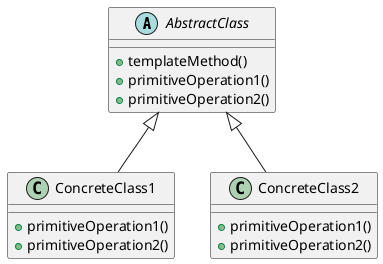

# Template method

**Propósito** 
Template Method es un patrón de diseño de comportamiento que define el esqueleto de un algoritmo en la superclase pero permite que las subclases sobrescriban pasos del algoritmo sin cambiar su estructura.

**Aplicabilidad**
- Para implementar las partes invariantes de un algoritmo y dejar que las subclases implementen el comportamiento variable.
- Para evitar la duplicación de código en las subclases al definir un algoritmo común en la superclase.
- Para controlar el flujo de un algoritmo mientras se permite que las subclases personalicen ciertos pasos.

**Estructura**


**pseudocódigo**
```plaintext
abstract class AbstractClass {
    // Template method (Metodo el cual sera el esqueleto del algoritmo)
    final void templateMethod() {
        primitiveOperation1();
        primitiveOperation2();
    }

    // Operaciones primitivas (Pasos del algoritmo que pueden ser sobrescritos por las subclases)
    abstract void primitiveOperation1();
    abstract void primitiveOperation2();
}

class ConcreteClass1 extends AbstractClass {
    void primitiveOperation1() {
        // Implementación específica de la operación 1
    }

    void primitiveOperation2() {
        // Implementación específica de la operación 2
    }
}

class ConcreteClass2 extends AbstractClass {
    void primitiveOperation1() {
        // Implementación específica de la operación 1
    }

    void primitiveOperation2() {
        // Implementación específica de la operación 2
    }
}
```

**Rol de los componentes**
- **AbstractClass**: Define el esqueleto del algoritmo en el método `templateMethod()`, que llama a las operaciones primitivas. También declara las operaciones primitivas que deben ser implementadas por las subclases. Tambien llamado método plantilla (Template Method).
- **ConcreteClass1 y ConcreteClass2**: Implementan las operaciones primitivas definidas en la clase abstracta. Cada subclase puede proporcionar su propia implementación de estas operaciones, permitiendo que el algoritmo definido en la clase abstracta se ejecute de manera diferente según la subclase utilizada. Tambien llamado hooks method (metodo gancho).