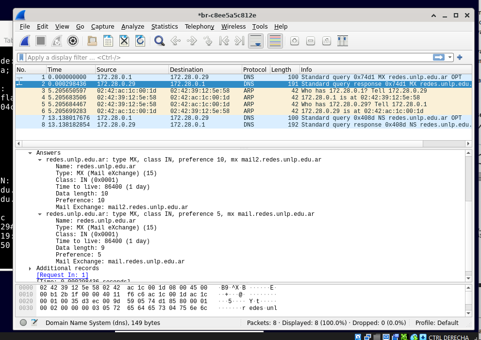
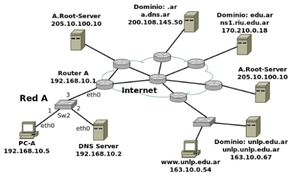

# Practica 3 - Capa de aplicación

# DNS (Domain Name Server)

>Introduccion
1. Investigue y describa como funciona el DNS ¿Cual es su objetivo?

El DNS (Domain Name Server) es un sistema de nomenclatura jerárquico y distribuido que traduce nombres de dominio legibles por humanos (como www.ejemplo.com) en direcciones IP numéricas (como 192.168.1.1).

Su objetivo principal es facilitar la navegación en Internet al permitir que los usuarios utilicen nombres de dominio fáciles de recordar en lugar de tener que memorizar direcciones IP. Además, el DNS ayuda a distribuir la carga de tráfico y mejorar la eficiencia de la red al permitir que múltiples servidores respondan a las solicitudes de resolución de nombres.

2. ¿Que es un root server? ¿Que es un generic top level domain (gTLD)?

Un root server es un servidor que forma parte de la infraestructura del DNS y que contiene la informacion de los servidores de nombres de dominio de nivel superior (TLD). Los root servers son responsables de dirigir las consultas DNS a los servidores TLD apropiados, que luego pueden dirigir la consulta al servidor autoritativo correspondiente para el dominio solicitado.

Un generic top level domain (gTLD) es un tipo de dominio de nivel superior que no está asociado a un país específico y que puede ser utilizado por cualquier persona o entidad. Algunos ejemplos de gTLDs incluyen .com, .org, .net, .info, entre otros. Los gTLDs son administrados por organizaciones designadas por la ICANN (Internet Corporation for Assigned Names and Numbers) y están destinados a proporcionar una variedad de opciones para los nombres de dominio en Internet.

3. ¿Qué es una respuesta del tipo autoritativa?

Una respuesta del tipo autoritativa es una respuesta proporcionada por un servidor DNS que tiene autoridad sobre el dominio en cuestión. Esto significa que el servidor tiene la información más actualizada y confiable sobre el dominio y puede proporcionar una respuesta definitiva a la consulta DNS.

4. ¿Qué diferencia una consulta DNS recursiva de una iterativa?

Una consulta DNS recursiva es aquella en la que el servidor DNS al que se le hace la consulta se encarga de buscar la respuesta completa para el cliente, realizando todas las consultas necesarias a otros servidores DNS hasta obtener la respuesta final. En otras palabras, el servidor DNS actúa como intermediario y devuelve la respuesta final al cliente.

Por otro lado, una consulta DNS iterativa es aquella en la que el servidor DNS responde al cliente con la mejor información que tiene disponible en ese momento, pero no realiza consultas adicionales a otros servidores. En este caso, el cliente es responsable de realizar consultas adicionales a otros servidores DNS hasta obtener la respuesta final.

5. ¿Qué es el resolver?
   
El resolver es un componente del sistema DNS que se encarga de recibir las consultas de los clientes y procesarlas para obtener la dirección IP correspondiente al nombre de dominio solicitado. El resolver puede ser parte del sistema operativo del cliente o estar implementado en un servidor DNS. Su función principal es enviar las consultas a los servidores DNS apropiados y devolver la respuesta al cliente, ya sea de manera recursiva o iterativa, dependiendo de la configuración del resolver y del tipo de consulta realizada.

6. Describa para qué se utilizan los siguientes tipos de registros de DNS:

a. A - Se utiliza para mapear un nombre de dominio a una dirección IP IPv4.
b. MX - Se utiliza para especificar los servidores de correo electrónico (mail exchange) para un dominio.
c. PTR - Se utiliza para realizar búsquedas inversas, mapeando una dirección IP a un nombre de dominio.
d. AAAA - Se utiliza para mapear un nombre de dominio a una dirección IP IPv6.
e. SRV - Se utiliza para especificar la ubicación y puerto de servicios en un dominio, como por ejemplo, servicios LDAP o SIP.
f. NS - Se utiliza para especificar los servidores de nombres autoritativos para un dominio.
g. CNAME - Se utiliza para crear un alias de un nombre de dominio a otro.
h. SOA - Se utiliza para almacenar información sobre la configuración del dominio, como el servidor de nombres principal y el tiempo de vida (TTL) de los registros.
i. TXT - Se utiliza para almacenar información de texto libre, comúnmente usada para verificación y autenticación.

7. En Internet, un dominio suele tener más de un servidor DNS, ¿por qué cree que esto es
así?

Un dominio suele tener más de un servidor DNS para garantizar la redundancia y la disponibilidad del servicio. Si un servidor DNS falla o no está disponible por alguna razón, los otros servidores pueden responder a las consultas, asegurando que los usuarios puedan seguir accediendo al dominio sin interrupciones. Además, tener múltiples servidores DNS distribuidos geográficamente puede mejorar el rendimiento y reducir la latencia en la resolución de nombres de dominio, ya que las consultas pueden ser atendidas por el servidor más cercano al usuario.

8. Cuando un dominio cuenta con más de un servidor, uno de ellos es el primario (o
maestro) y todos los demás son secundarios (o esclavos). ¿Cuál es la razón de que sea
así?

La razón de que un dominio tenga un servidor primario (o maestro) y varios servidores secundarios (o esclavos) es para mantener la consistencia y la integridad de los datos del DNS. El servidor primario es el encargado de almacenar y gestionar la información original del dominio, mientras que los servidores secundarios obtienen copias de esta información a través de un proceso llamado transferencia de zona. Esto permite que los servidores secundarios puedan responder a las consultas de los usuarios incluso si el servidor primario no está disponible, garantizando así la continuidad del servicio. Además, esta estructura facilita la administración y actualización de los registros DNS, ya que cualquier cambio realizado en el servidor primario se propaga automáticamente a los servidores secundarios, asegurando que todos los servidores tengan la información más reciente y coherente.

9. Explique brevemente en qué consiste el mecanismo de transferencia de zona y cuál es
su finalidad.

El mecanismo de transferencia de zona es un proceso mediante el cual un servidor DNS secundario (o esclavo) obtiene una copia completa de la información de un dominio desde el servidor DNS primario (o maestro). Este proceso se realiza para mantener la consistencia y la integridad de los datos del DNS entre los servidores.

La finalidad de la transferencia de zona es garantizar que todos los servidores DNS que gestionan un dominio tengan la misma información actualizada, permitiendo así que puedan responder correctamente a las consultas de los usuarios. Además, este mecanismo ayuda a mejorar la disponibilidad del servicio DNS, ya que si el servidor primario falla, los servidores secundarios pueden seguir proporcionando respuestas precisas a las solicitudes de resolución de nombres de dominio.

10. Imagine que usted es el administrador del dominio de DNS de la UNLP (unlp.edu.ar). A
su vez, cada facultad de la UNLP cuenta con un administrador que gestiona su propio
dominio (por ejemplo, en el caso de la Facultad de Informática se trata de info.unlp.edu.ar).
Suponga que se crea una nueva facultad, Facultad de Redes, cuyo dominio será
redes.unlp.edu.ar, y el administrador le indica que quiere poder manejar su propio dominio.
¿Qué debe hacer usted para que el administrador de la Facultad de Redes pueda gestionar
el dominio de forma independiente? (Pista: investigue en qué consiste la delegación de
dominios). Indicar qué registros de DNS se deberían agregar.

Para permitir que el administrador de la Facultad de Redes pueda gestionar su propio dominio (redes.unlp.edu.ar) de forma independiente, se debe realizar un proceso llamado delegación de dominios. La delegación consiste en asignar la autoridad sobre un subdominio a otro servidor DNS, permitiendo que el administrador del subdominio tenga control sobre los registros DNS de su propio dominio.

Para llevar a cabo la delegación, se deben agregar los siguientes registros de DNS en el servidor DNS del dominio principal (unlp.edu.ar):
1. **Registro NS (Name Server)**: Se deben agregar registros NS que apunten a los servidores DNS que gestionarán el dominio redes.unlp.edu.ar. Por ejemplo:
   - `redes.unlp.edu.ar. IN NS ns1.redes.unlp.edu.ar.`
   - `redes.unlp.edu.ar. IN NS ns2.redes.unlp.edu.ar.`
2. **Registro A (Address)**: Se deben agregar registros A para los servidores DNS que se han especificado en los registros NS, proporcionando sus direcciones IP. Por ejemplo:
    - `ns1.redes.unlp.edu.ar. IN A 192.168.1.10`
    - `ns2.redes.unlp.edu.ar. IN A 192.168.1.11`
Con estos registros, el servidor DNS del dominio principal (unlp.edu.ar) delegará la autoridad del subdominio redes.unlp.edu.ar a los servidores DNS especificados, permitiendo que el administrador de la Facultad de Redes gestione su propio dominio de manera independiente.

Entonces el flujo de resolución de nombres para redes.unlp.edu.ar sería el siguiente:
1. Cuando un usuario intenta acceder a redes.unlp.edu.ar, su resolver DNS enviará una consulta al servidor DNS del dominio principal (unlp.edu.ar).
2. El servidor DNS del dominio principal responderá con los registros NS que indican los servidores DNS responsables de redes.unlp.edu.ar.
3. El resolver DNS del usuario luego enviará la consulta a uno de los servidores DNS delegados (ns1.redes.unlp.edu.ar o ns2.redes.unlp.edu.ar) para obtener la dirección IP correspondiente al nombre de dominio solicitado.

11. Responda y justifique los siguientes ejercicios.
a. En la VM, utilice el comando dig para obtener la dirección IP del host
www.redes.unlp.edu.ar y responda:
    i. ¿La solicitud fue recursiva? ¿Y la respuesta? ¿Cómo lo sabe?
    ii. ¿Puede indicar si se trata de una respuesta autoritativa? ¿Qué
    significa que lo sea?
    iii. ¿Cuál es la dirección IP del resolver utilizado? ¿Cómo lo sabe?

Respuesta:
```
; <<>> DiG 9.16.27-Debian <<>> www.redes.unlp.edu.ar
;; global options: +cmd
;; Got answer:
;; ->>HEADER<<- opcode: QUERY, status: NOERROR, id: 63939
;; flags: qr aa rd ra; QUERY: 1, ANSWER: 1, AUTHORITY: 0, ADDITIONAL: 1

;; OPT PSEUDOSECTION:
; EDNS: version: 0, flags:; udp: 1232
; COOKIE: 05439ddcc61f2592010000006aa715da7289b487ba6a6811 (good)
;; QUESTION SECTION:
;www.redes.unlp.edu.ar.		IN	A

;; ANSWER SECTION:
www.redes.unlp.edu.ar.	300	IN	A	172.28.0.50

;; Query time: 0 msec
;; SERVER: 172.28.0.29#53(172.28.0.29)
;; WHEN: Sun Sep 13 18:30:02 -03 2026
;; MSG SIZE  rcvd: 94
```
i. La solicitud fue recursiva, ya que el flag "rd" (recursion desired) está presente en la respuesta. La respuesta también es recursiva, como se indica por el flag "ra" (recursion available) en la respuesta.
ii. Sí, se trata de una respuesta autoritativa, como lo indica el flag "aa" (authoritative answer) en la respuesta. Esto significa que el servidor DNS que respondió a la consulta tiene autoridad sobre el dominio redes.unlp.edu.ar y puede proporcionar información confiable y actualizada sobre él.
iii. La dirección IP del resolver utilizado es 172.28.0.29. 
Se puede determinar observando la línea que indica "SERVER: 172.28.0.29#53(172.28.0.29)".

b. ¿Cuáles son los servidores de correo del dominio redes.unlp.edu.ar? ¿Por
qué hay más de uno y qué significan los números que aparecen entre MX y
el nombre? Si se quiere enviar un correo destinado a redes.unlp.edu.ar, ¿a
qué servidor se le entregará? ¿En qué situación se le entregará al otro?

```
redes@debian:~$ dig redes.unlp.edu.ar MX
```
Respuesta:
```
; <<>> DiG 9.16.27-Debian <<>> redes.unlp.edu.ar MX
;; global options: +cmd
;; Got answer:
;; ->>HEADER<<- opcode: QUERY, status: NOERROR, id: 59340
;; flags: qr aa rd ra; QUERY: 1, ANSWER: 2, AUTHORITY: 0, ADDITIONAL: 3

;; OPT PSEUDOSECTION:
; EDNS: version: 0, flags:; udp: 1232
; COOKIE: 2fcdb8db8868d075010000006aa717eca95f974cc58cbbc3 (good)
;; QUESTION SECTION:
;redes.unlp.edu.ar.		IN	MX

;; ANSWER SECTION:
redes.unlp.edu.ar.	86400	IN	MX	10 mail2.redes.unlp.edu.ar.
redes.unlp.edu.ar.	86400	IN	MX	5 mail.redes.unlp.edu.ar.

;; ADDITIONAL SECTION:
mail.redes.unlp.edu.ar.	86400	IN	A	172.28.0.90
mail2.redes.unlp.edu.ar. 86400	IN	A	172.28.0.91

;; Query time: 0 msec
;; SERVER: 172.28.0.29#53(172.28.0.29)
;; WHEN: Sun Sep 13 18:38:52 -03 2026
;; MSG SIZE  rcvd: 149
```
¿Cuáles son los servidores de correo del dominio redes.unlp.edu.ar?
Los servidores de correo (listados en la ANSWER SECTION) son dos:

mail.redes.unlp.edu.ar. (con dirección IP 172.28.0.90)

mail2.redes.unlp.edu.ar. (con dirección IP 172.28.0.91)

¿Por qué hay más de uno y qué significan los números que aparecen entre MX y el nombre?
Hay más de un servidor para proveer redundancia y alta disponibilidad; si uno falla, el otro puede recibir los correos, evitando que se pierdan. Los números (5 y 10) indican la prioridad o preferencia de cada servidor. En los registros MX, un número menor representa una mayor prioridad.

Si se quiere enviar un correo destinado a redes.unlp.edu.ar, ¿a qué servidor se le entregará?
El correo intentará entregarse primero a mail.redes.unlp.edu.ar, porque tiene el número de prioridad más bajo (5), lo que lo convierte en el servidor principal.

¿En qué situación se le entregará al otro?
Se le entregará al servidor secundario mail2.redes.unlp.edu.ar (prioridad 10) únicamente si el servidor principal (mail) se encuentra apagado, caído, sin conexión a la red o rechazando conexiones temporalmente.

c. ¿Cuáles son los servidores de DNS del dominio redes.unlp.edu.ar?
```
redes@debian:~$ dig redes.unlp.edu.ar NS
```
```
; <<>> DiG 9.16.27-Debian <<>> redes.unlp.edu.ar NS
;; global options: +cmd
;; Got answer:
;; ->>HEADER<<- opcode: QUERY, status: NOERROR, id: 50055
;; flags: qr aa rd ra; QUERY: 1, ANSWER: 2, AUTHORITY: 0, ADDITIONAL: 3

;; OPT PSEUDOSECTION:
; EDNS: version: 0, flags:; udp: 1232
; COOKIE: ede22963fc1c7a72010000006aa7181bdefe6b5446320261 (good)
;; QUESTION SECTION:
;redes.unlp.edu.ar.		IN	NS

;; ANSWER SECTION:
redes.unlp.edu.ar.	86400	IN	NS	ns-sv-b.redes.unlp.edu.ar.
redes.unlp.edu.ar.	86400	IN	NS	ns-sv-a.redes.unlp.edu.ar.

;; ADDITIONAL SECTION:
ns-sv-a.redes.unlp.edu.ar. 604800 IN	A	172.28.0.30
ns-sv-b.redes.unlp.edu.ar. 604800 IN	A	172.28.0.29

;; Query time: 8 msec
;; SERVER: 172.28.0.29#53(172.28.0.29)
;; WHEN: Sun Sep 13 18:39:39 -03 2026
;; MSG SIZE  rcvd: 150

```

¿Cuáles son los servidores de DNS del dominio redes.unlp.edu.ar?
Observando la sección ANSWER SECTION, el dominio cuenta con dos servidores DNS (Name Servers):

ns-sv-a.redes.unlp.edu.ar. (IP: 172.28.0.30)

ns-sv-b.redes.unlp.edu.ar. (IP: 172.28.0.29)

d. Repita la consulta anterior cuatro veces más. ¿Qué observa? ¿Puede
explicar a qué se debe?

Con la repetición de la consulta, Alterna el orden los servidores de DNS en la respuesta. Esto se debe a que los servidores DNS pueden implementar un mecanismo de balanceo de carga o rotación de respuestas para distribuir las consultas entre los servidores disponibles, mejorando así la eficiencia y la disponibilidad del servicio.

e. Observe la información que obtuvo al consultar por los servidores de DNS del
dominio. En base a la salida, ¿es posible indicar cuál de ellos es el primario?

En base a la información obtenida, no es posible determinar cuál de los servidores de DNS es el primario únicamente a partir de la consulta realizada. Ambos servidores (ns-sv-a.redes.unlp.edu.ar y ns-sv-b.redes.unlp.edu.ar) están listados como servidores autoritativos para el dominio redes.unlp.edu.ar, pero no se proporciona información explícita sobre cuál es el primario y cuál es el secundario. Para identificar el servidor primario, sería necesario consultar el registro SOA (Start of Authority) del dominio, que contiene información sobre el servidor de nombres principal y otros detalles relevantes.

f. Consulte por el registro SOA del dominio y responda.

Consulta:
```
dig redes.unlp.edu.ar SOA
```

Respuesta:
```
; <<>> DiG 9.16.27-Debian <<>> redes.unlp.edu.ar SOA
;; global options: +cmd
;; Got answer:
;; ->>HEADER<<- opcode: QUERY, status: NOERROR, id: 232
;; flags: qr aa rd ra; QUERY: 1, ANSWER: 1, AUTHORITY: 0, ADDITIONAL: 1

;; OPT PSEUDOSECTION:
; EDNS: version: 0, flags:; udp: 1232
; COOKIE: c96a418c79f65b00010000006aa71a075c478659ad014ee2 (good)
;; QUESTION SECTION:
;redes.unlp.edu.ar.		IN	SOA

;; ANSWER SECTION:
redes.unlp.edu.ar.	86400	IN	SOA	ns-sv-b.redes.unlp.edu.ar. root.redes.unlp.edu.ar. 2020031700 604800 86400 2419200 86400

;; Query time: 0 msec
;; SERVER: 172.28.0.29#53(172.28.0.29)
;; WHEN: Sun Sep 13 18:47:51 -03 2026
;; MSG SIZE  rcvd: 123
```

i. ¿Puede ahora determinar cuál es el servidor de DNS primario?

Si, ahora es posible determinar cuál es el servidor de DNS primario. En la sección ANSWER SECTION del registro SOA, se indica que el servidor primario es `ns-sv-b.redes.unlp.edu.ar.`. Esto se puede deducir porque el primer campo del registro SOA especifica el servidor de nombres principal (primary name server) para el dominio.

ii. ¿Cuál es el número de serie, qué convención sigue y en qué casos es
importante actualizarlo?

El número de serie es `2020031700`. La convención que sigue es generalmente el formato YYYYMMDDnn, donde YYYY es el año, MM es el mes, DD es el día y nn es un número de versión que se incrementa si se realizan múltiples cambios en un mismo día. Es importante actualizar el número de serie cada vez que se realizan cambios en los registros del dominio para que los servidores secundarios puedan detectar que hay una nueva versión de la zona y puedan realizar la transferencia de zona para obtener la información actualizada.

iii. ¿Qué valor tiene el segundo campo del registro? Investigue para qué
se usa y cómo se interpreta el valor.

El segundo campo del registro SOA representa el tiempo de vida (TTL) del registro SOA. Se usa para determinar cuánto tiempo un servidor DNS debe almacenar en caché la información del registro SOA antes de solicitar una nueva actualización. El valor se interpreta como el número de segundos que el registro permanecerá en caché.

iv. ¿Qué valor tiene el TTL de caché negativa y qué significa?

El TTL de caché negativa es el tiempo durante el cual un servidor DNS debe almacenar en caché una respuesta negativa (es decir, una respuesta que indica que un nombre de dominio no existe). Este valor se usa para evitar que los clientes realicen consultas repetidas para nombres que ya han sido verificados y no existen. El valor se interpreta como el número de segundos que la respuesta negativa permanecerá en caché.

g. Indique qué valor tiene el registro TXT para el nombre
saludo.redes.unlp.edu.ar. Investigue para qué es usado este registro.

Consulta:
```
dig saludo.redes.unlp.edu.ar TXT
```

Respuesta:
```

; <<>> DiG 9.16.27-Debian <<>> saludo.redes.unlp.edu.ar TXT
;; global options: +cmd
;; Got answer:
;; ->>HEADER<<- opcode: QUERY, status: NOERROR, id: 9697
;; flags: qr aa rd ra; QUERY: 1, ANSWER: 1, AUTHORITY: 0, ADDITIONAL: 1

;; OPT PSEUDOSECTION:
; EDNS: version: 0, flags:; udp: 1232
; COOKIE: 88a6fe40ede91c17010000006aa71b6ee4be88b7089b05ed (good)
;; QUESTION SECTION:
;saludo.redes.unlp.edu.ar.	IN	TXT

;; ANSWER SECTION:
saludo.redes.unlp.edu.ar. 86400	IN	TXT	"HOLA"

;; Query time: 0 msec
;; SERVER: 172.28.0.29#53(172.28.0.29)
;; WHEN: Sun Sep 13 18:53:50 -03 2026
;; MSG SIZE  rcvd: 98


```

El registro TXT se utiliza para almacenar información de texto libre asociada a un nombre de dominio. Es comúnmente usado para propósitos de verificación y autenticación, como la verificación de propiedad del dominio, la configuración de políticas de correo electrónico (por ejemplo, SPF, DKIM) y otros usos específicos que requieren almacenar datos en formato de texto.

h. Utilizando dig, solicite la transferencia de zona de redes.unlp.edu.ar, analice
la salida y responda.

Consulta:
```
dig @ns-sv-b.redes.unlp.edu.ar redes.unlp.edu.ar AXFR
```

Respuesta:
```
; <<>> DiG 9.16.27-Debian <<>> @ns-sv-b.redes.unlp.edu.ar redes.unlp.edu.ar AXFR
; (1 server found)
;; global options: +cmd
redes.unlp.edu.ar.	86400	IN	SOA	ns-sv-b.redes.unlp.edu.ar. root.redes.unlp.edu.ar. 2020031700 604800 86400 2419200 86400
redes.unlp.edu.ar.	86400	IN	NS	ns-sv-a.redes.unlp.edu.ar.
redes.unlp.edu.ar.	86400	IN	NS	ns-sv-b.redes.unlp.edu.ar.
redes.unlp.edu.ar.	86400	IN	MX	5 mail.redes.unlp.edu.ar.
redes.unlp.edu.ar.	86400	IN	MX	10 mail2.redes.unlp.edu.ar.
ftp.redes.unlp.edu.ar.	86400	IN	CNAME	www.redes.unlp.edu.ar.
mail.redes.unlp.edu.ar.	86400	IN	A	172.28.0.90
mail2.redes.unlp.edu.ar. 86400	IN	A	172.28.0.91
ns-sv-a.redes.unlp.edu.ar. 604800 IN	A	172.28.0.30
ns-sv-b.redes.unlp.edu.ar. 604800 IN	A	172.28.0.29
practica.redes.unlp.edu.ar. 86400 IN	NS	ns1.practica.redes.unlp.edu.ar.
practica.redes.unlp.edu.ar. 86400 IN	NS	ns2.practica.redes.unlp.edu.ar.
ns1.practica.redes.unlp.edu.ar.	86400 IN A	172.28.0.120
ns2.practica.redes.unlp.edu.ar.	86400 IN A	172.28.0.121
saludo.redes.unlp.edu.ar. 86400	IN	TXT	"HOLA"
www.redes.unlp.edu.ar.	300	IN	A	172.28.0.50
redes.unlp.edu.ar.	86400	IN	SOA	ns-sv-b.redes.unlp.edu.ar. root.redes.unlp.edu.ar. 2020031700 604800 86400 2419200 86400
;; Query time: 4 msec
;; SERVER: 172.28.0.29#53(172.28.0.29)
;; WHEN: Sun Sep 13 18:53:31 -03 2026
;; XFR size: 17 records (messages 1, bytes 441)
```

i. ¿Qué significan los números que aparecen antes de la palabra IN?
¿Cuál es su finalidad?

Los números que aparecen antes de la palabra IN en los registros DNS representan el TTL (Time to Live) de cada registro. El TTL indica la cantidad de tiempo, en segundos, que un registro puede ser almacenado en caché por los servidores DNS y resolvers antes de que se considere obsoleto y se requiera una nueva consulta para obtener información actualizada.

ii. ¿Cuántos registros NS observa? Compare la respuesta con los
servidores de DNS del dominio redes.unlp.edu.ar que dio
anteriormente. ¿Puede explicar a qué se debe la diferencia y qué
significa?

Veo 4 registros NS en la respuesta de la transferencia de zona. Anteriormente, al consultar los servidores de DNS del dominio redes.unlp.edu.ar, se observaron solo 2 registros NS (ns-sv-a.redes.unlp.edu.ar y ns-sv-b.redes.unlp.edu.ar). La diferencia se debe a que en la transferencia de zona también se incluyen los registros NS para el subdominio practica.redes.unlp.edu.ar (ns1.practica.redes.unlp.edu.ar y ns2.practica.redes.unlp.edu.ar). Esto significa que el dominio redes.unlp.edu.ar tiene delegaciones adicionales para subdominios, lo que permite que otros servidores DNS gestionen esos subdominios de manera independiente.

i. Consulte por el registro A de www.redes.unlp.edu.ar y luego por el registro A
de www.practica.redes.unlp.edu.ar. Observe los TTL de ambos. Repita la
operación y compare el valor de los TTL de cada uno respecto de la
respuesta anterior. ¿Puede explicar qué está ocurriendo? (Pista: observar los
flags será de ayuda).

Consulta:
```
dig @ns-sv-b.redes.unlp.edu.ar www.redes.unlp.edu.ar A
```
Respuesta:
```
; <<>> DiG 9.16.27-Debian <<>> @ns-sv-b.redes.unlp.edu.ar www.redes.unlp.edu.ar A
; (1 server found)
;; global options: +cmd
;; Got answer:
;; ->>HEADER<<- opcode: QUERY, status: NOERROR, id: 59234
;; flags: qr aa rd ra; QUERY: 1, ANSWER: 1, AUTHORITY: 0, ADDITIONAL: 1

;; OPT PSEUDOSECTION:
; EDNS: version: 0, flags:; udp: 1232
; COOKIE: 9f2507992d6fcad8010000006aa71c5b87e6d72cbca2240c (good)
;; QUESTION SECTION:
;www.redes.unlp.edu.ar.		IN	A

;; ANSWER SECTION:
www.redes.unlp.edu.ar.	300	IN	A	172.28.0.50

;; Query time: 4 msec
;; SERVER: 172.28.0.29#53(172.28.0.29)
;; WHEN: Sun Sep 13 18:57:47 -03 2026
;; MSG SIZE  rcvd: 94
```

Consulta:
```
dig @ns-sv-b.redes.unlp.edu.ar www.practica.redes.unlp.edu.ar A
```
Respuesta:
```
; <<>> DiG 9.16.27-Debian <<>> @ns-sv-b.redes.unlp.edu.ar www.practica.redes.unlp.edu.ar A
; (1 server found)
;; global options: +cmd
;; Got answer:
;; ->>HEADER<<- opcode: QUERY, status: NOERROR, id: 26984
;; flags: qr rd ra; QUERY: 1, ANSWER: 1, AUTHORITY: 0, ADDITIONAL: 1

;; OPT PSEUDOSECTION:
; EDNS: version: 0, flags:; udp: 1232
; COOKIE: 94928f48e2655dda010000006aa71c94e010b7de48282a2b (good)
;; QUESTION SECTION:
;www.practica.redes.unlp.edu.ar.	IN	A

;; ANSWER SECTION:
www.practica.redes.unlp.edu.ar.	60 IN	A	172.28.0.10

;; Query time: 1544 msec
;; SERVER: 172.28.0.29#53(172.28.0.29)
;; WHEN: Sun Sep 13 18:58:44 -03 2026
;; MSG SIZE  rcvd: 103
```

Comparando los flags en la consulta hacia practicas no tenemos el flag aa, lo que indica que no es una respuesta autoritativa. Esto significa que el servidor DNS que respondió a la consulta no tiene autoridad sobre el subdominio practica.redes.unlp.edu.ar y está proporcionando la información basada en su caché o en la información obtenida de otro servidor DNS.

Es decir la primer consulta fue respondida por el servidor autoritativo del dominio redes.unlp.edu.ar, mientras que la segunda consulta fue respondida por un servidor que no es autoritativo para el subdominio practica.redes.unlp.edu.ar. Esto puede explicar la diferencia en los TTL observados, ya que los servidores no autoritativos pueden tener diferentes políticas de caché y tiempos de vida para los registros que manejan.

j. Consulte por el registro A de www.practica2.redes.unlp.edu.ar. ¿Obtuvo
alguna respuesta? Investigue sobre los códigos de respuesta de DNS. ¿Para
qué son utilizados los mensajes NXDOMAIN y NOERROR?

Respuesta:
```
; <<>> DiG 9.16.27-Debian <<>> www.practica2.redes.unlp.edu.ar A
;; global options: +cmd
;; Got answer:
;; ->>HEADER<<- opcode: QUERY, status: NXDOMAIN, id: 10130
;; flags: qr aa rd ra; QUERY: 1, ANSWER: 0, AUTHORITY: 1, ADDITIONAL: 1

;; OPT PSEUDOSECTION:
; EDNS: version: 0, flags:; udp: 1232
; COOKIE: 2aeef19ea0b1de63010000006aa71ea8c9f085d0d01e6cce (good)
;; QUESTION SECTION:
;www.practica2.redes.unlp.edu.ar. IN	A

;; AUTHORITY SECTION:
redes.unlp.edu.ar.	86400	IN	SOA	ns-sv-b.redes.unlp.edu.ar. root.redes.unlp.edu.ar. 2020031700 604800 86400 2419200 86400

;; Query time: 4 msec
;; SERVER: 172.28.0.29#53(172.28.0.29)
;; WHEN: Sun Sep 13 19:07:36 -03 2026
;; MSG SIZE  rcvd: 154
```

No, no se obtuvo una respuesta con un registro A para www.practica2.redes.unlp.edu.ar. En su lugar, se recibió un mensaje con el código de respuesta NXDOMAIN.

El código de respuesta NXDOMAIN indica que el nombre de dominio consultado no existe en el sistema DNS. Es utilizado para informar al cliente que la consulta no pudo ser resuelta porque el dominio solicitado no está registrado o no tiene registros asociados.

El código de respuesta NOERROR, por otro lado, indica que la consulta fue procesada correctamente y que no hubo errores en la resolución del nombre de dominio. Sin embargo, NOERROR no garantiza que se haya encontrado un registro para el nombre de dominio consultado; simplemente significa que la consulta fue válida y se pudo procesar sin problemas.

12. Investigue los comandos nslookup y host. ¿Para qué sirven? Intente con ambos
comandos obtener:
● Dirección IP de www.redes.unlp.edu.ar.
● Servidores de correo del dominio redes.unlp.edu.ar.
● Servidores de DNS del dominio redes.unlp.edu.ar

Los comandos `nslookup` y `host` son herramientas de línea de comandos utilizadas para realizar consultas DNS y obtener información sobre nombres de dominio, direcciones IP, servidores de correo, servidores de nombres, entre otros.

Para IP de www.redes.unlp.edu.ar:
- Usando `nslookup`:
```bash
nslookup www.redes.unlp.edu.ar

Server:		172.28.0.29
Address:	172.28.0.29#53

Name:	www.redes.unlp.edu.ar
Address: 172.28.0.50

```
- Usando `host`:
```bash
host www.redes.unlp.edu.ar

www.redes.unlp.edu.ar has address 172.28.0.50

```

Para servidores de correo del dominio redes.unlp.edu.ar:
- Usando `nslookup`:
```bash
nslookup -query=MX redes.unlp.edu.ar

Server:		172.28.0.29
Address:	172.28.0.29#53

redes.unlp.edu.ar	mail exchanger = 5 mail.redes.unlp.edu.ar.
redes.unlp.edu.ar	mail exchanger = 10 mail2.redes.unlp.edu.ar.
```

- Usando `host`:
```bash
host -t MX redes.unlp.edu.ar

redes.unlp.edu.ar mail is handled by 10 mail2.redes.unlp.edu.ar.
redes.unlp.edu.ar mail is handled by 5 mail.redes.unlp.edu.ar.
```

Para servidores de DNS del dominio redes.unlp.edu.ar:
- Usando `nslookup`:
```bash
nslookup -query=NS redes.unlp.edu.ar

Server:		172.28.0.29
Address:	172.28.0.29#53

redes.unlp.edu.ar	nameserver = ns-sv-b.redes.unlp.edu.ar.
redes.unlp.edu.ar	nameserver = ns-sv-a.redes.unlp.edu.ar.
```

- Usando `host`:
```bash
host -t NS redes.unlp.edu.ar

redes.unlp.edu.ar name server ns-sv-b.redes.unlp.edu.ar.
redes.unlp.edu.ar name server ns-sv-a.redes.unlp.edu.ar.
```

La diferencia principal entre `nslookup` y `host` es que `nslookup` ofrece una interfaz interactiva y más opciones de configuración, mientras que `host` es más simple y directo para consultas rápidas. Ambos comandos son útiles para diagnosticar problemas de DNS y obtener información sobre dominios y sus registros asociados.

13. ¿Qué función cumple en Linux/Unix el archivo /etc/hosts o en Windows el archivo \WINDOWS\system32\drivers\etc\hosts?

El archivo `/etc/hosts` en Linux/Unix y el archivo `\WINDOWS\system32\drivers\etc\hosts` en Windows cumplen la función de proporcionar un mapeo local entre nombres de dominio y direcciones IP. Este archivo permite a los sistemas operativos resolver nombres de dominio sin necesidad de consultar un servidor DNS externo.

14. Abra el programa Wireshark para comenzar a capturar el tráfico de red en la interfaz con
IP 172.28.0.1. Una vez abierto realice una consulta DNS con el comando dig para averiguar
el registro MX de redes.unlp.edu.ar y luego, otra para averiguar los registros NS
correspondientes al dominio redes.unlp.edu.ar. Analice la información proporcionada por dig
y compárelo con la captura.



dig es simplemente un cliente que envía la petición DNS (paquete 1) y luego formatea de manera amigable para el usuario la carga útil (payload) de la respuesta que recibe del servidor (paquete 2).

15. Dada la siguiente situación: “Una PC en una red determinada, con acceso a Internet utiliza los servicios de DNS de un servidor de la red”. Analice:
a. ¿Qué tipo de consultas (iterativas o recursivas) realiza la PC a su servidor de DNS?
b. ¿Qué tipo de consultas (iterativas o recursivas) realiza el servidor de DNS para resolver requerimientos de usuario como el anterior? ¿A quién le realiza estas consultas?

a. La PC realiza consultas recursivas a su servidor de DNS. Esto significa que la PC espera que el servidor de DNS haga todo el trabajo necesario para resolver el nombre de dominio solicitado y le devuelva la respuesta final, ya sea la dirección IP correspondiente o un mensaje de error si no se puede resolver.
b. El servidor de DNS realiza consultas iterativas para resolver los requerimientos de usuario. Esto significa que el servidor de DNS consulta a otros servidores DNS en la jerarquía del sistema de nombres de dominio, comenzando desde los servidores raíz y descendiendo por los servidores autoritativos hasta encontrar la información solicitada. El servidor de DNS realiza estas consultas a otros servidores DNS, como los servidores raíz, los servidores TLD (Top-Level Domain) y los servidores autoritativos para el dominio específico que se está resolviendo.

16. Relacione DNS con HTTP. ¿Se puede navegar si no hay servicio de DNS?

DNS (Domain Name System) y HTTP (Hypertext Transfer Protocol) están estrechamente relacionados en el proceso de navegación web. DNS se encarga de traducir los nombres de dominio legibles por humanos (como www.ejemplo.com) en direcciones IP que las computadoras utilizan para comunicarse entre sí. HTTP, por otro lado, es el protocolo que permite la transferencia de información en la web, como páginas HTML, imágenes y otros recursos.

17. Observar el siguiente gráfico y contestar:



a. Si la PC-A, que usa como servidor de DNS a "DNS Server", desea obtener la IP de www.unlp.edu.ar, cuáles serían, y en qué orden, los pasos que se ejecutarán para obtener la respuesta.
b. ¿Dónde es recursiva la consulta? ¿Y dónde iterativa?


**a. Pasos para la resolución del dominio**

* **Paso 1:** La PC-A (192.168.10.5) envía una consulta DNS pidiendo la IP de `www.unlp.edu.ar` a su servidor de nombres local configurado, el DNS Server (192.168.10.2).
* **Paso 2:** Al no tenerla en caché, el DNS Server consulta al servidor raíz A.Root-Server (205.10.100.10).
* **Paso 3:** El A.Root-Server responde con una delegación (referencia) apuntando al servidor responsable del TLD `.ar` (`a.dns.ar`, 200.108.145.50).
* **Paso 4:** El DNS Server envía la misma consulta al servidor `a.dns.ar` (200.108.145.50).
* **Paso 5:** El servidor `.ar` responde con una delegación hacia el servidor responsable del dominio `.edu.ar` (`ns1.riu.edu.ar`, 170.210.0.18).
* **Paso 6:** El DNS Server consulta al servidor `ns1.riu.edu.ar` (170.210.0.18).
* **Paso 7:** El servidor `.edu.ar` responde con la delegación hacia el servidor autoritativo del dominio `unlp.edu.ar` (`unlp.unlp.edu.ar`, 163.10.0.67).
* **Paso 8:** El DNS Server realiza la última consulta al servidor autoritativo `unlp.unlp.edu.ar` (163.10.0.67).
* **Paso 9:** El servidor `unlp.unlp.edu.ar` conoce el registro solicitado y devuelve la IP final de `www.unlp.edu.ar` (163.10.0.54) al DNS Server.
* **Paso 10:** El DNS Server reenvía esta respuesta final a la PC-A, que ahora puede comunicarse con el destino.

**b. Tipos de consulta**

* **Recursiva:** Se da en la comunicación entre la **PC-A y el DNS Server local**. La PC exige la resolución completa del nombre; si el DNS Server no tiene la respuesta, se compromete a realizar todo el trabajo de búsqueda por la red hasta conseguir el dato final (o un error) y devolvérselo al cliente.
* **Iterativa:** Se da en las consultas realizadas por el **DNS Server hacia la jerarquía de servidores de Internet** (A.Root-Server, a.dns.ar, ns1.riu.edu.ar, unlp.unlp.edu.ar). El DNS Server pide "la mejor respuesta que tengan", y los servidores jerárquicos se limitan a derivarlo al siguiente servidor responsable en la cadena, sin hacer la búsqueda ellos mismos.

18. ¿A quién debería consultar para que la respuesta sobre www.google.com sea autoritativa?

Para obtener una respuesta autoritativa sobre www.google.com, se debería consultar a los servidores DNS autoritativos del dominio google.com. Estos servidores son responsables de mantener la información oficial y actualizada sobre el dominio google.com y sus subdominios, incluyendo www.google.com.

19. ¿Qué sucede si al servidor elegido en el paso anterior se lo consulta por
www.info.unlp.edu.ar? ¿Y si la consulta es al servidor 8.8.8.8?

Si se consulta al servidor autoritativo de google.com por www.info.unlp.edu.ar, el servidor no podrá proporcionar una respuesta autoritativa para ese dominio, ya que no tiene autoridad sobre el dominio unlp.edu.ar. En su lugar, devolverá una respuesta indicando que no tiene información sobre ese nombre de dominio, probablemente con un código de respuesta NXDOMAIN (nombre de dominio no existe) o una referencia a los servidores autoritativos del dominio unlp.edu.ar.

Si la consulta se realiza al servidor 8.8.8.8, este es un servidor DNS público y recursivo, por lo que intentará resolver la consulta de forma recursiva, buscando la información en la jerarquía de servidores DNS hasta encontrar la respuesta o llegar a un error.