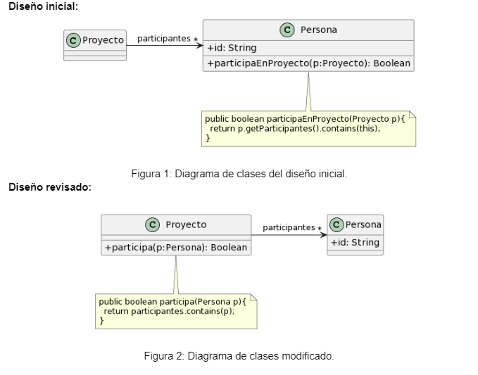

# Cuadernillo de Refactoring 

# Ejercicio 1

## 1.1 Protocolo de Cliente

La clase Cliente tiene el siguiente protocolo. ¿Cómo puede mejorarlo?

´´´java
/** 
* Retorna el límite de crédito del cliente
*/
public double lmtCrdt() {...

/** 
* Retorna el monto facturado al cliente desde la fecha f1 a la fecha f2
*/
protected double mtFcE(LocalDate f1, LocalDate f2) {...

/** 
* Retorna el monto cobrado al cliente desde la fecha f1 a la fecha f2
*/
private double mtCbE(LocalDate f1, LocalDate f2) {...
´´´

Resolucion: 
1. Nombres mas descriptivos 
2. Cambiar accesibilidad de los metodos 
3. Usar dateRange

```java
/**
 * Retorna el límite de crédito del cliente
 */
public double getCreditoLimit() {...}

/**
 * Retorna el monto facturado al cliente desde la fecha inicio a la fecha fin
 */
public double getMontoFacturado(LocalDate fechaInicio, LocalDate fechaFin) {...}

// Firma usando DateRange 
// public double getMontoFacturado(DateRange rangoFechas) {...}

/**
 * Retorna el monto cobrado al cliente desde la fecha inicio a la fecha fin
 */
public double getMontoCobrado(LocalDate fechaInicio, LocalDate fechaFin) {...}
// Firma usando DateRange
// public double getMontoCobrado(DateRange rangoFechas) {...}
```

## 1.2 Participacion en proyectos 



EL bad smell que se encuentra en el diagrama es el "Feature Envy". Esto se debe a que la clase Persona posee el atributo booleano que indica si una persona partcipa en un proyecto.
Para mejorar esto, se puede crear una clase Proyecto que tenga una lista de personas que participan en el proyecto. De esta manera, la clase Persona no tendría que preocuparse por si participa o no en un proyecto, y la clase Proyecto sería responsable de gestionar la participación de las personas en los proyectos. 

## 1.3 Calculos 

```java
public void imprimirValores() {
	int totalEdades = 0;
	double promedioEdades = 0;
	double totalSalarios = 0;
	
	for (Empleado empleado : personal) {
		totalEdades = totalEdades + empleado.getEdad();
		totalSalarios = totalSalarios + empleado.getSalario();
	}
	promedioEdades = totalEdades / personal.size();
		
	String message = String.format("El promedio de las edades es %s y el total de salarios es %s",        promedioEdades, totalSalarios);
	
	System.out.println(message);
}
```

En este código se pueden identificar varios bad smells, como por ejemplo:

1. Variable temporal(Temporary field): Las variables `totalEdades`, `promedioEdades` y `totalSalarios` son temporales y solo se utilizan dentro del método `imprimirValores()`. Esto puede dificultar la comprensión del código y su mantenimiento.


2. Código duplicado(Duplicate code): El cálculo del total de edades y salarios se realiza en un bucle, lo que puede generar código duplicado si se necesita realizar estos cálculos en otros métodos.

3. Falta de cohesión(Lack of cohesion): El método `imprimirValores()` realiza varias tareas, como calcular el total de edades, el promedio de edades y el total de salarios, lo que puede dificultar la comprensión del código y su mantenimiento.

# Ejercicio 2


```java 

public class CharRing extends Object {
   char[] source;
   int idx;
   public CharRing(String srcString) {
       char result;
       source = new char[srcString.length()];
       srcString.getChars(0, srcString.length(), source, 0);
       result = 0;
       idx = result;
   }
   public char next() {
       int result;
       if (idx >= source.length)
           idx = 0;
           result = idx++;
       return source[result]; 
    }
}
```

1. Se quiere aplicar el refactorin rename varaible sobre la variable result que se usa en la linea 18 , con el nuevo nombre currentPosition 

Codigo: 

```java
public class CharRing extends Object {
   char[] source;
   int idx;
   public CharRing(String srcString) {
       char result;
       source = new char[srcString.length()];
       srcString.getChars(0, srcString.length(), source, 0);
       result = 0;
       idx = result;
   }
   public char next() {
       int currentPosition;
       if (idx >= source.length)
           idx = 0;
           currentPosition = idx++;
       return source[currentPosition]; 
    }
}
```

Los inconvientes de este cambio es que el nombre currentPosition no refleja claramente su función en el código, ya que se utiliza para almacenar la posición actual del índice en lugar de representar una posición específica. Además, el nombre currentPosition puede generar confusión con otras variables o métodos que también podrían tener un nombre similar, lo que dificulta la comprensión del código.

# Ejercicio 3

```java
public class CharRing {
    private char[] source;
    private int idx;

    public CharRing(String src) {
        source = src.toCharArray();
        idx = 0;
    }

    public char next() {
        if (idx >= source.length)
            idx = 0;
        return source[idx++];
    }
}
```

```java
public class IntRing {
    private int[] source;
    private int idx;

    public IntRing(int[] src) {
        source = src;
        idx = 0;
    }

    public int next() {
        if (idx >= source.length)
            idx = 0;
        return source[idx++];
    }
}
```

